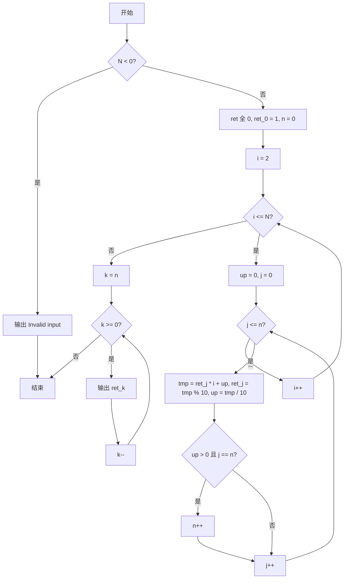
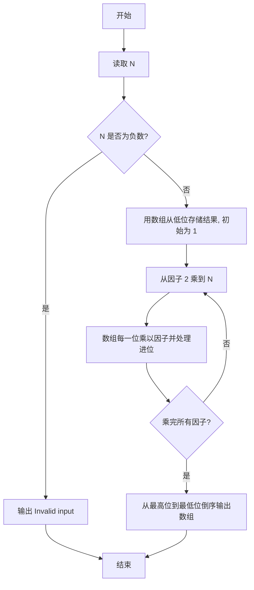

# PTA基础编程题目集 6-10阶乘计算升级版（Go语言实现）

## 题目描述

本题要求实现一个打印非负整数阶乘的函数。

### 函数接口定义

```go
func Print_Factorial(N int)
```

其中`N`是用户传入的参数，其值不超过1000。如果`N`是非负整数，则该函数必须在一行中打印出`N`!的值，否则打印"Invalid input"。

### 裁判测试程序样例

```go
package main

import "fmt"

func Print_Factorial(N int)

func main() {
	var N int
	fmt.Scan(&N)
	Print_Factorial(N)
}

// 你的代码将被嵌在这里
```

### 输入样例

```in
15
```

### 输出样例

```out
1307674368000
```

## 解题思路

这道题的核心是**大数乘法模拟**：`N` 最大为 1000，`1000!` 远超 `int` 范围，必须用大数乘法模拟。用数组 `ret` 从低位到高位逐位存储结果的每一位，初始 `ret[0] = 1`（即 0!）。从因子 2 乘到 `N`，每次乘法把数组的每一位乘以当前因子并处理进位；当最高位产生新进位（`up > 0 && j == n`）时位数 `n` 加一。最后从最高位到最低位倒序输出每一位即为最终阶乘结果。

### 核心问题分析

1. **大数存储**：N 最大 1000，1000! 远超 int 范围，用数组 ret 逐位保存结果。
2. **逐位乘法**：每乘一个因子 i，数组每一位乘以 i 再加进位，模 10 留本位，除 10 得进位。
3. **位数扩展**：最高位产生新进位时 n++，动态增加结果位数。
4. **倒序输出**：数组低位存低位，最后从最高位到最低位倒序打印。

### 算法原理说明

阶乘 N! 当 N 达到 1000 时结果有 2500 多位，超出任何整数类型，因此用数组逐位模拟手工乘法。数组 ret 下标 0 存个位、下标 1 存十位……初始 ret[0] = 1 表示 0! = 1。从因子 2 乘到 N：对每一位 j（0 到当前最高位 n），计算 tmp = ret[j] * i + up，本位存 tmp % 10，进位 up = tmp / 10；若最高位仍有进位则 n++。全部乘完后从下标 n 到 0 倒序输出。

### 具体计算步骤

1. 判断 `N < 0`：成立则调用 `fmt.Println("Invalid input")` 输出并返回。
2. 初始化数组 `ret := make([]int, 3000)`，`ret[0] = 1`，`n := 0` 表示当前有效最高位下标。
3. 外层循环 `i` 从 2 到 `N`，每次把当前结果乘以因子 `i`。
4. 内层循环 `j` 从 0 到 `n`：`tmp := ret[j]*i + up`，当前位存 `ret[j] = tmp % 10`，进位为 `up = tmp / 10`。
5. 若 `up > 0 && j == n`，说明最高位产生新进位，`n++` 扩展位数。
6. 所有因子乘完后，`for k := n; k >= 0; k--` 倒序执行 `fmt.Printf("%d", ret[k])` 输出每一位，最后 `fmt.Println()` 换行。

## 完整代码

```go
// 题目：6-10 阶乘计算升级版
// 要求：实现 Print_Factorial(N int) 打印 N!（N≤1000），负数打印 Invalid input。
//
// 实现原理：
//   大数模拟：数组 ret 低位存低位，依次乘以 2..N 并处理进位，最后倒序输出。
package main

import "fmt"

func Print_Factorial(N int) {
    if N < 0 {
        fmt.Println("Invalid input")
        return
    }
    ret := make([]int, 3000)
    ret[0] = 1
    n := 0
    for i := 2; i <= N; i++ {
        carry := 0
        for j := 0; j <= n; j++ {
            tmp := ret[j]*i + carry
            ret[j] = tmp % 10
            carry = tmp / 10
        }
        for carry > 0 {
            n++
            ret[n] = carry % 10
            carry /= 10
        }
    }
    for k := n; k >= 0; k-- {
        fmt.Printf("%d", ret[k])
    }
    fmt.Println()
}

func main() {
    var N int
    fmt.Scan(&N)
    Print_Factorial(N)
}
```

## 代码流程说明

1. 判断 `N < 0`：成立则调用 `fmt.Println("Invalid input")` 输出并返回。
2. 初始化数组 `ret := make([]int, 3000)`，`ret[0] = 1`，`n := 0` 表示当前有效最高位下标。
3. 外层循环 `i` 从 2 到 `N`，每次把当前结果乘以因子 `i`。
4. 内层循环 `j` 从 0 到 `n`：`tmp := ret[j]*i + up`，当前位存 `ret[j] = tmp % 10`，进位为 `up = tmp / 10`。
5. 若 `up > 0 && j == n`，说明最高位产生新进位，`n++` 扩展位数。
6. 所有因子乘完后，`for k := n; k >= 0; k--` 倒序执行 `fmt.Printf("%d", ret[k])` 输出每一位，最后 `fmt.Println()` 换行。

## 代码流程图



## 解题流程图


