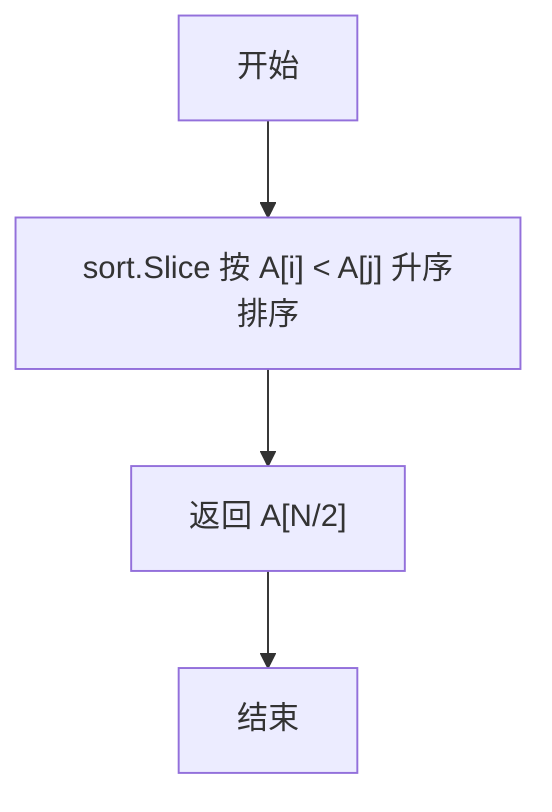
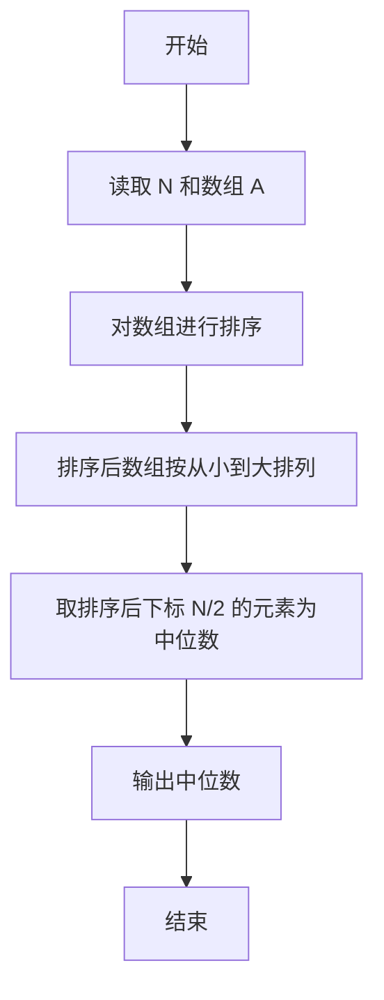

# PTA基础编程题目集 6-11求自定类型元素序列的中位数（Go语言实现）

## 题目描述

本题要求实现一个函数，求N个集合元素A[]的中位数，即序列中第⌊(N+1)/2⌋大的元素。其中集合元素的类型为自定义的ElementType。

### 函数接口定义

```go
type ElementType float32

func Median(A []ElementType, N int) ElementType
```

其中给定集合元素存放在数组A[]中，正整数N是数组元素个数。该函数须返回N个A[]元素的中位数，其值也必须是ElementType类型。

### 裁判测试程序样例

```go
package main

import "fmt"

const MAXN = 10

type ElementType float32

func Median(A []ElementType, N int) ElementType

func main() {
	A := make([]ElementType, MAXN)
	var N int
	fmt.Scan(&N)
	for i := 0; i < N; i++ {
		var val float32
		fmt.Scan(&val)
		A[i] = ElementType(val)
	}
	fmt.Printf("%.2f\n", Median(A, N))
}

// 你的代码将被嵌在这里
```

### 输入样例

```in
3
12.3 34 -5
```

### 输出样例

```out
12.30
```

## 函数部分

```go
func Median(A []ElementType, N int) ElementType {
    sort.Slice(A[:N], func(i, j int) bool {
        return A[i] < A[j]
    })
    return A[N/2]
}
```

## 解题思路

这道题的核心是**排序后取中间元素**：中位数定义为排序后位于第 ⌊(N+1)/2⌋ 大的元素。思路：先用 `sort.Slice` 配合比较函数把切片 `A` 从小到大排序，排序完成后中位数的下标为 `N/2`，直接返回 `A[N/2]` 即可。

### 核心问题分析

1. **排序**：用 sort.Slice 配合比较函数 A[i] < A[j] 对切片升序排序。
2. **下标计算**：排序后第 ⌊(N+1)/2⌋ 大元素的下标为 N/2。
3. **直接返回**：返回 A[N/2] 即为中位数。

### 算法原理说明

中位数是排序后位于中间位置的元素。先把切片按升序排列，排序后第 ⌊(N+1)/2⌋ 大的元素恰好位于下标 N/2 处（整型除法自动向下取整），因此直接返回 A[N/2] 即可。

### 具体计算步骤

1. 调用 `sort.Slice(A, func(i, j int) bool { return A[i] < A[j] })` 对切片 `A` 按升序排序。
2. 计算中位数下标 `N/2`（即第 ⌊(N+1)/2⌋ 大元素的位置）。
3. 返回 `A[N/2]`，即中位数。

## 完整代码

```go
// 题目：6-11 求自定类型元素序列的中位数
// 要求：实现 Median(A []ElementType, N int) ElementType 返回排序后中位数。
//
// 实现原理：
//   用 sort.Slice 按升序排序，返回 A[N/2]。
package main

import (
    "fmt"
    "sort"
)

const MAXN = 10

type ElementType float32

func Median(A []ElementType, N int) ElementType {
    sort.Slice(A[:N], func(i, j int) bool { return A[i] < A[j] })
    return A[N/2]
}

func main() {
    A := make([]ElementType, MAXN)
    var N int
    fmt.Scan(&N)
    for i := 0; i < N; i++ {
        var val float32
        fmt.Scan(&val)
        A[i] = ElementType(val)
    }
    fmt.Printf("%.2f\n", Median(A, N))
}
```

## 代码流程说明

1. 调用 `sort.Slice(A, func(i, j int) bool { return A[i] < A[j] })` 对切片 `A` 按升序排序。
2. 计算中位数下标 `N/2`（即第 ⌊(N+1)/2⌋ 大元素的位置）。
3. 返回 `A[N/2]`，即中位数。

## 代码流程图



## 解题流程图



## 复杂度分析

排序 N 个元素的时间复杂度为 `O(N log N)`；`sort.Slice` 原地调整数组，除排序过程的栈空间外不需要复制数组，额外空间复杂度为 `O(log N)`。

## 常见易错点

1. 中位数下标是 `N/2`，不是 `(N-1)/2`；题目取的是第 `⌊(N+1)/2⌋` 大元素。
2. 排序比较函数应按升序返回 `A[i] < A[j]`，否则下标含义会改变。
3. 只能排序有效范围 `A[:N]`，不能把未使用的数组空间一起排序。
4. `Median` 会改变切片中前 N 个元素的顺序，但这不影响本题返回中位数。
