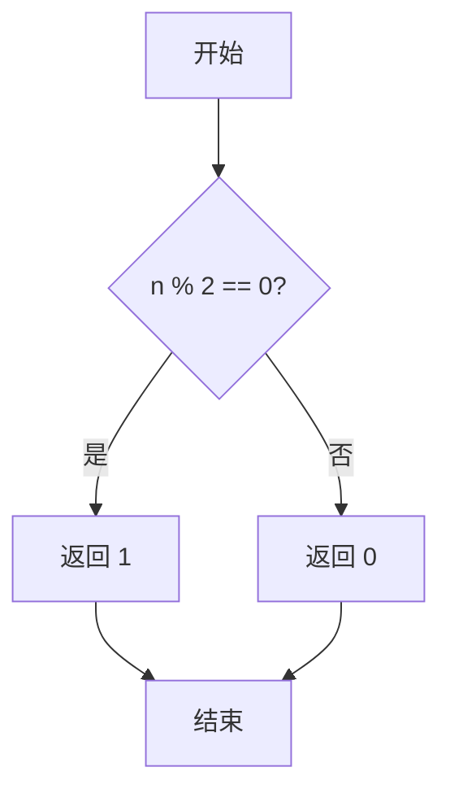
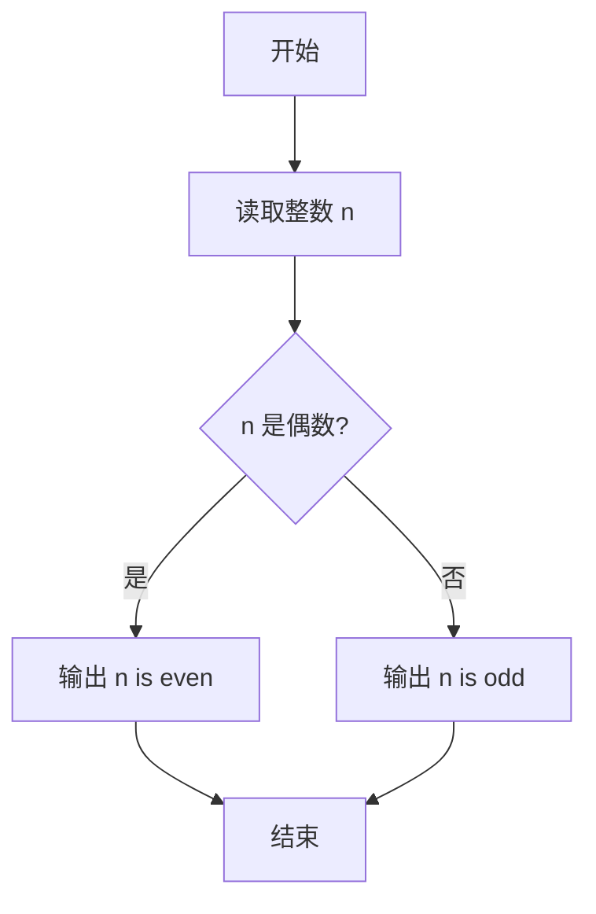

# PTA基础编程题目集 6-12判断奇偶性（Go语言实现）

## 题目描述

本题要求实现判断给定整数奇偶性的函数。

### 函数接口定义

```go
func even(n int) int
```

其中`n`是用户传入的整型参数。当`n`为偶数时，函数返回1；`n`为奇数时返回0。注意：0是偶数。

### 裁判测试程序样例

```go
package main

import "fmt"

func even(n int) int

func main() {
	var n int
	fmt.Scan(&n)
	if even(n) == 1 {
		fmt.Printf("%d is even.\n", n)
	} else {
		fmt.Printf("%d is odd.\n", n)
	}
}

// 你的代码将被嵌在这里
```

### 输入样例1

```in
-6
```

### 输出样例1

```out
-6 is even.
```

### 输入样例2

```in
5
```

### 输出样例2

```out
5 is odd.
```

## 函数部分

```go
func even(n int) int {
    if n%2 == 0 {
        return 1
    }
    return 0
}
```

## 解题思路

这道题的核心是**取模判断奇偶**：判断奇偶性只需看 `n` 是否能被 2 整除：`n % 2 == 0` 说明是偶数，否则是奇数。题目约定偶数返回 1、奇数返回 0，因此用 if 判断 `n%2 == 0` 是否成立即可，注意 0 也是偶数，能被该条件正确判定。

### 核心问题分析

1. **判断条件**：n % 2 == 0 说明 n 是偶数。
2. **返回值约定**：偶数返回 1，奇数返回 0。
3. **0 的处理**：0 % 2 == 0，0 被正确判定为偶数。

### 算法原理说明

整数奇偶性的本质是能否被 2 整除：n % 2 == 0 为偶数，否则为奇数。0 能被 2 整除，也满足偶数条件。按题目约定，偶数返回 1、奇数返回 0。

### 具体计算步骤

1. 计算 `n % 2`。
2. 判断 `n % 2 == 0`：成立（偶数）返回 1，不成立（奇数）返回 0。

## 完整代码

```go
// 题目：6-12 判断奇偶性
// 要求：实现 even(n int) int 偶数返回 1 奇数返回 0。
//
// 实现原理：
//   取模判断 n%2==0 则偶数返回 1，否则返回 0。
package main

import "fmt"

func even(n int) int {
    if n%2 == 0 {
        return 1
    }
    return 0
}

func main() {
    var n int
    fmt.Scan(&n)
    if even(n) == 1 {
        fmt.Printf("%d is even.\n", n)
    } else {
        fmt.Printf("%d is odd.\n", n)
    }
}
```

## 代码流程说明

1. 计算 `n % 2`。
2. 判断 `n % 2 == 0`：成立（偶数）返回 1，不成立（奇数）返回 0。

## 代码流程图



## 解题流程图



## 复杂度分析

函数只进行一次取模和一次条件判断，时间复杂度为 `O(1)`，空间复杂度为 `O(1)`。

## 常见易错点

1. 偶数的判断条件是 `n%2 == 0`，不能只判断 n 是否大于 0。
2. 0 是偶数，应返回 1。
3. 返回值约定为偶数 1、奇数 0，不能直接返回布尔值替代接口要求的整数。
4. 负数同样可以用取模判断奇偶性，不需要改变判断条件。
