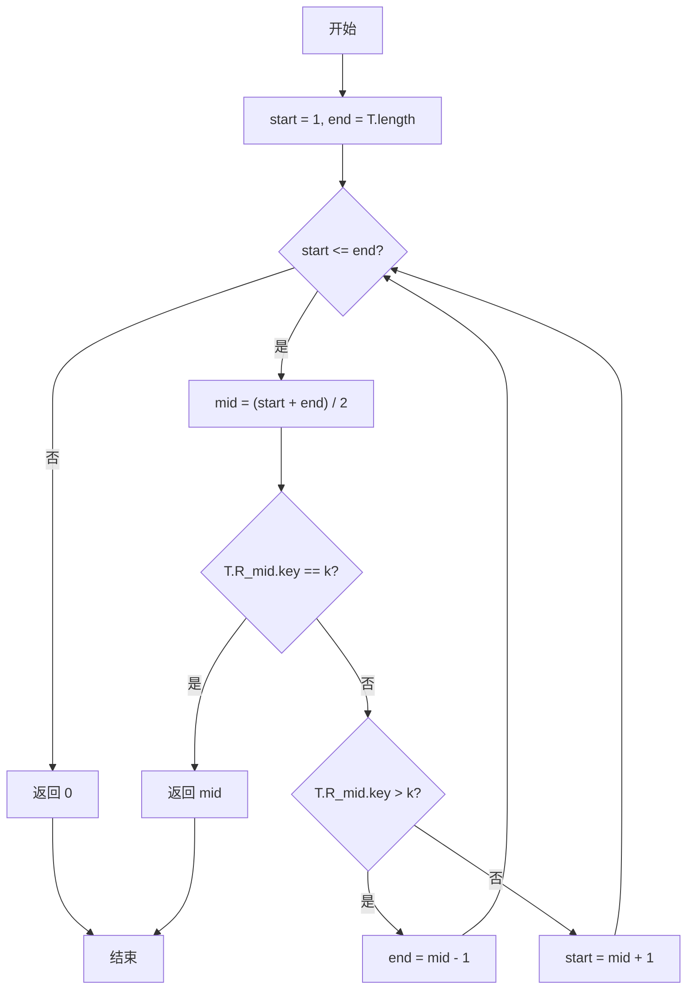
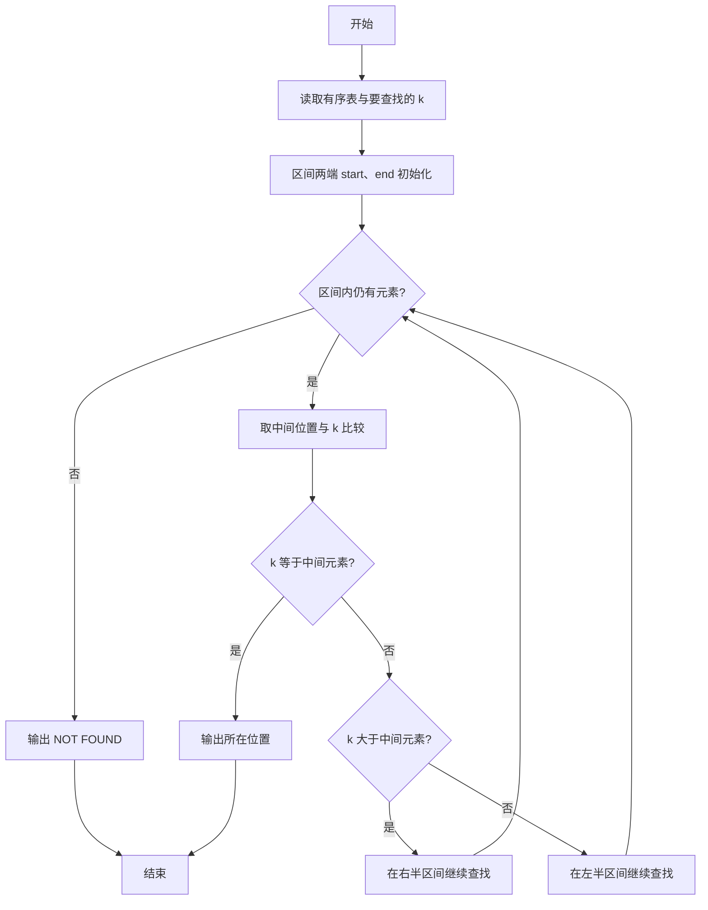

# PTA基础编程题目集 6-13折半查找（Go语言实现）

## 题目描述

给一个严格递增数列，函数int Search_Bin(SSTable T, KeyType k)用来二分地查找k在数列中的位置。

### 输入格式

第一行输入一个整数n，表示有序表的元素个数，接下来一行n个数字，依次为表内元素值。 然后输入一个要查找的值。

### 输出格式

输出这个值在表内的位置，如果没有找到，输出"NOT FOUND"。

### 函数接口定义

```go
type KeyType int

type ElemType struct {
	key KeyType
}

type SSTable struct {
	R      []ElemType
	length int
}

func Search_Bin(T SSTable, k KeyType) int
```

其中T是有序表，k是查找的值。

### 裁判测试程序样例

```go
package main

import "fmt"

type KeyType int

type ElemType struct {
	key KeyType
}

type SSTable struct {
	R      []ElemType
	length int
}

func Create(T *SSTable) {
	fmt.Scan(&T.length)
	T.R = make([]ElemType, T.length+1) // 下标从 1 开始，故多开一位
	for i := 1; i <= T.length; i++ {
		fmt.Scan(&T.R[i].key)
	}
}

func Search_Bin(T SSTable, k KeyType) int

func main() {
	var T SSTable
	var k KeyType
	Create(&T)
	fmt.Scan(&k)
	pos := Search_Bin(T, k)
	if pos == 0 {
		fmt.Println("NOT FOUND")
	} else {
		fmt.Println(pos)
	}
}

// 你的代码将被嵌在这里
```

### 输入样例1

```in
5
1 3 5 7 9
7
```

### 输出样例1

```out
4
```

### 输入样例2

```in
5
1 3 5 7 9
10
```

### 输出样例2

```out
NOT FOUND
```

## 函数部分

```go
func Search_Bin(T SSTable, k KeyType) int {
    start := 1
    end := T.length
    for start <= end {
        mid := (start + end) / 2
        if T.R[mid].key == k {
            return mid
        } else if T.R[mid].key > k {
            end = mid - 1
        } else {
            start = mid + 1
        }
    }
    return 0
}
```

## 解题思路

这道题的核心是**二分查找折半收缩**：二分查找适用于有序表，核心思路是不断把查找区间折半：用 `start`、`end` 指向区间两端（该表下标从 1 开始），取中间位置 `mid` 与 `k` 比较——相等则找到；`T.R[mid].key < k` 说明目标在右半区，把 `start` 移到 `mid + 1`；`T.R[mid].key > k` 则目标在左半区，把 `end` 移到 `mid - 1`。当 `start > end` 时区间为空，说明未找到，返回 0。

### 核心问题分析

1. **区间初始化**：start := 1，end := T.length（表下标从 1 开始）。
2. **中点取值**：mid := (start + end) / 2，与 k 比较。
3. **区间收缩**：k 小于中点元素则取左半区（end = mid - 1），大于则取右半区（start = mid + 1）。
4. **未找到**：start > end 时区间为空，返回 0。

### 算法原理说明

二分查找每次取有序表中间位置与目标值 k 比较：相等即命中；若中间元素大于 k，说明目标只可能在左半区，把右边界移到 mid - 1；若中间元素小于 k，目标在右半区，把左边界移到 mid + 1。每次比较后区间缩小一半，时间复杂度 O(log n)。区间为空（start > end）时表示未找到。

### 具体计算步骤

1. 初始化查找区间 `start := 1`，`end := T.length`（表下标从 1 开始）。
2. `for start <= end` 循环：区间非空时继续查找。
3. 取中间位置 `mid := (start + end) / 2`。
4. 若 `T.R[mid].key == k`，直接返回 `mid`。
5. 若 `T.R[mid].key > k`，说明目标在左半区，`end = mid - 1`；否则目标在右半区，`start = mid + 1`。
6. 循环结束仍未找到，返回 0（按题意表示未找到）。

## 完整代码

```go
// 题目：6-13 折半查找
// 要求：实现 Search_Bin(T SSTable, k KeyType) int 二分查找，找不到返回 0。
//
// 实现原理：
//   维护区间 start=1、end=T.length，取 mid=(start+end)/2 比较，相等返回 mid，否则收缩区间。
package main

import "fmt"

type KeyType int

type ElemType struct {
    key KeyType
}

type SSTable struct {
    R      []ElemType
    length int
}

func Create(T *SSTable) {
    fmt.Scan(&T.length)
    T.R = make([]ElemType, T.length+1)
    for i := 1; i <= T.length; i++ {
        fmt.Scan(&T.R[i].key)
    }
}

func Search_Bin(T SSTable, k KeyType) int {
    start := 1
    end := T.length
    for start <= end {
        mid := (start + end) / 2
        if T.R[mid].key == k {
            return mid
        } else if T.R[mid].key > k {
            end = mid - 1
        } else {
            start = mid + 1
        }
    }
    return 0
}

func main() {
    var T SSTable
    var k KeyType
    Create(&T)
    fmt.Scan(&k)
    pos := Search_Bin(T, k)
    if pos == 0 {
        fmt.Println("NOT FOUND")
    } else {
        fmt.Println(pos)
    }
}
```

## 代码流程说明

1. 初始化查找区间 `start := 1`，`end := T.length`（表下标从 1 开始）。
2. `for start <= end` 循环：区间非空时继续查找。
3. 取中间位置 `mid := (start + end) / 2`。
4. 若 `T.R[mid].key == k`，直接返回 `mid`。
5. 若 `T.R[mid].key > k`，说明目标在左半区，`end = mid - 1`；否则目标在右半区，`start = mid + 1`。
6. 循环结束仍未找到，返回 0（按题意表示未找到）。

## 代码流程图



## 解题流程图



## 复杂度分析

每次比较都把查找区间缩小约一半，因此时间复杂度为 `O(log n)`；只维护边界和中点，空间复杂度为 `O(1)`。

## 常见易错点

1. `SSTable.R` 的有效元素从下标 1 开始，边界应初始化为 `start=1`、`end=T.length`。
2. 找到目标时返回中点位置；查找区间耗尽后必须返回 0，以便主程序输出 `NOT FOUND`。
3. 向左收缩应写成 `end = mid - 1`，向右收缩应写成 `start = mid + 1`，否则可能死循环。
4. 只有在表已按严格递增顺序排列时，才能依据大小关系舍弃一半区间。
