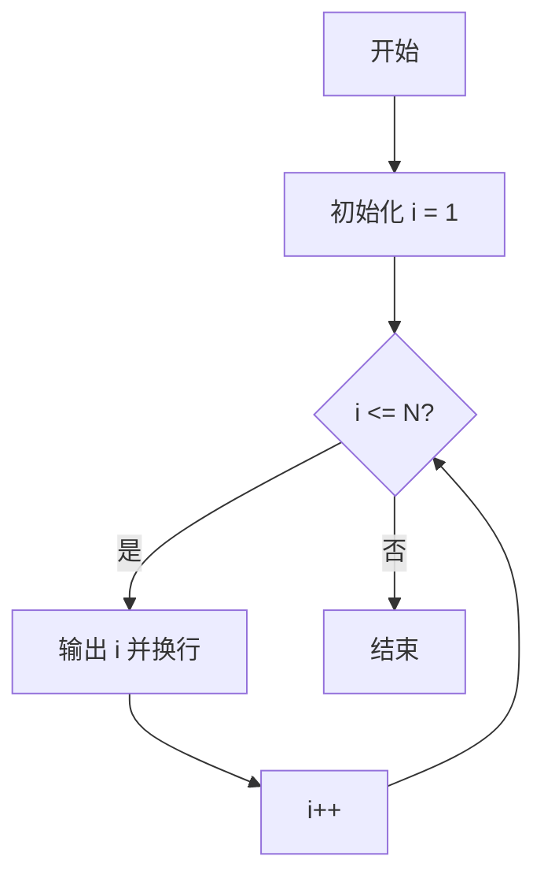
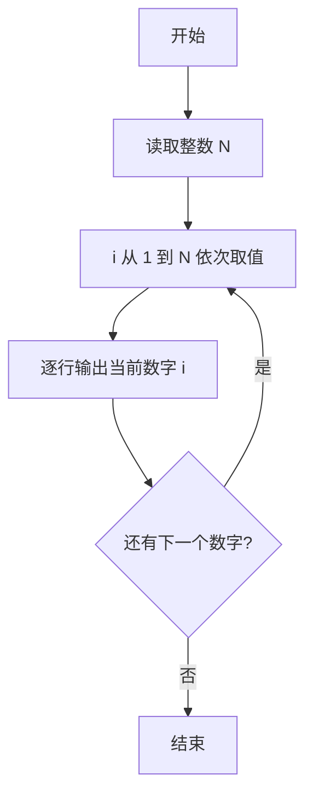

# PTA基础编程题目集 6-1简单输出整数（Go语言实现）

## 题目描述

本题要求实现一个函数，对给定的正整数`N`，打印从1到`N`的全部正整数。

### 函数接口定义

```go
func PrintN(N int)
```

其中`N`是用户传入的参数。该函数必须将从1到`N`的全部正整数顺序打印出来，每个数字占1行。

### 裁判测试程序样例

```go
package main

import "fmt"

func PrintN(N int)

func main() {
	var N int
	fmt.Scan(&N)
	PrintN(N)
}

// 你的代码将被嵌在这里
```

### 输入样例

```in
3
```

### 输出样例

```out
1
2
3
```

## 解题思路

这道题的核心是**顺序输出整数序列**：函数收到参数 N 后，把 1 到 N 的每个整数按行打印出来，不需要返回值。

### 核心问题分析

1. **输出范围**：从 1 到 N 共 N 个正整数，需要逐行打印。
2. **输出方式**：用 for 循环驱动，循环变量 i 从 1 递增到 N，覆盖全部整数。
3. **换行处理**：fmt.Println 每次输出后自动换行，满足"每个数字占 1 行"的格式要求。

### 算法原理说明

使用 for 循环让循环变量 i 从 1 递增到 N，循环体内调用 `fmt.Println(i)` 输出当前数字并换行。循环结束即完成全部输出，函数不需要返回值。

### 具体计算步骤

1. 循环变量初始化：i = 1。
2. 判断 i <= N 是否成立：成立则进入循环体，不成立则函数结束。
3. 循环体：`fmt.Println(i)` 输出 i 并换行。
4. 执行 i++ 自增，回到第 2 步继续判断。

## 完整代码

```go
// 题目：6-1 简单输出整数
// 要求：实现 PrintN(N int) 打印 1 到 N 的全部正整数，每个数字占 1 行。
//
// 实现原理：
//   用 for 循环变量 i 从 1 到 N，依次 fmt.Println(i) 输出并换行。
package main

import "fmt"

func PrintN(N int) {
    for i := 1; i <= N; i++ {
        fmt.Println(i)
    }
}

func main() {
    var N int
    fmt.Scan(&N)
    PrintN(N)
}
```

## 代码流程说明

1. for 循环初始化循环变量 i := 1。
2. 判断 i <= N 是否成立：成立则进入循环体，不成立则结束函数。
3. 循环体内调用 fmt.Println(i) 输出当前数字并换行。
4. 执行 i++ 使循环变量自增，回到第 2 步继续判断。

## 代码流程图



## 解题流程图


