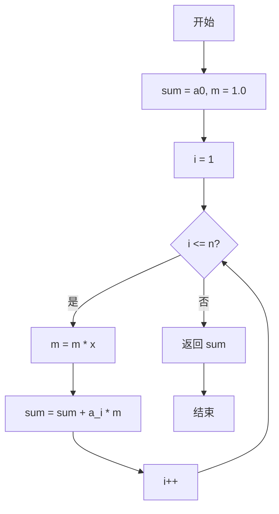
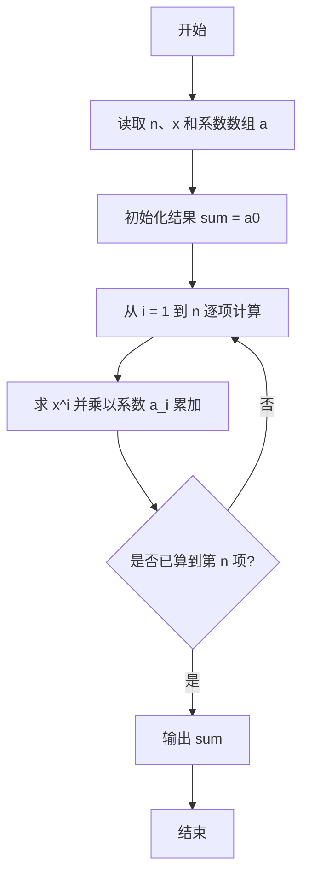

# PTA基础编程题目集 6-2多项式求值（Go语言实现）

## 题目描述

本题要求实现一个函数，计算阶数为`n`，系数为`a[0]` ... `a[n]`的多项式*f*(*x*)=∑^n^~i=0~*(*a*[*i*]*×x^i^) 在`x`点的值。

### 函数接口定义

```go
func f(n int, a []float64, x float64) float64
```

其中`n`是多项式的阶数，`a[]`中存储系数，`x`是给定点。函数须返回多项式`f(x)`的值。

### 裁判测试程序样例

```go
package main

import "fmt"

const MAXN = 10

func f(n int, a []float64, x float64) float64

func main() {
	var n int
	var x float64
	fmt.Scan(&n, &x)
	a := make([]float64, MAXN)
	for i := 0; i <= n; i++ {
		fmt.Scan(&a[i])
	}
	fmt.Printf("%.1f\n", f(n, a, x))
}

// 你的代码将被嵌在这里
```

### 输入样例

```in
2 1.1
1 2.5 -38.7
```

### 输出样例

```out
-43.1
```

## 解题思路

这道题的核心是**逐项累乘求多项式值**：多项式求值通常用逐项累乘的方式，先计算 `x^i` 再乘以系数 `a[i]` 累加，用变量 `m` 保存当前的 `x^i`，每轮迭代 `m *= x` 即可递推得到下一项，从而在 O(n) 时间内完成求值。

### 核心问题分析

1. **初值设置**：常数项 a[0] 作为累加初值 sum，m = 1.0 表示 x^0。
2. **幂次递推**：每轮迭代先 m *= x 得到当前项的 x^i，避免每项重复计算幂。
3. **逐项累加**：sum += a[i] * m，把 a[i] × x^i 累加到结果中。

### 算法原理说明

多项式 f(x) = a0 + a1·x + a2·x² + … + an·xⁿ。逐项累乘的思路是：用变量 m 保存当前项的 x 的幂次，初始为 x^0 = 1.0；第 i 轮先执行 `m *= x` 把 m 更新为 x^i，再执行 `sum += a[i] * m` 累加当前项。这样每项只需一次乘法和一次累加，整体在 O(n) 时间内完成。

### 具体计算步骤

1. 初始化 sum := a[0]（常数项），m := 1.0（x^0）。
2. 循环变量 i 从 1 递增到 n。
3. 每轮先 m *= x 得到 x^i，再累加 sum += a[i] * m。
4. 循环结束后返回 sum，即为多项式在 x 点的值。

## 完整代码

```go
// 题目：6-2 多项式求值
// 要求：实现 f(n int, a []float64, x float64) float64 计算多项式在 x 点的值。
//
// 实现原理：
//   逐项累乘：sum 初值为 a[0]，m 保存 x^i 初始为 1，每轮 m*=x 并累加 a[i]*m。
package main

import "fmt"

const MAXN = 10

func f(n int, a []float64, x float64) float64 {
    sum := a[0]
    m := 1.0
    for i := 1; i <= n; i++ {
        m *= x
        sum += a[i] * m
    }
    return sum
}

func main() {
    var n int
    var x float64
    fmt.Scan(&n, &x)
    a := make([]float64, MAXN)
    for i := 0; i <= n; i++ {
        fmt.Scan(&a[i])
    }
    fmt.Printf("%.1f\n", f(n, a, x))
}
```

## 代码流程说明

1. 用 `sum := a[0]` 保存常数项，`m := 1.0` 表示 `x^0`。
2. 循环变量 `i` 从 1 递增到 `n`。
3. 每轮先 `m *= x` 得到 `x^i`，再累加 `sum += a[i] * m`。
4. 循环结束后返回 `sum`，即为多项式在 `x` 点的值。

## 代码流程图



## 解题流程图


