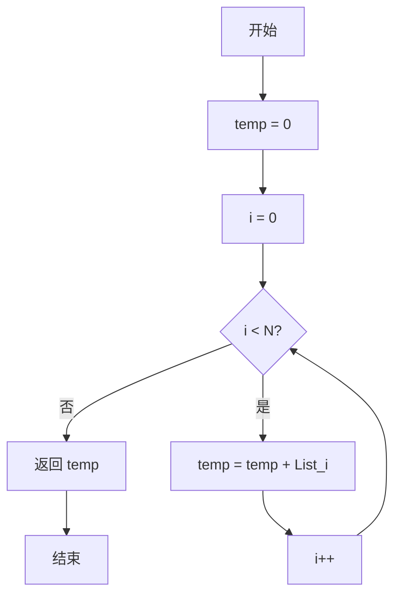
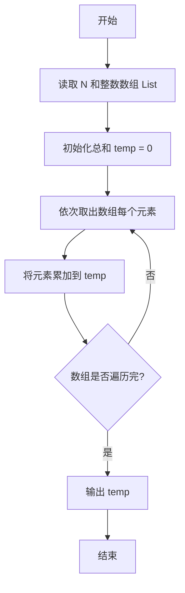

# PTA基础编程题目集 6-3简单求和（Go语言实现）

## 题目描述

本题要求实现一个函数，求给定的`N`个整数的和。

### 函数接口定义

```go
func Sum(List []int, N int) int
```

其中给定整数存放在数组`List[]`中，正整数`N`是数组元素个数。该函数须返回`N`个`List[]`元素的和。

### 裁判测试程序样例

```go
package main

import "fmt"

const MAXN = 10

func Sum(List []int, N int) int

func main() {
	List := make([]int, MAXN)
	var N int
	fmt.Scan(&N)
	for i := 0; i < N; i++ {
		fmt.Scan(&List[i])
	}
	fmt.Println(Sum(List, N))
}

// 你的代码将被嵌在这里
```

### 输入样例

```in
3
12 34 -5
```

### 输出样例

```out
41
```

## 解题思路

这道题的核心是**遍历累加求和**：用变量 `temp` 保存累加结果（初始为 0），遍历数组 `List` 的每个元素，依次把元素值累加到 `temp` 中。遍历结束后 `temp` 就是所有 `N` 个整数的和。

### 核心问题分析

1. **累加器初始化**：temp := 0，作为累加结果的起点。
2. **遍历范围**：循环变量 i 从 0 递增到 N - 1，覆盖数组的全部下标。
3. **逐元素累加**：每轮执行 temp += List[i]，把当前元素加入总和。

### 算法原理说明

求和即把所有元素依次累加。用变量 temp 保存累加结果，初始为 0；遍历数组的每个元素，每轮把 List[i] 加到 temp 上；遍历结束后 temp 就是 N 个整数的和，直接返回即可。

### 具体计算步骤

1. 初始化 `temp := 0`。
2. 循环变量 `i` 从 0 递增到 `N - 1`，覆盖数组的全部下标。
3. 每轮执行 `temp += List[i]`，把当前元素加入总和。
4. 循环结束后返回 `temp`。

## 完整代码

```go
// 题目：6-3 简单求和
// 要求：实现 Sum(List []int, N int) int 返回 N 个整数的和。
//
// 实现原理：
//   线性累加：temp 初始化为 0，遍历 List[0..N-1] 依次 temp+=List[i]。
package main

import "fmt"

const MAXN = 10

func Sum(List []int, N int) int {
    temp := 0
    for i := 0; i < N; i++ {
        temp += List[i]
    }
    return temp
}

func main() {
    List := make([]int, MAXN)
    var N int
    fmt.Scan(&N)
    for i := 0; i < N; i++ {
        fmt.Scan(&List[i])
    }
    fmt.Println(Sum(List, N))
}
```

## 代码流程说明

1. 初始化 `temp := 0`。
2. 循环变量 `i` 从 0 递增到 `N - 1`，覆盖数组的全部下标。
3. 每轮执行 `temp += List[i]`，把当前元素加入总和。
4. 循环结束后返回 `temp`。

## 代码流程图



## 解题流程图


