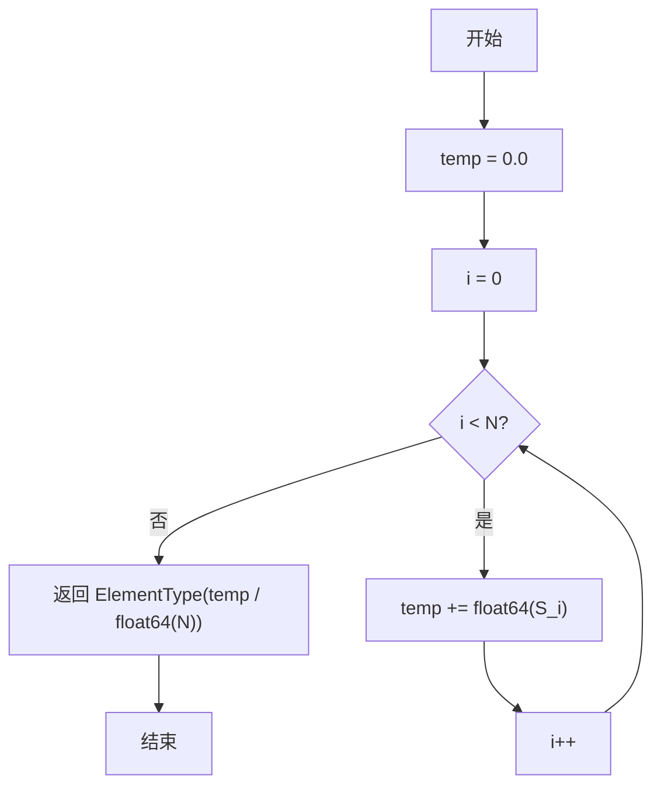
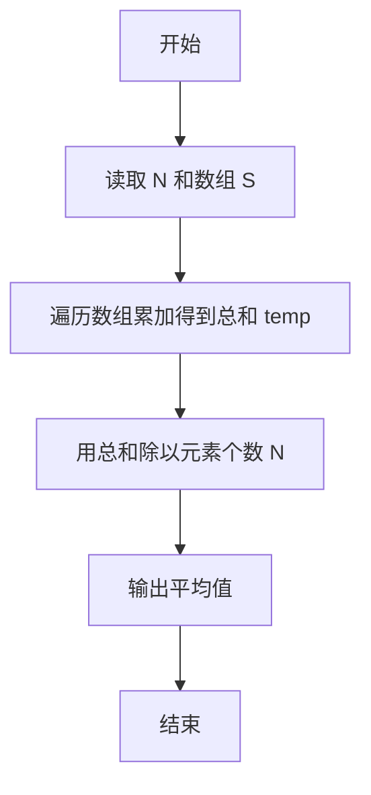

# PTA基础编程题目集 6-4求自定类型元素的平均（Go语言实现）

## 题目描述

本题要求实现一个函数，求`N`个集合元素`S[]`的平均值，其中集合元素的类型为自定义的`ElementType`。

### 函数接口定义

```go
type ElementType float32

func Average(S []ElementType, N int) ElementType
```

其中给定集合元素存放在数组`S[]`中，正整数`N`是数组元素个数。该函数须返回`N`个`S[]`元素的平均值，其值也必须是`ElementType`类型。

### 裁判测试程序样例

```go
package main

import "fmt"

const MAXN = 10

type ElementType float32

func Average(S []ElementType, N int) ElementType

func main() {
	S := make([]ElementType, MAXN)
	var N int
	fmt.Scan(&N)
	for i := 0; i < N; i++ {
		var val float32
		fmt.Scan(&val)
		S[i] = ElementType(val)
	}
	fmt.Printf("%.2f\n", Average(S, N))
}

// 你的代码将被嵌在这里
```

### 输入样例

```in
3
12.3 34 -5
```

### 输出样例

```out
13.77
```

## 解题思路

这道题的核心是**先求和再求平均**：平均值 = 元素总和 ÷ 元素个数。思路是先遍历数组 `S` 把全部元素累加得到总和 `temp`，再用 `temp` 除以元素个数 `N`。因为数组元素是 `ElementType`（底层为 float32），代码先用更高精度的 `float64` 累加，最后把平均值转回 `ElementType` 返回，以保证结果为小数且精度更高。

### 核心问题分析

1. **累加总和**：遍历数组 S 把所有元素累加到 temp。
2. **精度处理**：用 float64 高精度累加，避免 float32 累积误差。
3. **求平均值**：temp / float64(N) 得到平均值，再转回 ElementType 返回。

### 算法原理说明

平均值的定义是总和除以个数。遍历数组把全部元素累加得到总和 temp，然后用 temp 除以元素个数 N。由于数组元素底层是 float32，逐项累加可能产生精度损失，因此先用 float64 累加，最后再转回 ElementType 返回。

### 具体计算步骤

1. 初始化 `temp := 0`（`float64` 类型，用更高精度累加）。
2. 循环变量 `i` 从 0 递增到 `N - 1`，每轮执行 `temp += float64(S[i])`，把每个元素转为 `float64` 后累加。
3. 用 `temp / float64(N)` 计算总和除以元素个数，得到平均值。
4. 返回 `ElementType(temp / float64(N))`，即转回 `ElementType` 类型的平均值。

## 完整代码

```go
// 题目：6-4 求自定类型元素的平均
// 要求：实现 Average(S []ElementType, N int) ElementType 返回平均值。
//
// 实现原理：
//   用 float64 高精度累加 S 中所有元素，再除以 N 并转回 ElementType。
package main

import "fmt"

const MAXN = 10

type ElementType float32

func Average(S []ElementType, N int) ElementType {
    if N <= 0 {
        return 0
    }
    var temp float64 = 0
    for i := 0; i < N; i++ {
        temp += float64(S[i])
    }
    return ElementType(temp / float64(N))
}

func main() {
    S := make([]ElementType, MAXN)
    var N int
    fmt.Scan(&N)
    for i := 0; i < N; i++ {
        var val float32
        fmt.Scan(&val)
        S[i] = ElementType(val)
    }
    fmt.Printf("%.2f\n", Average(S, N))
}
```

## 代码流程说明

1. 初始化 `temp := 0`（`float64` 类型，用更高精度累加）。
2. 循环变量 `i` 从 0 递增到 `N - 1`，每轮执行 `temp += float64(S[i])`，把每个元素转为 `float64` 后累加。
3. 用 `temp / float64(N)` 计算总和除以元素个数，得到平均值。
4. 返回 `ElementType(temp / float64(N))`，即转回 `ElementType` 类型的平均值。

## 代码流程图



## 解题流程图


