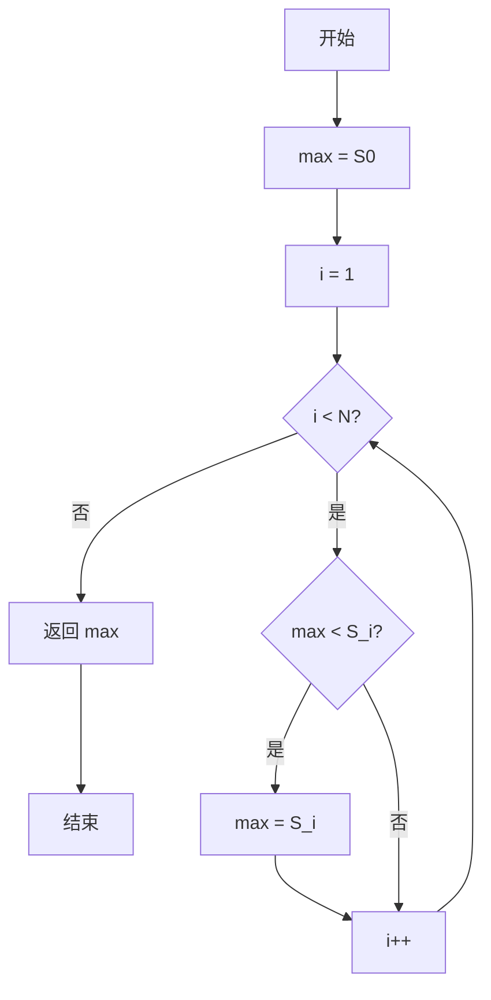
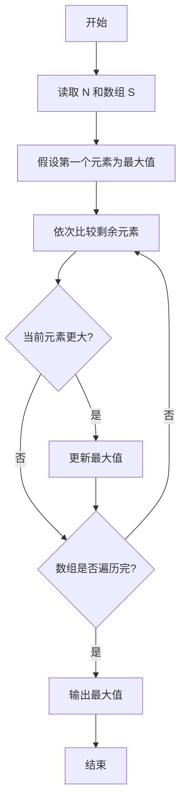

# PTA基础编程题目集 6-5求自定类型元素的最大值（Go语言实现）

## 题目描述

本题要求实现一个函数，求`N`个集合元素`S[]`中的最大值，其中集合元素的类型为自定义的`ElementType`。

### 函数接口定义

```go
type ElementType float32

func Max(S []ElementType, N int) ElementType
```

其中给定集合元素存放在数组`S[]`中，正整数`N`是数组元素个数。该函数须返回`N`个`S[]`元素中的最大值，其值也必须是`ElementType`类型。

### 裁判测试程序样例

```go
package main

import "fmt"

const MAXN = 10

type ElementType float32

func Max(S []ElementType, N int) ElementType

func main() {
	S := make([]ElementType, MAXN)
	var N int
	fmt.Scan(&N)
	for i := 0; i < N; i++ {
		var val float32
		fmt.Scan(&val)
		S[i] = ElementType(val)
	}
	fmt.Printf("%.2f\n", Max(S, N))
}

// 你的代码将被嵌在这里
```

### 输入样例

```in
3
12.3 34 -5
```

### 输出样例

```out
34.00
```

## 函数部分

```go
func Max(S []ElementType, N int) ElementType {
    if N <= 0 {
        return 0
    }
    max := S[0]
    for i := 1; i < N; i++ {
        if max < S[i] {
            max = S[i]
        }
    }
    return max
}
```

## 解题思路

这道题的核心是**"打擂台"求最大值**：先把第一个元素 `S[0]` 当作当前最大值 `max`，然后从第二个元素开始依次与 `max` 比较，凡是比 `max` 大的元素就更新 `max`。遍历结束后 `max` 即为整个数组的最大值。

### 核心问题分析

1. **初值设定**：max := S[0]，把第一个元素作为初始最大值。
2. **比较范围**：循环变量 i 从 1 递增到 N - 1，从第二个元素开始比较。
3. **更新规则**：只要 max < S[i] 就把 max 更新为 S[i]。

### 算法原理说明

"打擂台"思想：先假设第一个元素最大，然后让后面每个元素依次"攻擂"，比当前 max 大的就夺擂（更新 max）。遍历结束后留在擂台上的就是整个数组的最大值。

### 具体计算步骤

1. 初始化 `max := S[0]`，把首元素作为初始最大值。
2. 循环变量 `i` 从 1 递增到 `N - 1`。
3. 判断 `max < S[i]`：成立则把 `max` 更新为 `S[i]`。
4. 循环结束后返回 `max`。

## 完整代码

```go
// 题目：6-5 求自定类型元素的最大值
// 要求：实现 Max(S []ElementType, N int) ElementType 返回最大值。
//
// 实现原理：
//   打擂台：max 初始化为 S[0]，从 1 到 N-1 依次比较，若 S[i]>max 则更新。
package main

import "fmt"

const MAXN = 10

type ElementType float32

func Max(S []ElementType, N int) ElementType {
    if N <= 0 {
        return 0
    }
    max := S[0]
    for i := 1; i < N; i++ {
        if max < S[i] {
            max = S[i]
        }
    }
    return max
}

func main() {
    S := make([]ElementType, MAXN)
    var N int
    fmt.Scan(&N)
    for i := 0; i < N; i++ {
        var val float32
        fmt.Scan(&val)
        S[i] = ElementType(val)
    }
    fmt.Printf("%.2f\n", Max(S, N))
}
```

## 代码流程说明

1. 初始化 `max := S[0]`，把首元素作为初始最大值。
2. 循环变量 `i` 从 1 递增到 `N - 1`。
3. 判断 `max < S[i]`：成立则把 `max` 更新为 `S[i]`。
4. 循环结束后返回 `max`。

## 代码流程图



## 解题流程图



## 复杂度分析

除首元素外，每个元素只比较一次，时间复杂度为 `O(N)`；只保存当前最大值，额外空间复杂度为 `O(1)`。

## 常见易错点

1. 初始最大值应取 `S[0]`，不能固定初始化为 0，否则全为负数时会得到错误结果。
2. 后续比较应从下标 1 开始，避免重复处理首元素。
3. 返回值类型必须是 `ElementType`，不能随意改成 `float32` 或 `int`。
4. 题目保证 N 为正整数；若处理空数组扩展情况，应先定义空数组的返回规则。
