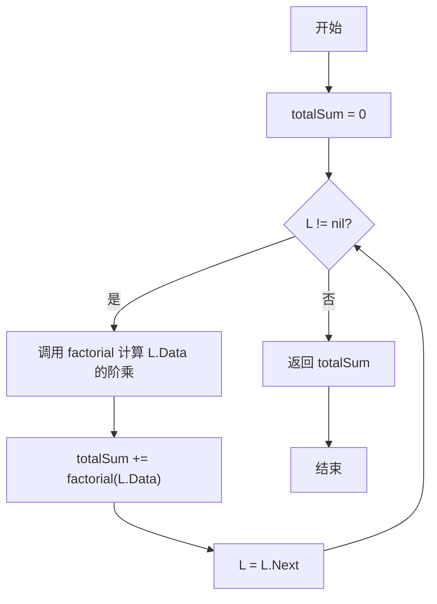
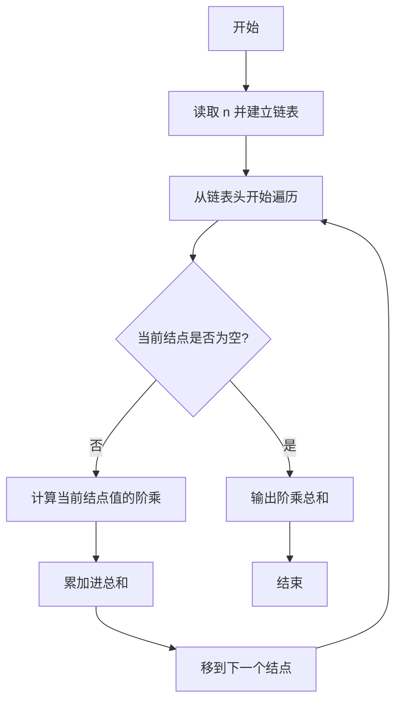

# PTA基础编程题目集 6-6求单链表结点的阶乘和（Go语言实现）

## 题目描述

本题要求实现一个函数，求单链表`L`结点的阶乘和。这里默认所有结点的值非负，且题目保证结果在`int`范围内。

### 函数接口定义

```go
func FactorialSum(L List) int
```

其中单链表`List`的定义如下：

```go
type Node struct {
	Data int   // 存储结点数据
	Next *Node // 指向下一个结点的指针
}

type List *Node // 定义单链表类型
```

### 裁判测试程序样例

```go
package main

import "fmt"

type Node struct {
	Data int
	Next *Node
}

type List *Node

func FactorialSum(L List) int

func main() {
	var N int
	fmt.Scan(&N)
	var L List = nil
	for i := 0; i < N; i++ {
		var data int
		fmt.Scan(&data)
		p := &Node{Data: data, Next: L}
		L = p
	}
	fmt.Println(FactorialSum(L))
}

// 你的代码将被嵌在这里
```

### 输入样例

```in
3
5 3 6
```

### 输出样例

```out
846
```

## 解题思路

这道题的核心是**遍历链表累加各结点值的阶乘**：先写一个辅助函数 `factorial(n)` 计算 `n` 的阶乘（`sum` 从 1 开始，循环乘以 2 到 `n` 的每个整数）；主函数 `FactorialSum` 用指针 `L` 从链表头开始遍历，只要结点不为空，就调用 `factorial(L.Data)` 计算当前结点值的阶乘并累加到 `totalSum`，然后 `L = L.Next` 指向下一个结点，直到链表遍历完毕，返回总和。

### 核心问题分析

1. **阶乘辅助函数**：factorial(n) 用循环从 2 乘到 n 计算 n 的阶乘。
2. **链表遍历**：for L != nil 从表头开始，当前结点非空就继续。
3. **累加求和**：把每个结点的阶乘 factorial(L.Data) 累加到 totalSum，指针后移。

### 算法原理说明

单链表的遍历只能通过指针 Next 逐结点进行。先用辅助函数 factorial 计算单个值的阶乘，再从表头出发，对每个非空结点计算其 Data 的阶乘并累加，指针 L 每轮后移一位，直到 L 为空时遍历结束，返回累加总和。

### 具体计算步骤

1. 辅助函数 `factorial(n int)`：初始化 `sum := 1`，循环变量 `i` 从 2 递增到 `n`，每轮执行 `sum *= i`，循环结束返回 `sum`。
2. 主函数初始化 `totalSum := 0`。
3. `for L != nil` 循环遍历链表：当前结点非空则进入循环体。
4. 调用 `factorial(L.Data)` 计算当前结点值的阶乘，累加到 `totalSum`。
5. 执行 `L = L.Next` 指针后移，回到第 3 步继续判断。
6. 链表遍历完后返回 `totalSum`。

## 完整代码

```go
// 题目：6-6 求单链表结点的阶乘和
// 要求：实现 FactorialSum(L List) int 返回链表各结点 Data 阶乘之和。
//
// 实现原理：
//   辅助函数 factorial 计算阶乘；遍历链表 L!=nil 时累加 factorial(L.Data) 并后移指针。
package main

import "fmt"

type Node struct {
    Data int
    Next *Node
}

type List *Node

func FactorialSum(L List) int {
    total := 0
    for L != nil {
        fact := 1
        for i := 2; i <= L.Data; i++ {
            fact *= i
        }
        total += fact
        L = L.Next
    }
    return total
}

func main() {
    var N int
    fmt.Scan(&N)
    var L List = nil
    for i := 0; i < N; i++ {
        var data int
        fmt.Scan(&data)
        p := &Node{Data: data, Next: L}
        L = p
    }
    fmt.Println(FactorialSum(L))
}
```

## 代码流程说明

1. 辅助函数 `factorial(n int)`：初始化 `sum := 1`，循环变量 `i` 从 2 递增到 `n`，每轮执行 `sum *= i`，循环结束返回 `sum`。
2. 主函数初始化 `totalSum := 0`。
3. `for L != nil` 循环遍历链表：当前结点非空则进入循环体。
4. 调用 `factorial(L.Data)` 计算当前结点值的阶乘，累加到 `totalSum`。
5. 执行 `L = L.Next` 指针后移，回到第 3 步继续判断。
6. 链表遍历完后返回 `totalSum`。

## 代码流程图



## 解题流程图


