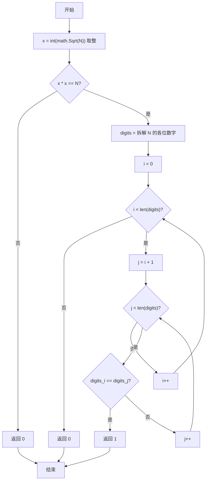
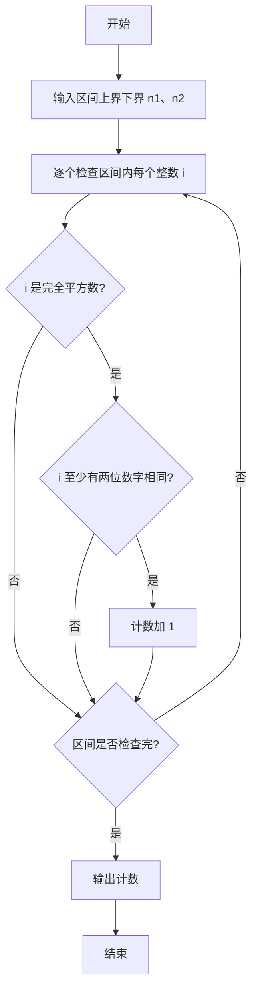

# PTA基础编程题目集 6-7统计某类完全平方数（Go语言实现）

## 题目描述

本题要求实现一个函数，判断任一给定整数`N`是否满足条件：它是完全平方数，又至少有两位数字相同，如144、676等。

### 函数接口定义

```go
func IsTheNumber(N int) int
```

其中`N`是用户传入的参数。如果`N`满足条件，则该函数必须返回1，否则返回0。

### 裁判测试程序样例

```go
package main

import "fmt"

func IsTheNumber(N int) int

func main() {
	var n1, n2 int
	fmt.Scan(&n1, &n2)
	cnt := 0
	for i := n1; i <= n2; i++ {
		if IsTheNumber(i) == 1 {
			cnt++
		}
	}
	fmt.Printf("cnt = %d\n", cnt)
}

// 你的代码将被嵌在这里
```

### 输入样例

```in
105 500
```

### 输出样例

```out
cnt = 6
```

## 解题思路

这道题的核心是**同时满足两个条件**：① 完全平方数；② 至少有两位数字相同。思路分三步：先用 `int(math.Sqrt(float64(N)))` 对 `N` 开平方取整得到 `x`，判断 `x*x == N` 是否成立来验证完全平方数；再把 `N` 的各位数字依次拆入切片 `digits`；最后用双重循环两两比较数字，只要找到任意两个相同数字即满足条件，返回 1，否则返回 0。

### 核心问题分析

1. **完全平方数判定**：对 N 开平方取整得 x，x*x == N 即完全平方数。
2. **拆解各位数字**：循环取 M%10 与 M/=10，把各位数字存入切片 digits。
3. **两位数字相同**：双重循环两两比较 digits[i] 与 digits[j]，相等即返回 1。

### 算法原理说明

一个整数是完全平方数当且仅当它的整数平方根的平方等于它本身，因此先算 x = int(math.Sqrt(float64(N)))，再检查 x*x == N。随后把 N 的每一位拆出来存入切片，用双重循环做两两比较，只要存在任意两位相等就说明"至少有两位数字相同"。

### 具体计算步骤

1. 计算 `x := int(math.Sqrt(float64(N)))` 并取整，判断 `x*x != N`：成立则说明不是完全平方数，返回 0。
2. 将 `N` 的各位数字依次拆入切片 `digits`：`M := N`，`for M > 0` 循环中 `digits = append(digits, M%10)` 取最低位，`M /= 10` 去掉最低位。
3. 外层循环 `i` 从 0 开始，内层循环 `j` 从 `i + 1` 开始，两两比较 `digits[i]` 与 `digits[j]`。
4. 只要发现 `digits[i] == digits[j]`，立即返回 1。
5. 双重循环结束后没有相同数字，返回 0。

## 完整代码

```go
// 题目：6-7 统计某类完全平方数
// 要求：实现 IsTheNumber(N int) int 判断完全平方数且至少有两位数字相同。
//
// 实现原理：
//   先对 N 开方取整验证完全平方数，再拆解各位数字用双重循环找相同数字。
package main

import (
    "fmt"
    "math"
)

func IsTheNumber(N int) int {
    if N < 0 {
        return 0
    }
    r := int(math.Sqrt(float64(N)))
    for (r+1)*(r+1) <= N {
        r++
    }
    for r*r > N {
        r--
    }
    if r*r != N {
        return 0
    }
    if N < 10 {
        return 0
    }
    cnt := [10]int{}
    tmp := N
    for tmp > 0 {
        d := tmp % 10
        cnt[d]++
        if cnt[d] >= 2 {
            return 1
        }
        tmp /= 10
    }
    return 0
}

func main() {
    var n1, n2 int
    fmt.Scan(&n1, &n2)
    cnt := 0
    for i := n1; i <= n2; i++ {
        if IsTheNumber(i) == 1 {
            cnt++
        }
    }
    fmt.Printf("cnt = %d\n", cnt)
}
```

## 代码流程说明

1. 计算 `x := int(math.Sqrt(float64(N)))` 并取整，判断 `x*x != N`：成立则说明不是完全平方数，返回 0。
2. 将 `N` 的各位数字依次拆入切片 `digits`：`M := N`，`for M > 0` 循环中 `digits = append(digits, M%10)` 取最低位，`M /= 10` 去掉最低位。
3. 外层循环 `i` 从 0 开始，内层循环 `j` 从 `i + 1` 开始，两两比较 `digits[i]` 与 `digits[j]`。
4. 只要发现 `digits[i] == digits[j]`，立即返回 1。
5. 双重循环结束后没有相同数字，返回 0。

## 代码流程图



## 解题流程图


