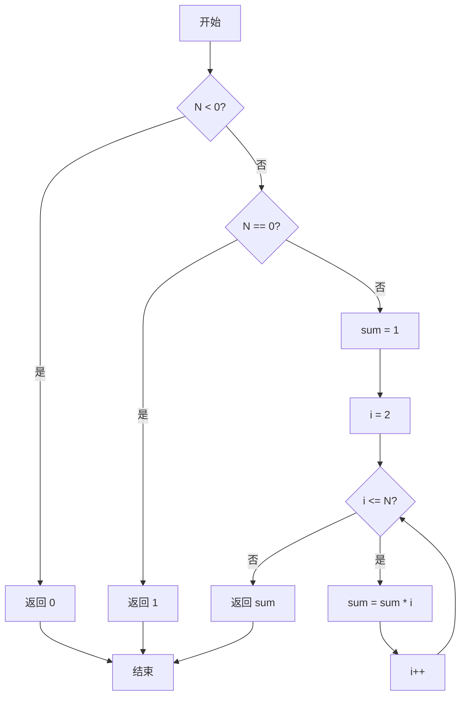
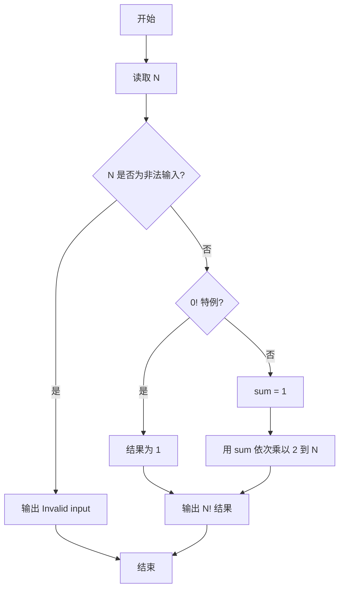

# PTA基础编程题目集 6-8简单阶乘计算（Go语言实现）

## 题目描述

本题要求实现一个计算非负整数阶乘的简单函数。

### 函数接口定义

```go
func Factorial(N int) int
```

其中`N`是用户传入的参数，其值不超过12。如果`N`是非负整数，则该函数必须返回`N`的阶乘，否则返回0。

### 裁判测试程序样例

```go
package main

import "fmt"

func Factorial(N int) int

func main() {
	var N int
	fmt.Scan(&N)
	NF := Factorial(N)
	if NF != 0 {
		fmt.Printf("%d! = %d\n", N, NF)
	} else {
		fmt.Println("Invalid input")
	}
}

// 你的代码将被嵌在这里
```

### 输入样例

```in
5
```

### 输出样例

```out
5! = 120
```

## 解题思路

这道题的核心是**累乘计算阶乘**：阶乘 `N! = 1 × 2 × ... × N`，且 `0! = 1`。思路：先判断 `N < 0` 的非法输入，直接返回 0；再判断 `N == 0` 时返回 1（`0!` 定义为 1）；否则用变量 `sum` 从 1 开始，依次乘以 2 到 `N` 的每个整数，最终得到 `N` 的阶乘。

### 核心问题分析

1. **非法输入**：N < 0 时阶乘无定义，按约定返回 0。
2. **0! 特例**：0! 定义为 1，需单独处理。
3. **累乘计算**：sum 从 1 开始，依次乘以 2 到 N 的每个整数。

### 算法原理说明

阶乘 N! = 1 × 2 × ... × N。用变量 sum 从 1 开始，循环 i 从 2 到 N 依次执行 sum *= i，循环结束后 sum 即为 N!。注意两个边界：负数无阶乘返回 0；0! 定义为 1。

### 具体计算步骤

1. 判断 `N < 0`：成立则返回 0（题目约定非法输入返回 0）。
2. 判断 `N == 0`：成立则返回 1（`0!` 定义为 1）。
3. 初始化 `sum := 1`。
4. 循环变量 `i` 从 2 递增到 `N`，每轮执行 `sum *= i`。
5. 循环结束后返回 `sum`，即为 `N!`。

## 完整代码

```go
// 题目：6-8 简单阶乘计算
// 要求：实现 Factorial(N int) int 计算阶乘，负数返回 0。
//
// 实现原理：
//   负数返回 0，0 返回 1，否则从 2 到 N 累乘。
package main

import "fmt"

func Factorial(N int) int {
    if N < 0 {
        return 0
    }
    if N == 0 {
        return 1
    }
    sum := 1
    for i := 2; i <= N; i++ {
        sum *= i
    }
    return sum
}

func main() {
    var N int
    fmt.Scan(&N)
    NF := Factorial(N)
    if NF != 0 {
        fmt.Printf("%d! = %d\n", N, NF)
    } else {
        fmt.Println("Invalid input")
    }
}
```

## 代码流程说明

1. 判断 `N < 0`：成立则返回 0（题目约定非法输入返回 0）。
2. 判断 `N == 0`：成立则返回 1（`0!` 定义为 1）。
3. 初始化 `sum := 1`。
4. 循环变量 `i` 从 2 递增到 `N`，每轮执行 `sum *= i`。
5. 循环结束后返回 `sum`，即为 `N!`。

## 代码流程图



## 解题流程图


