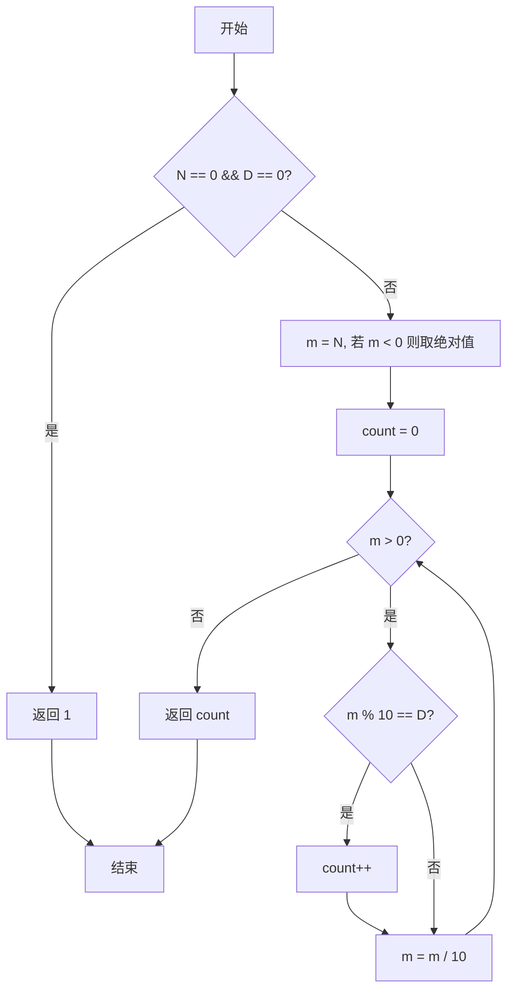
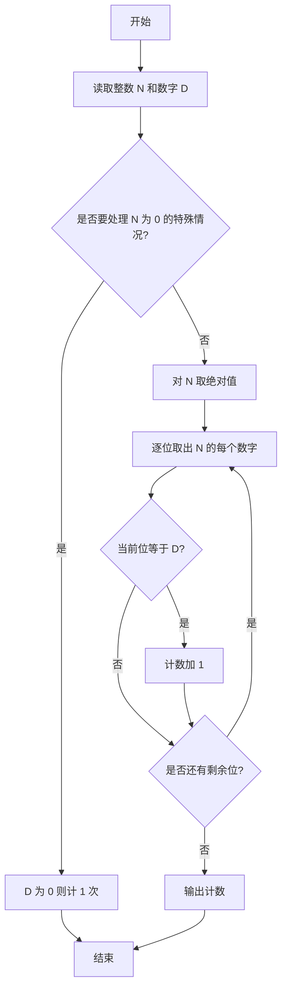

# PTA基础编程题目集 6-9统计个位数字（Go语言实现）

## 题目描述

本题要求实现一个函数，可统计任一整数中某个位数出现的次数。例如-21252中，2出现了3次，则该函数应该返回3。

### 函数接口定义

```go
func Count_Digit(N int, D int) int
```

其中`N`和`D`都是用户传入的参数。`N`的值不超过`int`的范围；`D`是[0, 9]区间内的个位数。函数须返回`N`中`D`出现的次数。

### 裁判测试程序样例

```go
package main

import "fmt"

func Count_Digit(N int, D int) int

func main() {
	var N, D int
	fmt.Scan(&N, &D)
	fmt.Println(Count_Digit(N, D))
}

// 你的代码将被嵌在这里
```

### 输入样例

```in
-21252 2
```

### 输出样例

```out
3
```

## 函数部分

```go
func Count_Digit(N int, D int) int {
    if N == 0 {
        if D == 0 {
            return 1
        }
        return 0
    }
    count := 0
    for N != 0 {
        digit := N % 10
        if digit < 0 {
            digit = -digit
        }
        if digit == D {
            count++
        }
        N /= 10
    }
    return count
}
```

## 解题思路

这道题的核心是**逐位检查统计出现次数**：每次用 `m % 10` 取出当前最低位与 `D` 比较，再用 `m /= 10` 去掉该位，直到 `m` 变为 0。需要注意两个特殊情况：负数先取绝对值再处理；`N = 0` 时循环不会执行，需单独判断 `D == 0` 时返回 1。

### 核心问题分析

1. **N=0 特例**：数字 0 只有一位数字 0，D==0 时计数应为 1。
2. **负数处理**：先取绝对值，负号不参与计数。
3. **逐位检查**：m%10 取最低位与 D 比较，m/=10 去掉该位。

### 算法原理说明

统计某数字出现的次数就是把整数逐位拆开逐一比较。每次用 m % 10 取出当前最低位，与 D 比较后相等则计数加 1，再用 m /= 10 去掉已检查的最低位，直到 m 变为 0 结束。负数先取绝对值，因为负号不属于数字位；N 为 0 时循环体不执行，需单独处理 D == 0 的情况。

### 具体计算步骤

1. 处理特例：`N == 0 && D == 0` 时返回 1（数字 0 中只出现一次 0）。
2. 将 `N` 存入 `m`，若 `m < 0` 则取绝对值 `m = -m`，用于处理负数。
3. 初始化计数 `count := 0`。
4. `for m > 0` 循环：`m % 10` 得到最低位，与 `D` 比较相等则 `count++`。
5. `m /= 10` 去掉已检查的最低位，继续循环。
6. 循环结束返回 `count`。

## 完整代码

```go
// 题目：6-9 统计个位数字
// 要求：实现 Count_Digit(N int, D int) int 统计 N 中 D 出现的次数。
//
// 实现原理：
//   特判 N==0&&D==0 返回 1；负数取绝对值；循环取 m%10 比较并计数。
package main

import "fmt"

func Count_Digit(N int, D int) int {
    if N == 0 {
        if D == 0 {
            return 1
        }
        return 0
    }
    count := 0
    for N != 0 {
        d := N % 10
        if d < 0 {
            d = -d
        }
        if d == D {
            count++
        }
        N /= 10
    }
    return count
}

func main() {
    var N, D int
    fmt.Scan(&N, &D)
    fmt.Println(Count_Digit(N, D))
}
```

## 代码流程说明

1. 处理特例：`N == 0 && D == 0` 时返回 1（数字 0 中只出现一次 0）。
2. 将 `N` 存入 `m`，若 `m < 0` 则取绝对值 `m = -m`，用于处理负数。
3. 初始化计数 `count := 0`。
4. `for m > 0` 循环：`m % 10` 得到最低位，与 `D` 比较相等则 `count++`。
5. `m /= 10` 去掉已检查的最低位，继续循环。
6. 循环结束返回 `count`。

## 代码流程图



## 解题流程图



## 复杂度分析

设 N 的十进制位数为 `d`，循环每次去掉一位，因此时间复杂度为 `O(d)`，额外空间复杂度为 `O(1)`。

## 常见易错点

1. 负号不是数字，处理负数时应只统计各个数字位。
2. N=0 时循环不会执行，但数字 0 本身应在 D=0 时计数 1 次。
3. 负数取模所得的个位可能为负，应取其绝对值后再与 D 比较。
4. 每轮检查后都要执行整数除以 10，否则无法移动到下一位。
