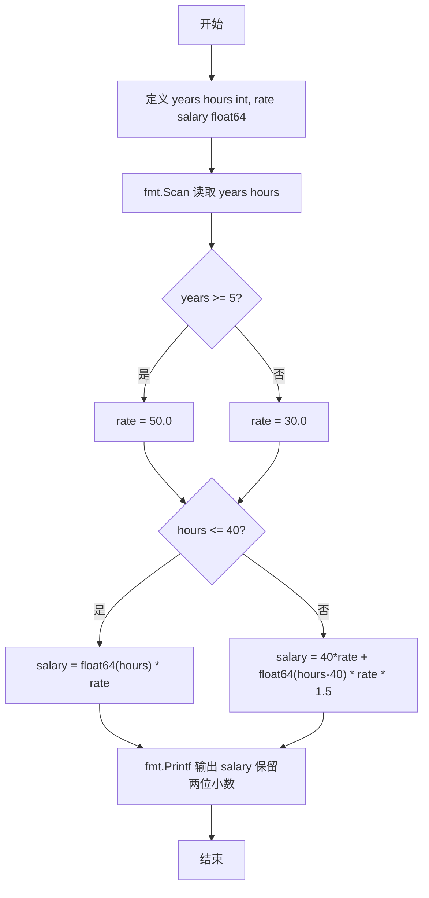
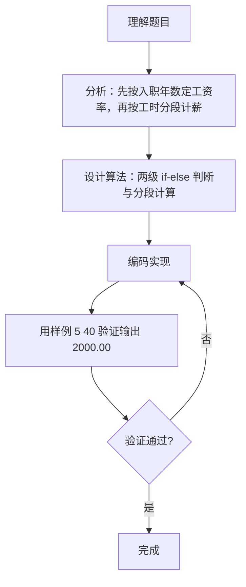

# 7-10 计算工资（Go语言实现）

## 前言

这道题要求根据入职年数与周工作时间计算员工周薪：老职工 50 元/小时、新职工 30 元/小时，超过 40 小时的部分按 1.5 倍计酬，输出保留两位小数。

题目有两个边界容易出错：

1. 进公司满 5 年即算老职工；
2. 恰好 40 小时不产生加班费。

核心策略是两级 if-else 判断：先按入职年数确定工资率，再按工时分段计算周薪，最后用 %.2f 格式化输出。

## 题目描述

某公司员工的工资计算方法如下：一周内工作时间不超过40小时，按正常工作时间计酬；超出40小时的工作时间部分，按正常工作时间报酬的1.5倍计酬。员工按进公司时间分为新职工和老职工，进公司不少于5年的员工为老职工，5年以下的为新职工。新职工的正常工资为30元/小时，老职工的正常工资为50元/小时。请按该计酬方式计算员工的工资。

## 输入格式

输入在一行中给出2个正整数，分别为某员工入职年数和周工作时间，其间以空格分隔。

## 输出格式

在一行输出该员工的周薪，精确到小数点后2位。

## 输入样例1

```in
5 40
```

## 输出样例1

```out
2000.00
```

## 输入样例2

```in
3 50
```

## 输出样例2

```out
1650.00
```

## 解题思路

### 1. 第一级判断：确定小时工资率

根据入职年数确定工资率 rate：

- years >= 5：老职工，rate = 50.0 元/小时；
- 否则：新职工，rate = 30.0 元/小时。

注意"不少于 5 年"包含恰好 5 年，需用 >= 判断。

### 2. 第二级判断：分段计算周薪

根据周工时 hours 选择计酬公式：

- hours <= 40：全部按正常计酬，salary = hours × rate；
- hours > 40：前 40 小时正常、超出部分按 1.5 倍，salary = 40×rate + (hours-40)×rate×1.5。

### 3. 类型转换与保留两位小数输出

hours 为 int 类型，与 float64 的 rate 相乘前需显式转换为 float64(hours)。使用 fmt.Printf("%.2f\n", salary) 保证输出精确到小数点后 2 位。

## 完整代码

```go
// 题目：7-10 计算工资
// 要求：根据入职年数与周工作时间计算周薪：老职工 50 元/小时、新职工 30 元/小时，超过 40 小时部分按 1.5 倍计酬，输出保留两位小数。
//
// 实现原理：
//   1. years >= 5 时 rate = 50.0，否则 rate = 30.0；
//   2. hours <= 40 时 salary = float64(hours) * rate，否则 salary = 40*rate + float64(hours-40)*rate*1.5；
//   3. 用 %.2f 输出保留两位小数的 salary。
package main

import "fmt"

func main() {
	var years, hours int
	var rate, salary float64

	fmt.Scan(&years, &hours)

	if years >= 5 {
		rate = 50.0
	} else {
		rate = 30.0
	}

	if hours <= 40 {
		salary = float64(hours) * rate
	} else {
		salary = 40*rate + float64(hours-40)*rate*1.5
	}

	fmt.Printf("%.2f\n", salary)
}
```

## 代码流程说明

1. 导入 fmt 包，提供标准输入输出功能。
2. 定义 years、hours 为 int，rate、salary 为 float64。
3. 用 fmt.Scan(&years, &hours) 读取入职年数与周工作时间。
4. 判断 years >= 5：成立则 rate = 50.0（老职工）；否则 rate = 30.0（新职工）。
5. 判断 `hours <= 40`：成立则 `salary = float64(hours) × rate`；否则 `salary = 40 × rate + float64(hours-40) × rate × 1.5`。
6. 用 fmt.Printf("%.2f\n", salary) 输出周薪，保留两位小数。
7. 程序结束，main 函数自然返回。

## 代码流程图



## 解题流程图



## 代码解析

### 确定工资率

```go
if years >= 5 {
    rate = 50.0
} else {
    rate = 30.0
}
```

入职年数不少于 5 年为老职工，rate 取 50.0；否则为新职工，rate 取 30.0。使用 >= 使恰好 5 年进入老职工分支。

### 分段计算薪资

```go
if hours <= 40 {
    salary = float64(hours) * rate
} else {
    salary = 40*rate + float64(hours-40)*rate*1.5
}
```

工时不超过 40 小时按正常计酬；超过 40 小时则前 40 小时正常计酬、超出部分按 1.5 倍计酬。float64(hours) 把 int 显式转换为浮点后再与 rate 相乘。

### 保留两位小数输出

```go
fmt.Printf("%.2f\n", salary)
```

%.2f 使浮点数固定输出两位小数，例如 2000 输出为 2000.00，满足"精确到小数点后2位"的要求。

## 复杂度分析

本题输入规模固定（2 个整数）：

- 时间复杂度：`O(1)`，两次判断与一次乘法运算，计算量与输入规模无关；
- 空间复杂度：`O(1)`，仅使用 4 个变量，无额外空间开销。

## 常见易错点

### 1. 5 年工龄的归属

题目规定"进公司不少于 5 年的员工为老职工"，years == 5 应进入 rate = 50.0 分支。若误用 years > 5，输入 5 40 会按 30 元/小时计算得 1200.00，而正确结果应为 2000.00。

### 2. 加班工时计算错误

超出 40 小时的部分应为 hours - 40。若误写成：

```go
salary = 40*rate + float64(hours)*rate*1.5
```

输入 3 50 会得到 40×30 + 50×30×1.5 = 3450.00，而正确结果应为 1650.00。

### 3. int 与 float64 混用

hours 是 int 类型，与 float64 的 rate 相乘必须显式转换，如 `float64(hours) × rate`。若直接写 `salary = hours × rate`，Go 编译器会因类型不匹配而报错，程序无法通过编译。

### 4. 小数位输出

输出必须精确到小数点后 2 位。若用 %f 输出，会得到 2000.000000 等多位小数；若遗漏小数位（如输出 2000），都不符合"精确到小数点后2位"的要求。

## 更多测试

### 测试一：新职工无加班

输入：

```text
4 30
```

输出：

```text
900.00
```

### 测试二：老职工加班

输入：

```text
10 45
```

输出：

```text
2375.00
```

### 测试三：新职工恰好 40 小时

输入：

```text
4 40
```

输出：

```text
1200.00
```

## 总结

本题综合考查两级条件判断与分段计算。先按入职年数确定工资率，再按工时是否超过 40 小时选择计酬公式，是典型的"先分类、后计算"模式。注意两个边界（5 年、40 小时）与 int、float64 之间的类型转换，即可正确求解。
