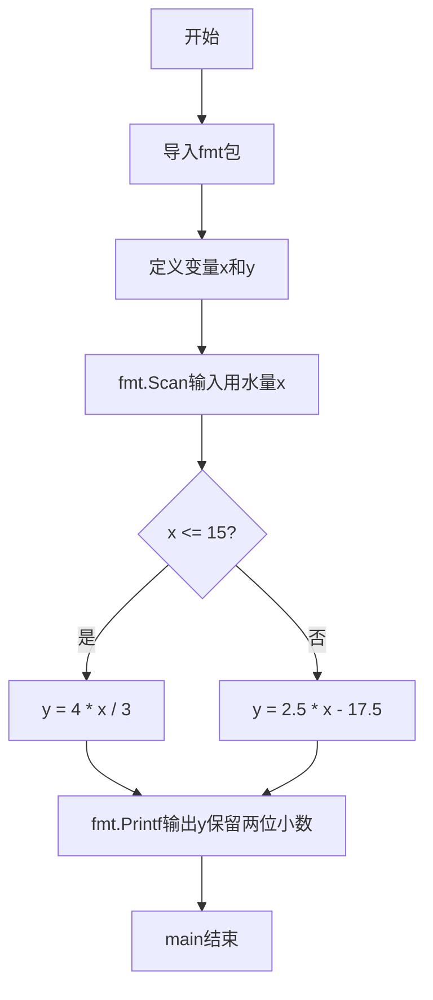
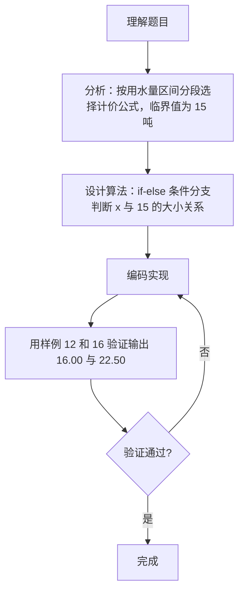

# 7-11 分段计算居民水费（Go语言实现）

## 前言

这道题要求根据月用水量按阶梯式计价方式计算居民应交的水费。用水量不超过 15 吨时按平价公式 `y = 4x/3` 计算，超过 15 吨后单价提高，按公式 `y = 2.5x - 17.5` 计算，属于典型的分段函数求值问题。

本题的易错点集中在三处：一是临界值 15 归属于平价段（即 `x <= 15`）；二是输入是非负实数，必须用浮点类型接收，避免精度丢失；三是输出必须精确到小数点后 2 位。

采用 if-else 条件分支结构对用水量区间进行判断，命中哪个区间就套用对应的公式计算，最后用 `%.2f` 格式化输出，思路直接且不易出错。

## 题目描述

为鼓励居民节约用水，自来水公司采取按用水量阶梯式计价的办法，居民应交水费y（元）与月用水量x（吨）相关：当x不超过15吨时，y=4x/3；超过后，y=2.5x−17.5。请编写程序实现水费的计算。

## 输入格式

输入在一行中给出非负实数x。

## 输出格式

在一行输出应交的水费，精确到小数点后2位。

## 输入样例1

```in
12
```

## 输出样例1

```out
16.00
```

## 输入样例2

```in
16
```

## 输出样例2

```out
22.50
```

## 解题思路

### 1. 识别分段函数关系

本题是一个典型的**分段函数求值问题**，核心在于根据用水量 x 的不同区间选择对应的水费计算公式。水费与用水量的关系分为两个阶段：

- 阶段一（平价水）：用水量不超过 15 吨时，采用较低单价 y = 4x/3；
- 阶段二（阶梯加价水）：用水量超过 15 吨时，采用较高单价 y = 2.5x - 17.5。

临界值 15 吨是分段点，判断时使用小于等于（`x <= 15`），保证恰好 15 吨时进入平价段。

### 2. 使用条件分支选择公式

使用**条件分支结构**（if-else）实现分段逻辑判断：

1. 读取输入的用水量 x；
2. 判断 x 与临界值 15 的大小关系；
3. 若 x ≤ 15，按平价公式 y = 4 × x / 3 计算；
4. 否则按阶梯加价公式 y = 2.5 × x - 17.5 计算；
5. 输出保留两位小数的计算结果。

### 3. 验证样例

- 样例1：x = 12 ≤ 15，y = 4 × 12 / 3 = 16.00 ✓
- 样例2：x = 16 > 15，y = 2.5 × 16 - 17.5 = 40 - 17.5 = 22.50 ✓

## 完整代码

```go
// 题目：7-11 分段计算居民水费
// 要求：根据月用水量 x 阶梯计价，x 不超过 15 吨时按 y = 4x/3 计算，否则按 y = 2.5x - 17.5 计算，输出保留两位小数。
//
// 实现原理：
//   1. 用浮点变量 x、y 保存用水量与结果，避免整数运算丢失精度；
//   2. if x <= 15 判断平价段，else 处理阶梯加价段；
//   3. fmt.Printf("%.2f") 将水费保留两位小数输出。
package main

import "fmt"

func main() {
    var x, y float64
    fmt.Scan(&x)

    if x <= 15 {
        y = 4 * x / 3
    } else {
        y = 2.5*x - 17.5
    }

    fmt.Printf("%.2f\n", y)
}
```

## 代码流程说明

1. 导入 fmt 包，提供 fmt.Scan 与 fmt.Printf 等输入输出能力。
2. 定义双精度浮点变量 x（月用水量）和 y（应交水费）。
3. 用 fmt.Scan 读取输入的非负实数，存入变量 x。
4. 判断 x <= 15：条件为真则按平价公式 y = 4 * x / 3 计算。
5. 条件为假（x > 15）则进入 else，按阶梯加价公式 y = 2.5 * x - 17.5 计算。
6. 用 fmt.Printf("%.2f\n", y) 输出水费，保留两位小数并换行，main 函数结束。

## 代码流程图



## 解题流程图



## 代码解析

### 浮点变量的定义与输入

```go
var x, y float64
fmt.Scan(&x)
```

题目保证输入是非负实数，因此用 float64 双精度浮点类型保存用水量 x 和结果 y，可以完整保留小数部分，避免使用整数类型接收造成精度丢失。

### 分段判断的核心逻辑

```go
if x <= 15 {
    y = 4 * x / 3
} else {
    y = 2.5*x - 17.5
}
```

这里把临界值 15 归入平价段（`x <= 15`），超过 15 才进入阶梯加价段。两个公式分别对应题目的两个阶段，各分支只做一次赋值，结构清晰。

### 保留两位小数的输出

```go
fmt.Printf("%.2f\n", y)
```

`%.2f` 表示按浮点数格式保留 2 位小数输出，`\n` 输出换行，正好满足"精确到小数点后2位"的要求。

## 复杂度分析

设输入规模为 n，本题只需处理单个实数输入：

- 时间复杂度：`O(1)`，无论 x 取何值，程序只执行一次比较和一次公式计算；
- 空间复杂度：`O(1)`，只使用了 x、y 两个固定大小的浮点变量，不随输入变化。

## 常见易错点

### 1. 用整数类型接收实数输入

若把 x 声明为 int 类型，输入 `12.5` 时只会读取到整数部分 `12`，导致计算错误：

```text
输入：12.5
错误结果（int 接收）：y = 4 × 12 / 3 = 16.00
正确结果（float64 接收）：y = 4 × 12.5 / 3 ≈ 16.67
```

必须使用浮点类型接收非负实数。

### 2. 整数除法与浮点除法混淆

若把公式写成 `y = 4/3 * x`，其中 `4/3` 在整数语境下会先得到 `1`，乘以 x 后结果明显偏小；即使 x 是浮点数，`4/3` 仍按整数除法计算得到 1。正确的写法是让 x 参与完整的浮点运算，如 `y = 4 * x / 3`。

### 3. 输出未保留两位小数

若用 `fmt.Println(y)` 直接输出，`16` 会被打印为 `16` 而不是 `16.00`，不符合"精确到小数点后2位"的输出要求，必须使用 `fmt.Printf("%.2f", y)` 格式化输出。

## 更多测试

### 测试一：零（最小边界）

输入：

```text
0
```

推演：0 ≤ 15 成立，y = 4 × 0 / 3 = 0，保留两位小数输出 0.00。

输出：

```text
0.00
```

### 测试二：临界值 15

输入：

```text
15
```

推演：15 ≤ 15 成立，进入平价段，y = 4 × 15 / 3 = 60 / 3 = 20，输出 20.00。

输出：

```text
20.00
```

### 测试三：带小数的平价用水量

输入：

```text
12.5
```

推演：12.5 ≤ 15 成立，y = 4 × 12.5 / 3 = 50 / 3 ≈ 16.6666，`%.2f` 四舍五入输出 16.67。

输出：

```text
16.67
```

## 总结

本题的核心是识别分段函数的两个区间，并用条件分支结构把不同的公式对应到不同的区间。实现时注意三点：用浮点类型接收实数、把临界值 15 正确归入平价段、用 `%.2f` 保证输出精度。这种"按区间分支计算"的思路是分段函数类问题的一般解法。
