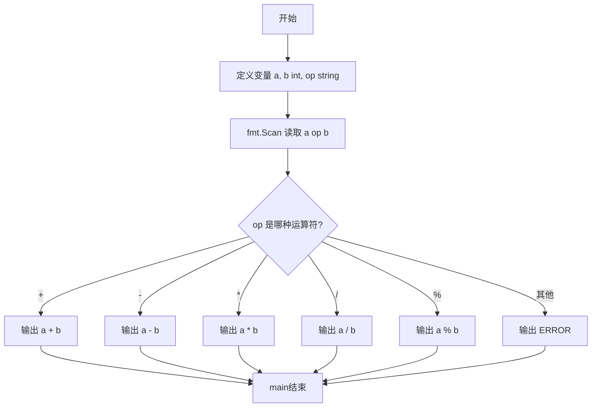
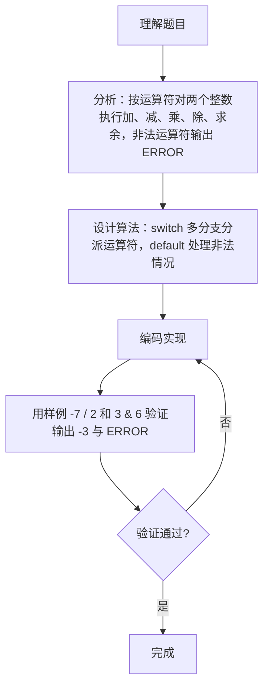

# 7-12 两个数的简单计算器（Go语言实现）

## 前言

这道题要求实现一个支持加、减、乘、除、求余五种运算的简单计算器。输入一行包含两个整数和一个运算符，输出对应的运算结果；若运算符不是这五种合法符号之一，则输出 `ERROR`。

本题的易错点在于：运算符必须以字符串形式读取而不是字符；非法运算符必须统一落入 `ERROR` 分支，不能没有输出；还要注意 Go 的整数除法和求余在负数参与时的符号规则。

采用 switch 多分支结构对运算符字符串进行分派，每个 case 对应一种运算，default 分支兜底处理非法符号，代码简洁、可读性好。

## 题目描述

本题要求编写一个简单计算器程序，可根据输入的运算符，对2个整数进行加、减、乘、除或求余运算。题目保证输入和输出均不超过整型范围。

## 输入格式

输入在一行中依次输入操作数1、运算符、操作数2，其间以1个空格分隔。操作数的数据类型为整型，且保证除法和求余的分母非零。

## 输出格式

当运算符为+、-、*、/、%时，在一行输出相应的运算结果。若输入是非法符号（即除了加、减、乘、除和求余五种运算符以外的其他符号）则输出ERROR。

## 输入样例1

```in
-7 / 2
```

## 输出样例1

```out
-3
```

## 输入样例2

```in
3 & 6
```

## 输出样例2

```out
ERROR
```

## 解题思路

### 1. 识别多分支选择问题

本题是一个典型的**多分支选择结构**问题。核心在于根据输入的运算符类型，对两个整数执行对应的算术运算，需要处理的情况包括：

- 5种合法运算符：+、-、*、/、%；
- 1种非法情况：运算符不是上述5种之一时，输出 ERROR。

### 2. 用 switch 分派运算符

使用 **switch 多分支结构**对运算符字符串 op 进行分派，每个 case 对应一种算术运算并直接输出结果，default 分支处理非法运算符：

1. 依次读取操作数 a、运算符 op、操作数 b；
2. 根据运算符 op 的不同，选择执行对应的算术运算；
3. 对于合法运算符，计算并输出结果；
4. 对于非法运算符，输出 ERROR。

### 3. 验证样例

- 样例1：-7 / 2，op 命中 "/" 分支，整数除法结果为 -3 ✓；
- 样例2：3 & 6，op 为 "&"，未命中任何 case，进入 default 输出 ERROR ✓。

## 完整代码

```go
// 题目：7-12 两个数的简单计算器
// 要求：对两个整数按运算符执行加、减、乘、除、求余运算，非法运算符或除零输出 ERROR。
//
// 实现原理：
//   1. 用字符串 op 读取运算符，fmt.Scan 自动按空白分隔读取三个输入项；
//   2. switch op 对五种合法运算符分别分派运算，直接输出结果；
//   3. 除法和求余分支增加 b==0 判断，零分母输出 ERROR；
//   4. default 分支捕获所有未匹配的非法符号，输出 ERROR。
package main

import "fmt"

func main() {
	var a, b int
	var op string
	fmt.Scan(&a, &op, &b)

	switch op {
	case "+":
		fmt.Println(a + b)
	case "-":
		fmt.Println(a - b)
	case "*":
		fmt.Println(a * b)
	case "/":
		if b == 0 {
			fmt.Println("ERROR")
		} else {
			fmt.Println(a / b)
		}
	case "%":
		if b == 0 {
			fmt.Println("ERROR")
		} else {
			fmt.Println(a % b)
		}
	default:
		fmt.Println("ERROR")
	}
}
```

## 代码流程说明

1. 导入 fmt 包，提供 fmt.Scan 与 fmt.Println 等输入输出能力。
2. 定义整型变量 a、b 和字符串变量 op，分别保存两个操作数和运算符。
3. 用 fmt.Scan(&a, &op, &b) 依次读取操作数 a、运算符 op、操作数 b。
4. switch op 判断运算符类型：命中哪个 case，就执行对应的算术运算并输出结果。
5. "/" 和 "%" 分支直接做除法与求余，依赖题目保证的分母非零条件。
6. 五种合法运算符都未命中时进入 default 分支，输出 ERROR。
7. 输出结果后 main 函数自然结束。

## 代码流程图



## 解题流程图



## 代码解析

### 以字符串形式读取运算符

```go
var op string
fmt.Scan(&a, &op, &b)
```

运算符用 string 类型读取，fmt.Scan 自动以空白字符分隔三个输入项。相比逐个字符读取，字符串方式既能表示单个符号，也能自然接收 `&` 等任意非法符号。

### switch 多分支分派

```go
switch op {
case "+":
	fmt.Println(a + b)
case "-":
	fmt.Println(a - b)
case "*":
	fmt.Println(a * b)
case "/":
	fmt.Println(a / b)
case "%":
	fmt.Println(a % b)
default:
	fmt.Println("ERROR")
}
```

每个 case 对应一种合法运算符并直接输出结果；default 分支捕获所有未匹配的情况，保证非法输入一定有输出。

### 整数除法与求余

```go
case "/":
	fmt.Println(a / b)
case "%":
	fmt.Println(a % b)
```

Go 的整数除法结果向零取整（截断小数部分），例如 `-7 / 2` 的结果是 `-3`，与题目样例一致。题目保证分母非零，因此这里不需要判零。

## 复杂度分析

设输入规模为 n，本题只有两个整数和一个运算符：

- 时间复杂度：`O(1)`，switch 分支只执行一次比较与一次运算；
- 空间复杂度：`O(1)`，只使用了两个整型变量和一个字符串变量，不随输入变化。

## 常见易错点

### 1. 运算符读取方式不当

若改用 `fmt.Scanf("%d %c %d", ...)` 之类的字符读取方式，输入中的空格容易被误读进字符变量，导致所有运算符都无法匹配。用 `fmt.Scan(&a, &op, &b)` 让 Scan 自动按空白分隔读取，最稳妥。

### 2. 忘记 default 分支导致非法输入无输出

若 switch 省略 default 分支，输入 `3 & 6` 时不匹配任何 case，程序不会输出任何内容，而不是要求的 ERROR：

```text
输入：3 & 6
错误：无输出
正确：ERROR
```

### 3. 忽视负数除法的取整方向

Go 的整数除法向零取整，`-7 / 2` 的结果是 `-3`（截断），而不是向下取整的 `-4`。求余的符号规则同理：`-7 % 2` 在 Go 中的结果是 `-1`。若按其他语言的取整规则实现，会与样例不一致。

## 更多测试

### 测试一：加法

输入：

```text
1 + 2
```

推演：op 为 "+"，命中加法分支，输出 1 + 2 = 3。

输出：

```text
3
```

### 测试二：负数求余

输入：

```text
-7 % 2
```

推演：op 为 "%"，命中求余分支，Go 中 -7 % 2 = -1，输出 -1。

输出：

```text
-1
```

### 测试三：乘法

输入：

```text
6 * 7
```

推演：op 为 "*"，命中乘法分支，输出 6 × 7 = 42。

输出：

```text
42
```

## 总结

本题通过 switch 多分支结构把运算符字符串映射到对应的算术运算，default 分支兜底处理非法符号。核心收获有两点：多分支判断优先考虑 switch，比一串 if-else 更清晰；运算符用字符串读取可以自然支持任意非法输入。同时要留意 Go 整数除法与求余在负数参与时的取整与符号规则，避免结果与样例不符。
