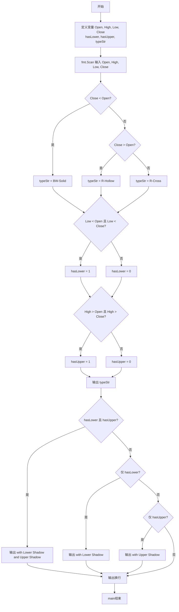
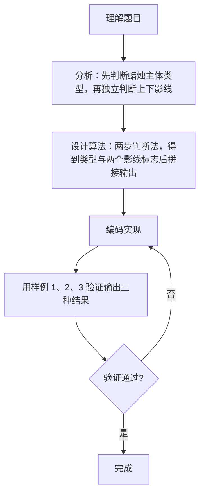

# 7-13 日K蜡烛图（Go语言实现）

## 前言

这道题要求根据开盘价 Open、最高价 High、最低价 Low、收盘价 Close 四个价格判断当日的日K蜡烛类型。蜡烛主体类型由收盘价与开盘价的大小关系决定，上下影线由最高价、最低价与开盘价、收盘价的比较决定，两个维度相互独立。

本题的易错点在于：把两个影线判断写成一串 else if 导致漏判、比较方向写反，以及输出拼接时遗漏空格。

实现上先比较 Close 与 Open 得到主体类型，再用两个独立的 if 得到下影线与上影线标志，最后按格式拼接输出，逻辑层次分明。

## 题目描述

股票价格涨跌趋势，常用蜡烛图技术中的K线图来表示，分为按日的日K线、按周的周K线、按月的月K线等。以日K线为例，每天股票价格从开盘到收盘走完一天，对应一根蜡烛小图，要表示四个价格：开盘价格Open（早上刚刚开始开盘买卖成交的第1笔价格）、收盘价格Close（下午收盘时最后一笔成交的价格）、中间的最高价High和最低价Low。

如果Close<Open，表示为"BW-Solid"（即"实心蓝白蜡烛"）；如果Close>Open，表示为"R-Hollow"（即"空心红蜡烛"）；如果Open等于Close，则为"R-Cross"（即"十字红蜡烛"）。如果Low比Open和Close低，称为"Lower Shadow"（即"有下影线"），如果High比Open和Close高，称为"Upper Shadow"（即"有上影线"）。请编程序，根据给定的四个价格组合，判断当日的蜡烛是一根什么样的蜡烛。

## 输入格式

输入在一行中给出4个正实数，分别对应Open、High、Low、Close，其间以空格分隔。

## 输出格式

在一行中输出日K蜡烛的类型。如果有上、下影线，则在类型后加上with 影线类型。如果两种影线都有，则输出with Lower Shadow and Upper Shadow。

## 输入样例1

```in
5.110 5.250 5.100 5.105
```

## 输出样例1

```out
BW-Solid with Lower Shadow and Upper Shadow
```

## 输入样例2

```in
5.110 5.110 5.110 5.110
```

## 输出样例2

```out
R-Cross
```

## 输入样例3

```in
5.110 5.125 5.112 5.126
```

## 输出样例3

```out
R-Hollow
```

## 解题思路

### 1. 分析两个独立的判断维度

本题是一个典型的**多条件组合判断**问题，判断分为两个相互独立的维度：

1. **蜡烛主体类型**（3种）：根据 Close 与 Open 的大小关系确定
   - Close < Open → BW-Solid（阴线，实心蓝白）；
   - Close > Open → R-Hollow（阳线，空心红）；
   - Close = Open → R-Cross（十字星）。
2. **影线情况**（4种组合）：根据 High、Low 与 Open、Close 的比较确定
   - 无上影、无下影；
   - 有下影（Lower Shadow）：Low 同时小于 Open 和 Close；
   - 有上影（Upper Shadow）：High 同时大于 Open 和 Close；
   - 双影线：既有上影又有下影。

### 2. 采用两步判断法

采用**两步判断法**分别确定蜡烛类型和影线情况，再组合输出：

1. 第一步：比较 Close 与 Open，确定蜡烛主体类型；
2. 第二步：分别判断 High、Low 与实体边界（Open 和 Close）的关系，得到两个独立的影线标志；
3. 第三步：按格式要求拼接蜡烛类型和影线信息输出。

### 3. 按格式组合输出

1. 先输出蜡烛类型；
2. 若 hasLower 与 hasUpper 同时成立，追加 " with Lower Shadow and Upper Shadow"；
3. 若仅有 hasLower，追加 " with Lower Shadow"；
4. 若仅有 hasUpper，追加 " with Upper Shadow"；
5. 两者都无则不追加，直接换行。

### 4. 验证样例

- 样例1：Open=5.110, High=5.250, Low=5.100, Close=5.105
  - Close(5.105) < Open(5.110) → BW-Solid ✓
  - Low(5.100) 同时小于 5.110 和 5.105 → 有下影 ✓
  - High(5.250) 同时大于 5.110 和 5.105 → 有上影 ✓
  - 输出：BW-Solid with Lower Shadow and Upper Shadow ✓
- 样例2：四个价格全部为 5.110
  - Close = Open → R-Cross ✓
  - Low 不小于实体，High 不大于实体 → 无影线 ✓
  - 输出：R-Cross ✓
- 样例3：Open=5.110, High=5.125, Low=5.112, Close=5.126
  - Close(5.126) > Open(5.110) → R-Hollow ✓
  - Low(5.112) 不小于 5.110 → 无下影 ✓
  - High(5.125) 不大于 5.126 → 无上影 ✓
  - 输出：R-Hollow ✓

## 完整代码

```go
// 题目：7-13 日 K 蜡烛图
// 要求：输入某股票当日 开盘价 open、最高价 high、最低价 low、收盘价 close，
//       判断蜡烛图类型（实心/空心/十字）及是否有上影线、下影线。
//
// 实现原理（K 线图规则）：
//   1. 实体颜色：close<open 为阴线(BW-Solid 实心)；close>open 为阳线(R-Hollow 空心)；
//      close==open 为十字线(R-Cross)；
//   2. 下影线：当日最低价 low 低于 open 和 close（即曾跌穿实体）；
//   3. 上影线：当日最高价 high 高于 open 和 close（即曾冲破实体）；
//   4. 按规则拼接输出对应英文描述。
package main

import "fmt"

func main() {
	var open, high, low, close float64
	fmt.Scan(&open, &high, &low, &close)

	ktype := "R-Cross"
	if close < open {
		ktype = "BW-Solid"
	} else if close > open {
		ktype = "R-Hollow"
	}

	hasLower := low < open && low < close
	hasUpper := high > open && high > close

	fmt.Print(ktype)
	if hasLower && hasUpper {
		fmt.Println(" with Lower Shadow and Upper Shadow")
	} else if hasLower {
		fmt.Println(" with Lower Shadow")
	} else if hasUpper {
		fmt.Println(" with Upper Shadow")
	} else {
		fmt.Println()
	}
}
```

## 代码流程说明

1. 导入 fmt 包，提供 fmt.Scan 与 fmt.Print 等输入输出能力。
2. 定义 4 个浮点变量 Open、High、Low、Close 存储价格，2 个整型标志 hasLower、hasUpper，以及字符串 typeStr。
3. 用 fmt.Scan 依次读取 4 个价格数据。
4. 判断蜡烛主体类型：Close < Open 为 BW-Solid，Close > Open 为 R-Hollow，否则为 R-Cross。
5. 判断下影线标志：Low 同时小于 Open 和 Close 时 hasLower = 1，否则为 0。
6. 判断上影线标志：High 同时大于 Open 和 Close 时 hasUpper = 1，否则为 0。
7. 先用 fmt.Print 输出主体类型，再根据两个标志的组合追加对应的影线描述。
8. 最后 fmt.Println 输出换行，main 函数结束。

## 代码流程图



## 解题流程图



## 代码解析

### 判断蜡烛主体类型

```go
if Close < Open {
    typeStr = "BW-Solid"
} else if Close > Open {
    typeStr = "R-Hollow"
} else {
    typeStr = "R-Cross"
}
```

先比较 Close 与 Open 的大小关系，三种情况一一对应三种主体类型，else 兜底处理 Close 等于 Open 的十字星情况。

### 独立判断上下影线

```go
if Low < Open && Low < Close {
    hasLower = 1
} else {
    hasLower = 0
}
if High > Open && High > Close {
    hasUpper = 1
} else {
    hasUpper = 0
}
```

下影线与上影线的判断是相互独立的，必须使用两个独立的 if 语句。若写成 else if 链，当第一个条件成立时第二个条件永远不会执行，双影线的情况就会漏判。

### 组合输出影线描述

```go
fmt.Print(typeStr)
if hasLower == 1 && hasUpper == 1 {
    fmt.Print(" with Lower Shadow and Upper Shadow")
} else if hasLower == 1 {
    fmt.Print(" with Lower Shadow")
} else if hasUpper == 1 {
    fmt.Print(" with Upper Shadow")
}
fmt.Println()
```

先输出主体类型，再用条件组合依次检查"双影线""仅下影""仅上影"三种情况，每种情况的描述字符串都自带前导空格，保证与类型之间有正确间隔。

## 复杂度分析

设输入规模为 n，本题只处理 4 个固定数量的价格数据：

- 时间复杂度：`O(1)`，无论价格取何值，只执行固定次数的比较与输出；
- 空间复杂度：`O(1)`，只使用了 4 个浮点变量、2 个标志变量和 1 个字符串变量，不随输入变化。

## 常见易错点

### 1. 两个影线判断误用 else if 导致漏判

若把影线判断写成：

```go
if Low < Open && Low < Close {
    hasLower = 1
} else if High > Open && High > Close {
    hasUpper = 1
}
```

当有下影线时，第一个分支成立，上影线判断永远不会执行，导致双影线的情况被误判为只有下影线。两个影线判断必须相互独立，各自用完整的 if-else。

### 2. 比较方向写反

下影线的条件是 Low 比 Open 和 Close 低，即 `Low < Open && Low < Close`；上影线的条件是 High 比 Open 和 Close 高，即 `High > Open && High > Close`。方向一旦写反，样例1 这种双影线的情况就会漏掉一侧。

### 3. 输出拼接时遗漏空格

追加影线信息时，" with Lower Shadow" 等字符串开头的空格不能省略。若写成 `fmt.Print("with Lower Shadow")`，结果会变成：

```text
BW-Solidwith Lower Shadow
```

类型与影线描述连在一起，不符合输出格式要求。

## 更多测试

### 测试一：仅下影线

输入：

```text
5.110 5.110 5.095 5.105
```

推演：Close(5.105) < Open(5.110) → BW-Solid；Low(5.095) 同时小于 5.110 和 5.105 → hasLower=1；High(5.110) 不大于 5.110 → hasUpper=0。输出 BW-Solid，仅下影线。

输出：

```text
BW-Solid with Lower Shadow
```

### 测试二：仅上影线

输入：

```text
5.105 5.120 5.110 5.110
```

推演：Close(5.110) > Open(5.105) → R-Hollow；Low(5.110) 不小于 5.105 → hasLower=0；High(5.120) 同时大于 5.105 和 5.110 → hasUpper=1。输出 R-Hollow，仅上影线。

输出：

```text
R-Hollow with Upper Shadow
```

### 测试三：无影线的阳线

输入：

```text
5.100 5.120 5.100 5.120
```

推演：Close(5.120) > Open(5.100) → R-Hollow；Low(5.100) 不小于 5.100 → hasLower=0；High(5.120) 不大于 5.120 → hasUpper=0。无影线，只输出类型。

输出：

```text
R-Hollow
```

## 总结

本题的核心是把蜡烛图判断拆分为两个相互独立的维度：主体类型看 Close 与 Open 的大小关系，影线情况看 High、Low 与实体的比较。实现要点是上下影线必须用两个独立 if 判断，避免 else if 漏判；输出时利用自带前导空格的描述字符串完成拼接。这种"先分解维度、再组合输出"的思路同样适用于其他多条件组合判断类题目。
