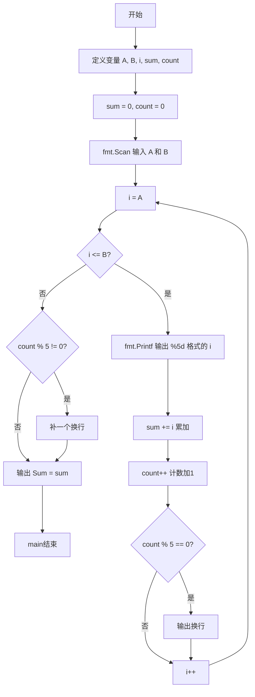
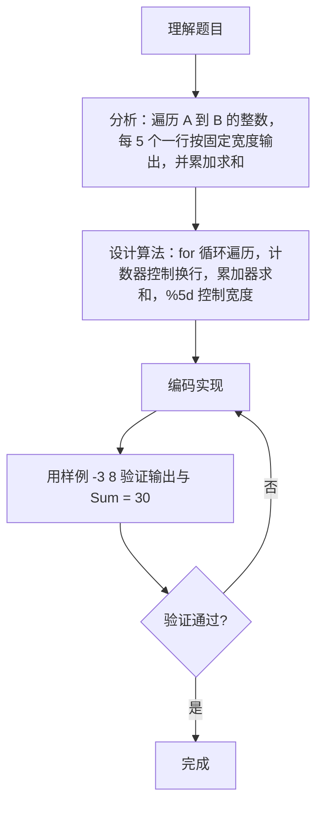

# 7-14 求整数段和（Go语言实现）

## 前言

这道题要求输出区间 [A, B] 内的所有整数并计算它们的总和。输出时每 5 个数字占一行，每个数字占 5 个字符宽度、向右对齐，最后一行按 `Sum = X` 格式输出总和。

本题的易错点在于：换行位置的判定必须用独立的计数器而不能依赖循环变量，以及 `%5d` 宽度控制与末尾换行的补齐。

采用 for 循环遍历区间，用计数器 count 统计已输出的个数，每满 5 个换行，循环结束后再根据余数补一个换行，保证输出格式正确。

## 题目描述

给定两个整数A和B，输出从A到B的所有整数以及这些数的和。

## 输入格式

输入在一行中给出2个整数A和B，其中−100≤A≤B≤100，其间以空格分隔。

## 输出格式

首先顺序输出从A到B的所有整数，每5个数字占一行，每个数字占5个字符宽度，向右对齐。最后在一行中按Sum = X的格式输出全部数字的和X。

## 输入样例

```in
-3 8
```

## 输出样例

```out
   -3   -2   -1    0    1
    2    3    4    5    6
    7    8
Sum = 30
```

## 解题思路

### 1. 拆解题目要求

本题是一个典型的**循环遍历与累加求和**问题，需要完成三个核心任务：

1. 顺序遍历输出：从整数 A 到整数 B（包含 A 和 B）依次输出每个整数；
2. 格式化排版：每个数字占 5 字符宽度、右对齐，每 5 个数字换一行；
3. 累加求和：计算区间内所有整数的总和，按指定格式输出。

### 2. 用 for 循环配合计数器

使用 **for 循环结构**实现区间遍历，结合计数器与累加器实现格式化和求和：

1. 读取区间端点 A 和 B；
2. 使用 for 循环从 i = A 遍历到 i = B：
   - 用 fmt.Printf("%5d", i) 设置输出宽度为 5 个字符，右对齐输出当前 i；
   - 将当前 i 累加到 sum 总和中；
   - 计数器 count 加 1，每满 5 个输出一个换行；
3. 循环结束后，若最后一行不足 5 个数字，补一个换行符；
4. 按 "Sum = X" 格式输出总和。

### 3. 验证样例

- 输入 A = -3，B = 8；
- 遍历序列：-3, -2, -1, 0, 1, 2, 3, 4, 5, 6, 7, 8（共 12 个数）；
- 格式化输出：
  - 第 1 行（第 1-5 个）：-3 -2 -1 0 1；
  - 第 2 行（第 6-10 个）：2 3 4 5 6；
  - 第 3 行（第 11-12 个）：7 8；
- 求和：-3-2-1+0+1+2+3+4+5+6+7+8 = 30 ✓。

## 完整代码

```go
// 题目：7-14 求整数段和
// 要求：顺序输出 A 到 B 的所有整数，每 5 个一行、每个占 5 字符宽右对齐，最后按 Sum = X 输出总和。
//
// 实现原理：
//   1. 用 for 循环从 i = A 遍历到 i = B，fmt.Printf("%5d") 保证 5 字符宽右对齐；
//   2. 累加器 sum 统计总和，计数器 count 统计已输出个数；
//   3. count 每满 5 个换一行，循环结束后按余数补齐最后一行，再输出 Sum。
package main

import "fmt"

func main() {
	var a, b int
	fmt.Scan(&a, &b)

	sum := 0
	count := 0

	for i := a; i <= b; i++ {
		fmt.Printf("%5d", i)
		sum += i
		count++
		if count%5 == 0 {
			fmt.Println()
		}
	}

	if count%5 != 0 {
		fmt.Println()
	}

	fmt.Printf("Sum = %d\n", sum)
}
```

## 代码流程说明

1. 导入 fmt 包，提供 fmt.Scan、fmt.Printf 与 fmt.Println 等输入输出能力。
2. 定义整型变量 A、B、i、sum、count，并把 sum、count 初始化为 0。
3. 用 fmt.Scan 读取区间端点 A 和 B。
4. for 循环从 i = A 遍历到 i = B，每次循环执行：
   - fmt.Printf("%5d", i) 以 5 字符宽度右对齐输出当前整数；
   - sum += i 把当前数累加到总和；
   - count++ 计数加 1；
   - 若 count % 5 == 0，输出一个换行，实现每行 5 个。
5. 循环结束后，若 count % 5 != 0（最后一行不足 5 个），补一个换行。
6. 用 fmt.Printf("Sum = %d\n", sum) 输出总和，main 函数结束。

## 代码流程图



## 解题流程图



## 代码解析

### 循环内的输出与累加

```go
for i = A; i <= B; i++ {
    fmt.Printf("%5d", i)
    sum += i
    count++
}
```

循环体把三件事放在一起完成：格式化输出当前整数、累加到总和、递增计数器。`%5d` 表示右对齐、总宽度为 5 个字符，负数会在数字前多出负号，宽度同样凑足 5。

### 每满 5 个换行

```go
if count%5 == 0 {
    fmt.Println()
}
```

每输出一个数后检查 count 是否为 5 的倍数。注意这里判断的是计数器 count，而不是循环变量 i，因为 i 的取值与"第几个"没有直接关系（例如 A = -3 时第 5 个数是 1，而不是 i 取 5 或 -5）。

### 补齐最后一行并输出总和

```go
if count%5 != 0 {
    fmt.Println()
}

fmt.Printf("Sum = %d\n", sum)
```

当总数不是 5 的倍数时，最后一行不满 5 个数字，循环内没有换行，这里补一个换行，使 "Sum = X" 独占一行。

## 复杂度分析

设区间长度 n = B - A + 1：

- 时间复杂度：`O(n)`，for 循环遍历区间内的 n 个整数，每个整数只做常数次操作；
- 空间复杂度：`O(1)`，只使用了 A、B、i、sum、count 等固定数量的整型变量，不随区间长度变化。

## 常见易错点

### 1. 用循环变量 i 判断换行

若把换行条件写成 `if i%5 == 0`，当起点 A 不是 5 的倍数时会出错。例如 A = -3 时，序列是 -3, -2, -1, 0, 1, 2, ...，其中 i = 0（第 4 个数）时 `0%5 == 0` 就会提前换行，破坏了每行 5 个的格式。必须使用独立的计数器 count 统计"第几个数"。

### 2. 遗漏 %5d 的宽度控制

若用 `fmt.Print(i)` 直接输出，数字没有固定宽度，例如 1 和 100 占用的宽度不同，无法满足"每个数字占 5 个字符宽度、向右对齐"的要求，输出排版会错乱。

### 3. 循环结束后忘记补齐换行

若总数不是 5 的倍数（如样例的 12 个数），最后一行只有 2 个数字，循环内没有触发换行。若不补换行，`Sum = 30` 会紧跟最后一个数字输出在同一行，格式错误。

### 4. Sum 输出格式不精确

"Sum = X" 中的等号两侧各有一个空格，若写成 `fmt.Printf("Sum=%d\n", sum)` 或 `fmt.Println("Sum =", sum)`（数字前多一个空格），都与要求不符。

## 更多测试

### 测试一：单元素区间

输入：

```text
5 5
```

推演：循环只执行一次，输出 "    5"（5 字符宽右对齐），sum = 5，count = 1；循环结束后 count%5 = 1 非零，补一个换行；输出 "Sum = 5"。

输出：

```text
    5
Sum = 5
```

### 测试二：恰好 5 个数

输入：

```text
1 5
```

推演：依次输出 1、2、3、4、5，每个占 5 字符宽；第 5 个数输出后 count = 5，触发换行；循环结束 count%5 = 0 不补换行；sum = 1+2+3+4+5 = 15，输出 "Sum = 15"。

输出：

```text
    1    2    3    4    5
Sum = 15
```

### 测试三：负数区间

输入：

```text
-5 -1
```

推演：依次输出 -5、-4、-3、-2、-1，共 5 个数，第 5 个数后换行；sum = -5-4-3-2-1 = -15，输出 "Sum = -15"。

输出：

```text
   -5   -4   -3   -2   -1
Sum = -15
```

## 总结

本题的核心是"循环遍历 + 计数换行 + 累加求和"的组合。关键细节有两点：用独立的计数器 count 而不是循环变量来判断换行位置，保证起点任意时每行都恰好 5 个数；用 `%5d` 控制输出宽度，用循环结束后的余数判断补齐换行。掌握"计数器控制排版"的技巧后，这类格式化输出题目都能举一反三。
