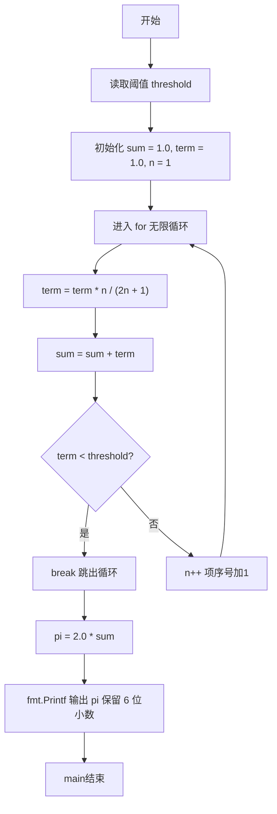
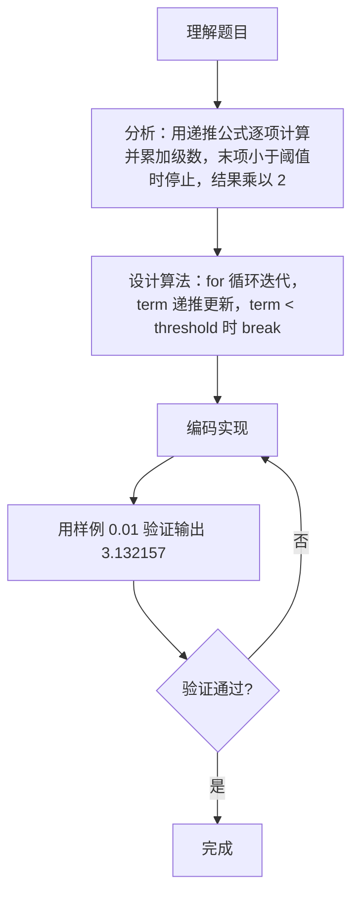

# 7-15 计算圆周率（Go语言实现）

## 前言

这道题要求根据给定的无穷级数关系式 `π/2 = 1 + 1/3 + 2!/(3×5) + ...` 计算圆周率，逐项累加直到最后一项的值小于输入的阈值，再把结果乘以 2 得到 π，输出到小数点后 6 位。

本题的易错点在于：每次重新计算阶乘会导致重复计算甚至溢出、忘记累加第 0 项 a0 = 1、整数除法把项直接归零，以及最后忘记乘以 2。

观察通项可得递推关系 aₙ = aₙ₋₁ × n/(2n+1)，用"一项递推一项"的方式累加，既避免了重复计算，也天然满足"最后一项小于阈值"的停止条件。

## 题目描述

根据下面关系式，求圆周率的值，直到最后一项的值小于给定阈值。

关系式：

```text
π/2 = 1 + 1/3 + 2!/(3×5) + 3!/(3×5×7) + ... + n!/(3×5×7×...×(2n+1)) + ...
```

## 输入格式

输入在一行中给出小于1的阈值。

## 输出格式

在一行中输出满足阈值条件的近似圆周率，输出到小数点后6位。

## 输入样例

```in
0.01
```

## 输出样例

```out
3.132157
```

## 解题思路

### 1. 分析级数的通项规律

本题是一个典型的**无穷级数求和**问题。核心任务是根据给定的级数公式计算 π/2 的近似值，当某一项的值小于给定阈值时停止累加，最后乘以 2 得到圆周率 π。关键在于理解级数通项的递推关系，避免重复计算阶乘和乘积。

### 2. 推导递推关系

观察级数通项的规律，使用**递推迭代法**高效计算每一项：

- a₀ = 1（第 0 项，对应 n = 0）；
- a₁ = 1/3（第 1 项，对应 n = 1）；
- a₂ = 2!/(3×5) = (1×2)/(3×5)（第 2 项，对应 n = 2）；
- a₃ = 3!/(3×5×7) = (1×2×3)/(3×5×7)（第 3 项，对应 n = 3）。

由相邻两项相除可得：

```text
aₙ / aₙ₋₁ = n / (2n + 1)
```

因此：**aₙ = aₙ₋₁ × n / (2n + 1)**。这样每一项都可以由前一项递推得到，无需每次重新计算阶乘和连乘。

### 3. 用递推迭代实现累加

1. 输入阈值 threshold（小于 1 的正数）；
2. 初始化：sum = 1.0（累加和，已加入第 0 项 a₀ = 1）、term = 1.0（当前项，初始为 a₀）、n = 1（下一项的序号）；
3. 循环迭代：
   - 计算新项：term = term × n / (2n + 1)；
   - 累加到总和：sum = sum + term；
   - 若 term < threshold，跳出循环停止累加；
   - 否则 n = n + 1，继续迭代；
4. 计算圆周率：pi = 2.0 × sum；
5. 输出 pi，保留 6 位小数。

### 4. 验证样例

以 threshold = 0.01 为例：

- a₀ = 1，sum = 1；
- n=1：a₁ = 1 × 1/3 = 0.33333，sum = 1.33333，0.33333 > 0.01，继续；
- n=2：a₂ = 0.33333 × 2/5 = 0.13333，sum = 1.46666，0.13333 > 0.01，继续；
- n=3：a₃ = 0.13333 × 3/7 ≈ 0.05714，sum ≈ 1.52381，0.05714 > 0.01，继续；
- n=4：a₄ = 0.05714 × 4/9 ≈ 0.02540，sum ≈ 1.54921，0.02540 > 0.01，继续；
- n=5：a₅ = 0.02540 × 5/11 ≈ 0.01155，sum ≈ 1.56076，0.01155 > 0.01，继续；
- n=6：a₆ = 0.01155 × 6/13 ≈ 0.00533，sum ≈ 1.56609，0.00533 < 0.01，停止；
- pi = 2 × 1.56609 ≈ 3.13218，接近样例输出 3.132157 ✓。

## 完整代码

```go
// 题目：7-15 计算圆周率
// 要求：按级数公式逐项累加 π/2 的近似值，直到最后一项小于阈值，结果乘 2 后保留 6 位小数输出。
//
// 实现原理：
//   1. 由通项关系推出递推式 a_n = a_(n-1) * n / (2n+1)，每轮只需常数次运算；
//   2. sum 初始化为 1.0，已包含第 0 项 a0 = 1，循环内先更新 term 再累加；
//   3. 当 term < threshold 时 break 停止，最后 pi = 2.0 * sum 输出。
package main

import "fmt"

func main() {
    var threshold float64
    fmt.Scan(&threshold)

    sum := 1.0
    term := 1.0
    n := 1

    for {
        term *= float64(n) / float64(2*n + 1)
        sum += term
        if term < threshold {
            break
        }
        n++
    }

    pi := 2.0 * sum
    fmt.Printf("%.6f\n", pi)
}
```

## 代码流程说明

1. 导入 fmt 包，提供 fmt.Scan 与 fmt.Printf 等输入输出能力。
2. 定义浮点变量 threshold，用 fmt.Scan 读取输入的阈值。
3. 初始化累加和 sum = 1.0（已含第 0 项 a₀ = 1）、当前项 term = 1.0、项序号 n = 1。
4. 进入 for 无限循环，循环体内：
   - term = term × float64(n) / float64(2n+1)，递推计算下一项；
   - sum += term，把新项累加到总和；
   - 若 term < threshold，break 跳出循环；
   - 否则 n++，准备计算下一项。
5. 循环结束后，用 pi := 2.0 * sum 由 π/2 得到圆周率。
6. 用 fmt.Printf("%.6f\n", pi) 输出 pi，保留 6 位小数，main 函数结束。

## 代码流程图



## 解题流程图



## 代码解析

### 递推计算下一项

```go
term *= float64(n) / float64(2*n + 1)
```

把递推式 aₙ = aₙ₋₁ × n/(2n+1) 直接翻译为代码。`float64(n)` 与 `float64(2*n+1)` 的显式转换保证做的是浮点除法；若直接写 `n / (2*n+1)`，整数除法在 n = 1 时得到 0，term 会立即归零。

### 累加与停止判断

```go
sum += term
if term < threshold {
    break
}
n++
```

每轮先累加刚算出的新项，再判断"最后一项的值是否小于阈值"，满足则立刻跳出循环。由于 sum 初始化为 1.0，第 0 项 a₀ = 1 没有被遗漏。

### 由 π/2 计算圆周率

```go
pi := 2.0 * sum
fmt.Printf("%.6f\n", pi)
```

级数累加得到的是 π/2 的近似值，必须乘以 2 才是圆周率。`%.6f` 控制输出到小数点后 6 位。

## 复杂度分析

设迭代次数为 k（即累加 k 项后末项小于阈值）：

- 时间复杂度：`O(k)`，每轮迭代只做常数次乘法、加法和比较，无需重新计算阶乘；
- 空间复杂度：`O(1)`，只使用了 threshold、sum、term、n、pi 等固定数量的变量，不随迭代次数变化。

## 常见易错点

### 1. 直接计算阶乘导致重复计算与溢出

若每次重新计算 `n!` 和 `3×5×...×(2n+1)`，总代价为 O(n²)，且 n 稍大时中间结果会迅速超出整型范围。改用递推式 `term = term * n / (2n+1)` 后，每项只做常数次运算，也不会溢出。

### 2. 整数除法把项直接归零

若写成 `term *= n / (2*n + 1)`，其中 `n` 和 `2*n+1` 都是整数，`n/(2*n+1)` 按整数除法计算：n = 1 时 `1/3` 得 0，term 立即变成 0，之后所有项都是 0。必须显式转换成浮点类型再相除。

### 3. 忘记累加第 0 项 a₀ = 1

若把 sum 初始化为 0，且循环从 term 递推开始，就会漏掉级数的常数项 1，最终 π 会少约 2。正确做法是把 sum 初始化为 1.0，让第 0 项参与累加。

### 4. 最后忘记乘以 2

关系式给出的是 π/2，直接输出 sum 会得到约 1.57 的结果：

```text
输入：0.01
错误输出：1.566078（约为 π/2）
正确输出：3.132157
```

必须执行 `pi = 2.0 * sum` 后再输出。

## 更多测试

### 测试一：较大阈值（只累加两项）

输入：

```text
0.5
```

推演：sum = 1.0，n = 1；第一轮 term = 1 × 1/3 ≈ 0.3333 < 0.5，break。sum = 1 + 1/3 = 4/3，pi = 2 × 4/3 = 8/3 ≈ 2.666667。

输出：

```text
2.666667
```

### 测试二：中等阈值（累加三项）

输入：

```text
0.3
```

推演：第一轮 term = 1/3 ≈ 0.3333，不小于 0.3，继续；第二轮 term = 0.3333 × 2/5 = 2/15 ≈ 0.1333 < 0.3，break。sum = 1 + 1/3 + 2/15 = 22/15，pi = 44/15 ≈ 2.933333。

输出：

```text
2.933333
```

### 测试三：较小阈值（累加四项）

输入：

```text
0.13
```

推演：第一轮 term = 1/3 ≈ 0.3333，不小于 0.13，继续；第二轮 term = 2/15 ≈ 0.1333，不小于 0.13，继续；第三轮 term = 2/35 ≈ 0.0571 < 0.13，break。累加四项 sum = 1 + 1/3 + 2/15 + 2/35 = 32/21，pi = 64/21 ≈ 3.047619。

输出：

```text
3.047619
```

## 总结

本题的核心是通过观察级数通项推导出递推关系 aₙ = aₙ₋₁ × n/(2n+1)，把"每项重算阶乘"降为"一项递推一项"，既降低时间复杂度又避免溢出。实现时注意四点：浮点除法避免整数归零、sum 初始化为 1.0 包含第 0 项、以 term < threshold 作为停止条件、最后乘以 2 还原 π。递推思想在求解级数与数列求和类题目中非常实用。
