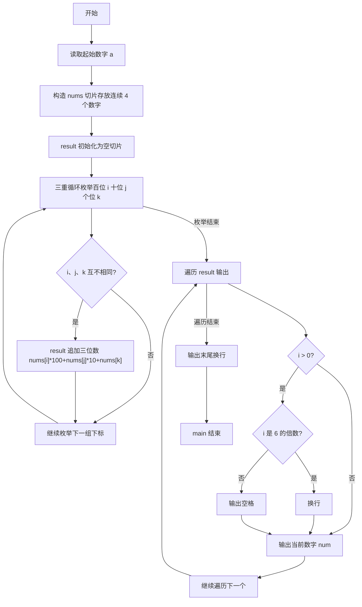
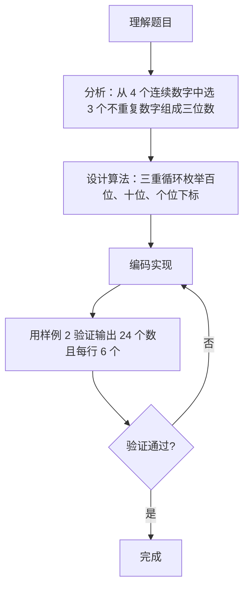

# 7-16 求符合给定条件的整数集（Go语言实现）

## 前言

这道题要求从给定的正整数 A 开始，取 A、A+1、A+2、A+3 共 4 个连续数字，从中任选 3 个不重复的数字组成三位数，并按从小到大排列输出，每行 6 个。

题目的难点主要集中在两点：一是组成三位数时三个数位必须互不相同，否则会产生 222 这类无效结果；二是输出格式要求行内以空格分隔、行末不能有多余空格、每行恰好 6 个数。

本题采用三重循环枚举百位、十位、个位的全部下标组合，用三个下标互不相同来保证数字不重复，再统一收集结果后格式化输出。

## 题目描述

给定不超过6的正整数A，考虑从A开始的连续4个数字。请输出所有由它们组成的无重复数字的3位数。

## 输入格式

输入在一行中给出A。

## 输出格式

输出满足条件的的3位数，要求从小到大，每行6个整数。整数间以空格分隔，但行末不能有多余空格。

## 输入样例

```in
2
```

## 输出样例

```out
234 235 243 245 253 254
324 325 342 345 352 354
423 425 432 435 452 453
523 524 532 534 542 543
```

## 解题思路

### 1. 枚举所有可能的排列

从 A 开始的 4 个连续数字存放在切片 nums 中，即 {A, A+1, A+2, A+3}。组成三位数时，百位、十位、个位各有 4 种取值，因此用三重循环逐一枚举这 4×4×4 = 64 种下标组合。

### 2. 用下标互不相同保证数字不重复

三位数的三个数位必须使用不同的数字，即百位下标 i、十位下标 j、个位下标 k 必须互不相同，判断条件为 i != j && j != k && i != k。只有三个条件同时成立时才组合成三位数。

### 3. 组合成三位数

下标确定后，按 nums[i]×100 + nums[j]×10 + nums[k] 组合成三位数，并追加到 result 切片。

### 4. 结果自然递增与格式化输出

由于 nums 中的数字按升序存放，且三重循环按百位→十位→个位的顺序遍历，生成的结果自然从小到大排列，无需额外排序。输出时每 6 个数换行，行内数字间用空格分隔，行首与行末不输出多余空格。

## 完整代码

```go
// 题目：7-16 求符合给定条件的整数集
// 要求：从 A 开始的连续 4 个数字中任取 3 个不重复数字组成三位数，按升序输出，每行 6 个。
//
// 实现原理：
//   1. 构造包含 A、A+1、A+2、A+3 的切片 nums；
//   2. 三重循环枚举百位、十位、个位下标，三个下标互不相同才组合成三位数；
//   3. 数字按升序存放且按 i→j→k 顺序遍历，结果自然递增；
//   4. 遍历结果，每 6 个数换行，行内以空格分隔。
package main

import "fmt"

func main() {
	var a int
	fmt.Scan(&a)

	nums := []int{a, a + 1, a + 2, a + 3}
	result := []int{}

	// 三重循环枚举三位，i!=j!=k 保证数字不重复
	for i := 0; i < 4; i++ {
		for j := 0; j < 4; j++ {
			for k := 0; k < 4; k++ {
				if i != j && j != k && i != k {
					result = append(result, nums[i]*100+nums[j]*10+nums[k])
				}
			}
		}
	}

	for i, num := range result {
		if i > 0 {
			if i%6 == 0 {
				fmt.Println() // 每 6 个换一行
			} else {
				fmt.Print(" ")
			}
		}
		fmt.Print(num)
	}
	fmt.Println()
}
```

## 代码流程说明

1. 声明变量 a，用 fmt.Scan 读取起始数字。
2. 构造 nums 切片存放 A、A+1、A+2、A+3，并初始化空切片 result。
3. 三重循环：外层 i 控制百位下标，中层 j 控制十位下标，内层 k 控制个位下标，均从 0 到 3。
4. 判断 i、j、k 是否互不相同：成立则组合成三位数并追加到 result。
5. 遍历 result：下标 i 大于 0 时，若 i 是 6 的倍数则换行，否则输出一个空格。
6. 输出当前数字 num。
7. 遍历结束后输出末尾换行，main 函数自然结束。

## 代码流程图



## 解题流程图



## 代码解析

### 构造数字集合

```go
nums := []int{a, a + 1, a + 2, a + 3}
```

根据输入的 A 构造连续 4 个数字的切片，后续所有三位数都从该切片中选取。

### 三重循环枚举不重复的三位数

```go
for i := 0; i < 4; i++ {
    for j := 0; j < 4; j++ {
        for k := 0; k < 4; k++ {
            if i != j && j != k && i != k {
                result = append(result, nums[i]*100+nums[j]*10+nums[k])
            }
        }
    }
}
```

外层、中层、内层循环分别确定百位、十位、个位在 nums 中的下标。只有当 i、j、k 两两互不相同时，才将三个数字按位权组合成三位数并存入 result。

### 每 6 个一行的格式化输出

```go
if i > 0 {
    if i%6 == 0 {
        fmt.Println()
    } else {
        fmt.Print(" ")
    }
}
fmt.Print(num)
```

输出逻辑：第一个数前不加任何字符；之后每输出 6 个数换行一次，其余情况输出一个空格分隔，从而保证每行 6 个整数且行末没有多余空格。

## 复杂度分析

设参与排列的数字个数为 n（本题 n 固定为 4）：

- 时间复杂度：三重循环共枚举 n³ 种下标组合，其中满足三位互不相同的组合数为 n×(n-1)×(n-2)，因此时间复杂度为 O(n³)；
- 空间复杂度：result 切片最多保存 n×(n-1)×(n-2) 个数（本题为 24 个），空间复杂度为 O(n³)。

本题 n 恒为 4，实际时间与空间开销均为常数级。

## 常见易错点

### 1. 数位重复未过滤

若省略下标互不相同的判断（如只写 i != j），会生成 223、232 这类含重复数字的三位数。例如 A=2 时，错误代码可能输出 223，而正确结果中不存在任何含重复数位的三位数。

### 2. 输出格式错误

每行必须恰好 6 个数，行内以空格分隔，行末不能有多余空格。若在每次输出后都追加空格，行尾会残留多余空格；若换行条件写错（如 i%6 == 1），换行位置会整体错位。

### 3. 遗漏末尾换行

遍历结束后需要补一个 fmt.Println()。若漏写，最后一行的输出会与终端提示符粘连，影响结果判断。

## 更多测试

### 测试一：A 取最小值 1

输入：

```text
1
```

输出：

```text
123 124 132 134 142 143
213 214 231 234 241 243
312 314 321 324 341 342
412 413 421 423 431 432
```

推演验证：数字集合为 {1,2,3,4}，三重循环按百位从小到大枚举。百位为 1 时，十位依次取 2、3、4，个位取剩余数字，得到 123、124、132、134、142、143，共 6 个，恰好占满第一行；其余各行同理，24 个数整体按升序排列。

### 测试二：A 取中间值 4

输入：

```text
4
```

输出：

```text
456 457 465 467 475 476
546 547 564 567 574 576
645 647 654 657 674 675
745 746 754 756 764 765
```

推演验证：数字集合为 {4,5,6,7}。百位为 4 时，十位、个位从 {5,6,7} 中取两个不同数字，得到 456、457、465、467、475、476；其余各行同理，输出保持每行 6 个、升序排列。

### 测试三：A 取最大值 6

输入：

```text
6
```

输出：

```text
678 679 687 689 697 698
768 769 786 789 796 798
867 869 876 879 896 897
967 968 976 978 986 987
```

推演验证：数字集合为 {6,7,8,9}，所有三位数均为三个数字的排列，共 24 个。第一行百位为 6，按十位 7、8、9 的顺序得到 678、679、687、689、697、698，与循环枚举顺序一致。

## 总结

本题的核心是"三重循环枚举 + 下标判重"的排列组合思路：枚举所有下标组合，用 i、j、k 互不相同来过滤重复数字，得到的数字天然有序。格式化输出时用取余控制每行 6 个、用行首判断控制空格分隔，即可满足"每行 6 个、行末无多余空格"的要求。这一思路同样适用于其他排列、组合类题目。
