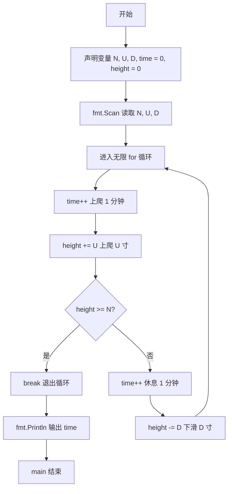
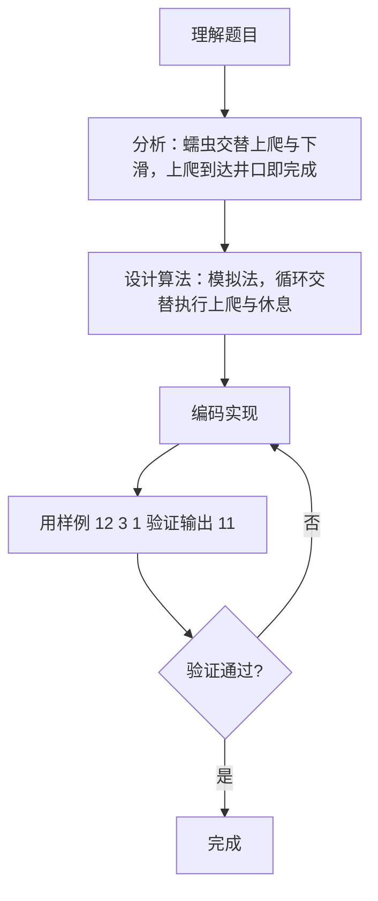

# 7-17 爬动的蠕虫（Go语言实现）

## 前言

这道题模拟一条蠕虫爬出井口的过程：蠕虫每 1 分钟向上爬 U 寸，之后必须休息 1 分钟，休息期间下滑 D 寸，如此交替进行，要求计算爬出井口所需的总分钟数。

题目有两个关键细节：一是只要某次上爬过程中蠕虫的头部到达或超过井口即完成任务，不需要再休息下滑；二是上爬与休息各占 1 分钟，时间必须分别累加。

本题采用模拟法，用无限循环交替执行上爬与休息两个阶段，每次上爬后立即判断是否爬出井口。

## 题目描述
一条蠕虫长1寸，在一口深为N寸的井的底部。已知蠕虫每1分钟可以向上爬U寸，但必须休息1分钟才能接着往上爬。在休息的过程中，蠕虫又下滑了D寸。就这样，上爬和下滑重复进行。请问，蠕虫需要多长时间才能爬出井？

这里要求不足1分钟按1分钟计，并且假定只要在某次上爬过程中蠕虫的头部到达了井的顶部，那么蠕虫就完成任务了。初始时，蠕虫是趴在井底的（即高度为0）。

## 输入格式
输入在一行中顺序给出3个正整数N、U、D，其中D<U，N不超过100。

## 输出格式
在一行中输出蠕虫爬出井的时间，以分钟为单位。

## 输入样例

```in
12 3 1
```

## 输出样例

```out
11
```

## 解题思路

### 1. 明确爬出条件

蠕虫初始高度为 0，井深为 N。每轮先上爬 1 分钟使高度增加 U 寸，此时若 height >= N，说明蠕虫头部已到达或超过井口，任务完成；否则必须休息 1 分钟，高度减少 D 寸，进入下一轮。

### 2. 时间的累加规则

上爬阶段累加 1 分钟，休息阶段也累加 1 分钟。由于蠕虫在最后一次上爬到达井口后立即结束，最后一次休息不会发生，因此只需把两个阶段的时间分别累加即可得到总时间。

### 3. 循环终止的判断

模拟使用无限循环，每次上爬后立即检查 height >= N，成立则跳出循环并输出 time。这样保证了"到达井口即完成"的题意。

## 完整代码

```go
// 题目：7-17 爬动的蠕虫
// 要求：蠕虫每 1 分钟上爬 U 寸，随后休息 1 分钟并下滑 D 寸，求爬出深 N 寸的井所需的总分钟数。
//
// 实现原理：
//   1. 用 height 记录当前高度、time 记录已用分钟数，初始均为 0；
//   2. 无限循环中先执行上爬阶段：time+1、height+U；
//   3. 上爬后立即判断 height >= N，成立则退出循环；
//   4. 否则执行休息阶段：time+1、height-D，回到步骤 2 继续。
package main

import "fmt"

func main() {
    var N, U, D, time, height int
    time = 0
    height = 0
    fmt.Scan(&N, &U, &D)

    for {
        time++
        height += U
        if height >= N {
            break
        }

        time++
        height -= D
    }

    fmt.Println(time)
}
```

## 代码流程说明

1. 定义井深 N、上爬距离 U、下滑距离 D，以及时间 time（初始 0）、当前高度 height（初始 0）。
2. 用 fmt.Scan 读取 N、U、D。
3. 进入无限循环：
   - time 加 1，height 增加 U，模拟上爬 1 分钟；
   - 判断 height >= N：成立则 break 退出循环；
   - time 加 1，height 减少 D，模拟休息 1 分钟。
4. 循环结束后输出总时间 time，main 函数自然结束。

## 代码流程图



## 解题流程图



## 代码解析

### 变量声明与输入

```go
var N, U, D, time, height int
time = 0
height = 0
fmt.Scan(&N, &U, &D)
```

time 与 height 初始化为 0，分别表示已用的分钟数和蠕虫当前高度（初始趴在井底）。一次性声明 5 个整型变量并读取 N、U、D。

### 上爬阶段与爬出判断

```go
time++
height += U
if height >= N {
    break
}
```

先累加 1 分钟并上爬 U 寸，随后立即判断是否到达或超过井口。条件成立说明任务完成，直接跳出循环，不再执行休息阶段。

### 休息阶段

```go
time++
height -= D
```

上爬未到达井口时，累加 1 分钟休息时间并下滑 D 寸，然后回到循环开头继续下一轮。

## 复杂度分析

设输入规模为 n（本题输入为固定的 3 个正整数）：

- 时间复杂度：循环每执行一轮，蠕虫净上升 U-D 寸，最多约需 N/(U-D) 轮，因此时间复杂度为 O(N/(U-D))。由于 N 不超过 100，实际运行次数为常数级；
- 空间复杂度：只使用 N、U、D、time、height 等若干基本整型变量，空间复杂度为 O(1)。

## 常见易错点

### 1. 上爬到达井口后仍计算休息

若把爬出判断放在休息阶段之后，会在蠕虫已经到达井口后再多加一次休息时间。例如 N=3、U=3、D=1 时，正确答案为 1 分钟；错误写法会先上爬再休息再判断，得到错误的结果。

### 2. 时间累加遗漏

上爬和休息各占 1 分钟，两个阶段都要累加时间。若只累加上爬时间而忽略休息时间，样例 12 3 1 会得到 5 分钟，而不是正确的 11 分钟。

### 3. 用 > 代替 >= 判断爬出

"到达井的顶部"包含恰好等于 N 的情况，判断应写 height >= N。若写成 height > N，当高度恰好等于 N 时不会退出循环，导致继续执行多余的休息下滑。

## 更多测试

### 测试一：第一次上爬即到达井口

输入：

```text
3 3 1
```

输出：

```text
1
```

推演验证：time=1 时上爬，height 由 0 变为 3，满足 height >= N（3 >= 3），立即退出循环，输出 1。

### 测试二：上爬两次后爬出

输入：

```text
5 4 1
```

输出：

```text
3
```

推演验证：第 1 分钟上爬至 height=4，4 < 5，休息 1 分钟下滑至 3；第 3 分钟上爬至 7，7 >= 5，退出循环，输出 3。

### 测试三：需要多轮循环的较长过程

输入：

```text
6 2 1
```

输出：

```text
9
```

推演验证：每轮净上升 1 寸。第 1、3、5、7 分钟上爬后高度分别为 2、3、4、5，均小于 6；第 9 分钟上爬后高度为 6，满足 height >= N，输出 9。

## 总结

本题通过模拟法直观地复现了蠕虫"上爬-休息-下滑"的循环过程。解题关键是把握两个时间点：上爬后立即判断是否到达井口，以及上爬与休息两个阶段都要累加时间。这类过程模拟题用循环加条件判断逐步推演即可求解，是算法入门阶段的典型练习。