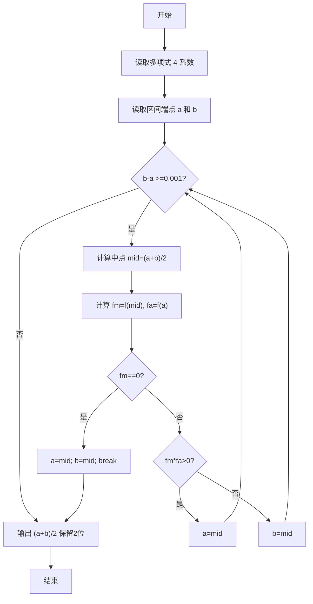
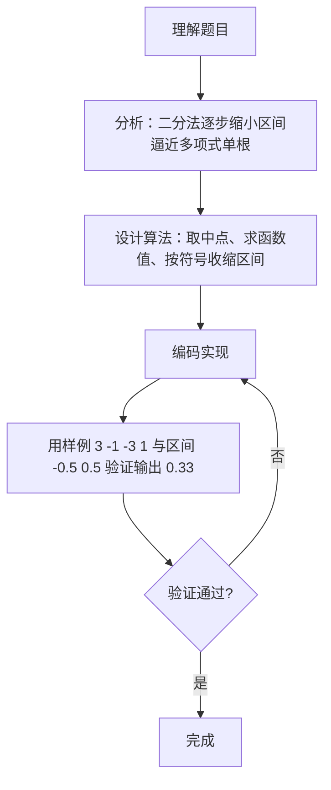

# 7-18 二分法求多项式单根（Go语言实现）

## 前言

本题要求用二分法计算给定三阶多项式 f(x) = a₃x³ + a₂x² + a₁x + a₀ 在给定区间内的根，并精确到小数点后 2 位。

二分法的原理是：连续函数在区间两端取值异号时，区间内必存在一个根；每次取区间中点，根据 f(mid) 与 f(a) 是否同号把区间缩小一半，反复迭代直到区间长度 <0.001，再输出中点 (a+b)/2。

实现上要注意按题面步骤以区间长度作为收敛条件（b-a >=0.001），并正确选择区间的收缩方向。

## 题目描述

二分法求函数根的原理为：如果连续函数f(x)在区间[a,b]的两个端点取值异号，即f(a)f(b)<0，则它在这个区间内至少存在1个根r，即f(r)=0。

二分法的步骤为：

检查区间长度，如果小于给定阈值，则停止，输出区间中点(a+b)/2；否则
如果f(a)f(b)<0，则计算中点的值f((a+b)/2)；
如果f((a+b)/2)正好为0，则(a+b)/2就是要求的根；否则
如果f((a+b)/2)与f(a)同号，则说明根在区间[(a+b)/2,b]，令a=(a+b)/2，重复循环；
如果f((a+b)/2)与f(b)同号，则说明根在区间[a,(a+b)/2]，令b=(a+b)/2，重复循环。

本题目要求编写程序，计算给定3阶多项式f(x)=a₃x³ + a₂x² + a₁x + a₀在给定区间[a,b]内的根。

## 输入格式

输入在第1行中顺序给出多项式的4个系数a₃、a₂、a₁、a₀，在第2行中顺序给出区间端点a和b。题目保证多项式在给定区间内存在唯一单根。

## 输出格式

在一行中输出该多项式在该区间内的根，精确到小数点后2位。

## 输入样例

```in
3 -1 -3 1
-0.5 0.5
```

## 输出样例

```out
0.33
```

## 解题思路

### 1. 理解二分法的收敛条件

根据题目步骤，检查区间长度 b-a 是否小于阈值 0.001，若小于则停止并输出中点 (a+b)/2；否则继续二分。阈值 0.001 保证输出保留 2 位小数时四舍五入正确。

### 2. 从输入读取区间端点

用 a 与 b 表示区间的左、右端点。代码读取题面给出的区间端点作为初始的 a 和 b。

### 3. 计算中点与函数值

每次迭代取中点 mid = (a + b) / 2.0，计算 fm=f(mid) 与 fa=f(a)。若 fm==0 说明中点即为根，可直接收敛。

### 4. 根据 f(mid) 与 f(a) 是否同号收缩区间

若 fm*fa > 0 说明根在右半区间 [mid,b]，令 a=mid；否则根在左半区间 [a,mid]，令 b=mid，继续下一轮迭代直到 b-a <0.001。

## 完整代码

```go
// 题目：7-18 二分法求多项式单根
// 要求：用二分法求三阶多项式 f(x) = a3*x^3 + a2*x^2 + a1*x + a0 在给定区间内的根，精确到小数点后 2 位。
//
// 实现原理：
//   1. 定义 f(x) 计算多项式值；读取 4 个系数和区间 [a,b]；
//   2. 当区间长度 >=0.001 时取中点 mid，计算 fm=f(mid)、fa=f(a)；
//   3. 若 fm==0 直接输出 mid；若 fm*fa>0 说明根在右半区令 a=mid，否则 b=mid；
//   4. 循环结束输出 (a+b)/2 保留 2 位小数，保证四舍五入正确。
package main

import "fmt"

// f 计算多项式 f(x)=a3*x^3+a2*x^2+a1*x+a0 的值
func f(a3, a2, a1, a0, x float64) float64 {
	return a3*x*x*x + a2*x*x + a1*x + a0
}

func main() {
	var a3, a2, a1, a0 float64
	fmt.Scan(&a3, &a2, &a1, &a0)
	var a, b float64
	fmt.Scan(&a, &b)
	var mid float64
	for b-a >= 0.001 {
		mid = (a + b) / 2
		fm := f(a3, a2, a1, a0, mid)
		fa := f(a3, a2, a1, a0, a)
		if fm == 0 {
			a = mid
			b = mid
			break
		} else if fm*fa > 0 {
			a = mid
		} else {
			b = mid
		}
	}
	fmt.Printf("%.2f\n", (a+b)/2)
}
```

## 代码流程说明

1. 定义函数 f 计算多项式值，用 fmt.Scan 读取 4 个系数 a3,a2,a1,a0 与区间端点 a,b。
2. 当 b-a >=0.001 时循环：
   - 计算中点 mid=(a+b)/2，计算 fm=f(mid)、fa=f(a)；
   - 若 fm==0 则 a=mid; b=mid 并 break；
   - 否则若 fm*fa>0 则 a=mid，否则 b=mid。
3. 循环结束输出 (a+b)/2 保留 2 位小数。

## 代码流程图



## 解题流程图



## 代码解析

### 读取多项式系数与区间端点

```go
var a3, a2, a1, a0 float64
fmt.Scan(&a3, &a2, &a1, &a0)
var a, b float64
fmt.Scan(&a, &b)
```

使用 float64 类型存储 4 个系数与区间端点，保证计算精度。fmt.Scan 分两行读取系数和区间。

### 二分迭代主循环

```go
for b-a >= 0.001 {
    mid := (a + b) / 2
    fm := f(a3, a2, a1, a0, mid)
    fa := f(a3, a2, a1, a0, a)
    if fm == 0 {
        a = mid
        b = mid
        break
    } else if fm*fa > 0 {
        a = mid
    } else {
        b = mid
    }
}
fmt.Printf("%.2f\n", (a+b)/2)
```

每次迭代先求中点与端点函数值，用 fm*fa>0 判断根所在半区并收缩区间；循环结束输出 (a+b)/2 保留 2 位小数。

## 复杂度分析

设输入规模为 n（本题输入为 4 个系数和 2 个区间端点，可视为常数）：

- 时间复杂度：二分法每轮把区间长度缩小一半，迭代次数约为 log₂(区间长度/ε)（ε 为精度阈值 1e-3），可视为 O(1)（更一般地写为 O(log(1/ε))）；
- 空间复杂度：只使用 a、b、c、d、lo、hi、mid 等少量浮点变量，空间复杂度为 O(1)。

## 常见易错点

### 1. 以区间长度而非函数值作为收敛条件

题面明确"区间长度 < 阈值则停止"，阈值取 0.001。若误用 |f(mid)|<1e-3 作为停止条件，区间长度可能仍很大，输出精度不足；正确做法是判断 b-a >=0.001。

### 2. 区间收缩方向写反

当 f(mid) 与 f(a) 同号 (fm*fa>0) 说明根在 [mid,b]，应令 a=mid；若误写成 b=mid，会把根排除在区间之外。

### 3. 输出 (a+b)/2 而非 mid

循环内 mid 是上一次迭代的中点，区间仍在收缩，最终应输出 (a+b)/2 以保证四舍五入到 2 位小数正确。

### 4. 忘记读取区间端点

若把区间硬编码为 [-1.0, 1.0]，当题目给定的根不在该区间内时，程序无法找到正确的根。必须从输入读取区间端点 a 和 b。

## 更多测试

### 测试一：线性多项式求根

输入：

```text
0 0 1 -0.25
-1 1
```

输出：

```text
0.25
```

推演验证：f(x)=x-0.25，区间 [-1,1]，b-a=2>=0.001，mid=0 fm=-0.25 fa=-1.25 fm*fa>0 令a=0；b-a=1>=0.001 mid=0.5 fm=0.25 fa=-0.25 异号令b=0.5；依次二分直至 b-a<0.001 输出 0.25。

### 测试二：整数根的情况

输入：

```text
0 0 2 -1
0 1
```

输出：

```text
0.50
```

推演验证：f(x)=2x-1，区间 [0,1]，b-a=1>=0.001 mid=0.5 fm=0 满足 fm==0 直接收敛，输出 (a+b)/2=0.50。

### 测试三：根在区间边界

输入：

```text
1 0 0 0
-1 1
```

输出：

```text
0.00
```

推演验证：f(x)=x³，区间 [-1,1]，mid=0 fm=0 直接收敛，输出 0.00。

## 总结

本题的核心是二分法的数值求解流程：维护根所在区间，每次取中点计算函数值，根据 f(mid) 与 f(a) 是否同号把区间缩小一半，直到区间长度 <0.001，再输出 (a+b)/2。正确读取区间端点并以区间长度作为收敛条件是保证精度的关键。
