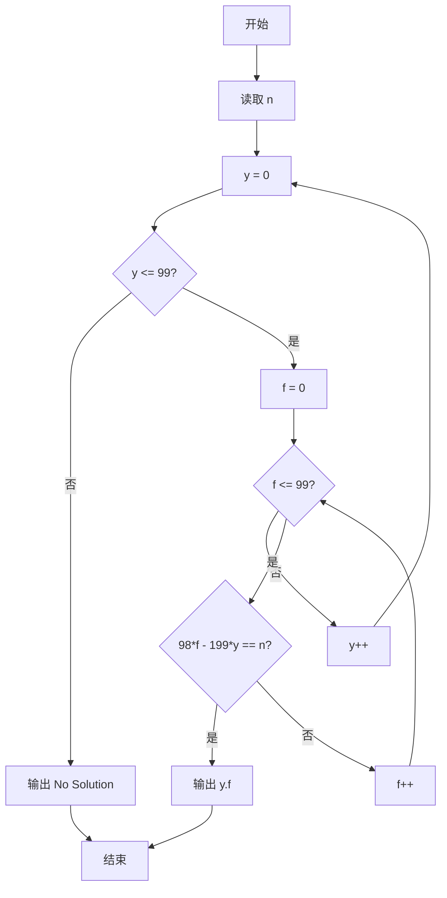
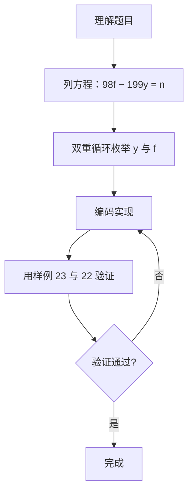

# 7-19 支票面额（Go语言实现）

## 前言

这道题描述了一个支票面额被错付的场景：真实面额为 y 元 f 分，出纳员却错给了 f 元 y 分，采购员用去 n 分后余额为 2y 元 2f 分，要求根据 n 求出真实面额。

解题的核心是把生活问题转化为数量等式，再在有限的取值范围内枚举搜索满足条件的解。若枚举范围内无解，则按题目要求输出 No Solution。

关键的等式推导：真实面额为 100y+f 分，错付为 100f+y 分，用去 n 分后剩余 (100f+y)-n 分，等于 200y+2f 分。由此可得 98f-199y=n。

## 题目描述

一个采购员去银行兑换一张y元f分的支票，结果出纳员错给了f元y分。采购员用去了n分之后才发觉有错，于是清点了余额尚有2y元2f分，问该支票面额是多少？

## 输入格式

输入在一行中给出小于100的正整数n。

## 输出格式

在一行中按格式y.f输出该支票的原始面额。如果无解，则输出No Solution。

## 输入样例1

```in
23
```

## 输出样例1

```out
25.51
```

## 输入样例2

```in
22
```

## 输出样例2

```out
No Solution
```

## 解题思路

### 1. 列方程

真实面额为 y 元 f 分 = 100y+f 分。出纳错付 f 元 y 分 = 100f+y 分。采购员用去 n 分后，剩余 (100f+y)−n 分。题面说余额为 2y 元 2f 分 = 200y+2f 分，因此：

```text
(100f+y) − n = 200y+2f
⇒ 98f − 199y = n
```

### 2. 枚举 y 和 f

由方程 98f − 199y = n 可知，y 每增大 1，n 减少 199；f 每增大 1，n 增大 98。由于 n < 100，y 的取值范围不会太大，f 的取值范围为 0~99。用双重循环枚举 y(0..99) 和 f(0..99)，命中 98*f−199*y==n 时输出 y.f。

### 3. 无解处理

双重循环结束仍无命中，按题目要求输出 No Solution。

## 完整代码

```go
// 题目：7-19 支票面额
// 要求：真实面额 y 元 f 分，错给成 f 元 y 分。给定用去的 n 分，
//       枚举满足 98*f − 199*y == n 的 y 与 f，按 y.f 格式输出。
//
// 实现原理：
//   1. 由题意列方程：(100f+y)−n = 200y+2f，化简为 98f − 199y = n；
//   2. 双重循环枚举 y(0..99) 与 f(0..99)，命中时输出 y.f 并结束；
//   3. 枚举完仍无命中则输出 No Solution。
package main

import "fmt"

func main() {
	var n int
	fmt.Scan(&n)

	for y := 0; y < 100; y++ {
		for f := 0; f <= 99; f++ {
			if 98*f-199*y == n {
				fmt.Printf("%d.%d\n", y, f)
				return
			}
		}
	}
	fmt.Println("No Solution")
}
```

## 代码流程说明

1. 声明整型变量 n，用 fmt.Scan 读取损失的分值。
2. 外层 for 循环枚举 y 从 0 到 99。
3. 内层 for 循环枚举 f 从 0 到 99。
4. 判断 98*f−199*y == n：成立则用 fmt.Printf 按 y.f 格式输出，并 return 结束程序。
5. 两层循环全部结束仍无命中，用 fmt.Println 输出 No Solution。

## 代码流程图



## 解题流程图



## 代码解析

### 读取输入

```go
var n int
fmt.Scan(&n)
```

n 为采购员用去的分数，作为方程右端的已知量输入。

### 双重循环枚举求解

```go
for y := 0; y < 100; y++ {
    for f := 0; f <= 99; f++ {
        if 98*f-199*y == n {
            fmt.Printf("%d.%d\n", y, f)
            return
        }
    }
}
```

外层枚举元数 y，内层枚举分数 f。命中条件 98*f−199*y==n 时立即按 y.f 格式输出并 return。

### 无解输出

```go
fmt.Println("No Solution")
```

两层循环枚举完毕仍无命中，按题目要求输出 No Solution。

## 复杂度分析

设输入规模为 n（本题输入为单个整数 n）：

- 时间复杂度：外层循环最多执行 99 次，内层最多执行 100 次，总枚举次数为 9900 次，每次只做常数时间的比较，因此时间复杂度为 O(1)；
- 空间复杂度：只使用 n、y、f 等少量整型变量，空间复杂度为 O(1)。

## 常见易错点

### 1. 方程推导错误

方程应为 98f−199y==n。若误写为 100y−f==n 或其他形式，会导致枚举条件完全不对，无法命中正确解。

### 2. 输出格式错误

题目要求按 y.f 格式输出（如 25.51）。若写成 "%d %d" 或 "%d元%d分"，格式不符合要求。

### 3. 无解时忘记输出

枚举结束仍无命中时，必须输出 No Solution。若忘记处理，程序将不输出任何内容，与题目要求不符。

## 更多测试

### 测试一：n=23

输入：

```text
23
```

输出：

```text
25.51
```

推演验证：98*51−199*25 = 4998−4975 = 23，命中条件，输出 25.51。

### 测试二：n=22

输入：

```text
22
```

输出：

```text
No Solution
```

推演验证：遍历 y=1..99、f=0..99 的全部组合，98*f−199*y 的值均不等于 22，输出 No Solution。

### 测试三：n=99

输入：

```text
99
```

输出：

```text
No Solution
```

推演验证：98*f−199*y=99 无整数解（因为 98f = 199y+99，右端 199y+99 需是 98 的倍数），遍历所有组合无命中。

## 总结

本题的核心是把"支票面额"问题转化为数量等式 98f−199y==n，再用双重循环枚举 y 与 f 进行验证。命中即按 y.f 格式输出并结束，枚举完仍无命中则输出 No Solution。枚举法思路简单、实现直观，特别适合取值范围有限的问题。
