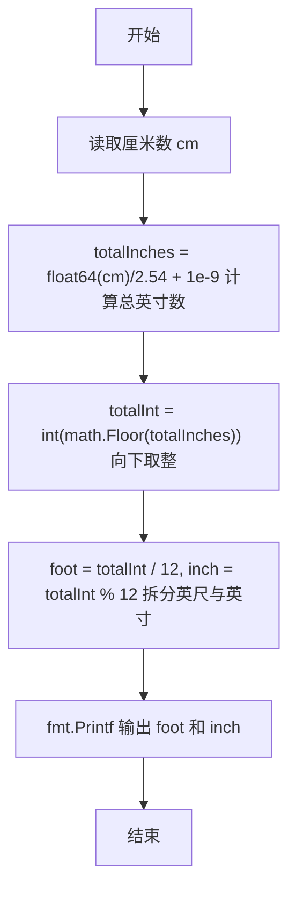
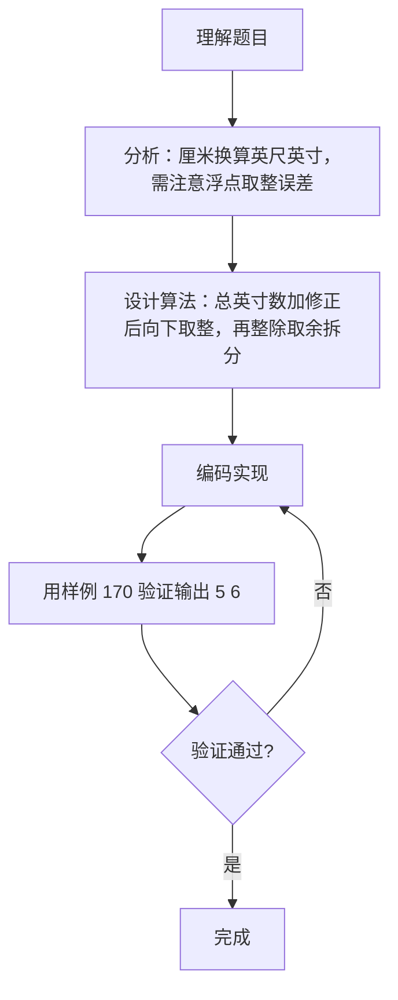

# 7-1 厘米换算英尺英寸（Go语言实现）

## 前言

这道题要求把输入的厘米数换算成英制的英尺和英寸输出，属于单位换算问题，涉及浮点数运算和取整两个关键点。

题目有两个细节容易出错：

1. 厘米除以 2.54 得到的是浮点数，直接向下取整可能受浮点精度误差影响，导致取整结果偏小；
2. 1 英尺等于 12 英寸，把总英寸数拆成英尺和英寸时，整除和取余的顺序不能写反。

核心策略是先把厘米统一换算成总英寸数，加上一个极小的修正量 1e-9 规避浮点误差，再向下取整，最后用整除和取余拆出英尺与英寸。

## 题目描述

如果已知英制长度的英尺*f**oo**t*和英寸*in**c**h*的值，那么对应的米是(*f**oo**t*+*in**c**h*/12)×0.3048。现在，如果用户输入的是厘米数，那么对应英制长度的英尺和英寸是多少呢？别忘了1英尺等于12英寸。

## 输入格式

输入在一行中给出1个正整数，单位是厘米。

## 输出格式

在一行中输出这个厘米数对应英制长度的英尺和英寸的整数值，中间用空格分开。英寸的值应小于12。

## 输入样例

```in
170
```

## 输出样例

```out
5 6
```

## 解题思路

### 1. 推导厘米与英寸的换算关系

已知条件：
- 1 英寸 = 2.54 厘米
- 1 英尺 = 12 英寸

因此，给定厘米数 cm，可先换算成总英寸数：

```text
totalInches = cm / 2.54
```

### 2. 规避浮点精度误差

`cm / 2.54` 是浮点数，2.54 在二进制中无法精确表示，计算结果可能比真实值略小。为防止浮点精度误差导致取整错误（如 66.9999... 被向下取整成 66），代码先加上 1e-9，再用 math.Floor 向下取整得到整数 totalInt：

```text
totalInt = floor(cm / 2.54 + 1e-9)
```

### 3. 拆分英尺与英寸

最后用整除和取余把总英寸拆成英尺和英寸：

- 英尺数：foot = totalInt / 12
- 剩余英寸数：inch = totalInt % 12

具体计算步骤为：

1. 读取输入的厘米数 cm
2. 计算 totalInches = cm / 2.54 + 1e-9
3. 用 math.Floor 向下取整得到整数 totalInt
4. 计算 foot = totalInt / 12
5. 计算 inch = totalInt % 12
6. 按「foot inch」格式输出结果

## 完整代码

```go
// 题目：7-1 厘米换算英尺英寸
// 要求：输入厘米数，输出对应的英尺和英寸的整数值，中间用空格分开，英寸值应小于 12。
//
// 实现原理：
//   1. 根据 1 英寸 = 2.54 厘米，把厘米数换算为总英寸数；
//   2. 加上 1e-9 修正浮点精度误差，用 math.Floor 向下取整；
//   3. 用整除和取余把总英寸拆成英尺和英寸并输出。
package main

import (
	"fmt"
	"math"
)

func main() {
	var cm int
	fmt.Scan(&cm)
	totalInches := float64(cm)/2.54 + 1e-9
	totalInt := int(math.Floor(totalInches))
	foot := totalInt / 12
	inch := totalInt % 12
	fmt.Printf("%d %d\n", foot, inch)
}
```
## 代码流程说明

1. 声明整型变量 cm，用 fmt.Scan 读取输入的厘米数。
2. 计算 totalInches = float64(cm)/2.54 + 1e-9，得到总英寸数并加上修正量。
3. 用 math.Floor 向下取整，再转换为整型得到 totalInt。
4. 用整除 totalInt / 12 求出英尺数 foot。
5. 用取余 totalInt % 12 求出剩余英寸数 inch。
6. 用 fmt.Printf 按「foot inch」格式输出，中间用空格分隔，末尾换行。
7. main 函数自然结束。

## 代码流程图



## 解题流程图



## 代码解析

### 读取输入

```go
var cm int
fmt.Scan(&cm)
```

cm 声明为 int 类型，因为题目保证输入是正整数厘米数。fmt.Scan 按空格分隔读取标准输入，把第一个整数存入 cm。

### 浮点换算与取整

```go
totalInches := float64(cm)/2.54 + 1e-9
totalInt := int(math.Floor(totalInches))
```

int 类型不能直接与浮点数相除，必须先转换 float64(cm)。加上 1e-9 是为了修正浮点精度误差：例如 127/2.54 在浮点运算中可能得到 49.9999...，不加修正会被向下取整为 49，而正确答案应是 50。最后 math.Floor 向下取整得到整数 totalInt。

### 拆分英尺与英寸

```go
foot := totalInt / 12
inch := totalInt % 12
```

利用 1 英尺等于 12 英寸的关系，整除得到英尺数，取余得到不足 1 英尺的剩余英寸数，这样 inch 一定小于 12。

## 复杂度分析

该算法只进行固定次数的算术运算，与输入大小无关：

- 时间复杂度：`O(1)`，每次运行只做常数次除法、取整和取余运算；
- 空间复杂度：`O(1)`，只使用几个固定数量的变量，不随输入规模增长。

## 常见易错点

### 1. 浮点精度误差导致取整偏小

2.54 在二进制中不能精确表示，`cm / 2.54` 的浮点结果可能比真实值略小。例如输入 127 时，127/2.54 的浮点结果可能是 49.9999...，直接向下取整得到 49，导致输出 `4 1` 而非正确的 50 英寸（即 `4 2`）。代码通过加 1e-9 修正了这个问题。

### 2. 整数与浮点数直接相除

Go 中 int 与 float64 属于不同类型，直接写 `cm / 2.54` 会报编译错误（mismatched types）。必须先把 cm 转换为浮点数，即 `float64(cm) / 2.54`。

### 3. 英尺与英寸拆分错误

拆分时英寸必须用取余运算得到：

```go
foot := totalInt / 12
inch := totalInt % 12
```

若把两行都写成整除或把顺序写反，例如输入 170 时 totalInt = 66，正确结果是 `5 6`，写反则会输出 `6 5`。

## 更多测试

### 测试一：厘米数为 0

输入：

```text
0
```

输出：

```text
0 0
```

推演：totalInches = 0/2.54 + 1e-9 = 1e-9，取整得 0，foot = 0/12 = 0，inch = 0%12 = 0，输出 `0 0`。

### 测试二：厘米数恰好为 254

输入：

```text
254
```

输出：

```text
8 4
```

推演：254/2.54 = 100，取整得 100，foot = 100/12 = 8，inch = 100%12 = 4，输出 `8 4`。8 英尺 4 英寸共 100 英寸，恰好等于 254 厘米。

### 测试三：厘米数不足 1 英尺

输入：

```text
33
```

输出：

```text
1 0
```

推演：33/2.54 = 12.9921...，取整得 12，foot = 12/12 = 1，inch = 12%12 = 0，输出 `1 0`。33 厘米略小于 13 英寸（33.02 厘米），所以是 1 英尺 0 英寸。

## 总结

本题的核心是先做单位换算，再处理浮点取整。把厘米统一换算成总英寸数后，用整除和取余拆出英尺与英寸，思路清晰、代码简洁。加 1e-9 修正浮点误差是一个值得记住的小技巧，凡涉及不精确小数除法的取整问题都可以借鉴。这类换算题的关键在于单位关系梳理准确、取整边界处理稳妥。