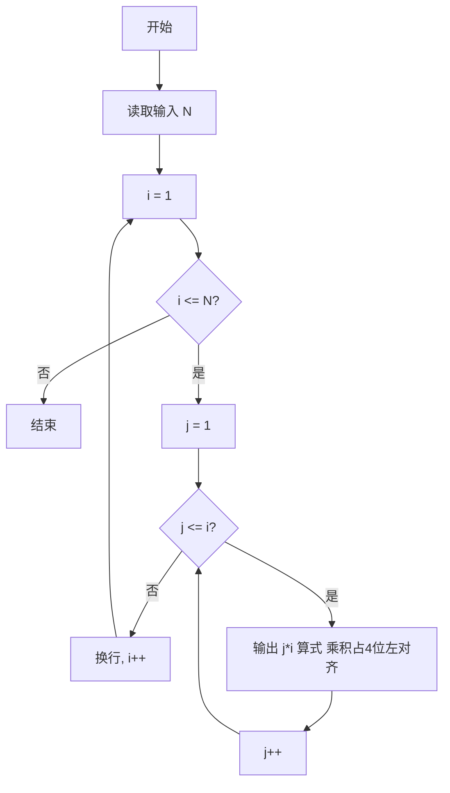
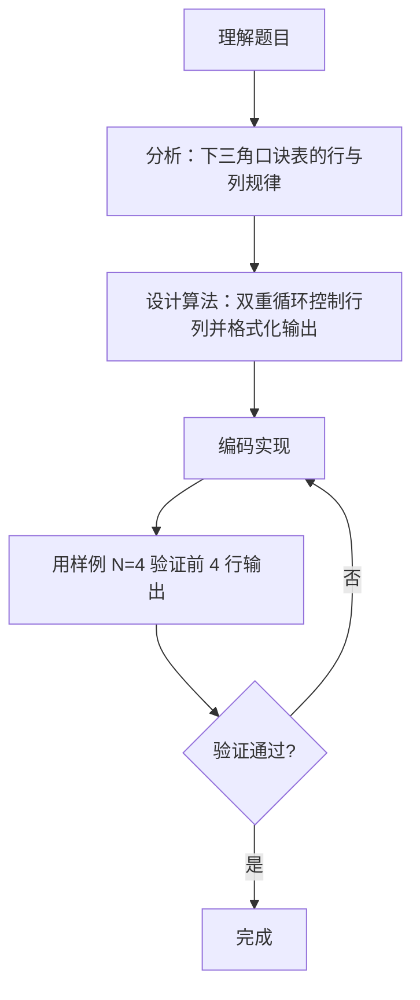

# 7-20 打印九九口诀表（Go语言实现）

## 前言

这道题要求输出下三角形式的九九口诀表：给定一位正整数 N，输出从 1*1 到 N*N 的部分口诀表。第 i 行有 i 个算式，每个算式格式为 "j*i=乘积"（j 从 1 到 i），同一行内算式之间以空格分隔，等号右边数字占 4 位、左对齐。

题目本身是典型的双重循环与格式化输出练习，易错点集中在句间空格的控制和输出格式的对齐上：同一行内除第一个算式外，其余算式前都要有一个空格，而行末不需要多余空格；乘积部分需要占 4 位且左对齐。

代码采用外层循环控制行号（i 从 1 到 N）、内层循环控制列号（j 从 1 到 i）的双重循环结构，根据输入 N 输出前 N 行口诀表。

## 题目描述

下面是一个完整的下三角九九口诀表：

```text

1*1=1   
1*2=2   2*2=4   
1*3=3   2*3=6   3*3=9   
1*4=4   2*4=8   3*4=12  4*4=16  
1*5=5   2*5=10  3*5=15  4*5=20  5*5=25  
1*6=6   2*6=12  3*6=18  4*6=24  5*6=30  6*6=36  
1*7=7   2*7=14  3*7=21  4*7=28  5*7=35  6*7=42  7*7=49  
1*8=8   2*8=16  3*8=24  4*8=32  5*8=40  6*8=48  7*8=56  8*8=64  
1*9=9   2*9=18  3*9=27  4*9=36  5*9=45  6*9=54  7*9=63  8*9=72  9*9=81
```

本题要求对任意给定的一位正整数N，输出从1*1到N*N的部分口诀表。

## 输入格式

输入在一行中给出一个正整数N（1≤N≤9）。

## 输出格式

输出下三角N*N部分口诀表，其中等号右边数字占4位、左对齐。

## 输入样例

```in
4
```

## 输出样例

```out
1*1=1   
1*2=2   2*2=4   
1*3=3   2*3=6   3*3=9   
1*4=4   2*4=8   3*4=12  4*4=16  
```

## 解题思路

### 1. 分析下三角口诀表的行列规律

第 i 行有 i 个算式，第 i 行第 j 个算式为 "j*i=乘积"（j 从 1 到 i）。行号对应算式的第二个乘数，列号对应第一个乘数，且列号不超过行号，从而形成下三角结构。

### 2. 用双重循环控制行列

外层循环 i 从 1 到 N 控制行数，内层循环 j 从 1 到 i 控制该行输出的算式个数，保证每行只输出到 i*i。

### 3. 控制句间空格

同一行内，除第一个算式外，每个算式前先输出一个空格，避免算式之间粘连，同时保证行末不输出多余空格。

### 4. 格式化输出算式

用 fmt.Printf("%d*%d=%-4d", j, i, i*j) 输出每个算式，其中 %-4d 表示乘积占 4 位、左对齐。一行结束后用 fmt.Println 换行。

## 完整代码

```go
// 题目：7-20 打印九九口诀表
// 要求：给定正整数 N，输出下三角形式的九九乘法口诀表前 N 行，每句格式为"j*i=乘积"，
//       乘积占 4 位左对齐，同行句间空格分隔。
//
// 实现原理：
//   1. 读取输入 N；
//   2. 双重循环：外层 i 从 1 到 N 代表行（被乘数），内层 j 从 1 到 i 代表该行列数（下三角）；
//   3. 同一行内除首句外，前一句先输出一个空格再打印下一句，行末换行。
package main

import "fmt"

func main() {
	var n int
	fmt.Scan(&n)

	for i := 1; i <= n; i++ {
		for j := 1; j <= i; j++ {
			fmt.Printf("%d*%d=%-4d", j, i, i*j)
		}
		fmt.Println()
	}
}
```

## 代码流程说明

1. 声明整型变量 n，用 fmt.Scan 读取输入的正整数 N。
2. 外层 for 循环 i 从 1 到 N，控制输出 N 行，i 作为算式的第二个乘数（行号）。
3. 内层 for 循环 j 从 1 到 i，第 i 行输出 i 个算式，j 作为第一个乘数（列号）。
4. 用 fmt.Printf("%d*%d=%-4d", j, i, i*j) 输出当前算式，乘积占 4 位左对齐。
5. 内层循环结束后用 fmt.Println 换行，进入下一行。
6. main 函数自然结束。

## 代码流程图



## 解题流程图



## 代码解析

### 读取输入 N

```go
var n int
fmt.Scan(&n)
```

读取题目给定的正整数 N（1≤N≤9），控制口诀表的输出行数。

### 双重循环控制行列

```go
for i := 1; i <= n; i++ {
    for j := 1; j <= i; j++ {
```

外层循环 i 控制行数（共 N 行），内层循环 j 的循环上界为 i，随行号变化，每行最多取到 i，从而形成"第 i 行 i 个算式"的下三角结构。

### 格式化输出

```go
fmt.Printf("%d*%d=%-4d", j, i, i*j)
```

%-4d 格式符使乘积占 4 位、左对齐，与题目要求一致。由于 %-4d 会在乘积后自动补空格至 4 位宽度，算式之间自然由这些空格分隔，无需额外输出空格。fmt.Println 在每行结束后换行。

## 复杂度分析

设输入的 N 为口诀表的行数：

- 时间复杂度：外层循环执行 N 次，内层循环共执行 1+2+...+N = N(N+1)/2 次，每次只做常数时间的输出，因此时间复杂度为 O(N²)；
- 空间复杂度：没有使用额外的数据结构，空间复杂度为 O(1)。

## 常见易错点

### 1. 忘记读取输入 N

若把循环上界硬编码为 9（`i <= 9`），当题目输入 N < 9 时仍会输出完整 9 行，与要求不符。必须读取输入 N 作为循环上界。

### 2. 内层循环上界写错

内层 j 的上界应随 i 变化（j <= i）。若写成 j <= N 或 j <= 9，则每一行都会输出 N 或 9 个算式，不再是下三角口诀表。

### 3. 乘积未占 4 位左对齐

题目要求"等号右边数字占 4 位、左对齐"。若写成 %d（无格式），乘积宽度不一致；若写成 %4d（右对齐），格式不符。必须使用 %-4d。由于 %-4d 会在乘积后自动补空格至 4 位宽度，算式间的间距由这些补位空格自然形成，无需额外输出空格分隔。

## 更多测试

### 测试一：N 取最小边界 1

输入：

```text
1
```

输出：

```text
1*1=1   
```

推演验证：N=1 时只输出 1 行，该行只有 1 个算式 "1*1=1"，乘积占 4 位左对齐即 "1   "。

### 测试二：N 取最大边界 9

输入：

```text
9
```

输出：

```text
1*1=1   
1*2=2   2*2=4   
1*3=3   2*3=6   3*3=9   
1*4=4   2*4=8   3*4=12  4*4=16  
1*5=5   2*5=10  3*5=15  4*5=20  5*5=25  
1*6=6   2*6=12  3*6=18  4*6=24  5*6=30  6*6=36  
1*7=7   2*7=14  3*7=21  4*7=28  5*7=35  6*7=42  7*7=49  
1*8=8   2*8=16  3*8=24  4*8=32  5*8=40  6*8=48  7*8=56  8*8=64  
1*9=9   2*9=18  3*9=27  4*9=36  5*9=45  6*9=54  7*9=63  8*9=72  9*9=81  
```

推演验证：N=9 时输出完整 9 行口诀表。逐行核对，第 i 行依次输出 "1*i=i"、" 2*i=2i"、…、" i*i=i*i"，乘积均占 4 位左对齐，例如 "1*9=9   "、"2*9=18  "、"9*9=81  "。

## 总结

本题是典型的双重循环嵌套练习。把握"第 i 行输出 i 个算式、算式为 j*i=乘积"的下三角规律，配合句间空格控制与格式化输出（%-4d），即可正确打印口诀表。关键是读取输入 N 作为循环上界，而不是固定输出 9 行。
