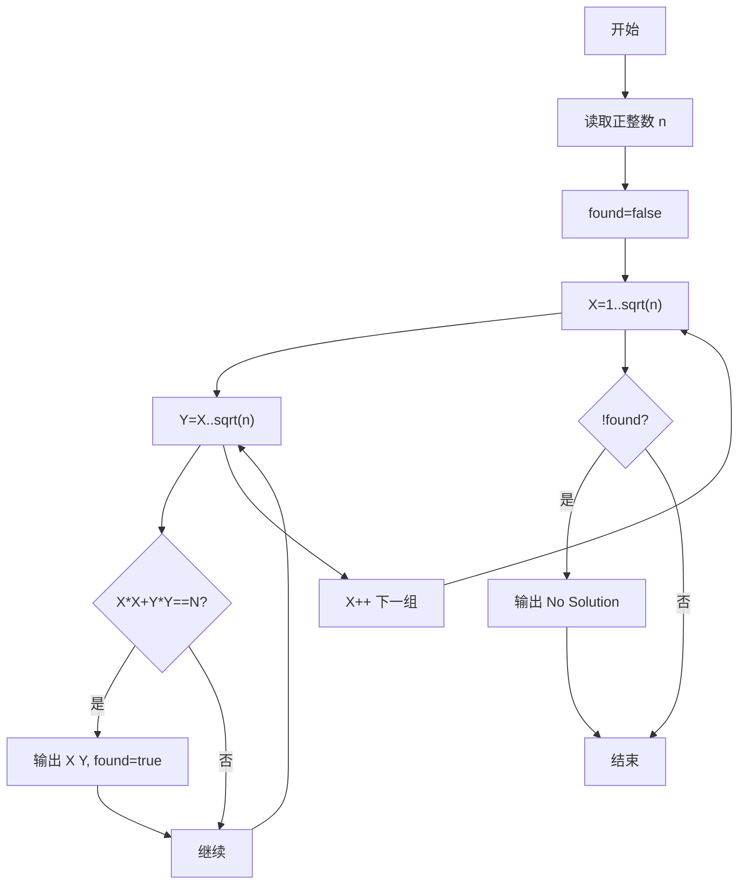
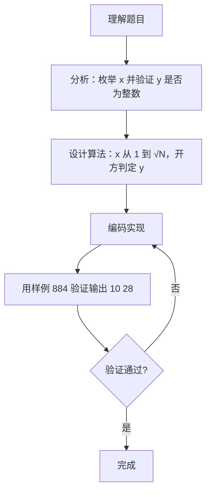

# 7-21 求特殊方程的正整数解（Go语言实现）

## 前言

这道题要求求出方程 X² + Y² = N 的全部正整数解，其中 X ≤ Y，N 最大为 10000。如果对 x、y 双重循环逐一枚举，最坏需要 O(N²) 次尝试；更高效的做法是只枚举 x，借助方程的结构直接计算 y² = N - x²，再通过开方判定 y 是否为整数。

本题有两个细节容易出错：一是枚举范围只需要到 √N，超过 √N 后 y 会小于 x，不再满足 X ≤ Y；二是 math.Sqrt 返回的是浮点数，必须用整数平方回验（y*y == y²）来确认 y 恰好是正整数，避免浮点精度造成的漏判。

下面采用「枚举 + 开方判定」的策略，在 O(√N) 时间内找到方程的解。

## 题目描述

本题要求对任意给定的正整数N，求方程X² + Y² = N的全部正整数解。

## 输入格式

输入在一行中给出正整数N（≤10000）。

## 输出格式

输出方程X² + Y² = N的全部正整数解，其中X≤Y。每组解占1行，两数字间以1空格分隔，按X的递增顺序输出。如果没有解，则输出No Solution。

## 输入样例1

```in
884
```

## 输出样例1

```out
10 28
20 22
```

## 输入样例2

```in
11
```

## 输出样例2

```out
No Solution
```

## 解题思路

### 1. 确定 x 的枚举范围

由 X ≤ Y 可知 x 不必超过 √N：当 x > √N 时，y² = N - x² < x²，即 y < x，必然违反题目要求的 X ≤ Y，因此枚举到 √N 即可。本题 N ≤ 10000，√N ≤ 100，枚举量非常小。

### 2. 对每个 x 计算 y² 并开方判定

对当前 x 计算 y² = N - x²，再对 y² 开方取整得到 y：

- 若 y > 0，说明 y 是正整数；
- 若 y*y == y²，说明开方结果恰好是整数（y² 是完全平方数），方程成立。

两个条件同时满足，就找到了一组正整数解。

### 3. 输出全部解并处理无解

枚举过程中每命中一组解即按 "X Y" 格式输出并标记 found=true；双重循环结束后若 !found 则输出 No Solution，保证与题目要求的"全部解+无解提示"一致。

## 完整代码

```go
// 题目：7-21 求特殊方程的正整数解
// 要求：给定正整数 N（≤10000），求方程 X^2+Y^2=N 的全部正整数解（X≤Y），按 X 递增输出，无解输出 No Solution。
//
// 实现原理（双重枚举）：
//   1. X、Y 均从 1 枚举到 √N，用 X*X<=N、Y*Y<=N 作为循环条件避免浮点误差；
//   2. 内层 Y 从 X 开始保证 X≤Y 且不重复；
//   3. 若 X*X+Y*Y==N 则输出该组解并标记 found；循环结束后若 !found 则输出 No Solution。
package main

import "fmt"

func main() {
	var n int
	fmt.Scan(&n)
	found := false
	for x := 1; x*x <= n; x++ {
		for y := x; y*y <= n; y++ {
			if x*x+y*y == n {
				fmt.Printf("%d %d\n", x, y)
				found = true
			}
		}
	}
	if !found {
		fmt.Println("No Solution")
	}
}
```

## 代码流程说明

1. 声明整型变量 n，用 fmt.Scan 读取正整数 N。
2. 循环枚举 x，从 1 开始，循环条件为 float64(x) ≤ math.Sqrt(float64(n))，每次自增 1。
3. 计算 y2 = n - x*x，即 y² 的值。
4. 用 math.Sqrt 对 y2 开方并转换为 int 取整，得到 y。
5. 若 X*X+Y*Y==N 则输出 X Y 并标记 found=true。
6. 循环结束后若 !found 则输出 No Solution。

## 代码流程图



## 解题流程图



## 代码解析

### 双重枚举与范围控制

```go
limit := int(math.Sqrt(float64(N)))
for X := 1; X <= limit; X++ {
    for Y := X; Y <= limit; Y++ {
        if X*X+Y*Y == N {
```

X、Y 均从 1 到 √N，Y 从 X 开始保证 X≤Y，limit 预先计算避免重复开方。

### 命中判断与标记

```go
fmt.Printf("%d %d\n", X, Y)
found = true
```

命中时输出并标记 found，继续枚举以找到全部解。

### 无解处理

```go
if !found {
    fmt.Println("No Solution")
}
```

双重循环结束后若仍无命中，按题目要求输出 No Solution。

## 复杂度分析

设输入规模为 N：

- 时间复杂度：循环从 x=1 执行到 x=√N，共约 √N 次，循环体内部是常数时间的乘法和开方运算，总时间复杂度为 O(√N)；
- 空间复杂度：只使用 n、x、y2、y 等几个基本类型变量，空间复杂度为 O(1)。

## 常见易错点

### 1. 浮点开方的精度问题

直接用 int(math.Sqrt(float64(y2))) 取整后与浮点结果比较可能出错。例如当 y2 为 16 时，个别浮点实现可能返回 3.9999999999999996，取整得到 3，导致漏判。正确做法是用 y*y == y2 做整数回验，只有回验通过才算找到解。

### 2. 枚举范围越过 √N

若把循环写成 x <= n，虽然结果正确，但白白多执行 O(N) 次循环；若枚举范围过小（小于 √N），则可能漏掉 x 较大的解。超过 √N 后 y < x，违反题目要求的 X ≤ Y，无需枚举。

### 3. 遗漏 No Solution

若忘记在 !found 时输出 No Solution，无解输入（如 11）将不输出任何内容，与题目要求不符。必须在循环结束后判断 found 并输出。

## 更多测试

### 测试一：最小的有解输入

输入：

```text
2
```

输出：

```text
1 1
```

推演：x=1（1 ≤ √2），y2 = 2-1 = 1，y = int(√1) = 1，y > 0 且 1*1 == 1，输出 "1 1"。

### 测试二：N = 25

输入：

```text
25
```

输出：

```text
3 4
```

推演：x=1 时 y2 = 24，int(√24) = 4，4*4 = 16 ≠ 24，跳过；x=2 时 y2 = 21，int(√21) = 4，16 ≠ 21，跳过；x=3 时 y2 = 16，int(√16) = 4，4*4 = 16 == 16 且 y > 0，输出 "3 4"。

### 测试三：N = 50

输入：

```text
50
```

输出：

```text
1 7
```

推演：x=1（1 ≤ √50），y2 = 50-1 = 49，y = int(√49) = 7，y > 0 且 7*7 == 49，输出 "1 7"。

## 总结

本题的核心是用「枚举 + 开方判定」把 O(N²) 的双重枚举压缩到 O(√N)：只枚举 x，由 N - x² 直接确定 y²，再用整数平方回验消除浮点误差。把握住 x ≤ √N 的枚举边界和 y*y == y² 的整数校验，就能稳妥地求出方程的正整数解。
