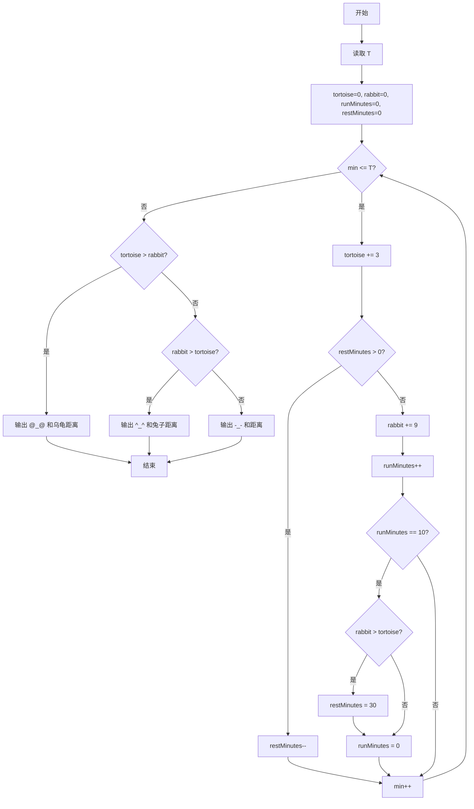
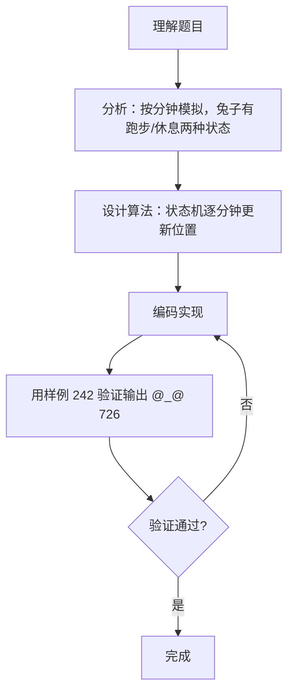

# 7-22 龟兔赛跑（Go语言实现）

## 前言

这道题按题目原意是给定比赛时间 T 分钟，模拟乌龟和兔子的赛跑过程，判断谁跑得快，并输出胜者标识及距离。

规则要点：乌龟每分钟跑 3 米且不休息；兔子每分钟跑 9 米，但每跑 10 分钟回头检查一次——若已超过乌龟就在路边休息 30 分钟，否则继续跑。

代码采用按分钟逐步模拟的方式：每分钟更新乌龟位置；兔子在跑步时前进，在休息时跳过，每 10 分钟检查一次是否需要休息。

## 题目描述

乌龟与兔子进行赛跑，跑场是一个矩型跑道，跑道边可以随地进行休息。乌龟每分钟可以前进3米，兔子每分钟前进9米；兔子嫌乌龟跑得慢，觉得肯定能跑赢乌龟，于是，每跑10分钟回头看一下乌龟，若发现自己超过乌龟，就在路边休息，每次休息30分钟，否则继续跑10分钟；而乌龟非常努力，一直跑，不休息。假定乌龟与兔子在同一起点同一时刻开始起跑，请问T分钟后乌龟和兔子谁跑得快？

## 输入格式

输入在一行中给出比赛时间T（分钟）。

## 输出格式

在一行中输出比赛的结果：乌龟赢输出@_@，兔子赢输出^_^，平局则输出-_-；后跟1空格，再输出胜利者跑完的距离（平局输出乌龟或兔子跑完的距离均可）。

## 输入样例

```in
242
```

## 输出样例

```out
@_@ 726
```

## 解题思路

### 1. 按分钟逐步模拟

用循环从第 1 分钟到第 T 分钟逐步推进。每分钟更新乌龟位置（+3 米）；兔子根据状态（跑步或休息）更新位置。

### 2. 兔子的状态管理

兔子有两种状态：跑步和休息。用变量区分当前状态：
- 跑步时：每分钟 +9 米，跑步累计时间 +1；若累计达到 10 分钟，检查是否领先乌龟——是则切换到休息状态（休息 30 分钟），否则跑步累计清零继续跑。
- 休息时：每分钟什么都不做，休息倒计时 −1；倒计时归零时切换回跑步状态。

### 3. 比较最终位置

循环结束后比较乌龟和兔子的位置：乌龟远大于兔子则输出 @_@ 和乌龟距离，兔子大于乌龟则输出 ^_^ 和兔子距离，平局输出 -_- 和距离。

## 完整代码

```go
// 题目：7-22 龟兔赛跑
// 要求：给定时间 T，模拟乌龟(3米/分)与兔子(9米/分，每跑10分钟检查是否需休息30分钟)的赛跑，
//       输出胜者及距离。
//
// 实现原理（按分钟模拟）：
//   1. 每分钟乌龟 +3 米；
//   2. 兔子维护跑步/休息两种状态：
//      - 跑步：+9米/分，每10分钟检查是否领先乌龟决定是否休息；
//      - 休息：不前进，倒计时归零后恢复跑步；
//   3. 循环结束后比较位置输出结果。
package main

import "fmt"

func main() {
	var t int
	fmt.Scan(&t)

	tortoise, rabbit := 0, 0
	runMinutes := 0
	restMinutes := 0

	for min := 1; min <= t; min++ {
		tortoise += 3

		if restMinutes > 0 {
			restMinutes--
		} else {
			rabbit += 9
			runMinutes++
			if runMinutes == 10 {
				if rabbit > tortoise {
					restMinutes = 30
				}
				runMinutes = 0
			}
		}
	}

	switch {
	case tortoise > rabbit:
		fmt.Printf("@_@ %d\n", tortoise)
	case rabbit > tortoise:
		fmt.Printf("^_^ %d\n", rabbit)
	default:
		fmt.Printf("-_- %d\n", tortoise)
	}
}
```

## 代码流程说明

1. 声明整型变量 t，用 fmt.Scan 读取比赛时间。
2. 初始化 tortoise = 0、rabbit = 0，runMinutes = 0（跑步累计分钟数），restMinutes = 0（休息倒计时）。
3. 循环 min 从 1 到 t：
   - 乌龟前进 3 米：tortoise += 3。
   - 若 restMinutes > 0（兔子在休息）：休息倒计时 −1。
   - 否则（兔子在跑步）：rabbit += 9，runMinutes++；若 runMinutes == 10：
     - 若 rabbit > tortoise：进入休息状态，restMinutes = 30。
     - runMinutes 清零。
4. 循环结束后比较位置：
   - 乌龟 > 兔子：输出 @_@ 和乌龟距离。
   - 兔子 > 乌龟：输出 ^_^ 和兔子距离。
   - 平局：输出 -_- 和乌龟距离。

## 代码流程图



## 解题流程图



## 代码解析

### 读取时间与初始化

```go
var t int
fmt.Scan(&t)

tortoise, rabbit := 0, 0
runMinutes := 0
restMinutes := 0
```

读取比赛时间 T，初始化两者位置为 0，兔子跑步累计分钟数和休息倒计时均为 0。

### 按分钟模拟核心循环

```go
for min := 1; min <= t; min++ {
    tortoise += 3

    if restMinutes > 0 {
        restMinutes--
    } else {
        rabbit += 9
        runMinutes++
        if runMinutes == 10 {
            if rabbit > tortoise {
                restMinutes = 30
            }
            runMinutes = 0
        }
    }
}
```

每分钟乌龟前进 3 米。兔子在休息时倒计时 −1；在跑步时前进 9 米，每 10 分钟检查一次是否需要休息（领先则休息 30 分钟）。

### 结果判定与输出

```go
switch {
case tortoise > rabbit:
    fmt.Printf("@_@ %d\n", tortoise)
case rabbit > tortoise:
    fmt.Printf("^_^ %d\n", rabbit)
default:
    fmt.Printf("-_- %d\n", tortoise)
}
```

循环结束后比较位置，按题目要求输出胜者标识和距离。

## 复杂度分析

设比赛时间为 T 分钟：

- 时间复杂度：O(T)，每分钟只做常数时间的更新；
- 空间复杂度：O(1)，只使用若干整型变量。

## 常见易错点

### 1. 忘记切换回跑步状态

休息倒计时归零时必须把 restMinutes 置 0，下一轮循环兔子才能恢复跑步。若忘记归零，兔子会一直"休息"下去。

### 2. 检查时机不对

应在每跑 10 分钟后检查一次，而不是每分钟都检查。若每分钟都检查，会导致兔子频繁进入休息。

### 3. 休息期间乌龟仍在前进

循环中乌龟的更新在最前面，无论兔子在跑步还是休息，乌龟都在前进。若把乌龟的更新放在兔子跑步分支内，乌龟会在兔子休息时停止。

### 4. 输出格式错误

乌龟赢输出 `@_@`，兔子赢输出 `^_^`，平局输出 `-_-`，后跟空格和距离。若符号写错或格式不对，会判错。

## 更多测试

### 测试一：短时间兔子赢

输入：

```text
5
```

输出：

```text
^_^ 45
```

推演验证：5 分钟内兔子跑了 5×9=45 米（未达 10 分钟不检查），乌龟跑了 5×3=15 米。兔子领先，输出 ^_^ 45。

### 测试二：刚好 10 分钟

输入：

```text
10
```

输出：

```text
^_^ 90
```

推演验证：前 10 分钟兔子跑了 90 米，乌龟跑了 30 米。第 10 分钟末检查时兔子领先，进入休息。但循环已结束，最终位置兔子 90 > 乌龟 30，输出 ^_^ 90。

### 测试三：长时间乌龟反超

输入：

```text
242
```

输出：

```text
@_@ 726
```

推演验证：这是题目样例。乌龟一直跑：242×3=726 米。兔子前 10 分钟跑 90 米领先，然后休息 30 分钟（乌龟趁机跑 90 米），如此反复。经过多轮休息后乌龟逐渐追上并反超，最终乌龟 726 米 > 兔子 459 米。

## 总结

本题的核心是用状态机按分钟模拟龟兔赛跑的过程。乌龟始终匀速前进，兔子在跑步与休息两种状态间切换——每跑 10 分钟检查一次是否需要休息 30 分钟。理解兔子的状态转换时机是正确实现的关键。
