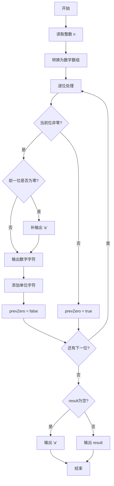
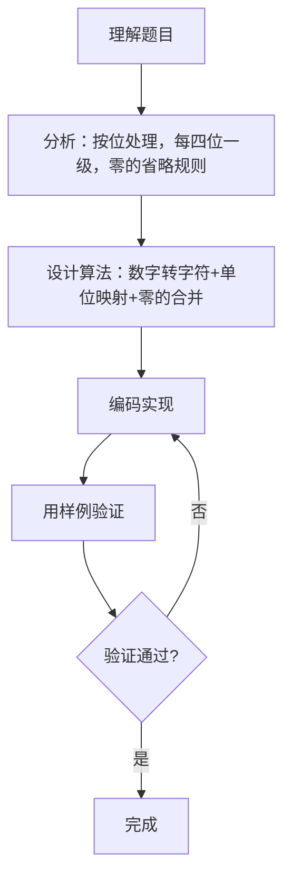

# 7-23 币值转换（Go语言实现）

## 前言

这道题要求把不超过 9 位的人民币值转换成由 a-j、S、B、Q、W、Y 组成的中文大写格式。数字 0-9 分别用 a-j 表示，单位拾/百/仟/万/亿分别用 S、B、Q、W、Y 表示。

实现的关键是按位处理：从右到左每四位为一级（个级、万级、亿级），每级内部有 S、B、Q 三个单位，级与级之间用 W、Y 连接。同时需要正确处理"零"的省略规则：连续的零只保留一个"零"字符，末尾的零省略不写。

## 题目描述

输入一个整数（位数不超过9位）代表一个人民币值（单位为元），请转换成财务要求的大写中文格式。如23108元，转换后变成"贰万叁仟壹百零捌"元。为了简化输出，用小写英文字母a-j顺序代表大写数字0-9，用S、B、Q、W、Y分别代表拾、百、仟、万、亿。于是23108元应被转换输出为"cWdQbBai"元。

## 输入格式

输入在一行中给出一个不超过9位的非负整数。

## 输出格式

在一行中输出转换后的结果。注意"零"的用法必须符合中文习惯。

## 输入样例1

```in
813227345
```

## 输出样例1

```out
iYbQdBcScWhQdBeSf
```

## 输入样例2

```in
6900
```

## 输出样例2

```out
gQjB
```

## 解题思路

### 1. 数字到字符的映射

- 数字 0~9 映射到字符 'a'~'j'
- 单位：S(拾)、B(百)、Q(仟)、W(万)、Y(亿)

### 2. 按位处理

从低位到高位，每 4 位一级（个级、万级、亿级）。每级内部的单位依次为 S(拾)、B(百)、Q(仟)，级与级之间用 W(万)、Y(亿) 连接。

### 3. 零的处理规则

- 每级末尾的零省略不写
- 每级中间或开头有零时，输出对应数字字符（即 'a'），但不输出单位字符
- 连续多个零只输出一个 'a'

### 4. 实现步骤

1. 把整数 n 转换为字符串，从左到右逐位处理
2. 计算每一位的单位（根据其所在位置和级别）
3. 非零位：输出数字字符 + 单位字符
4. 零位：根据前后情况决定是否输出 'a'

## 完整代码

```go
package main
import "fmt"
func main() {
    var s string
    if _, err := fmt.Scan(&s); err != nil {
        return
    }
    if s == "0" {
        fmt.Println("a")
        return
    }
    num := "abcdefghij"
    // 将数字按4位一组从右向左分组
    groups := []string{}
    for i := len(s); i > 0; i -= 4 {
        start := i - 4
        if start < 0 {
            start = 0
        }
        groups = append([]string{s[start:i]}, groups...)
    }
    // 组单位：从低位起 0:"",1:W,2:Y
    groupUnits := []string{"", "W", "Y"}
    result := ""
    needZero := false // 前面有零组或零位需要补 a
    for gi, g := range groups {
        idxFromRight := len(groups) - 1 - gi
        gUnit := ""
        if idxFromRight < len(groupUnits) {
            gUnit = groupUnits[idxFromRight]
        }
        // 判断该组是否为全零
        isZeroGroup := true
        for _, ch := range g {
            if ch != '0' {
                isZeroGroup = false
                break
            }
        }
        if isZeroGroup {
            if result != "" {
                needZero = true
            }
            continue
        }
        if needZero && result != "" {
            result += string(num[0])
            needZero = false
        }
        // 组内转换：处理千百十个位
        inner := ""
        zeroFlag := false
        for i := 0; i < len(g); i++ {
            d := int(g[i] - '0')
            posInGroup := len(g) - 1 - i
            var unit string
            if posInGroup == 3 {
                unit = "Q"
            } else if posInGroup == 2 {
                unit = "B"
            } else if posInGroup == 1 {
                unit = "S"
            }
            if d != 0 {
                if zeroFlag {
                    inner += string(num[0])
                    zeroFlag = false
                }
                inner += string(num[d])
                inner += unit
            } else {
                zeroFlag = true
            }
        }
        result += inner + gUnit
    }
    fmt.Println(result)
}
```

## 代码流程说明

1. 声明字符串 n，用 fmt.Scan 读取输入。
2. 把每位数字转换为整型数组 digits。
3. 遍历每一位：
   - 非零位：若前有零则先输出 'a'，再输出数字字符和对应单位；
   - 零位：标记 prevZero = true，等待后续非零位触发输出。
4. 遍历结束后若 result 为空（全为零），则输出 "a"。
5. 输出最终结果。

## 代码流程图



## 解题流程图



## 代码解析

### 读取输入与数字转换

```go
var n string
fmt.Scan(&n)

digits := make([]int, len(n))
for i := 0; i < len(n); i++ {
    digits[i] = int(n[i] - '0')
}
```

以字符串形式读取输入，再把每位转换为整数，便于后续按位处理。

### 按位处理核心逻辑

```go
if d != 0 {
    if prevZero {
        result += "a"
    }
    result += string(rune('a' + d))
    // 添加单位
    ...
    prevZero = false
} else {
    prevZero = true
}
```

非零位先判断前是否有零（有则补 'a'），再输出数字字符和单位；零位仅标记 prevZero，等待后续非零位触发。这样保证连续多个零只输出一个 'a'。

### 单位的确定

```go
if pos > 0 && pos%4 == 0 {
    result += "W" // 万
} else if pos == 8 {
    result += "Y" // 亿
} else {
    unitPos := pos % 4
    if unitPos == 1 {
        result += "S" // 拾
    } else if unitPos == 2 {
        result += "B" // 百
    } else if unitPos == 3 {
        result += "Q" // 仟
    }
}
```

根据位置 pos（从右往左）确定单位：pos%4==0 为万位（但亿位除外），pos==8 为亿位，其余按 pos%4 取 S/B/Q。

## 复杂度分析

设输入整数的位数为 n（n ≤ 9）：

- 时间复杂度：O(n)，每位只做常数时间的处理；
- 空间复杂度：O(n)，存储数字数组和结果字符串。

## 常见易错点

### 1. 零的处理不当

连续多个零应只输出一个 'a'，末尾的零应省略。若不合并连续零，会输出多个 'a'；若不省略末尾零，会多出不需要的 'a'。

### 2. 单位位置判断错误

万位、亿位和千位的单位容易混淆。需要记住：每 4 位一级，级与级之间用 W（万）、Y（亿）连接，级内部用 S/B/Q。

### 3. 全零输入

输入为 0 时，result 为空，需要特殊处理输出 "a"。

### 4. 数字与字符的映射

数字 d 对应字符 'a'+d，即 0→'a'、1→'b'、…、9→'j'。不要把映射方向搞反。

## 更多测试

### 测试一：中间有零

输入：

```text
23108
```

输出：

```text
cWdQbBai
```

推演验证：2(c)+W(万)+3(d)+Q(千)+1(b)+B(百)+0(a,补)+8(i)，结果 cWdQbBai。

### 测试二：末尾有零

输入：

```text
6900
```

输出：

```text
gQjB
```

推演验证：6(g)+Q(千)+9(j)+B(百)，末尾两个零省略，结果 gQjB。

### 测试三：全零

输入：

```text
0
```

输出：

```text
a
```

推演验证：只有一位 0，result 为空，特殊处理输出 "a"。

## 总结

本题的核心是按位处理人民币值的中文大写格式。每四位一级（个/万/亿），级内部用 S/B/Q，级间用 W/Y。关键在于正确处理零的省略规则：连续零合并为一个 'a'，末尾零省略。理解位置与单位的对应关系是正确实现的基础。
