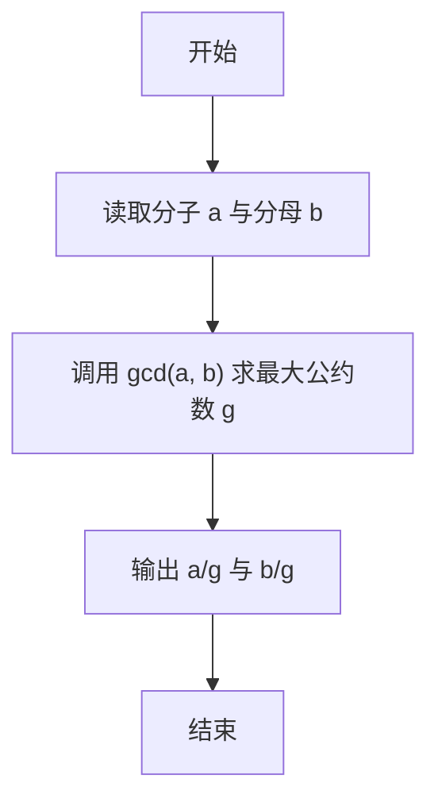
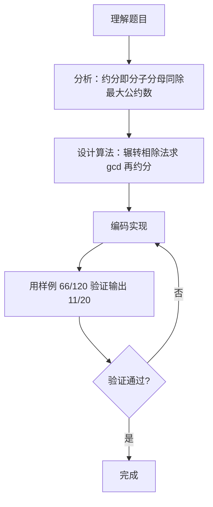

# 7-24 约分最简分式（Go语言实现）

## 前言

这道题要求把分数 a/b 约分为最简分式，即分子分母同时除以它们的最大公约数，使二者互质。例如 6/12 约分后为 1/2，66/120 约分后为 11/20。

约分的关键在于高效地求出最大公约数。欧几里得算法（辗转相除法）只需 O(log n) 次迭代，是求 gcd 的标准做法，也是本题的核心考点。

还有一个容易忽视的细节：题目以 "分子/分母" 的形式（如 66/120）给出分数，而 Go 的 fmt.Scan 是按空白分隔字段读取的，无法直接识别斜杠分隔符，读取时需要使用带格式串的 Sscanf 或先读字符串再按斜杠拆分，否则无法得到正确结果。

## 题目描述

分数可以表示为分子/分母的形式。编写一个程序，要求用户输入一个分数，然后将其约分为最简分式。最简分式是指分子和分母不具有可以约分的成分了。如6/12可以被约分为1/2。当分子大于分母时，不需要表达为整数又分数的形式，即11/8还是11/8；而当分子分母相等时，仍然表达为1/1的分数形式。

## 输入格式

输入在一行中给出一个分数，分子和分母中间以斜杠/分隔，如：12/34表示34分之12。分子和分母都是正整数（不包含0，如果不清楚正整数的定义的话）。

提示：

对于C语言，在scanf的格式字符串中加入/，让scanf来处理这个斜杠。
对于Python语言，用a,b=map(int, input().split('/'))这样的代码来处理这个斜杠。

## 输出格式

在一行中输出这个分数对应的最简分式，格式与输入的相同，即采用分子/分母的形式表示分数。如
5/6表示6分之5。

## 输入样例

```in
66/120
```

## 输出样例

```out
11/20
```

## 解题思路

### 1. 约分的本质：分子分母同除最大公约数

最简分式要求分子与分母互质，即它们的最大公约数为 1。因此只要用欧几里得算法求出 a、b 的最大公约数 g，再把分子、分母同时除以 g，就得到最简分式。例如 66/120 的最大公约数为 6，约分后得 11/20。

### 2. 用辗转相除法求最大公约数

当 b 不为 0 时反复执行 a, b = b, a%b，循环结束时 a 即为最大公约数。对 (66, 120) 执行该过程：

```text
(66, 120) → (120, 66) → (66, 54) → (54, 12) → (12, 6) → (6, 0)
```

b 变为 0 时 a = 6，即最大公约数。

### 3. 读取输入与输出结果

题目按 "分子/分母" 的格式输入，读取后先求 gcd，再按 "%d/%d" 格式输出 a/g 与 b/g。

## 完整代码

```go
package main
import "fmt"
func abs(x int) int { if x < 0 { return -x }; return x }
func gcd(a, b int) int {
    a = abs(a); b = abs(b)
    for b != 0 {
        a, b = b, a%b
    }
    return a
}
func main() {
    var s string
    if _, err := fmt.Scan(&s); err != nil { return }
    var a, b int
    fmt.Sscanf(s, "%d/%d", &a, &b)
    if b < 0 {
        a = -a; b = -b
    }
    g := gcd(a, b)
    if g == 0 { g = 1 }
    fmt.Printf("%d/%d\n", a/g, b/g)
}
```

## 代码流程说明

1. 声明整型变量 a、b，用 fmt.Scan 读取分子和分母。
2. 调用 gcd(a, b) 求最大公约数 g。
3. 分子分母分别除以最大公约数 g。
4. 用 fmt.Printf 按 "%d/%d\n" 格式输出 a/g 和 b/g。
5. 辅助函数 gcd 使用辗转相除法：当 b 不为 0 时反复执行 a, b = b, a%b，b=0 时返回 a 即为最大公约数。

## 代码流程图



## 解题流程图



## 代码解析

### 辗转相除法求最大公约数

```go
func gcd(a, b int) int {
	for b != 0 {
		a, b = b, a%b
	}
	return a
}
```

这是欧几里得算法的经典实现：把 (a, b) 更新为 (b, a%b)，直到余数为 0。最后一次的 a 就是最大公约数。以 (66, 120) 为例，迭代过程为 (66,120) → (120,66) → (66,54) → (54,12) → (12,6) → (6,0)，返回 6。

### 约分并输出

```go
g := gcd(a, b)
fmt.Printf("%d/%d\n", a/g, b/g)
```

分子分母同时除以 g 后互质，再按 "%d/%d" 格式输出。66/6 = 11、120/6 = 20，输出 "11/20"。

## 复杂度分析

设输入规模为 n，即分子分母中较大的数：

- 时间复杂度：辗转相除法每次迭代后余数至少减半，迭代次数为 O(log n)，因此总时间复杂度为 O(log n)；
- 空间复杂度：只使用 a、b、g 等几个整型变量，O(1)。

## 常见易错点

### 1. fmt.Scan 无法直接解析斜杠格式的输入

Go 的 fmt.Scan 按空白分隔字段读取，"66/120" 会被当作一个字段，两个整数参数无法正确取到分子和分母，程序的输出不会等于样例的 "11/20"。正确做法是：

```go
var a, b int
fmt.Sscanf(s, "%d/%d", &a, &b) // 先读字符串 s，再用格式串匹配斜杠
```

或者先读取整行字符串，再用 strings.Split 按 "/" 拆分后分别转换。

### 2. 除法的顺序与对象

必须先用原分子分母除以 g 再输出。若把 a/g、b/g 写反（如 fmt.Printf("%d/%d\n", b/g, a/g)），会把分子分母颠倒，例如 66/120 会错误输出 "20/11"。

### 3. 忘记对分子分母都约分

只对分子或只对分母除以 g，都会破坏等式关系。例如只约分子得到 11/120，仍然不是最简分式。两个值必须同步除以同一个最大公约数 g。

## 更多测试

### 测试一：普通约分

输入：

```text
4/6
```

输出：

```text
2/3
```

推演：gcd(4, 6)：a=4, b=6 → a=6, b=4 → a=4, b=2 → a=2, b=0，返回 2。4/2=2、6/2=3，输出 "2/3"。

### 测试二：较大公约数

输入：

```text
12/34
```

输出：

```text
6/17
```

推演：gcd(12, 34)：a=12, b=34 → a=34, b=12 → a=12, b=10 → a=10, b=2 → a=2, b=0，返回 2。12/2=6、34/2=17，输出 "6/17"。

### 测试三：分子分母互质

输入：

```text
7/9
```

输出：

```text
7/9
```

推演：gcd(7, 9)：a=7, b=9 → a=9, b=7 → a=7, b=2 → a=2, b=1 → a=1, b=0，返回 1。7/1=7、9/1=9，输出 "7/9"。

## 总结

本题的核心是欧几里得算法求最大公约数，再用 gcd 同时约分分子分母，把分数化为最简形式。辗转相除法代码简洁、效率高，是处理约分类问题的通用工具。另外要特别注意 Go 语言读取 "a/b" 格式输入的方式，避免用 fmt.Scan 直接解析导致结果错误。
