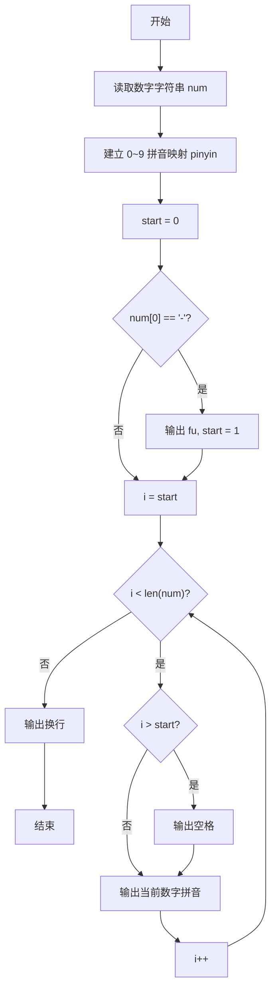
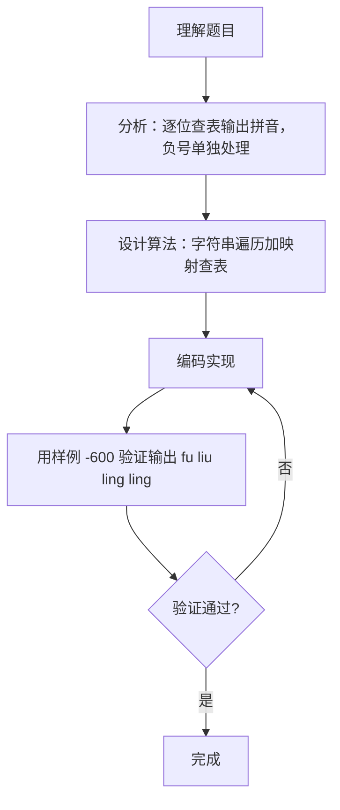

# 7-25 念数字（Go语言实现）

## 前言

这道题要求把一个整数逐位转换成对应的拼音。例如，`123` 要输出为 `yi er san`；如果输入的是负数，还需要先输出 `fu`。

题目看似简单，但有两个细节很容易出错：

1. 负号不能按照普通数字处理；
2. 相邻拼音之间需要有空格，行末却不能多出空格。

使用字符串读取整数，可以直接逐个处理字符，不必进行除法取位，也能自然地处理负号。

## 题目描述

输入一个整数，输出每个数字对应的拼音。当整数为负数时，先输出fu字。十个数字对应的拼音如下：

```in
0: ling
1: yi
2: er
3: san
4: si
5: wu
6: liu
7: qi
8: ba
9: jiu
```

## 输入格式

输入在一行中给出一个整数，如：1234。

提示：整数包括负数、零和正数。

## 输出格式

在一行中输出这个整数对应的拼音，每个数字的拼音之间用空格分开，行末没有最后的空格。如
yi er san si。

## 输入样例

```in
-600
```

## 输出样例

```out
fu liu ling ling
```

## 解题思路

### 1. 将整数当作字符串读取

如果使用整数类型读取，还需要通过取模、除法等操作分离每一位，并额外处理数字顺序。直接使用string类型读取会更方便：字符串中的每个字符本身就是一位数字。

例如，输入 `-600` 后，字符串中的内容依次为：

```text
'-'  '6'  '0'  '0'
```

Go中string类型无需额外的结束标志，通过len()获取长度。

### 2. 使用切片建立数字与拼音的映射

按照 `0` 到 `9` 的顺序保存所有拼音：

```go
pinyin := []string{"ling", "yi", "er", "san", "si", "wu", "liu", "qi", "ba", "jiu"}
```

数字字符减去字符 `'0'`，就能得到对应的整数下标。例如：

```go
'6' - '0' == 6
```

因此，`pinyin[num[i]-'0']` 就是当前数字对应的拼音。

### 3. 单独处理负号

如果第一个字符是 `-`，先输出 `fu `（含一个空格），然后从下标 `1` 开始遍历数字部分；否则从下标 `0` 开始遍历。

### 4. 控制输出空格

用变量 `start` 记录遍历的起始下标：

- 循环中当 `i > start` 时，先输出一个空格，再输出当前拼音；
- 第一个输出项（可能是 `fu` 或第一个数字拼音）前不加空格。

这种写法可以统一处理正数、负数和零，避免在行末输出多余空格。

## 完整代码

```go
package main
import "fmt"
func main() {
    var s string
    if _, err := fmt.Scan(&s); err != nil { return }
    pinyin := []string{"ling", "yi", "er", "san", "si", "wu", "liu", "qi", "ba", "jiu"}
    start := 0
    if len(s) > 0 && s[0] == '-' {
        fmt.Print("fu")
        start = 1
        if len(s) > 1 { fmt.Print(" ") }
    }
    for i := start; i < len(s); i++ {
        if i > start {
            fmt.Print(" ")
        }
        d := s[i] - '0'
        fmt.Print(pinyin[d])
    }
    fmt.Println()
}
```

## 代码流程说明

1. 声明 string 变量 num，用 fmt.Scan 读取整数（以字符串形式）。
2. 构造拼音映射切片 pinyin，下标 0~9 对应 ling 到 jiu。
3. 初始化 start = 0。
4. 判断 num[0] == '-'：成立则输出 "fu " 并把 start 设为 1。
5. for 循环从 start 遍历到字符串末尾。
6. 判断 i > start：成立则输出一个空格。
7. 输出 pinyin[num[i]-'0'] 得到当前数字的拼音。
8. 遍历结束后输出换行。

## 代码流程图



## 解题流程图



## 代码解析

### 读取输入字符串

```go
fmt.Scan(&num)
```

使用fmt.Scan读取字符串，Go的string类型是动态长度的，无需担心数组越界问题。

### 处理负数

```go
if num[0] == '-' {
    fmt.Print("fu ")
    start = 1
}
```

输出 `fu ` 后，将遍历起点改为 `1`，跳过负号。`fu` 本身已带一个空格，后续第一个数字拼音前不会再输出空格。

### 查表输出拼音

```go
fmt.Print(pinyin[num[i]-'0'])
```

这里利用数字字符在字符编码中连续排列的特点，将字符转换为 `0` 到 `9` 的切片下标，再访问对应的拼音字符串。

## 复杂度分析

设输入整数包含 `n` 个字符：

- 时间复杂度：`O(n)`，每个字符只处理一次；
- 空间复杂度：`O(n)`，string类型用于保存输入内容。拼音映射切片的大小固定，可视为常量空间。

## 常见易错点

### 1. `fu` 后空格的处理

源代码中 `fmt.Print("fu ")` 已包含空格，但要注意：若写成 `fmt.Print("fu")` 不加空格，结果可能变成：

```text
fuliu ling ling
```

负号同样属于一个输出项，后面的第一个数字拼音与它之间也必须有空格。

### 2. 行末多输出一个空格

不要在每个拼音后都无条件输出空格。可以像本文一样，通过 `i > start` 判断，在除第一项以外的每一项之前输出空格。

### 3. 将负号拿去查表

表达式 `num[i] - '0'` 只适用于数字字符。遍历前必须判断并跳过 `-`。

### 4. 忽略输入为零的情况

输入 `0` 时也需要输出：

```text
ling
```

字符串遍历法无需增加特殊分支，就能正确处理零。

## 更多测试

### 测试一：正数

输入：

```text
1234
```

输出：

```text
yi er san si
```

### 测试二：零

输入：

```text
0
```

输出：

```text
ling
```

### 测试三：负数中含有多个零

输入：

```text
-1002
```

输出：

```text
fu yi ling ling er
```

## 总结

本题的核心是"字符到数组下标"的转换。把整数作为字符串读取后，只需处理负号、遍历数字字符并查表输出即可。`start` 变量则解决了空格分隔问题，使输出格式更稳定。这个思路也适用于字符分类、编码转换和简单词法处理等题目。
