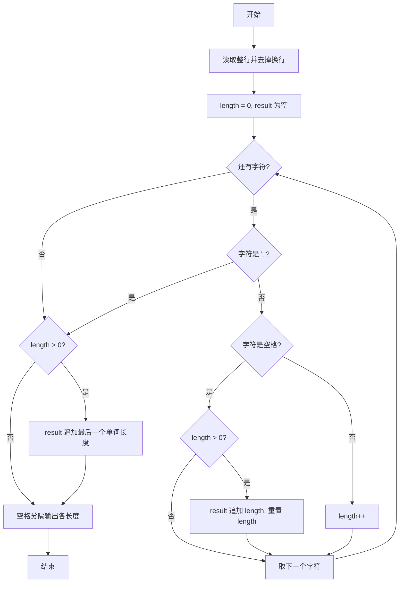
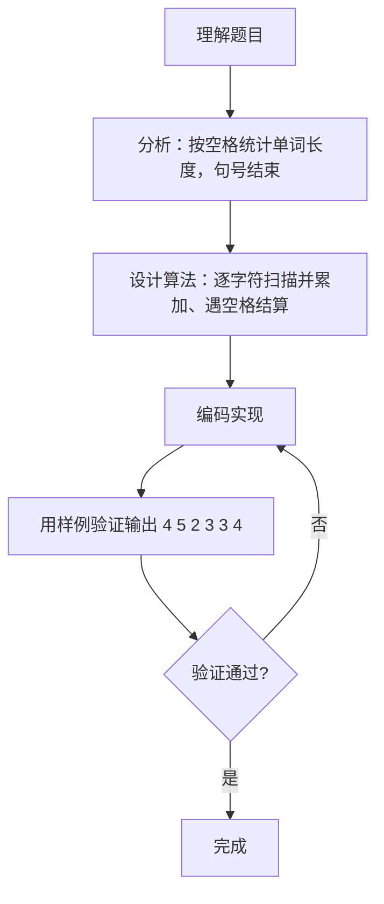

# 7-26 单词长度（Go语言实现）

## 前言

这道题要求统计一行英文文本中每个单词的长度，文本以句号 `.` 结束，单词之间以空格分隔，最终的句号不计算在内。

题目有两个细节容易出错：一是行中可能出现连续空格，不能因此输出多余的 0 长度；二是输出时每个长度之间用空格隔开，行末不能有多余空格。

采用逐字符遍历法：用 bufio 读取整行，遇空格结算当前单词长度，遇句号停止扫描，最后统一用空格分隔输出各长度。

## 题目描述

你的程序要读入一行文本，其中以空格分隔为若干个单词，以.结束。你要输出每个单词的长度。这里的单词与语言无关，可以包括各种符号，比如it's算一个单词，长度为4。注意，行中可能出现连续的空格；最后的.不计算在内。

## 输入格式

输入在一行中给出一行文本，以.结束

提示：用scanf("%c",...);来读入一个字符，直到读到.为止。

## 输出格式

在一行中输出这行文本对应的单词的长度，每个长度之间以空格隔开，行末没有最后的空格。

## 输入样例

```in
It's great to see you here.
```

## 输出样例

```out
4 5 2 3 3 4
```

## 解题思路

### 1. 逐行读取并去掉换行符

用 bufio.NewReader 创建读取器，通过 ReadString('\n') 读取整行文本，再用 strings.TrimSuffix 去掉末尾的换行符，得到需要扫描的字符串。

### 2. 逐字符扫描，遇空格结算单词长度

遍历字符串中的每个字符：

- 遇到空格：说明当前单词结束，若已累计的 length > 0，则把该长度记入 result 并重置 length（length 为 0 说明是连续空格，直接跳过）；
- 遇到其它字符：length++，累加当前单词的长度；
- 遇到句号 '.'：停止扫描。

### 3. 处理句号前的最后一个单词

循环在 '.' 处 break 后，句号前可能还有一个未结算的单词，因此循环结束后若 length > 0，要把这个尾部单词的长度也加入 result。

### 4. 控制输出格式

遍历 result 输出各长度：首元素前不加空格，其余元素前输出一个空格，保证行末没有多余空格。

## 完整代码

```go
package main
import (
    "bufio"
    "fmt"
    "os"
    "strings"
)
func main() {
    reader := bufio.NewReader(os.Stdin)
    line, _ := reader.ReadString('\n')
    line = strings.TrimRight(line, "\r\n")
    for !strings.Contains(line, ".") {
        extra, err := reader.ReadString('\n')
        if err != nil { break }
        line += "\n" + strings.TrimRight(extra, "\r\n")
    }
    lengths := []string{}
    cur := 0
    for _, c := range line {
        if c == '.' {
            break
        }
        if c == ' ' || c == '\t' || c == '\n' || c == '\r' {
            if cur > 0 {
                lengths = append(lengths, fmt.Sprintf("%d", cur))
                cur = 0
            }
        } else {
            cur++
        }
    }
    if cur > 0 {
        lengths = append(lengths, fmt.Sprintf("%d", cur))
    }
    if len(lengths) > 0 {
        fmt.Println(strings.Join(lengths, " "))
    }
}
```

## 代码流程说明

1. 创建 bufio.NewReader 读取器，用 ReadString('\n') 读取整行文本，再用 strings.TrimSuffix 去掉末尾换行符。
2. 初始化 length = 0 作为单词长度计数器，first = true 标记是否为第一个输出的单词，result 为空切片用于收集各单词长度。
3. 用 for 循环逐个遍历字符：读到 '.' 时 break 终止循环。
4. 遇到空格时，若 length > 0 说明当前有完整单词，把该长度追加到 result 并重置 length = 0。
5. 遇到非空格非 '.' 字符时，length++ 累加当前单词长度。
6. 循环结束后，若 length > 0，说明还有以 '.' 结尾前的单词未记录，追加到 result。
7. 遍历 result，首元素前不加空格，其余元素前输出一个空格分隔。

## 代码流程图



## 解题流程图



## 代码解析

### 逐行读取并去除换行

```go
reader := bufio.NewReader(os.Stdin)
s, _ := reader.ReadString('\n')
s = strings.TrimSuffix(s, "\n")
```

ReadString('\n') 读取包含换行符在内的整行，TrimSuffix 去掉末尾的 "\n"，避免把换行符当作单词字符累计。

### 空格分支结算单词

```go
if c == ' ' {
    if length > 0 {
        result = append(result, length)
        length = 0
        first = false
    }
}
```

遇到空格时先检查 length > 0：只有确实存在未结算的单词才记录，连续空格时 length 为 0 会直接跳过，不会产生多余的 0 长度。

### 句号与末尾单词的处理

```go
if c == '.' {
    break
}
...
if length > 0 {
    result = append(result, length)
}
```

循环在句号处立即停止，句号前的最后一个单词由循环后的补记逻辑记录。若省略这段补记，以单词直接结尾的输入（如 "hello."）将丢失最后一个长度。

## 复杂度分析

设文本长度为 n（字符个数）：

- 时间复杂度：对文本逐字符遍历一次，遇到空格、句号或普通字符都是常数时间的判断与累加，总时间复杂度为 O(n)；
- 空间复杂度：result 切片最多保存所有单词的长度，单词个数不超过 n，因此空间复杂度为 O(n)。

## 常见易错点

### 1. 连续空格产生多余的 0 长度

若遇到空格时无条件记录长度，连续空格会把 0 也写入 result。例如输入 "a  b."（两个连续空格），不加 length > 0 判断会输出：

```text
1 0 1
```

而正确结果是：

```text
1 1
```

### 2. 遗漏句号前的最后一个单词

循环在 '.' 处 break 后，句号前的单词长度还未结算。例如输入 "hello."，若没有循环后的补记逻辑，result 为空，输出为空而不是 "5"。

### 3. 行末多输出空格

若在每个长度后都输出空格，会违反「行末没有最后的空格」的要求。正确做法是在除第一个以外的每个长度前输出空格，或像本代码一样用 i > 0 判断。

### 4. first 变量未实际使用

代码中声明了 first 并赋值，但最终输出依赖的是下标判断 i > 0，first 并没有参与逻辑。阅读代码时注意不要被该变量误导，实际控制空格的是输出循环中的 i > 0。

## 更多测试

### 测试一：连续空格

输入：

```text
a  b.
```

输出：

```text
1 1
```

推演：'a' 使 length=1；第一个空格 length>0，记录 1 并重置；第二个空格 length=0，跳过；'b' 使 length=1；'.' 停止；补记 length=1。result=[1,1]，输出 "1 1"。

### 测试二：单个单词

输入：

```text
hello.
```

输出：

```text
5
```

推演：五个字符累计 length=5；'.' 停止；补记 length=5。result=[5]，输出 "5"。

### 测试三：包含符号的单词

输入：

```text
A B C.
```

输出：

```text
1 1 1
```

推演：'A' 累计 1，空格结算记录 1；'B' 累计 1，空格结算记录 1；'C' 累计 1，'.' 停止；补记 1。result=[1,1,1]，输出 "1 1 1"。

## 总结

本题用一次逐字符遍历完成单词长度的统计：空格负责结算、句号负责终止、循环后的补记处理尾部单词，输出时再通过下标判断控制空格。核心技巧是「长度累加、遇空格结算」的状态机思想，也适用于按分隔符切分统计等同类问题。
