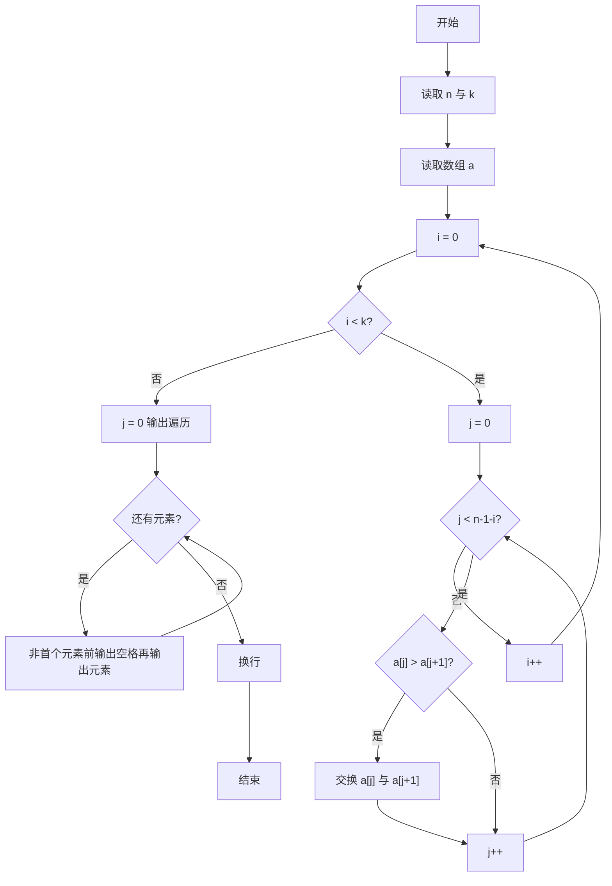
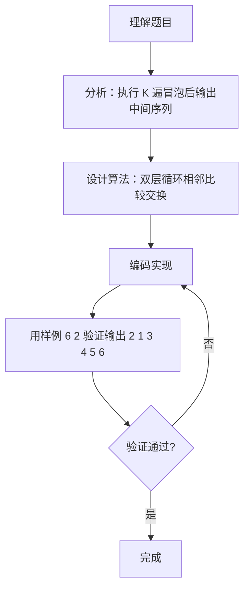

# 7-27 冒泡法排序（Go语言实现）

## 前言

这道题要求用冒泡排序把 N 个整数从小到大排序，但题目并不要求输出最终结果，而是只执行 K 趟扫描后输出中间结果数列。冒泡排序的每一趟扫描都会把当前未排序部分的最大值"冒泡"到末尾，因此执行几趟就对应结果推进到哪一步。

实现时有两个容易出错的地方：一是内层循环的上界要随已归位元素的增多而减小；二是输出时数字之间以空格分隔，行末不能有多余空格。

本题采用两层循环模拟冒泡过程：外层循环控制 K 趟扫描，内层循环进行相邻元素的比较与交换，最后按要求格式输出数组即可。

## 题目描述

将N个整数按从小到大排序的冒泡排序法是这样工作的：从头到尾比较相邻两个元素，如果前面的元素大于其紧随的后面元素，则交换它们。通过一遍扫描，则最后一个元素必定是最大的元素。然后用同样的方法对前N−1个元素进行第二遍扫描。依此类推，最后只需处理两个元素，就完成了对N个数的排序。

本题要求对任意给定的K（<N），输出扫描完第K遍后的中间结果数列。

## 输入格式

输入在第1行中给出N和K（1≤K<N≤100），在第2行中给出N个待排序的整数，数字间以空格分隔。

## 输出格式

在一行中输出冒泡排序法扫描完第K遍后的中间结果数列，数字间以空格分隔，但末尾不得有多余空格。

## 输入样例

```in
6 2
2 3 5 1 6 4
```

## 输出样例

```out
2 1 3 4 5 6
```

## 解题思路

### 1. 明确题目的特殊要求

本题并不是要求完成全部排序，而是只执行 K 趟扫描后输出中间结果。冒泡排序的特点是每趟扫描会将当前未排序部分的最大值"冒泡"到末尾，因此执行第 i 趟后，末尾 i 个元素已经有序，中间的 i+1 到 n 个元素仍是无序的中间状态。

### 2. 冒泡排序的相邻比较交换

冒泡排序通过两层循环实现：外层循环控制排序趟数（本题执行 K 趟），内层循环进行相邻元素的比较与交换。第 i 趟扫描时，只需比较前 n-1-i 个元素（因为末尾 i 个元素已经有序）。若 `a[j] > a[j+1]` 则交换两者位置，使较大元素逐步后移。

### 3. 输入解析与输出格式控制

算法先用 bufio 读取两行输入，解析出 n、k 和待排序数组 a；由于只扫描 k 遍，输出的正是第 k 遍后的中间结果。最后遍历数组，第一个元素直接输出，其余元素前先输出一个空格，确保数字间以单个空格分隔且行末无多余空格。

## 完整代码

```go
package main
import (
    "fmt"
)
func main() {
    var n, k int
    if _, err := fmt.Scan(&n, &k); err != nil { return }
    a := make([]int, n)
    for i := 0; i < n; i++ { fmt.Scan(&a[i]) }
    for i := 0; i < k; i++ {
        for j := 0; j < n-1-i; j++ {
            if a[j] > a[j+1] {
                a[j], a[j+1] = a[j+1], a[j]
            }
        }
    }
    for i := 0; i < n; i++ {
        if i > 0 { fmt.Print(" ") }
        fmt.Print(a[i])
    }
    fmt.Println()
}
```

## 代码流程说明

1. 创建 bufio.Scanner 读取输入，读取第一行并用 strings.Fields 分割，转成整数 n（待排序元素个数）和 k（排序趟数）；再读取第二行分割成字符串数组，逐个转成整数存入切片 a。
2. 外层循环 i 从 0 到 k-1，控制执行 k 趟排序；内层循环 j 从 0 到 n-1-i，每次比较 a[j] 和 a[j+1]，若前者大则交换两者（Go 支持多重赋值交换），使较大元素逐步后移。
3. 遍历切片输出：第一个元素直接输出，后续元素前先输出一个空格；全部输出后换行，确保行末无多余空格。

## 代码流程图



## 解题流程图



## 代码解析

### 相邻元素的比较与交换

```go
if a[j] > a[j+1] {
    a[j], a[j+1] = a[j+1], a[j]
}
```

这是冒泡排序的核心操作：若前面元素大于后面元素则交换位置。Go 语言的多重赋值允许一条语句完成交换，无需借助临时变量。

### 内层循环上界的确定

```go
for j := 0; j < n-1-i; j++ {
```

第 i 趟扫描时，末尾 i 个元素已经有序（每趟确定一个最大值），因此内层只需比较前 n-1-i 对相邻元素，避免对已归位元素的无效比较。

### 控制输出空格

```go
for i := 0; i < n; i++ {
    if i > 0 {
        fmt.Print(" ")
    }
    fmt.Print(a[i])
}
```

第一个元素直接输出，其余元素前先输出一个空格，使数字之间以单个空格分隔，同时保证行末不会多出空格。

## 复杂度分析

设输入的元素个数为 n：

- 时间复杂度：`O(K×n)`。第 i 趟内层执行 n-1-i 次比较，K 趟共约 `K×n - K×(K+1)/2` 次比较与交换；当 K 接近 n 时退化为 `O(n²)`。
- 空间复杂度：`O(n)`，需要长度为 n 的切片存放待排序元素；交换在数组内部完成，无额外空间开销。

## 常见易错点

### 1. 内层循环上界错误

内层上界必须写成 `n-1-i`。若写成 `n-i`，当 i=0 时 j 最大为 n-1，访问 `a[j+1]` 即 `a[n]` 会导致数组越界：

```go
for j := 0; j < n-i; j++ { // 错误：i=0 时访问 a[n] 越界
```

### 2. 多执行一趟导致结果错误

外层循环若写成 `i <= k` 会执行 k+1 趟。例如样例中 6 个元素 K=2 时，正确答案是 `2 1 3 4 5 6`，多执行一趟则变成完全有序的 `1 2 3 4 5 6`。

### 3. 行末多输出一个空格

若在每个元素后都无条件输出空格，行末会多出一个空格：

```text
2 1 3 4 5 6 
```

正确做法是只在除第一个元素以外的元素之前输出空格。

### 4. 输入行解析顺序错误

第一行给出 N 和 K，第二行给出 N 个整数。若先读数组再读 N、K，或把第二行的元素个数当作 N 使用，都会导致解析混乱，输出错误结果。

## 更多测试

### 测试一：仅两个元素

输入：

```text
2 1
2 1
```

推演：第 1 趟（i=0，j 从 0 到 0）：a[0]=2 大于 a[1]=1，交换得 [1 2]。输出：

```text
1 2
```

### 测试二：K 趟后仍未完全有序

输入：

```text
4 2
4 3 2 1
```

推演：第 1 趟：j=0 时 4>3 交换得 [3 4 2 1]，j=1 时 4>2 交换得 [3 2 4 1]，j=2 时 4>1 交换得 [3 2 1 4]。第 2 趟：j=0 时 3>2 交换得 [2 3 1 4]，j=1 时 3>1 交换得 [2 1 3 4]。输出：

```text
2 1 3 4
```

### 测试三：已有序序列

输入：

```text
3 2
1 2 3
```

推演：第 1 趟与第 2 趟均无任何交换，序列保持不变。输出：

```text
1 2 3
```

## 总结

本题的核心是冒泡排序的相邻比较交换思想，同时考察对排序过程的控制：通过外层循环限定执行趟数、内层循环边界随已归位元素减少，即可输出任意趟的中间结果。输出格式的控制（数字间单空格、行末无空格）也是常见的考察点。冒泡排序时间复杂度为 O(n²)，适合数据规模较小的场景。