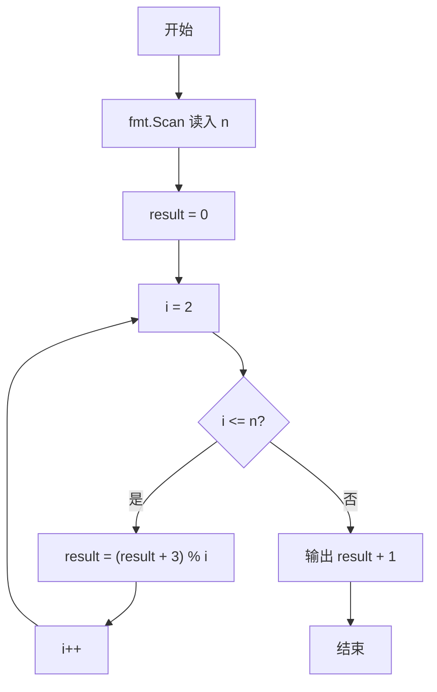
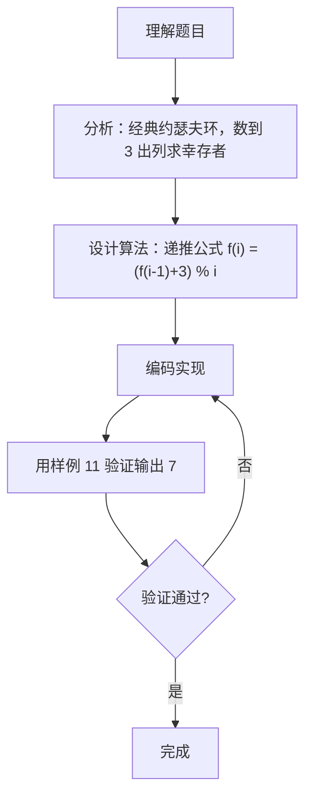

# 7-28 猴子选大王（Go语言实现）

## 前言

这道题是经典的约瑟夫环问题：N 只猴子围成一圈，从 1 号开始报数，每数到 3 的猴子退出圈子，求最后剩下的猴子编号。

如果直接模拟报数与出列过程，需要维护圈结构和退出状态，实现比较繁琐。而约瑟夫环存在递推公式 f(1)=0，f(i)=(f(i-1)+m)%i，可以一次性计算出最后幸存者的下标，时间复杂度只有 O(N)。

实现时最容易出错的是编号的基转换：递推公式得到的是 0 基下标，而猴子编号从 1 开始，输出前需要加 1。

## 题目描述

一群猴子要选新猴王。新猴王的选择方法是：让N只候选猴子围成一圈，从某位置起顺序编号为1~N号。从第1号开始报数，每轮从1报到3，凡报到3的猴子即退出圈子，接着又从紧邻的下一只猴子开始同样的报数。如此不断循环，最后剩下的一只猴子就选为猴王。请问是原来第几号猴子当选猴王？

## 输入格式

输入在一行中给一个正整数N（≤1000）。

## 输出格式

在一行中输出当选猴王的编号。

## 输入样例

```in
11
```

## 输出样例

```out
7
```

## 解题思路

### 1. 识别约瑟夫环问题

本题是经典的约瑟夫环问题：N 只猴子围成一圈，从 1 号开始报数，每数到 3 的猴子出列，求最后幸存者的编号。直接循环模拟需要显式维护圈结构，而使用约瑟夫环递推公式可将求解过程优化为 O(N)。

### 2. 递推公式的使用

约瑟夫环递推公式为 f(1)=0，f(i) = (f(i-1)+m) % i，其中 m 为出列报数值（本题 m=3），i 为当前人数。公式中的 f(i) 表示 i 个人时最后幸存者的 0 基下标。通过递推从 i=2 累加到 N，即可在不维护圈结构的情况下直接得到最终幸存者下标。

### 3. 编号基转换与输出

递推得到的 result 是 0 基下标（从 0 开始计数），而题目要求的猴子编号从 1 开始，因此输出 result + 1 即为最终当选的猴王编号。

## 完整代码

```go
// 题目：7-28 猴子选大王（约瑟夫环问题）
// 要求：N 只猴子围成一圈，从 1 开始报数，每数到 3 的猴子出列，求最后剩下的猴子编号（从 1 开始）。
//
// 实现原理：
//   1. 对"数到 m 出列"的约瑟夫问题，最后幸存者满足递推 f(1)=0，f(i)=(f(i-1)+m)%i；
//   2. 本题 m=3，循环 i 从 2 累加到 N，得到 0 基下标；
//   3. 最后输出 result+1，将 0 基下标转换为 1 基编号。
package main

import "fmt"

func main() {
	var n int
	fmt.Scan(&n)

	result := 0
	for i := 2; i <= n; i++ {
		result = (result + 3) % i // 约瑟夫递推（m=3）
	}

	fmt.Println(result + 1) // 0 基转 1 基
}
```

## 代码流程说明

1. fmt.Scan 读入猴子总数 n。
2. 初始化 result = 0，对应 f(1) = 0，即只有 1 只猴子时幸存者的 0 基下标。
3. for 循环 i 从 2 到 n，逐步执行 result = (result + 3) % i，得到当前人数 i 下幸存者的 0 基下标。
4. fmt.Println 输出 result + 1，将 0 基下标转为 1 基编号。

## 代码流程图



## 解题流程图



## 代码解析

### 递推公式的实现

```go
result := 0
for i := 2; i <= n; i++ {
    result = (result + 3) % i
}
```

result 从 f(1)=0 出发，逐轮计算 f(2)、f(3)……直到 f(n)。每一轮对 i 取模，保证下标始终落在当前人数范围内，不需要维护圈结构。

### 0 基到 1 基的转换

```go
fmt.Println(result + 1)
```

递推公式得到的是 0 基下标（从 0 开始计数），而猴子编号从 1 开始，因此输出前需要加 1。

## 复杂度分析

设猴子的总数为 n：

- 时间复杂度：`O(n)`，单层循环从 2 递推到 n，每轮只做一次加法和取模运算。
- 空间复杂度：`O(1)`，只使用常量个变量，无需模拟圈结构或额外存储。

## 常见易错点

### 1. 忘记 0 基与 1 基的转换

如果直接输出 result 而不是 result + 1，样例 N=11 会输出 6 而不是正确答案 7。

### 2. 递推起点错误

f(1)=0 是 0 基形式。若把初始值设为 1（一基形式）却继续套用 0 基递推公式，所有后续结果都会偏移，最终编号错误。

### 3. 循环边界错误

循环应从 i=2 开始，且必须包含 i=n 这一轮。若写成 i < n 或循环从 i=3 开始，会漏掉中间某一轮递推，得到错误结果。

### 4. 漏掉取模运算

若写成 result = result + 3 而漏掉 % i，result 会不断累加，例如 N=11 时 result 累加 10 次 3 得 30，输出 31，明显超出编号范围。

## 更多测试

### 测试一：只有一只猴子

输入：

```text
1
```

推演：循环不执行，result 保持 0，输出 0+1=1。只有一只猴子，直接当选猴王。输出：

```text
1
```

### 测试二：三只猴子

输入：

```text
3
```

推演：i=2 时 result=(0+3)%2=1；i=3 时 result=(1+3)%3=1，输出 1+1=2。手工模拟：1 号报 1、2 号报 2、3 号报 3 出列；再从 1 号开始报 1、2 号报 2、1 号报 3 出列，剩余 2 号当选。输出：

```text
2
```

### 测试三：五只猴子

输入：

```text
5
```

推演：i=2 时 result=3%2=1；i=3 时 result=(1+3)%3=1；i=4 时 result=(1+3)%4=0；i=5 时 result=(0+3)%5=3，输出 3+1=4。手工模拟：3 号、1 号、5 号、2 号依次出列，剩余 4 号当选。输出：

```text
4
```

## 总结

约瑟夫环问题的递推解法把模拟过程的 O(N×M) 复杂度优化到 O(N)，核心在于理解出列后重新编号与取模运算的关系，以及 0 基下标与 1 基编号之间的转换。这类递推公式也适用于其他"每隔若干人出列"的环形计数问题。