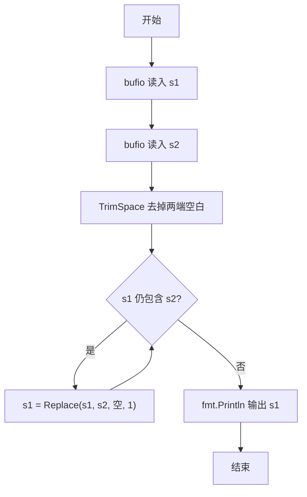
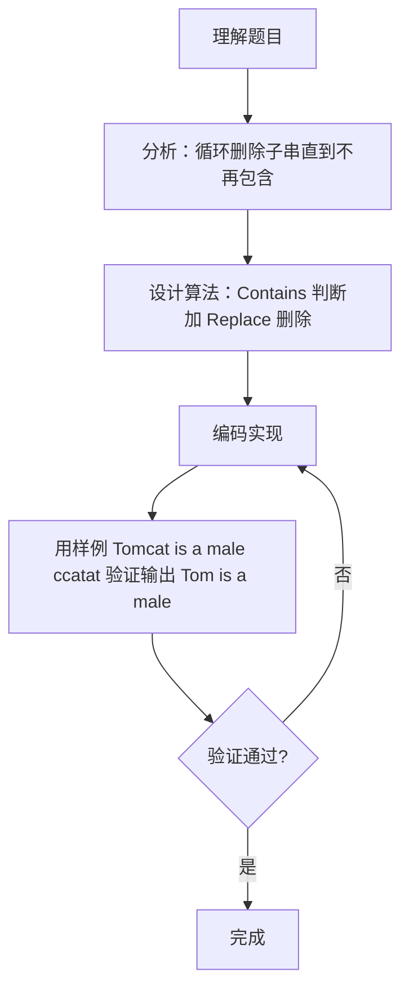

# 7-29 删除字符串中的子串（Go语言实现）

## 前言

这道题要求从字符串 S1 中删除所有出现的子串 S2。题目本身不复杂，但有一个关键陷阱：删除一个子串后，前后的字符可能拼接出新的 S2，因此必须循环查找、删除，直到 S1 中不再包含 S2 为止。

另一个需要注意的地方是输入：S1 中可能含有空格，用 fmt.Scan 无法读取完整的一行，需要借助 bufio 读取整行，并去掉两端的空白字符。

本题利用 Go 标准库的 strings.Contains 和 strings.Replace 实现循环删除，代码简洁且不易出错。

## 题目描述

输入2个字符串S1和S2，要求删除字符串S1中出现的所有子串S2，即结果字符串中不能包含S2。

## 输入格式

输入在2行中分别给出不超过80个字符长度的、以回车结束的2个非空字符串，对应S1和S2。

## 输出格式

在一行中输出删除字符串S1中出现的所有子串S2后的结果字符串。

## 输入样例

```in
Tomcat is a male ccatat
cat
```

## 输出样例

```out
Tom is a male 
```

## 解题思路

### 1. 抓住循环删除的关键

需要从主串 S1 中删除所有出现的子串 S2。难点在于删除一个子串后，前后的字符可能拼接出新的 S2（如样例中删除"cat"后，剩余字符拼接可能再次形成"cat"），因此必须循环查找删除，直到 S1 中不再包含 S2 为止。

### 2. 利用标准库实现删除

利用 Go 标准库的字符串处理函数：用 strings.Contains 判断 S1 中是否仍包含 S2；若包含，则用 strings.Replace(s1, s2, "", 1) 删除第一个匹配项并重新赋值给 S1。重复执行直到 Contains 返回 false，此时 S1 中不再含任何 S2。

### 3. 读取含空格的整行输入

S1 中可能含有空格（如样例 "Tomcat is a male ccatat"），fmt.Scan 按空白字符分割输入，无法读取完整的一行。需用 bufio.NewReader 的 ReadString('\n') 读取整行，再用 strings.TrimRight(s, "\r\n") 仅去掉行尾换行符，保留首尾空格。
## 完整代码

```go
package main
import (
	"bufio"
	"fmt"
	"os"
	"strings"
)
func main() {
	reader := bufio.NewReader(os.Stdin)
	s1, _ := reader.ReadString('\n')
	s2, _ := reader.ReadString('\n')
	s1 = strings.TrimRight(s1, "\r\n")
	s2 = strings.TrimRight(s2, "\r\n")
	if s2 == "" {
		fmt.Println(s1)
		return
	}
	for strings.Contains(s1, s2) {
		s1 = strings.Replace(s1, s2, "", 1)
	}
	fmt.Println(s1)
}
```

## 代码流程说明

1. 使用 bufio.NewReader 创建读取器，ReadString('\n') 读取第一行 s1 与第二行 s2（保留行内空格）。
2. 用 strings.TrimRight(s, "\r\n") 仅去掉行尾换行符，保留首尾空格。
3. 若 s2 为空则直接输出 s1 并结束，防止 Contains("", "") 恒真导致死循环。
4. for 循环条件为 strings.Contains(s1, s2)，当 s1 仍包含 s2 时，用 strings.Replace(s1, s2, "", 1) 删除第一个匹配项并重新赋值给 s1。
5. 循环结束后 s1 中不再包含 s2，fmt.Println 输出结果字符串。

## 代码流程图



## 解题流程图



## 代码解析

### 读取整行输入

```go
reader := bufio.NewReader(os.Stdin)
s1, _ := reader.ReadString('\n')
s2, _ := reader.ReadString('\n')
```

S1 可能包含空格，fmt.Scan 会以空白符为界截断。ReadString('\n') 读取直到换行符，可保留行内空格，再配合 TrimSpace 去掉两端的空白。

### 循环删除子串

```go
for strings.Contains(s1, s2) {
    s1 = strings.Replace(s1, s2, "", 1)
}
```

Contains 作为循环条件，只要 s1 中还包含 s2 就继续删除。Replace 的第四个参数 1 表示只替换第一个匹配项，每次删除后立即重新判断，从而捕获删除后拼接产生的新子串。

### 输出结果

```go
fmt.Println(s1)
```

循环结束后 s1 中不再包含任何 s2，直接输出即可，Println 自动换行。

## 复杂度分析

设 S1 的长度为 n，S2 的长度为 m：

- 时间复杂度：`O(n²/m)`。每次 Replace 需扫描并拼接字符串，代价与串长成正比；删除次数最多约 n/m 次，整体复杂度为 `O(n²/m)`。
- 空间复杂度：`O(n)`，每次 Replace 都会生成新的字符串，占用与原串长度相当的空间。

## 常见易错点

### 1. 忘记循环删除

只删除一次子串。例如样例中若只删除一次，S1 变为 "Tom is a male ccatat"，其中仍包含 "cat"（"ccatat" 中的后一个），输出错误。

### 2. 用 fmt.Scan 读取含空格的输入

fmt.Scan 按空白分割输入，读取 "Tomcat is a male ccatat" 只会得到 "Tomcat"。必须用 bufio 读取整行才能保留行内空格。

### 3. 不处理行末换行符

ReadString 读到的内容包含换行符，若不做 TrimSpace，S2 会带着换行符参与匹配，导致永远匹配不上，输出原串。

### 4. Replace 参数理解错误

strings.Replace(s, old, new, n) 的第四个参数 n 表示替换次数：n 为 1 时只替换第一个匹配项，n 为 -1 时替换所有匹配项。参数写错可能导致删除不彻底或一次删除过多。

## 更多测试

### 测试一：主串不含子串

输入：

```text
hello world
xyz
```

推演：Contains("hello world", "xyz") 为假，循环不执行，直接输出原串。输出：

```text
hello world
```

### 测试二：删除后拼接出新子串

输入：

```text
aaa
aa
```

推演：Contains("aaa","aa") 为真，删除第一个 "aa" 得 "a"；Contains("a","aa") 为假，循环结束。输出：

```text
a
```

### 测试三：删除后前后字符再次拼接成子串

输入：

```text
11a11
11
```

推演：Contains("11a11","11") 为真，删除第一个 "11" 得 "a11"；Contains("a11","11") 为真，删除 "11" 得 "a"。输出：

```text
a
```

## 总结

本题的核心是利用标准库完成"删除—检查—再删除"的循环过程，关键难点是删除后可能产生新的子串，必须循环到不再包含为止。此外，读取含空格的整行输入时应使用 bufio 而不是 fmt.Scan，这些细节共同构成了字符串处理类题目的通用要点。