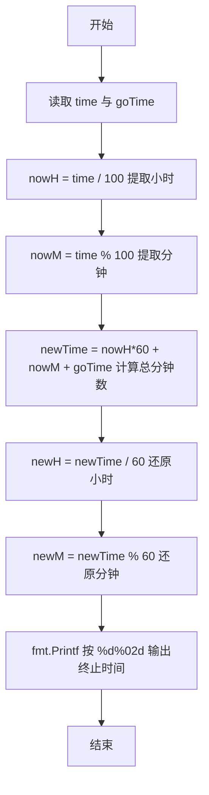
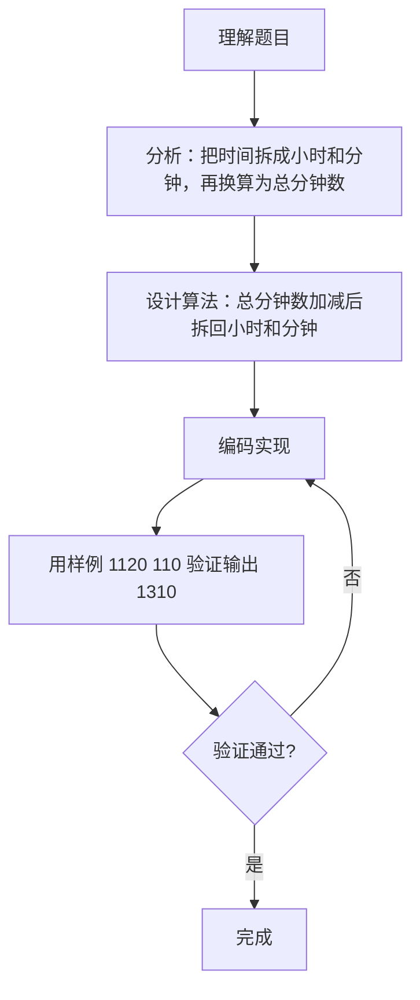

# 7-2 然后是几点（Go语言实现）

## 前言

这道题要求根据起始时间和流逝的分钟数计算出终止时间。起始时间用最多四位数字表示，比如 `1106` 表示 11 点零 6 分。

题目有两个细节容易出错：

1. 流逝的分钟数可能超过 60，也可能是负数，必须统一换算成分钟才能正确加减；
2. 输出时小时没有前导零，分钟不足两位要补零，格式必须精确控制。

核心策略是先把时间拆成小时和分钟，统一换算成从 0 点起的总分钟数，加减后再拆回小时和分钟，最后用 `%d%02d` 格式化输出。

## 题目描述

有时候人们用四位数字表示一个时间，比如 `1106` 表示 11 点零 6 分。现在，你的程序要根据起始时间和流逝的时间计算出终止时间。

读入两个数字，第一个数字以这样的四位数字表示当前时间，第二个数字表示分钟数，计算当前时间经过那么多分钟后是几点，结果也表示为四位数字。当小时为个位数时，没有前导的零，例如 5 点 30 分表示为 `530`；0 点 30 分表示为 `030`。注意，第二个数字表示的分钟数可能超过 60，也可能是负数。

## 输入格式

输入在一行中给出 2 个整数，分别是四位数字表示的起始时间、以及流逝的分钟数，其间以空格分隔。注意：在起始时间中，当小时为个位数时，没有前导的零，即 5 点 30 分表示为 `530`；0 点 30 分表示为 `030`。流逝的分钟数可能超过 60，也可能是负数。

## 输出格式

输出不多于四位数字表示的终止时间，当小时为个位数时，没有前导的零。题目保证起始时间和终止时间在同一天内。

## 输入样例

```in
1120 110
```

## 输出样例

```out
1310
```

## 解题思路

### 1. 解析起始时间

起始时间可能是 3 位数（如 `530` 表示 5 点 30 分）或 4 位数（如 `1120` 表示 11 点 20 分），但无论几位，用整除和取模都能正确提取：

- nowH = time / 100 得到小时
- nowM = time % 100 得到分钟

例如 `530`：530/100 = 5，530%100 = 30；`1120`：1120/100 = 11，1120%100 = 20。

### 2. 统一换算为总分钟数

流逝分钟数可能超过 60，也可能是负数，直接对时、分分别加减很麻烦。把起始时间换算成从 0 点起的总分钟数再加减，可以统一处理所有情况：

```text
newTime = nowH*60 + nowM + goTime
```

### 3. 还原终止时间

把总分钟数重新拆成小时和分钟：

- newH = newTime / 60
- newM = newTime % 60

题目保证起始时间和终止时间在同一天内，所以 newH 一定在 0 到 23 之间，不会出现负数。

### 4. 格式化输出

用 `%d%02d` 输出：小时部分 `%d` 不补前导零，分钟部分 `%02d` 不足两位自动补零。

## 完整代码

```go
// 题目：7-2 然后是几点
// 要求：输入四位数字表示的起始时间与流逝的分钟数，计算终止时间并按规定格式输出。
//
// 实现原理：
//   1. 用整除和取模把起始时间拆成小时 h 与分钟 m；
//   2. 统一换算为总分钟数 total = h*60 + m + elapsed，并用 %1440 处理跨天与负数；
//   3. 再把总分钟数拆回小时与分钟，用 %d%02d 格式化输出。
package main

import "fmt"

func main() {
	var start, elapsed int
	fmt.Scanf("%d %d", &start, &elapsed)
	h := start / 100
	m := start % 100
	total := h*60 + m + elapsed
	total %= 1440
	if total < 0 {
		total += 1440
	}
	fmt.Printf("%d%02d\n", total/60, total%60)
}
```
## 代码流程说明

1. 导入 fmt 包，声明 time（起始时间）与 goTime（流逝分钟数）两个整型变量。
2. 用 fmt.Scan 读取起始时间和流逝分钟数。
3. 用 time/100 整除提取小时 nowH，time%100 取模提取分钟 nowM。
4. 计算总分钟数 newTime = nowH*60 + nowM + goTime，无论正负、是否超过 60 都能正确累加。
5. 用 newTime/60 还原终止小时 newH，newTime%60 还原终止分钟 newM。
6. 用 fmt.Printf 输出，%d 输出小时，%02d 保证分钟为两位（不足补零）。
7. main 函数自然结束。

## 代码流程图



## 解题流程图



## 代码解析

### 解析起始时间

```go
nowH := time / 100
nowM := time % 100
```

整除 100 得到小时，取模 100 得到分钟。这个方法同时适用于 3 位和 4 位的起始时间，无需判断位数。

### 累加总分钟数

```go
newTime := nowH*60 + nowM + goTime
```

把起始时间统一换算成从 0 点起经过的分钟数，再与流逝分钟数相加。这样负数表示倒退、超过 60 表示跨小时，都由加减法统一处理，不需要分支判断。

### 格式化输出

```go
fmt.Printf("%d%02d\n", newH, newM)
```

%d 输出小时不带前导零；%02d 表示输出两位整数，不足两位用 0 补齐。例如 0 点 30 分输出 `030`，而 11 点 0 分输出 `1100`。

## 复杂度分析

该算法只进行固定次数的算术运算，与输入大小无关：

- 时间复杂度：`O(1)`，每次运行只做常数次整除、取模和加减运算；
- 空间复杂度：`O(1)`，只使用几个固定数量的变量。

## 常见易错点

### 1. 分钟部分漏掉前导零

输出必须使用 `%02d` 而不是 `%d`。例如起始时间 `1120`、流逝 40 分钟，newM = 0，若用 `%d%d` 输出会得到 `110`，正确结果是 `1100`。

### 2. 忘记处理负的流逝分钟数

流逝分钟数可能是负数，例如输入 `1120 -20`，表示 11 点 20 分倒退 20 分钟。newTime = 680 - 20 = 660，newH = 11、newM = 0，应输出 `1100`。若程序把 goTime 当作正数处理或提前判断大小，就会出错。本题保证终止时间与起始时间在同一天内，所以 newH 不会越界。

### 3. 小时部分错误地补了前导零

`%d` 不会补零，所以 6 点输出 `6xx` 而不是 `06xx`。若误用 `%02d` 输出小时，例如 9 点会输出 `09xx`，与题目要求的"小时为个位数时没有前导的零"不符。

## 更多测试

### 测试一：流逝分钟数恰好进位到整点

输入：

```text
530 30
```

输出：

```text
600
```

推演：nowH = 530/100 = 5，nowM = 530%100 = 30；newTime = 5*60 + 30 + 30 = 360；newH = 360/60 = 6，newM = 360%60 = 0，输出 `600`。

### 测试二：流逝分钟数为负数

输入：

```text
1120 -20
```

输出：

```text
1100
```

推演：nowH = 11，nowM = 20；newTime = 11*60 + 20 - 20 = 660；newH = 660/60 = 11，newM = 660%60 = 0，输出 `1100`。

### 测试三：从零点开始，分钟数不足一小时

输入：

```text
030 90
```

输出：

```text
200
```

推演：`030` 读入后为整数 30，nowH = 30/100 = 0，nowM = 30%100 = 30；newTime = 0 + 30 + 90 = 120；newH = 120/60 = 2，newM = 120%60 = 0，输出 `200`。

## 总结

本题的要点是把"时间"这个复合单位统一换算成总分钟数后再运算，从而把跨小时、倒退等情况全部简化为一次加减法。格式化输出时，小时和分钟分别用 `%d` 与 `%02d` 控制，即可满足题目对前导零的全部要求。这种"拆开换算、运算后还原"的思路在时间、日期等复合单位的题目中非常实用。