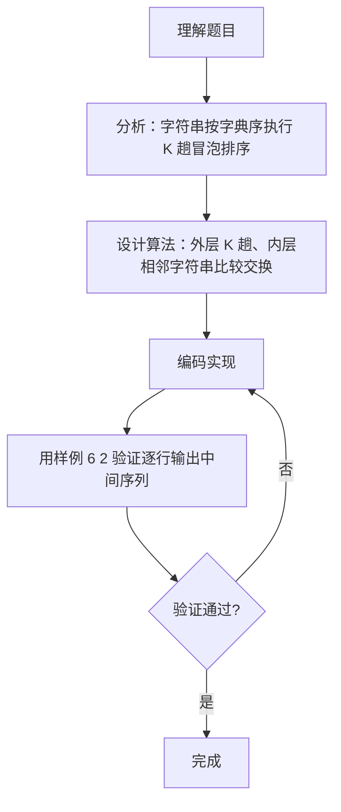

# 7-30 字符串的冒泡排序（Go语言实现）

## 前言

这道题把 7-27 的整数冒泡排序推广到字符串序列，要求按字典序从小到大排序，执行 K 趟扫描后输出中间结果。冒泡排序的思想完全不变，只是把整数比较换成字符串的字典序比较。

Go 语言中字符串可以直接使用关系运算符比较字典序，交换时用多重赋值即可完成，因此实现与整数版本几乎一致。

唯一需要特别注意的是输出格式：与整数版本的一行输出不同，本题要求每行输出一个字符串。

## 题目描述

我们已经知道了将N个整数按从小到大排序的冒泡排序法。本题要求将此方法用于字符串序列，并对任意给定的K（<N），输出扫描完第K遍后的中间结果序列。

## 输入格式

输入在第1行中给出N和K（1≤K<N≤100），此后N行，每行包含一个长度不超过10的、仅由小写英文字母组成的非空字符串。

## 输出格式

输出冒泡排序法扫描完第K遍后的中间结果序列，每行包含一个字符串。

## 输入样例

```in
6 2
best
cat
east
a
free
day
```

## 输出样例

```out
best
a
cat
day
east
free
```

## 解题思路

### 1. 将冒泡排序推广到字符串

冒泡排序的思想同样适用于字符串序列：每趟扫描将当前未排序部分字典序最大的字符串"冒泡"到末尾，只需把整数比较换成字符串比较。本题要求执行 K 趟排序后输出中间结果序列。

### 2. 字符串的比较与交换

Go 中字符串可以用关系运算符直接比较字典序：`strs[j] > strs[j+1]` 表示前者的字典序大于后者时需要交换。交换时使用多重赋值 `strs[j], strs[j+1] = strs[j+1], strs[j]`，无需临时变量。

### 3. 输入与输出的格式控制

用 fmt.Scan 读入 N 和 K，再逐行读入 N 个字符串存入 string 切片 strs。K 趟排序结束后逐行输出每个字符串（每行一个），这与整数冒泡排序的一行输出不同。
## 完整代码

```go
// 题目：7-30 字符串的冒泡排序
// 要求：输入 N 个字符串与趟数 K，按字典序从小到大执行 K 趟冒泡排序后输出中间结果序列。
//
// 实现原理：
//   1. 用 string 切片存储 N 个字符串，Go 的关系运算符可直接比较字符串的字典序；
//   2. 外层循环 i 控制趟数（共 K 趟），内层循环 j 从 0 到 N-1-i 比较相邻字符串；
//   3. 若 strs[j] > strs[j+1] 则用多重赋值交换两者，使字典序较大的字符串后移；
//   4. 排序结束后逐行输出每个字符串。
package main

import "fmt"

func main() {
	var n, k int
	fmt.Scan(&n, &k)

	strs := make([]string, n)
	for i := 0; i < n; i++ {
		fmt.Scan(&strs[i])
	}

	for i := 0; i < k; i++ {
		for j := 0; j < n-1-i; j++ {
			if strs[j] > strs[j+1] {
				strs[j], strs[j+1] = strs[j+1], strs[j]
			}
		}
	}

	for i := 0; i < n; i++ {
		fmt.Println(strs[i])
	}
}
```

## 代码流程说明

1. fmt.Scan 读入 n 和 k，然后逐行读入 n 个字符串存入 string 切片 strs。
2. 外层循环 i 从 0 到 k-1，共执行 k 趟；内层循环 j 从 0 到 n-1-i，用字符串比较运算符比较相邻两个字符串的字典序。
3. 若 strs[j] > strs[j+1] 表示前串字典序大于后串，使用 Go 多重赋值交换两者位置。
4. 遍历 string 切片，每行用 fmt.Println 输出一个字符串，即 K 趟排序后的中间结果。

## 代码流程图

```mermaid
flowchart TD
    A[开始] --> B[fmt.Scan 读入 n, k]
    B --> C[逐行读入 n 个字符串到 strs 切片]
    C --> D[i = 0]
    D --> E{"i < k?"}
    E -- 是 --> F[j = 0]
    F --> G{"j < n-1-i?"}
    G -- 是 --> H{"strs[j] > strs[j+1]?"}
    H -- 是 --> I[多重赋值交换两字符串]
    H -- 否 --> J[j++]
    I --> J
    J --> G
    G -- 否 --> K[i++]
    K --> E
    E -- 否 --> L[i = 0]
    L --> M{"i < n?"}
    M -- 是 --> N[fmt.Println 输出 strs[i]]
    N --> O[i++]
    O --> M
    M -- 否 --> P[结束]
```

## 解题流程图



## 代码解析

### 字符串的字典序比较

```go
if strs[j] > strs[j+1] {
```

Go 的关系运算符可直接用于字符串，按字典序比较（逐字符比较编码值）。这比整数比较更直观地完成了"前串字典序大于后串则交换"的判定。

### 多重赋值交换

```go
strs[j], strs[j+1] = strs[j+1], strs[j]
```

Go 语言的多重赋值会先计算右侧的值再写入左侧变量，不需要临时变量即可完成两个字符串的交换。

### 逐行输出

```go
for i := 0; i < n; i++ {
    fmt.Println(strs[i])
}
```

题目要求每行输出一个字符串，因此用 Println 逐个输出，与整数序列的一行输出不同。

## 复杂度分析

设输入的字符串个数为 n：

- 时间复杂度：`O(K×n)`。第 i 趟内层最多比较 n-1-i 次，K 趟共约 `K×n - K×(K+1)/2` 次字符串比较；本题每个字符串长度不超过 10，字符串比较本身可视为常数时间。当 K 接近 n 时退化为 `O(n²)`。
- 空间复杂度：`O(n×L)`，其中 L 为字符串最大长度（≤10），用于存储 n 个字符串；交换在切片内完成，无额外空间开销。

## 常见易错点

### 1. 输出格式错误

与整数冒泡排序的一行输出不同，本题要求每行输出一个字符串。若把所有字符串用空格连接成一行输出，格式错误。

### 2. 比较方向写反

若把条件写成 strs[j] < strs[j+1]（即前串较小不交换、较大才交换），K 趟后得到的是字典序降序结果，与题目要求的升序不符。

### 3. 内层循环上界错误

内层上界应为 n-1-i。若写成 n-i，当 i=0 时 j 最大为 n-1，访问 strs[j+1] 即 strs[n] 会导致切片越界。

### 4. 字典序比较的直觉误区

前缀相同的字符串，较短者字典序较小。例如 "ab" < "abc"。若用字符串长度先比较再比较内容，会得到错误结果；直接使用 Go 的关系运算符即可保证正确的字典序。

## 更多测试

### 测试一：两个字符串交换

输入：

```text
2 1
b
a
```

推演：第 1 趟（i=0，j 从 0 到 0）："b" > "a" 成立，交换得 ["a","b"]。逐行输出：

```text
a
b
```

### 测试二：已按字典序有序

输入：

```text
3 2
a
b
c
```

推演：两趟均无任何交换，序列保持不变。输出：

```text
a
b
c
```

### 测试三：前缀相同的字符串比较

输入：

```text
3 1
abc
ab
b
```

推演：第 1 趟（i=0，j 从 0 到 1）：j=0 时 "abc" 与 "ab" 比较，前两个字符相同而 "abc" 更长，故 "abc" > "ab"，交换得 ["ab","abc","b"]；j=1 时 "abc" 与 "b" 比较，'a' < 'b'，不交换。输出：

```text
ab
abc
b
```

## 总结

本题把冒泡排序从整数推广到字符串，核心不变——相邻元素比较、按需交换、K 趟后输出中间结果。区别在于比较规则换成字典序、输出方式改为逐行，体现了排序算法与数据类型解耦的思想。Go 语言的字符串关系运算与多重赋值让实现变得非常简洁。