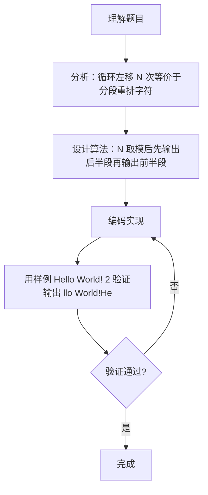

# 7-31 字符串循环左移（Go语言实现）

## 前言

这道题要求把字符串循环左移 N 次。例如 "Hello World!" 左移 2 次，就是把前 2 个字符 "He" 移动到末尾，得到 "llo World!He"。

直接模拟逐个移动字符效率不高，而且当 N 大于等于字符串长度时还需要考虑取模。更巧妙的做法是：对 N 取模后，把字符串分成前后两段，先输出后半段、再输出前半段，就等效地完成了循环左移。

实现时需要注意两个细节：字符串可能含空格，要用整行读取；读取的内容包含换行符，处理前需要先去掉。

## 题目描述

输入一个字符串和一个非负整数N，要求将字符串循环左移N次。

## 输入格式

输入在第1行中给出一个不超过100个字符长度的、以回车结束的非空字符串；第2行给出非负整数N。

## 输出格式

在一行中输出循环左移N次后的字符串。

## 输入样例

```in
Hello World!
2
```

## 输出样例

```out
llo World!He
```

## 解题思路

### 1. 理解循环左移的实质

循环左移 N 次的本质是把字符串前 N 个字符移动到字符串末尾。例如 "Hello World!" 左移 2 次，就是把前 2 个字符 "He" 移动到末尾，得到 "llo World!He"。这与字符串的整体旋转是等价的。

### 2. 用取模处理移动次数

循环左移 N 次与循环左移 N % length 次效果相同。当 N 大于等于字符串长度时，先对 N 取模，避免重复移动。例如长度 4 的字符串左移 6 次等价于左移 2 次。

### 3. 分段输出实现左移

将字符串分为 [0, N) 和 [N, length) 两段。先输出 [N, length) 部分，再输出 [0, N) 部分，即可得到循环左移 N 次的结果，不需要真正搬移字符。该方法时间复杂度 O(length)，空间开销小。

### 4. 整行读取与换行处理

字符串可能含空格（如 "Hello World!"），需用 bufio.NewReader 的 ReadString('\n') 读取整行，再判断并去掉末尾的换行符，否则换行符会被当作字符参与左移。
## 完整代码

```go
// 题目：7-31 字符串循环左移
// 要求：输入字符串 s 与左移位数 n，将 s 循环左移 n 位后输出。
//
// 实现原理（切片拼接）：
//   1. 左移 n 位等价于：把前 n 个字符移到末尾；
//   2. 用 s[n:] 取后半段、s[:n] 取前半段，拼接成 s[n:] + s[:n]；
//   3. 先对 n 取模 len(s)（左移超过长度时等效取余），避免越界。
package main

import (
	"bufio"
	"fmt"
	"os"
	"strings"
)

func main() {
	reader := bufio.NewReader(os.Stdin)
	s, _ := reader.ReadString('\n')
	s = strings.TrimRight(s, "\r\n")
	if len(s) == 0 {
		fmt.Println("")
		return
	}
	var n int
	fmt.Fscan(reader, &n)
	n = n % len(s)
	if n < 0 {
		n += len(s)
	}
	result := s[n:] + s[:n]
	fmt.Println(result)
}
```

## 代码流程说明

1. 导入 fmt、bufio、os 包，用于输入输出。
2. 使用 bufio.NewReader(os.Stdin).ReadString('\n') 读取整行字符串（可包含空格）存入变量 s。
3. 将 string 转为 []byte 切片 sBytes，若末尾为换行符则截断并更新长度。
4. 使用 fmt.Scan 读取整数 N。
5. 对 N 取模：n = n % length，当 N ≥ length 时只需移动余数次。
6. 循环从 i = n 到 i < length，依次输出 sBytes[i]，即被移到前面的部分。
7. 循环从 i = 0 到 i < n，依次输出 sBytes[i]，即被移到后面的前 n 个字符。
8. fmt.Println 输出换行符，main 函数自然结束。

## 代码流程图

```mermaid
flowchart TD
    A[开始] --> B[读取字符串到 s]
    B --> C[sBytes = []byte(s)]
    C --> D[length = len(sBytes)]
    D --> E{"sBytes[length-1] == '\n'?"}
    E -- 是 --> F[截断换行符, length 减 1]
    E -- 否 --> G[fmt.Scan 读入 n]
    F --> G
    G --> H["n = n % length"]
    H --> I[i = n]
    I --> J{"i < length?"}
    J -- 是 --> K[fmt.Printf 输出 sBytes[i]]
    K --> L[i++]
    L --> J
    J -- 否 --> M[i = 0]
    M --> N{"i < n?"}
    N -- 是 --> O[fmt.Printf 输出 sBytes[i]]
    O --> P[i++]
    P --> N
    N -- 否 --> Q[fmt.Println 换行]
    Q --> R[结束]
```

## 解题流程图



## 代码解析

### 读取整行并处理换行符

```go
s, _ := reader.ReadString('\n')
sBytes := []byte(s)
length := len(sBytes)
if length > 0 && sBytes[length-1] == '\n' {
    sBytes = sBytes[:length-1]
    length--
}
```

ReadString 读取的内容包含末尾换行符，需先判断并截断，否则换行符会被当作字符串的一部分参与左移，导致结果错误。

### N 对长度取模

```go
n = n % length
```

循环左移 N 次与左移 N % length 次效果相同。例如 length=4 时左移 6 次等价于左移 2 次，取模避免了无意义的重复移动，也处理了 N 大于等于长度的情况。

### 分段输出

```go
for i := n; i < length; i++ {
    fmt.Printf("%c", sBytes[i])
}
for i := 0; i < n; i++ {
    fmt.Printf("%c", sBytes[i])
}
```

先输出后半段 [n, length)，再输出前半段 [0, n)，两部分拼接即为循环左移 n 次后的字符串。使用 %c 逐字符输出，避免字符串拼接带来的额外开销。

## 复杂度分析

设字符串的长度为 n：

- 时间复杂度：`O(n)`。取模运算为 O(1)，两段遍历总共访问每个字符恰好一次。
- 空间复杂度：`O(n)`，将字符串转为 []byte 切片需要与串长相当的空间。

## 常见易错点

### 1. 忘记去掉末尾换行符

ReadString 读入的字符串以 '\n' 结尾。若不处理，换行符会被当作字符参与取模和左移，且 Println 还会再输出一个换行，导致结果中混入多余换行。必须先截断换行符。

### 2. 忽略 N 大于等于字符串长度的情况

若不对 N 取模，例如 length=3、N=5，直接按下标 5 开始输出 sBytes 会越界。先取模 n = 5 % 3 = 2 后，两段下标都落在 [0, length) 范围内。

### 3. 两段输出顺序颠倒

若先输出前 n 个字符再输出后半段，得到的是原字符串（先 [0,n) 再 [n,length) 即原顺序），无法实现左移。必须先输出 [n, length) 再输出 [0, n)。

### 4. 用 fmt.Scan 读取含空格的字符串

输入 "Hello World!" 含空格，fmt.Scan 只能读到 "Hello"。必须用 bufio 的 ReadString 读取整行，才能保留行内空格。

## 更多测试

### 测试一：N 为 0

输入：

```text
Hello World!
0
```

推演：length=12，n = 0 % 12 = 0。第一段循环 i 从 0 到 11 输出全部字符 "Hello World!"，第二段不执行。输出：

```text
Hello World!
```

### 测试二：N 大于字符串长度

输入：

```text
abcd
6
```

推演：length=4，n = 6 % 4 = 2。先输出 sBytes[2..3]="cd"，再输出 sBytes[0..1]="ab"，拼接得 "cdab"。输出：

```text
cdab
```

### 测试三：N 等于字符串长度

输入：

```text
abc
3
```

推演：length=3，n = 3 % 3 = 0。第一段循环输出全部字符 "abc"，第二段不执行，输出原串。输出：

```text
abc
```

## 总结

循环左移的核心是"取模 + 分段输出"，把移动操作转化为输出顺序的调整，避免了逐个移动字符的 O(N×length) 开销。同时要注意整行读取、去掉换行符、对 N 取模三个细节，这些是字符串处理类题目的通用要点。