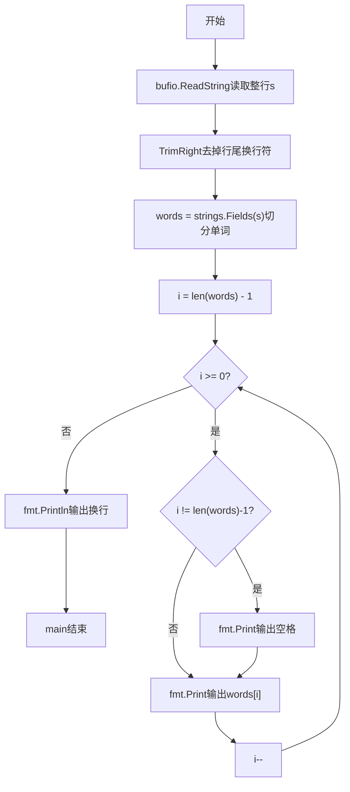
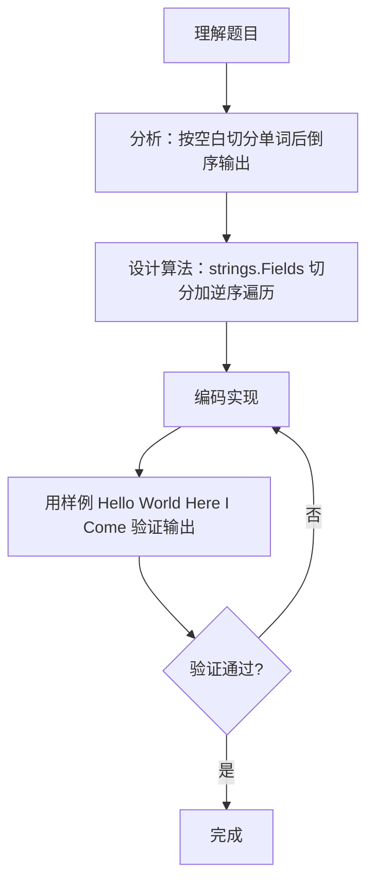

# 7-32 说反话-加强版（Go语言实现）

## 前言

这道题要求把一句英语中的单词顺序颠倒后输出。句子中的单词之间可能隔着多个连续空格，但输出时每个单词之间只能保留一个空格，例如 "Hello World   Here I Come" 应输出为 "Come I Here World Hello"。

题目有两个易错点：一是输入的字符串可能较长且带行尾换行符，需要先读取整行并去掉换行；二是单词之间的多个连续空格必须在切分阶段被吞掉，输出阶段不能产生多余空格。

采用 strings.Fields 按任意空白字符切分单词，再从后向前遍历输出，可以同时解决连续空格与首尾空白两个问题。

## 题目描述

给定一句英语，要求你编写程序，将句中所有单词的顺序颠倒输出。

## 输入格式

测试输入包含一个测试用例，在一行内给出总长度不超过500 000的字符串。字符串由若干单词和若干空格组成，其中单词是由英文字母（大小写有区分）组成的字符串，单词之间用若干个空格分开。

## 输出格式

每个测试用例的输出占一行，输出倒序后的句子，并且保证单词间只有1个空格。

## 输入样例

```in
Hello World   Here I Come
```

## 输出样例

```out
Come I Here World Hello
```

## 解题思路

### 1. 核心问题分析

本题要求将句子中的单词顺序颠倒输出，需要处理两个关键点：一是单词之间可能有多个连续空格，二是输出时单词间只能有一个空格。例如输入"Hello World   Here I Come"，共有5个单词，倒序输出即从最后一个单词"Come"开始依次向前输出。

### 2. 算法原理说明

采用"按空白切分，倒序输出"的策略：

1. **切分阶段**：用 strings.Fields 按任意空白字符把整句切分成单词切片，自动吞掉连续空格和首尾空白，无需手动扫描。
2. **倒序输出阶段**：从最后一个单词倒序遍历到第一个，依次输出。除第一个输出的单词（即原句最后一个单词）外，每个单词前先输出一个空格，保证单词间只有一个空格。

### 3. 具体计算步骤

1. 用 bufio.NewReader 读取整行字符串 s。
2. 用 strings.TrimRight 去掉行尾的 \r 和 \n 换行符。
3. 用 strings.Fields(s) 按空白切分出单词切片 words。
4. 从 j = len(words)-1 倒序到 j = 0：
   - 若 j 不是最后一个单词的下标（即不是第一个输出的单词），先输出一个空格
   - 输出当前单词 words[j]
5. 输出换行符。

## 完整代码

```go
// 题目：7-32 说反话-加强版
// 要求：输入一句英文，将各单词倒序输出（保持单词内部顺序不变），单词间以单个空格分隔。
//
// 实现原理：
//   1. 用 strings.Fields 按空白切分出单词数组（自动处理多余空格）；
//   2. 从最后一个单词倒序遍历到第一个，依次输出，非首词前补一个空格。
package main

import (
	"fmt"
	"io"
	"os"
	"strings"
)

func main() {
	data, _ := io.ReadAll(os.Stdin)
	s := strings.TrimRight(string(data), "\r\n")
	words := strings.Fields(s) // 切分单词
	for i := len(words) - 1; i >= 0; i-- { // 逆序输出
		if i != len(words)-1 {
			fmt.Print(" ")
		}
		fmt.Print(words[i])
	}
	fmt.Println()
}
```

## 代码流程说明

1. 使用 io.ReadAll(os.Stdin) 读取全部输入字符串 s（可包含空格，支持 500k 超长行）。
2. 用 strings.TrimRight(s, "\r\n") 去掉行尾换行符。
3. 用 strings.Fields(s) 按任意空白字符切分出单词切片 words，自动处理连续空格。
4. for 循环 i 从 len(words)-1 递减到 0，若 i != len(words)-1（非第一个输出的单词）先 fmt.Print 输出一个空格，再 fmt.Print 输出 words[i]。
5. fmt.Println 输出换行，main 函数自然结束。

## 代码流程图



## 解题流程图



## 代码解析

### 读取并清理整行输入

```go
reader := bufio.NewReader(os.Stdin)
s, _ := reader.ReadString('\n')
s = strings.TrimRight(s, "\r\n")
```

ReadString 读取到换行符为止，返回的字符串末尾带有 \n，在 Windows 环境下还可能带有 \r。用 strings.TrimRight 把它们去掉，避免换行符混入最后一个单词。

### 按空白切分单词

```go
words := strings.Fields(s) // 切分单词
```

strings.Fields 以任意空白字符（空格、制表符等）作为分隔符，把字符串切成单词切片，连续多个空格以及首尾空白都会被自动忽略，无需手动扫描处理。

### 倒序输出单词

```go
for i := len(words) - 1; i >= 0; i-- { // 逆序输出
	if i != len(words)-1 {
		fmt.Print(" ")
	}
	fmt.Print(words[i])
}
```

从最后一个单词向前遍历到第一个。除第一个输出的单词（原句最后一个单词）外，其余每个单词前先输出一个空格，从而保证输出句子中单词之间只有一个空格。

## 复杂度分析

设输入字符串长度为 n（即包含 n 个字符），切分出的单词数为 w：

- 时间复杂度：O(n)，strings.Fields 切分与倒序输出各做一次线性扫描；
- 空间复杂度：O(w)，words 切片需要存储 w 个单词字符串。

## 常见易错点

### 1. 用 strings.Split 按单个空格切分

若误用 strings.Split(s, " ") 代替 strings.Fields，连续多个空格会产生空字符串元素，导致倒序输出时单词间出现多余空格：

```text
输入：a  b（a 与 b 之间有两个空格）
错误输出：b  a（中间仍有两个空格）
正确输出：b a
```

### 2. 倒序循环边界越界

若把循环写成 for i := len(words); i > 0; i--，第一次迭代 i = len(words) 会越界访问 words[len(words)]，且下标 0 的单词永远不会被输出。循环应从 len(words)-1 开始，以 i >= 0 为继续条件。

### 3. 首个输出的单词前多打空格

若去掉 if i != len(words)-1 判断，无条件先输出空格再输出单词，句首的单词前会多出一个空格：

```text
输入：Hello World
错误输出： World Hello（行首多一个空格）
正确输出：World Hello
```

## 更多测试

### 测试一：单词间多个连续空格

输入：

```text
I   am   a   student
```

输出：

```text
student a am I
```

### 测试二：只有一个单词

输入：

```text
Hello
```

输出：

```text
Hello
```

### 测试三：句子首尾带空格

输入：

```text
   Hello   World   
```

输出：

```text
World Hello
```

## 总结

本题的核心是"按空白切分、倒序输出"。用 strings.Fields 一次性解决连续空格与首尾空白问题，再通过"非首词前补空格"的写法保证单词间恰好只有一个空格。借助标准库切分函数处理空白、统一处理输出分隔的思路，同样适用于单词统计、句子重组等字符串处理题目。