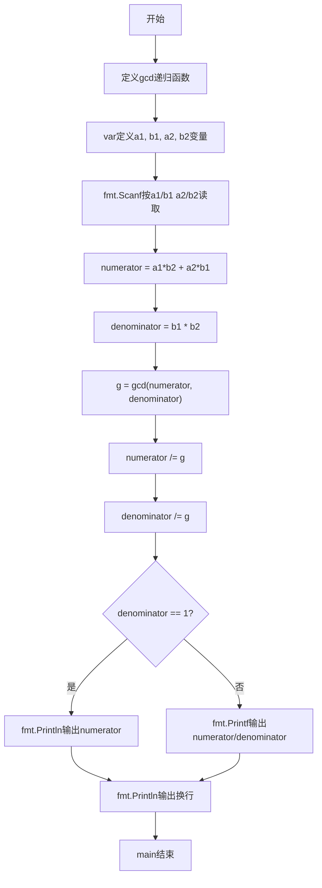
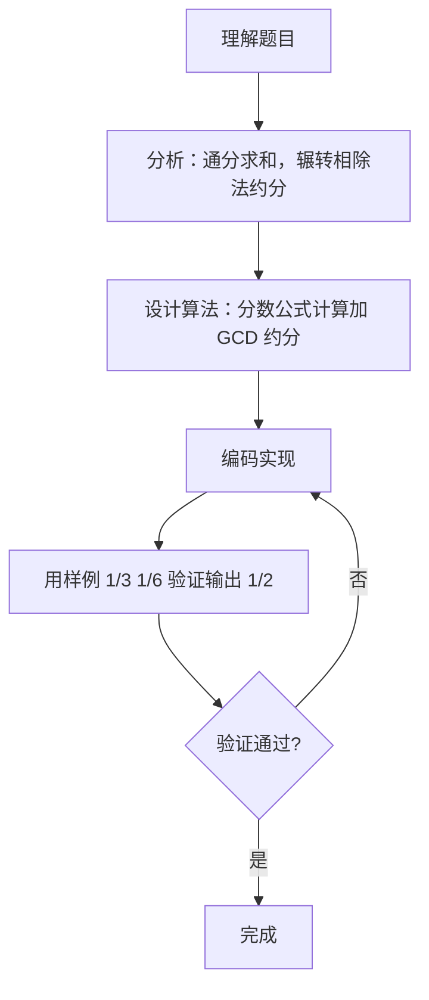

# 7-33 有理数加法（Go语言实现）

## 前言

这道题要求计算两个有理数的和，并以最简分数形式输出。例如 1/3 + 1/6 通分后为 9/18，约分得到 1/2；若结果的分母为 1，则只输出分子。

题目有两个易错点：一是输入带有斜杠，需要按 a1/b1 a2/b2 的格式解析出四个整数；二是输出前必须约分，否则结果不是最简分数，分母为 1 时也不能再输出斜杠形式。

采用"通分求和 + 辗转相除法约分"的策略，先算出未约分的分子分母，再求最大公约数完成约分，最后按分母是否为 1 决定输出格式。

## 题目描述

本题要求编写程序，计算两个有理数的和。

## 输入格式

输入在一行中按照a1/b1 a2/b2的格式给出两个分数形式的有理数，其中分子和分母全是整形范围内的正整数。

## 输出格式

在一行中按照a/b的格式输出两个有理数的和。注意必须是该有理数的最简分数形式，若分母为1，则只输出分子。

## 输入样例1

```in
1/3 1/6
```

## 输出样例1

```out
1/2
```

## 输入样例2

```in
4/3 2/3
```

## 输出样例2

```out
2
```

## 解题思路

### 1. 核心问题分析

本题需要计算两个分数的和并输出最简形式。核心难点在于：一是正确解析带斜杠的输入格式（如"1/3 1/6"），二是分数相加后的约分处理。例如1/3 + 1/6 = 6/18 + 3/18 = 9/18，约分后为1/2。

### 2. 算法原理说明

1. **分数加法公式**：a1/b1 + a2/b2 = (a1×b2 + a2×b1) / (b1×b2)
2. **约分算法**：使用辗转相除法（欧几里得算法）求分子和分母的最大公约数（GCD），然后分子分母同时除以GCD得到最简分数。
3. **辗转相除法原理**：gcd(a, b) = gcd(b, a mod b)，当b=0时a即为最大公约数。

### 3. 具体计算步骤

1. 按"a1/b1 a2/b2"格式读取两个分数的分子和分母。
2. 计算通分后的分子：numerator = a1×b2 + a2×b1。
3. 计算通分后的分母：denominator = b1×b2。
4. 求分子和分母的最大公约数 g = gcd(numerator, denominator)。
5. 约分：numerator /= g，denominator /= g。
6. 若分母为1，只输出分子；否则输出"分子/分母"格式。

## 完整代码

```go
// 题目：7-33 有理数加法
// 要求：输入两个有理数 a1/b1、a2/b2，求它们的和并化为最简分数输出。
//
// 实现原理（分数加法 + 约分）：
//   1. 分数加法公式：a1/b1 + a2/b2 = (a1·b2 + a2·b1) / (b1·b2)；
//   2. 用 int64 避免乘法溢出；
//   3. 求分子分母的最大公约数 gcd，同除以 gcd 得最简形式；
//   4. 若分母为 1 则只输出整数。
package main

import (
	"bufio"
	"fmt"
	"os"
	"strings"
)

func gcd(a, b int64) int64 {
	if b == 0 {
		return a
	}
	return gcd(b, a%b)
}

func main() {
	reader := bufio.NewReader(os.Stdin)
	input, _ := reader.ReadString('\n')
	input = strings.TrimRight(input, "\r\n")

	parts := strings.Split(input, " ")
	f1 := strings.Split(parts[0], "/")
	f2 := strings.Split(parts[1], "/")

	var a1, b1, a2, b2 int64
	fmt.Sscanf(f1[0], "%d", &a1)
	fmt.Sscanf(f1[1], "%d", &b1)
	fmt.Sscanf(f2[0], "%d", &a2)
	fmt.Sscanf(f2[1], "%d", &b2)

	numerator := a1*b2 + a2*b1   // 通分相加的分子
	denominator := b1 * b2       // 通分后的分母

	g := gcd(numerator, denominator)
	numerator /= g
	denominator /= g

	if denominator == 1 {
		fmt.Println(numerator) // 整数结果
	} else {
		fmt.Printf("%d/%d\n", numerator, denominator)
	}
}
```

## 代码流程说明

1. 用 bufio.NewReader 读取整行输入，用 TrimRight 去掉行尾换行符。
2. 按空格拆分得到两个分数的字符串，再按斜杠 "/" 拆出各自的分子和分母。
3. 用 fmt.Sscanf 分别解析 a1、b1、a2、b2 四个整数（int64）。
4. 按分数加法公式计算通分后的分子和分母。
5. 调用 gcd 函数求分子分母的最大公约数。
6. 分子分母分别除以最大公约数完成约分。
7. 判断分母是否为 1，选择只输出分子或按 "a/b" 格式输出。
8. main 函数自然结束。

## 代码流程图



## 解题流程图



## 代码解析

### 解析带斜杠的输入

```go
fmt.Scanf("%d/%d %d/%d", &a1, &b1, &a2, &b2)
```

格式串中的 %d/%d 会依次匹配数字、斜杠、数字，把一行输入 a1/b1 a2/b2 解析为四个整数，无需手动拆分子分母。

### 通分求和

```go
numerator := a1*b2 + a2*b1
denominator := b1 * b2
```

按分数加法公式 a1/b1 + a2/b2 = (a1×b2 + a2×b1)/(b1×b2) 计算，得到未约分的和。

### 辗转相除法求最大公约数

```go
func gcd(a, b int) int {
    if a < 0 {
        a = -a
    }
    if b < 0 {
        b = -b
    }
    if b == 0 {
        return a
    }
    return gcd(b, a%b)
}
```

递归实现 gcd(a, b) = gcd(b, a mod b)，b 为 0 时返回 a。开头对负数取绝对值，保证约分过程正确；本题输入分子分母均为正整数，这一处理是为通用性考虑。

### 约分并输出

```go
g := gcd(numerator, denominator)
numerator /= g
denominator /= g

if denominator == 1 {
    fmt.Println(numerator)
} else {
    fmt.Printf("%d/%d\n", numerator, denominator)
}
```

分子分母同除以最大公约数得到最简分数；最后判断分母是否为 1，决定只输出分子还是按 "a/b" 格式输出。

## 复杂度分析

设输入分数分子分母的最大值为 m：

- 时间复杂度：O(log m)，瓶颈是辗转相除法求最大公约数，迭代次数不超过 O(log m)；
- 空间复杂度：O(1)，仅需常数个整数变量（递归版 gcd 的调用栈深度为 O(log m)）。

## 常见易错点

### 1. 用 fmt.Scan 读取带斜杠的输入

若用 fmt.Scan(&a1, &b1, &a2, &b2) 读取，扫描 "1/3" 时只能读走数字 1，遇到斜杠解析失败，剩余变量保持零值，计算结果必然错误：

```text
输入：1/3 1/6
错误做法：fmt.Scan(&a1, &b1, &a2, &b2) 解析失败
正确做法：fmt.Scanf("%d/%d %d/%d", &a1, &b1, &a2, &b2)
```

### 2. 忘记约分

输出前若不求最大公约数约分，会输出非最简分数：

```text
输入：1/3 1/6
错误输出：9/18
正确输出：1/2
```

### 3. 分母为 1 时仍输出斜杠形式

```text
输入：4/3 2/3
错误输出：2/1
正确输出：2
```

### 4. 求 gcd 时用错操作数

约分必须对计算后的分子、分母求最大公约数。若误写为 g := gcd(a1, a2)（取原始输入的分子），约分无效，输出仍是未化简的分数。

## 更多测试

### 测试一：同分母分数相加

输入：

```text
1/5 2/5
```

输出：

```text
3/5
```

### 测试二：约分后分母为 1

输入：

```text
1/2 1/2
```

输出：

```text
1
```

### 测试三：异分母分数相加

输入：

```text
2/3 1/6
```

输出：

```text
5/6
```

## 总结

本题的核心是"通分求和 + 辗转相除法约分"。先按分数加法公式算出未约分的分子分母，再用欧几里得算法求出最大公约数完成约分，最后根据分母是否为 1 选择输出格式。辗转相除法是分数运算、最大公约数类题目的通用工具，熟练掌握后可以复用到有理数均值等问题中。
