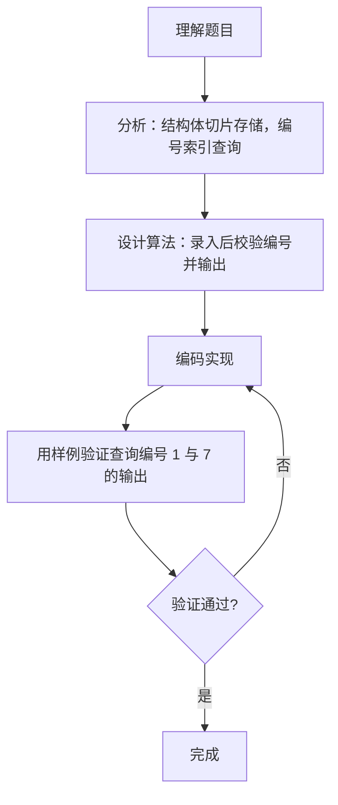

# 7-34 通讯录的录入与显示（Go语言实现）

## 前言

这道题要求先录入 N 条通讯录记录，再根据若干查询编号输出对应记录。每条记录包含姓名、生日、性别、固定电话、移动电话五个字段，需要先全部存下来再按编号取用。

题目有两个易错点：一是输出字段的顺序与输入顺序不同（输入为姓名-生日-性别-固话-手机，输出为姓名-固话-手机-性别-生日），照抄输入顺序会出错；二是查询编号可能超出范围，必须输出 Not Found。

采用结构体切片存储记录，查询时直接用编号作为下标访问，再按题目要求的顺序打印字段即可。

## 题目描述

通讯录中的一条记录包含下述基本信息：朋友的姓名、出生日期、性别、固定电话号码、移动电话号码。
本题要求编写程序，录入N条记录，并且根据要求显示任意某条记录。

## 输入格式

输入在第一行给出正整数N（≤10）；随后N行，每行按照格式姓名 生日 性别 固话 手机给出一条记录。其中姓名是不超过10个字符、不包含空格的非空字符串；生日按yyyy/mm/dd的格式给出年月日；性别用M表示"男"、F表示"女"；固话和手机均为不超过15位的连续数字，前面有可能出现+。

在通讯录记录输入完成后，最后一行给出正整数K，并且随后给出K个整数，表示要查询的记录编号（从0到N−1顺序编号）。数字间以空格分隔。

## 输出格式

对每一条要查询的记录编号，在一行中按照姓名 固话 手机 性别 生日的格式输出该记录。若要查询的记录不存在，则输出Not Found。

## 输入样例

```in
3
Chris 1984/03/10 F +86181779452 13707010007
LaoLao 1967/11/30 F 057187951100 +8618618623333
QiaoLin 1980/01/01 M 84172333 10086
2 1 7
```

## 输出样例

```out
LaoLao 057187951100 +8618618623333 F 1967/11/30
Not Found
```

## 解题思路

### 1. 核心问题分析

本题需要实现通讯录的录入与查询功能。核心要点有三：一是用合适的数据结构存储多条记录（包含姓名、生日、性别、固话、手机5个字段）；二是按正确顺序输出字段（注意输出顺序与输入顺序不同：输入是姓名-生日-性别-固话-手机，输出是姓名-固话-手机-性别-生日）；三是处理无效查询编号，输出Not Found。

### 2. 算法原理说明

采用结构体数组+索引查询的方案：

1. **数据结构设计**：定义Contact结构体，包含5个字段分别存储一条记录的各项信息。
2. **录入阶段**：读取N后，循环N次按输入顺序读取5个字段存入结构体数组对应下标的元素。
3. **查询阶段**：读取K后，循环K次读取查询编号idx。若idx在[0, N)范围内，则按输出顺序读取并打印对应结构体的字段；否则输出"Not Found"。

### 3. 具体计算步骤

1. 读取正整数N（通讯录记录条数）。
2. 循环i从0到N-1：
   - 依次读取姓名、生日、性别、固话、手机，存入contacts[i]的对应字段。
3. 读取正整数K（查询次数），随后读取K个查询编号。
4. 循环处理K个查询：
   - 读取查询编号idx；
   - 判断idx >= 0 且 idx < N？
     - 是：按"姓名 固话 手机 性别 生日"顺序输出；
     - 否：输出"Not Found"。

## 完整代码

```go
// 题目：7-34 通讯录的录入与显示
// 要求：录入 N 条通讯录记录，再根据 K 个查询编号按"姓名 固话 手机 性别 生日"格式输出，编号无效时输出 Not Found。
//
// 实现原理：
//   1. 定义 Contact 结构体封装 5 个字段，用 make 创建长度为 N 的结构体切片；
//   2. 录入阶段按"姓名 生日 性别 固话 手机"顺序读取并存入对应下标；
//   3. 查询阶段校验编号是否在 [0, N) 内，合法则按输出顺序打印，否则输出 Not Found。
package main

import "fmt"

type Contact struct {
	name        string
	birthday    string
	gender      byte
	fixedPhone  string
	mobilePhone string
}

func main() {
	var n int
	fmt.Scan(&n)

	contacts := make([]Contact, n)
	for i := 0; i < n; i++ {
		var gender string
		fmt.Scan(&contacts[i].name, &contacts[i].birthday, &gender,
			&contacts[i].fixedPhone, &contacts[i].mobilePhone)
		contacts[i].gender = gender[0]
	}

	var k int
	fmt.Scan(&k)
	for i := 0; i < k; i++ {
		var idx int
		fmt.Scan(&idx)
		if idx >= 0 && idx < n {
			c := contacts[idx]
			fmt.Printf("%s %s %s %c %s\n", c.name, c.fixedPhone,
				c.mobilePhone, c.gender, c.birthday)
		} else {
			fmt.Println("Not Found")
		}
	}
}
```

## 代码流程说明

1. 导入 fmt 包。
2. 定义 type Contact struct：包含 name、birthday、gender(byte)、fixedPhone、mobilePhone 字段。
3. fmt.Scan 输入通讯录记录条数 n。
4. 用 make([]Contact, n) 容纳 n 条记录。
5. 循环 n 次录入记录：每次用 fmt.Scan 按"姓名 生日 性别 固话 手机"顺序读取，性别取首字符存为 byte。
6. fmt.Scan 输入查询次数 k。
7. 循环 k 次处理查询：
   - fmt.Scan 读取查询编号 idx；
   - 判断 idx 是否在有效范围 [0, n) 内；
   - 有效则按"姓名 固话 手机 性别 生日"顺序用 fmt.Printf 输出（性别用 %c）；
   - 无效则用 fmt.Println 输出 "Not Found"。
8. main 函数自然结束。

## 代码流程图

```mermaid
flowchart TD
    A[开始] --> B[type Contact struct定义]
    B --> C[fmt.Scan读取整数n]
    C --> D[make([]Contact, n)]
    D --> E[i = 0]
    E --> F{"i < n?"}
    F -- 是 --> G["fmt.Scan读取姓名、生日、性别、固话、手机存入contacts[i]"]
    G --> H[i++]
    H --> F
    F -- 否 --> I[fmt.Scan读取整数k]
    I --> J[i = 0]
    J --> K{"i < k?"}
    K -- 是 --> L[fmt.Scan读取查询编号idx]
    L --> M{"0 <= idx < n?"}
    M -- 是 --> N[按姓名 固话 手机 性别 生日格式输出]
    M -- 否 --> O[fmt.Println输出Not Found]
    N --> P[i++]
    O --> P
    P --> K
    K -- 否 --> Q[main结束]
```

## 解题流程图



## 代码解析

### 定义通讯录结构体

```go
type Contact struct {
	name        string
	birthday    string
	gender      byte
	fixedPhone  string
	mobilePhone string
}
```

用结构体把一条记录的 5 个字段打包在一起，gender 用 byte 存储单字符，便于统一管理多条记录。

### 录入 N 条记录

```go
contacts := make([]Contact, n)
for i := 0; i < n; i++ {
	var gender string
	fmt.Scan(&contacts[i].name, &contacts[i].birthday, &gender,
		&contacts[i].fixedPhone, &contacts[i].mobilePhone)
	contacts[i].gender = gender[0]
}
```

make 创建长度为 n 的结构体切片，循环中按"姓名 生日 性别 固话 手机"的输入顺序读取字段，性别先读为 string 再取首字符存为 byte。

### 校验编号并输出

```go
if idx >= 0 && idx < n {
	c := contacts[idx]
	fmt.Printf("%s %s %s %c %s\n", c.name, c.fixedPhone,
		c.mobilePhone, c.gender, c.birthday)
} else {
	fmt.Println("Not Found")
}
```

先校验查询编号是否在 [0, n) 内；合法时注意按"姓名 固话 手机 性别 生日"的输出顺序打印字段，与输入顺序不同；编号越界则输出 "Not Found"。

## 复杂度分析

设记录条数为 N，查询次数为 K：

- 时间复杂度：O(N + K)，录入阶段循环 N 次，查询阶段循环 K 次，均为线性扫描；
- 空间复杂度：O(N)，结构体切片需要存储 N 条记录。

## 常见易错点

### 1. 输出字段顺序错误

输入顺序是"姓名 生日 性别 固话 手机"，输出要求是"姓名 固话 手机 性别 生日"。若按输入顺序打印：

```text
查询编号 1（LaoLao）
错误输出：LaoLao 1967/11/30 F 057187951100 +8618618623333
正确输出：LaoLao 057187951100 +8618618623333 F 1967/11/30
```

### 2. 忘记判断编号越界

若去掉 if idx >= 0 && idx < n 直接访问 contacts[idx]，查询编号 7 会越界并触发运行时错误；按题目要求越界时应输出 Not Found：

```text
查询编号 7（记录数 N = 3）
错误输出：panic（下标越界）
正确输出：Not Found
```

### 3. 记录编号从 0 开始计数

记录编号从 0 到 N-1，查询第一条记录要用编号 0 而不是 1。若误认为从 1 开始，会把编号 0 当作无效编号：

```text
查询编号 0（Chris）
错误做法：把 0 当作无效编号输出 Not Found
正确输出：Chris +86181779452 13707010007 F 1984/03/10
```

## 更多测试

### 测试一：重复查询同一条记录

输入：

```text
2
Tom 2000/01/01 M 123456 987654
Jerry 1999/12/31 F 111111 222222
3 0 1 0
```

输出：

```text
Tom 123456 987654 M 2000/01/01
Jerry 111111 222222 F 1999/12/31
Tom 123456 987654 M 2000/01/01
```

### 测试二：所有查询编号均无效

输入：

```text
1
Amy 2001/02/03 F 88888 99999
2 2 5
```

输出：

```text
Not Found
Not Found
```

### 测试三：固话带 + 号且只有一条记录

输入：

```text
1
Bob 1990/06/15 M +8612345678901234 13512345678
1 0
```

输出：

```text
Bob +8612345678901234 13512345678 M 1990/06/15
```

## 总结

本题的核心是"结构体存储 + 索引查询"。用结构体封装一条记录的 5 个字段，录入时按输入顺序写入，查询时先校验编号再按题目要求的顺序输出。字段输出顺序与输入顺序不同、无效编号输出 Not Found，是两个必须注意的细节。这种"先建数据结构、再按下标访问"的思路是记录类查询题目的通用解法。