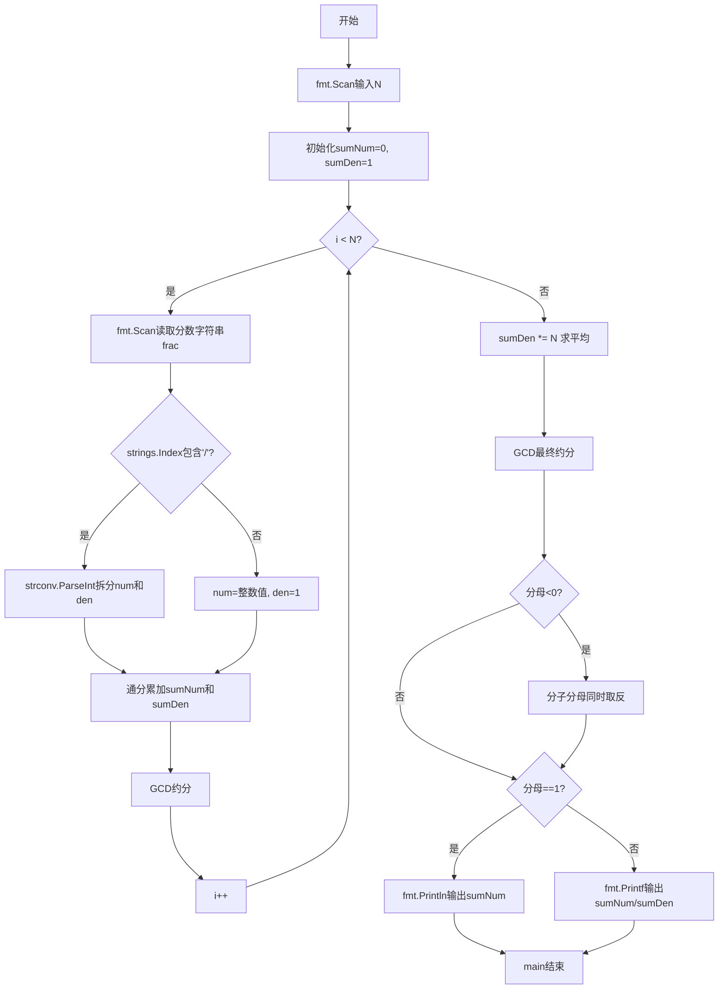
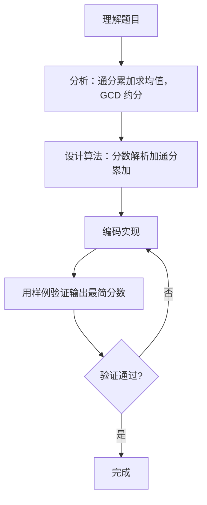

# 7-35 有理数均值（Go语言实现）

## 前言

这道题要求计算 N 个有理数的平均值，并以最简分数形式输出。例如分数 1/2 与 1/6 需要先通分累加，再除以 N 得到平均值，最后约分输出。

题目有几个易错点：一是输入可能是分数（分子/分母）也可能是整数，需要分别解析；二是分子分母可为负数，最终输出要保证负号在分子上、分母为正；三是累加过程中分子分母可能迅速增大，需要每次累加后立即约分。

采用 int64 存储、通分累加、每次约分的策略，先求总和再除以 N，最后统一约分输出。

## 题目描述

本题要求编写程序，计算N个有理数的平均值。

## 输入格式

输入第一行给出正整数N（≤100）；第二行中给出N个分数形式的有理数，其中分子和分母全是整形范围内的整数（正负均可），没有分母为0的情况。

## 输出格式

在一行中按照a/b的格式输出N个有理数的平均值。注意必须是该有理数的最简分数形式，若分母为1，则只输出分子。

## 输入样例

```in
4
1/2 1/6 3/6 -5/10
```

## 输出样例

```out
1/6
```

## 解题思路

### 1. 核心问题分析

本题需要解决的核心问题：

1. **分数输入解析**：识别输入中的分数格式（分子/分母）或整数格式
2. **分数累加求和**：多个分数相加需要通分，避免浮点数精度丢失
3. **求平均值**：总和除以个数N
4. **最简分数输出**：用最大公约数约分，保证分母为正

### 2. 算法原理说明

- **辗转相除法(GCD)**：用于求最大公约数，对分数进行约分。公式：`gcd(a, b) = gcd(b, a % b)`，直到b为0时a即为最大公约数
- **分数加法**：`a/b + c/d = (a*d + c*b) / (b*d)`，每次累加后立即约分防止溢出
- **求平均值**：将累加后的分母乘以N，再进行约分
- **符号处理**：确保负号在分子上，分母始终为正

### 3. 具体计算步骤

1. 输入N，初始化分子sumNum=0，分母sumDen=1。
2. 对每个分数：
   - 解析分子num和分母den；
   - 通分累加：`sumNum = sumNum*den + num*sumDen`，`sumDen = sumDen*den`；
   - 用GCD约分化简。
3. 求平均：`sumDen *= N`，再次约分。
4. 若分母为负，分子分母同时取反。
5. 按格式输出结果。

## 完整代码

```go
// 题目：7-35 有理数均值
// 要求：输入 N 个有理数（分子分母可为整数，分母不为 0），输出其平均值的最简分数形式；若分母为 1 则只输出分子。
//
// 实现原理：
//   1. 逐项解析分数（不含 '/' 时按整数处理，分母为 1），通分累加并每次用 GCD 约分防止溢出；
//   2. 累加结束后分母乘以 N 求平均值，再次约分；
//   3. 若分母为负，分子分母同时取反，保证输出分母为正。
package main

import (
    "fmt"
    "strconv"
    "strings"
)

func gcd(a, b int64) int64 {
    if a < 0 {
        a = -a
    }
    if b < 0 {
        b = -b
    }
    if b == 0 {
        return a
    }
    return gcd(b, a%b)
}

func main() {
    var n int
    fmt.Scan(&n)

    var sumNum int64 = 0
    var sumDen int64 = 1

    for i := 0; i < n; i++ {
        var frac string
        fmt.Scan(&frac)

        var num, den int64
        pos := strings.Index(frac, "/")
        if pos != -1 {
            num, _ = strconv.ParseInt(frac[:pos], 10, 64)
            den, _ = strconv.ParseInt(frac[pos+1:], 10, 64)
        } else {
            num, _ = strconv.ParseInt(frac, 10, 64)
            den = 1
        }

        sumNum = sumNum*den + num*sumDen
        sumDen = sumDen * den

        g := gcd(sumNum, sumDen)
        sumNum /= g
        sumDen /= g
    }

    sumDen *= int64(n)
    g := gcd(sumNum, sumDen)
    sumNum /= g
    sumDen /= g

    if sumDen < 0 {
        sumNum = -sumNum
        sumDen = -sumDen
    }

    if sumDen == 1 {
        fmt.Println(sumNum)
    } else {
        fmt.Printf("%d/%d\n", sumNum, sumDen)
    }
}
```

## 代码流程说明

1. 定义 gcd 函数：接收两个 int64 参数，先取绝对值再用辗转相除法递归求最大公约数。
2. fmt.Scan 输入分数个数 n。
3. 初始化累计分子 sumNum = 0、累计分母 sumDen = 1。
4. 循环 n 次：
   - fmt.Scan 读取一个分数字符串 frac；
   - 用 strings.Index 查找 '/' 的位置：存在则用 strconv.ParseInt 拆分分子分母，否则整个字符串为整数、分母为 1；
   - 按通分公式累加 sumNum 和 sumDen；
   - 调用 gcd 约分，避免中间结果过大。
5. 求平均值：sumDen 乘以 n。
6. 再次 gcd 约分。
7. 若分母为负，分子分母同时取反保证分母为正。
8. 分母为 1 时用 fmt.Println 只输出分子，否则用 fmt.Printf 输出"分子/分母"格式。

## 代码流程图



## 解题流程图



## 代码解析

### 辗转相除法求最大公约数

```go
func gcd(a, b int64) int64 {
    if a < 0 {
        a = -a
    }
    if b < 0 {
        b = -b
    }
    if b == 0 {
        return a
    }
    return gcd(b, a%b)
}
```

与 7-33 的 gcd 思路相同，先对负数取绝对值再递归相除。这里使用 int64 类型，因为多个分数累加后分子分母可能超过 int 的表示范围。

### 解析分数或整数

```go
pos := strings.Index(frac, "/")
if pos != -1 {
    num, _ = strconv.ParseInt(frac[:pos], 10, 64)
    den, _ = strconv.ParseInt(frac[pos+1:], 10, 64)
} else {
    num, _ = strconv.ParseInt(frac, 10, 64)
    den = 1
}
```

用 strings.Index 查找斜杠的位置；存在则把字符串拆成分子、分母两部分分别转换，不存在说明输入的是一个整数，分母取 1。

### 通分累加并立即约分

```go
sumNum = sumNum*den + num*sumDen
sumDen = sumDen * den

g := gcd(sumNum, sumDen)
sumNum /= g
sumDen /= g
```

每次累加后立即用 gcd 约分，防止分子分母在后续累加中膨胀溢出。

### 求平均并处理符号

```go
sumDen *= int64(n)
g := gcd(sumNum, sumDen)
sumNum /= g
sumDen /= g

if sumDen < 0 {
    sumNum = -sumNum
    sumDen = -sumDen
}
```

分母乘以 N 即相当于总和除以 N；约分后若分母为负，把分子分母同时取反，确保输出 "a/b" 中的分母为正。

## 复杂度分析

设有理数个数为 N，累加过程中分子分母的最大值为 M：

- 时间复杂度：O(N × log M)，每个分数的解析为 O(1)，每次 gcd 约分为 O(log M)；
- 空间复杂度：O(1)，除 gcd 的递归调用栈外，只需常数个变量存储累加分子分母。

## 常见易错点

### 1. 输入为整数时未处理

输入中的有理数也可能是整数形式（不带斜杠）。若直接用 strings.Index 的结果拆分，遇到不含 '/' 的字符串会出错：

```text
输入：3 5 1 2（N=4）
错误做法：未判断 '/' 是否存在，直接对 frac[:pos] 取值
正确做法：pos == -1 时 num = 整数值，den = 1
```

### 2. 累加后未及时约分导致溢出

若不在每次累加后约分，sumDen 连乘会快速增长，超出 int 范围导致结果错误：

```text
输入：N 较大且分数分母也较大
未约分：分母连乘增长，int 溢出
正确做法：int64 存储，每次累加后立即调用 gcd 约分
```

### 3. 负号处理不当

输入含负数（如 -5/10）。若 gcd 不对负数取绝对值，或输出前不保证分母为正，可能出现非规范输出：

```text
错误输出：1/-2 或 -1/-2
正确输出：-1/2（负号在分子，分母为正）
```

### 4. 分母为 1 时仍输出分数形式

```text
输入：N=1，分数 3
错误输出：3/1
正确输出：3
```

## 更多测试

### 测试一：单个分数

输入：

```text
1
3/4
```

输出：

```text
3/4
```

### 测试二：平均结果为整数

输入：

```text
2
2/1 4/1
```

输出：

```text
3
```

### 测试三：含负分数的混合

输入：

```text
3
-1/2 1/4 3/4
```

输出：

```text
1/6
```

## 总结

本题的核心是"通分累加 + 求平均 + 约分"。难点在于输入解析要同时支持分数和整数，累加过程中要防止溢出，输出前要处理负号保证分母为正。与 7-33 相比，本题把单次分数加法扩展为 N 项累加并多出求平均一步，但 gcd 约分和输出格式的判断思路完全一致。