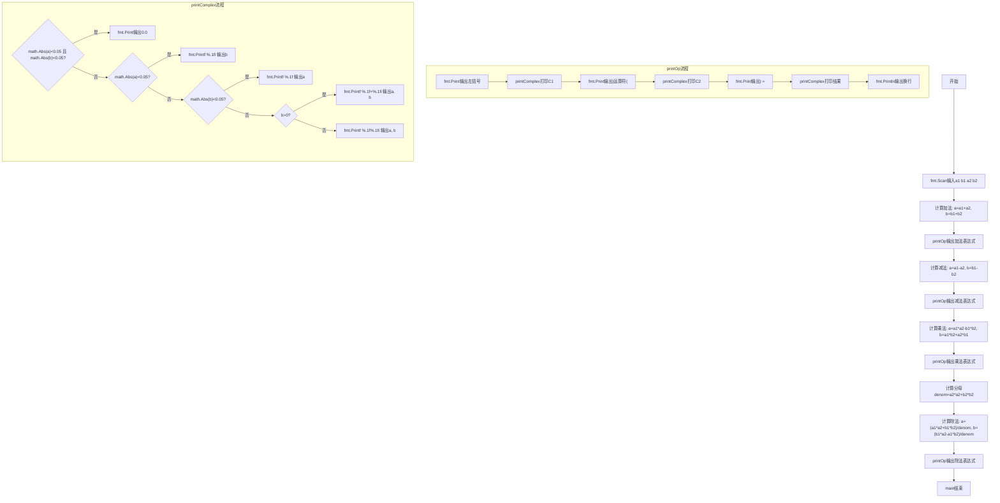
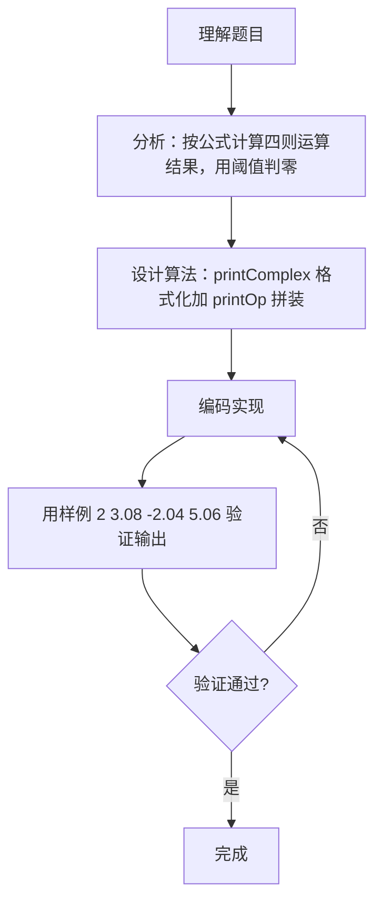

# 7-36 复数四则运算（Go语言实现）

## 前言

这道题要求计算两个复数的和、差、积、商，共输出 4 行结果，每行按 (C1) 运算符 (C2) = 结果 的格式给出，数字精确到小数点后 1 位。

题目有几个易错点：一是结果保留 1 位小数，浮点运算的精度误差导致不能用 == 直接判断实部虚部是否为 0，需要用绝对值小于 0.05 的阈值判断；二是实部或虚部为 0 时不输出该部分，全部为 0 时输出 0.0；三是虚部为负时符号不能重复出现。

采用"公式计算 + 阈值判零 + 统一格式化"的策略，按复数四则运算公式算出结果的实部虚部，再由 printComplex 统一处理四种输出情况。

## 题目描述

本题要求编写程序，计算2个复数的和、差、积、商。

## 输入格式

输入在一行中按照a1 b1 a2 b2的格式给出2个复数C1=a1+b1i和C2=a2+b2i的实部和虚部。题目保证C2不为0。

## 输出格式

分别在4行中按照(a1+b1i) 运算符 (a2+b2i) = 结果的格式顺序输出2个复数的和、差、积、商，数字精确到小数点后1位。如果结果的实部或者虚部为0，则不输出。如果结果为0，则输出0.0。

## 输入样例1

```in
2 3.08 -2.04 5.06
```

## 输出样例1

```out
(2.0+3.1i) + (-2.0+5.1i) = 8.1i
(2.0+3.1i) - (-2.0+5.1i) = 4.0-2.0i
(2.0+3.1i) * (-2.0+5.1i) = -19.7+3.8i
(2.0+3.1i) / (-2.0+5.1i) = 0.4-0.6i
```

## 输入样例2

```in
1 1 -1 -1.01
```

## 输出样例2

```out
(1.0+1.0i) + (-1.0-1.0i) = 0.0
(1.0+1.0i) - (-1.0-1.0i) = 2.0+2.0i
(1.0+1.0i) * (-1.0-1.0i) = -2.0i
(1.0+1.0i) / (-1.0-1.0i) = -1.0
```

## 解题思路

### 1. 核心问题分析

本题需要解决的核心问题：

1. **复数四则运算公式**：正确实现加减乘除的数学运算
2. **浮点数比较**：由于需要判断实部/虚部是否为0，需考虑浮点精度，用阈值0.05判断
3. **格式化输出**：精确到小数点后1位，实部虚部为0时不输出，注意符号处理
4. **特殊情况**：结果为0时输出"0.0"

### 2. 算法原理说明

设 C1 = a1 + b1i，C2 = a2 + b2i

- **加法**：`C1 + C2 = (a1+a2) + (b1+b2)i`
- **减法**：`C1 - C2 = (a1-a2) + (b1-b2)i`
- **乘法**：`C1 * C2 = (a1*a2 - b1*b2) + (a1*b2 + a2*b1)i`
- **除法**：`C1 / C2 = [(a1*a2 + b1*b2) + (b1*a2 - a1*b2)i] / (a2² + b2²)`

### 3. 格式化输出规则

- 实部和虚部都接近0（绝对值<0.05）：输出"0.0"
- 只有实部接近0：只输出虚部+"i"（注意虚部的正负号）
- 只有虚部接近0：只输出实部
- 都不为0：虚部为正时输出"a+bi"，虚部为负时输出"a-bi"（负号自带）

### 4. 具体计算步骤

1. 输入a1, b1, a2, b2。
2. 按公式分别计算和、差、积、商的实部和虚部。
3. 每次计算后调用printOp输出完整表达式。
4. printComplex根据规则格式化输出单个复数。

## 完整代码

```go
// 题目：7-36 复数四则运算
// 要求：输入两个复数 a1+b1i、a2+b2i，输出它们的加、减、乘、除运算结果，
//       其中实部、虚部四舍五入到一位小数；接近 0 的分量按规则省略。
//
// 实现原理：
//   1. 复数运算公式：
//      加：(a1+a2) + (b1+b2)i
//      减：(a1-a2) + (b1-b2)i
//      乘：(a1a2 - b1b2) + (a1b2 + a2b1)i
//      除：分母 = a2^2 + b2^2；实部 = (a1a2 + b1b2)/分母；虚部 = (b1a2 - a1b2)/分母
//   2. printComplex 负责格式化：|值|<0.05 视为 0.0 而省略；虚部正数用 '+' 连接，负数直接带 '-'；
//   3. printOp 统一按 "(A) op (B) = R" 的格式输出每一步。
package main

import (
	"bufio"
	"fmt"
	"os"
)

func abs(x float64) float64 {
	if x < 0 {
		return -x
	}
	return x
}

func printComplex(a, b float64) {
	if abs(a) < 0.05 && abs(b) < 0.05 {
		fmt.Print("0.0")
	} else if abs(a) < 0.05 {
		fmt.Printf("%.1fi", b) // 仅虚部
	} else if abs(b) < 0.05 {
		fmt.Printf("%.1f", a) // 仅实部
	} else if b > 0 {
		fmt.Printf("%.1f+%.1fi", a, b) // 虚部为正，用 + 连接
	} else {
		fmt.Printf("%.1f%.1fi", a, b) // 虚部为负，自带负号
	}
}

func printOp(a1, b1 float64, op byte, a2, b2, a, b float64) {
	fmt.Print("(")
	printComplex(a1, b1)
	fmt.Printf(") %c (", op)
	printComplex(a2, b2)
	fmt.Print(") = ")
	printComplex(a, b)
	fmt.Println()
}

func main() {
	in := bufio.NewReader(os.Stdin)

	var a1, b1, a2, b2 float64
	fmt.Fscan(in, &a1, &b1, &a2, &b2)

	a := a1 + a2
	b := b1 + b2
	printOp(a1, b1, '+', a2, b2, a, b)

	a = a1 - a2
	b = b1 - b2
	printOp(a1, b1, '-', a2, b2, a, b)

	a = a1*a2 - b1*b2
	b = a1*b2 + a2*b1
	printOp(a1, b1, '*', a2, b2, a, b)

	denom := a2*a2 + b2*b2
	a = (a1*a2 + b1*b2) / denom
	b = (b1*a2 - a1*b2) / denom
	printOp(a1, b1, '/', a2, b2, a, b)
}
```

## 代码流程说明

1. printComplex 函数：接收实部 a 和虚部 b。先判断实部虚部是否都接近 0（绝对值小于 0.05），是则输出 "0.0"；再依次判断仅实部接近 0（只输出虚部加 "i"）、仅虚部接近 0（只输出实部）；最后虚部为正时用 "+" 连接，虚部为负时负号自带，按 "%.1f" 精度输出。
2. printOp 函数：fmt.Print 输出左括号，调用 printComplex 打印 C1，fmt.Printf 输出 ") 运算符 ("，调用 printComplex 打印 C2，fmt.Print 输出 ") = "，调用 printComplex 打印结果，最后 fmt.Println 输出换行。
3. main 函数加法：a = a1+a2，b = b1+b2，调用 printOp 输出加法。
4. main 函数减法：a = a1-a2，b = b1-b2，调用 printOp 输出减法。
5. main 函数乘法：a = a1*a2 - b1*b2，b = a1*b2 + a2*b1，调用 printOp 输出乘法。
6. main 函数除法：先求分母 denom = a2² + b2²，再计算 a = (a1*a2 + b1*b2)/denom，b = (b1*a2 - a1*b2)/denom，调用 printOp 输出除法。

## 代码流程图



## 解题流程图



## 代码解析

### 格式化输出单个复数

```go
func printComplex(a, b float64) {
    if math.Abs(a) < 0.05 && math.Abs(b) < 0.05 {
        fmt.Print("0.0")
    } else if math.Abs(a) < 0.05 {
        fmt.Printf("%.1fi", b)
    } else if math.Abs(b) < 0.05 {
        fmt.Printf("%.1f", a)
    } else if b > 0 {
        fmt.Printf("%.1f+%.1fi", a, b)
    } else {
        fmt.Printf("%.1f%.1fi", a, b)
    }
}
```

由于结果保留 1 位小数，绝对值小于 0.05 的数四舍五入后显示为 0.0，因此用 0.05 作为"是否为 0"的判定阈值。虚部为负时，"%.1f%.1fi" 中第二个 %1f 自带负号，形成 "a-bi" 的效果，不会出现多余的 "+"。

### 拼装完整运算表达式

```go
func printOp(a1, b1 float64, op byte, a2, b2, a, b float64) {
    fmt.Print("(")
    printComplex(a1, b1)
    fmt.Printf(") %c (", op)
    printComplex(a2, b2)
    fmt.Print(") = ")
    printComplex(a, b)
    fmt.Println()
}
```

运算符以 byte 参数传入，配合 %c 输出；两个操作数与结果都交给 printComplex 统一格式化，保证四行输出风格一致。

### 除法公式的实现

```go
denom := a2*a2 + b2*b2
a = (a1*a2 + b1*b2) / denom
b = (b1*a2 - a1*b2) / denom
```

除法通过分子分母同乘 C2 的共轭实现，分母 denom = a2² + b2² 必为正数（题目保证 C2 不为 0），实部虚部分别除以 denom 得到结果。

## 复杂度分析

本题输入固定为两个复数的 4 个浮点数，运算规模为常数：

- 时间复杂度：O(1)，四种运算各自只执行常数次算术运算，printComplex 至多进行 4 次条件判断；
- 空间复杂度：O(1)，仅需常数个浮点变量存储实部虚部。

## 常见易错点

### 1. 用 == 直接判断浮点数是否为 0

浮点运算存在精度误差，直接用 a == 0 判断可能失败。本题结果保留 1 位小数，应像代码一样用 math.Abs(x) < 0.05 作为判零阈值：

```text
错误做法：if a == 0 && b == 0 { fmt.Print("0.0") }
正确做法：if math.Abs(a) < 0.05 && math.Abs(b) < 0.05 { ... }
```

### 2. 虚部为负时符号重复

虚部为负时，若仍用 "%+.1fi" 或手动拼接 "+"，会出现 "a+-bi" 这种错误格式：

```text
错误输出：(2.0+3.1i) - (-2.0+5.1i) = 4.0+-2.0i
正确输出：(2.0+3.1i) - (-2.0+5.1i) = 4.0-2.0i
```

### 3. 只输出虚部时丢掉 "i"

仅实部接近 0 时只输出虚部，此时必须保留 "i"：

```text
样例1的和：错误输出 8.1（丢了 i）
正确输出：8.1i
```

### 4. 结果为 0 时输出格式错误

实部虚部都接近 0 时应输出 "0.0"，而不是 "0" 或 "0.0+0.0i"：

```text
样例2的和：错误输出 0 或 0.0+0.0i
正确输出：0.0
```

## 更多测试

### 测试一：第一个复数为零

输入：

```text
0 0 1 1
```

输出：

```text
(0.0) + (1.0+1.0i) = 1.0i
(0.0) - (1.0+1.0i) = -1.0-1.0i
(0.0) * (1.0+1.0i) = 0.0
(0.0) / (1.0+1.0i) = 0.0
```

### 测试二：纯实数运算

输入：

```text
2 0 3 0
```

输出：

```text
(2.0) + (3.0) = 5.0
(2.0) - (3.0) = -1.0
(2.0) * (3.0) = 6.0
(2.0) / (3.0) = 0.7
```

### 测试三：虚部为负的操作数

输入：

```text
-1 -2 3 4
```

输出：

```text
(-1.0-2.0i) + (3.0+4.0i) = 2.0+2.0i
(-1.0-2.0i) - (3.0+4.0i) = -4.0-6.0i
(-1.0-2.0i) * (3.0+4.0i) = 5.0-10.0i
(-1.0-2.0i) / (3.0+4.0i) = -0.4-0.1i
```

## 总结

本题的核心是"公式计算 + 阈值判零 + 格式化输出"。先按复数四则运算公式算出结果的实部虚部，再用绝对值 0.05 作为判零阈值规避浮点精度问题，最后统一由 printComplex 处理四种输出情况。这类"浮点判零 + 定制格式"的处理方式在输出要求严格的题目中非常常见，值得反复体会。
