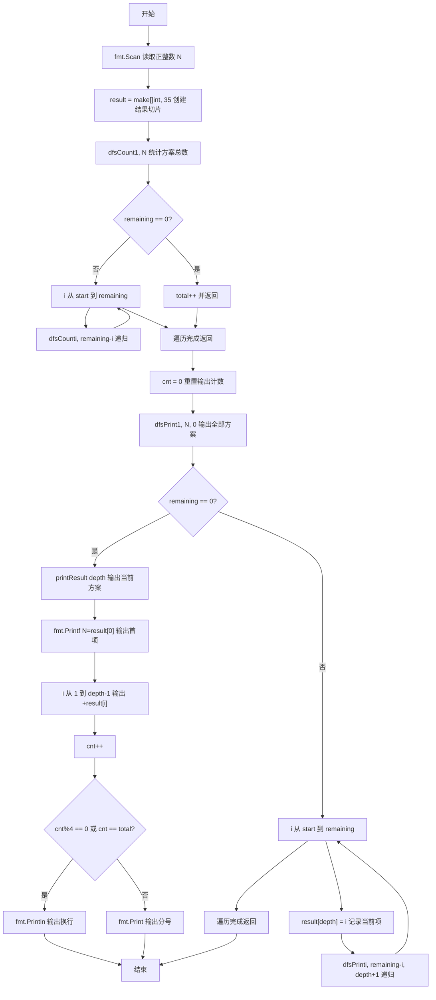
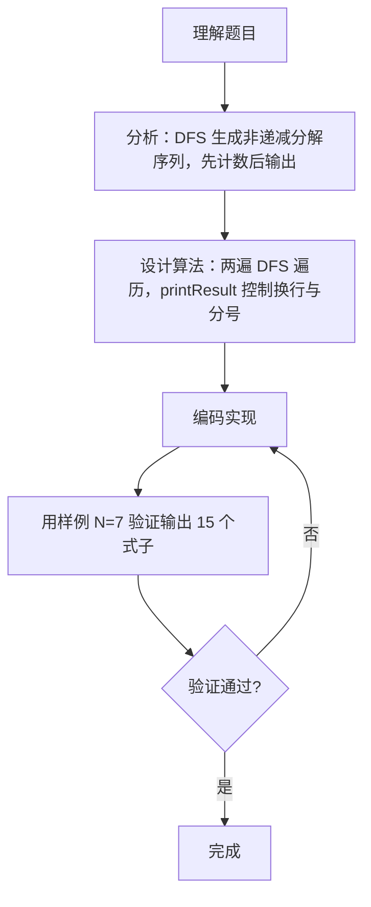

# 7-37 整数分解为若干项之和（Go语言实现）

## 前言

整数分解（又称整数分拆）是组合数学中的经典问题。本题要求把正整数 N 分解成若干正整数相加的形式，并按递增顺序输出所有分解式子，同时还要满足每 4 个式子一行的输出格式要求。

直接枚举所有排列会产生大量重复，因此关键在于保证"不重不漏"：只要让分解序列始终保持非递减（后一项不小于前一项），同一组数字就只会出现一次。本文采用深度优先搜索（DFS）实现这一目标。

输出的换行与分号控制同样容易出错——需要先统计方案总数，才能在最后一个式子后正确换行，因此代码采用了"先计数、后输出"的两遍 DFS 策略。

## 题目描述

将一个正整数 N 分解成几个正整数相加，可以有多种分解方法，例如 7=6+1，7=5+2，7=5+1+1，…。编程求出正整数 N 的所有整数分解式子。

## 输入格式

每个输入包含一个测试用例，即正整数 N (0<N≤30)。

## 输出格式

按递增顺序输出 N 的所有整数分解式子。递增顺序是指：对于两个分解序列 N₁={n₁,n₂,⋯} 和 N₂={m₁,m₂,⋯}，若存在 i 使得 n₁=m₁,⋯,nᵢ=mᵢ，但是 nᵢ₊₁<mᵢ₊₁，则 N₁序列必定在 N₂序列之前输出。每个式子由小到大相加，式子间用分号隔开，且每输出 4 个式子后换行。

## 输入样例

```in
7
```

## 输出样例

```out
7=1+1+1+1+1+1+1;7=1+1+1+1+1+2;7=1+1+1+1+3;7=1+1+1+2+2
7=1+1+1+4;7=1+1+2+3;7=1+1+5;7=1+2+2+2
7=1+2+4;7=1+3+3;7=1+6;7=2+2+3
7=2+5;7=3+4;7=7
```

## 解题思路

### 1. 用非递减序列避免重复

如果直接枚举数字的排列，`1+2+4`、`2+1+4`、`4+1+2` 等会被当作不同方案重复输出。让分解序列保持非递减（后一项不小于前一项），同一组数字只会生成一次。DFS 中通过参数 `start` 控制：每次选择 `i` 后，下一层递归只能从 `i` 开始，从而保证序列单调不减。

### 2. 两次 DFS：先计数后输出

输出格式要求在最后一个式子后换行，也就是需要预先知道方案总数 `total`。因此：
- 第一遍 `dfsCount` 只计数、不输出，得到方案总数 `total`；
- 第二遍 `dfsPrint` 按完全相同的搜索顺序实际输出，用 `cnt` 与 `total` 判断当前式子是否为最后一个。

### 3. 递归终止与结果记录

当 `remaining == 0` 时表示当前方案已经凑满，此时 `depth` 记录了已选数字的个数，`result[0..depth-1]` 就是该方案；否则让 `i` 从 `start` 循环到 `remaining`，把当前选中的数存入 `result[depth]` 后继续递归。

## 完整代码

```go
// 题目：7-37 整数分解为若干项之和
// 要求：把正整数 N 分解成若干个正整数之和（各项递增、不重复），按字典序输出所有分解方式，
//       每行最多 4 种，不同分解以 ';' 分隔，最后一行末尾无多余符号。
//
// 实现原理（DFS 回溯生成整数划分）：
//   1. 递归函数 dfs(start, remaining)：start 表示当前可选的最小数字（保证递增、不重复），
//      remaining 表示剩余待分解的量；
//   2. 每轮枚举 i 从 start 到 remaining，把 i 加入结果序列后递归 dfs(i, remaining-i)，
//      递归返回后回溯（弹出 i）以尝试其他选择；
//   3. 当 remaining==0 时得到一种完整分解，调用 printResult 输出；
//   4. 先用 dfsCount 统计总数 total，便于在输出时正确判断换行/分号。
package main

import (
	"fmt"
)

var (
	N      int
	result []int
	count  int
	total  int
)

// dfsCount 统计分解方案总数
func dfsCount(start, remaining int) {
	if remaining == 0 {
		total++
		return
	}
	for i := start; i <= remaining; i++ {
		dfsCount(i, remaining-i)
	}
}

// printResult 按格式输出一种分解方案
func printResult() {
	fmt.Printf("%d=%d", N, result[0])
	for i := 1; i < len(result); i++ {
		fmt.Printf("+%d", result[i])
	}
	count++
	if count%4 == 0 || count == total {
		fmt.Println() // 满 4 种或最后一种则换行
	} else {
		fmt.Print(";") // 否则用分号分隔
	}
}

// dfsPrint 回溯生成并输出所有分解
func dfsPrint(start, remaining int) {
	if remaining == 0 {
		printResult() // 一种完整分解
		return
	}
	for i := start; i <= remaining; i++ {
		result = append(result, i)  // 选择 i
		dfsPrint(i, remaining-i)    // 递归剩余部分（最小可选 i）
		result = result[:len(result)-1] // 回溯
	}
}

func main() {
	fmt.Scan(&N)
	dfsCount(1, N) // 先统计总数
	count = 0
	dfsPrint(1, N) // 再输出
}
```

## 代码流程说明

1. 声明包级变量：`N` 保存待分解的整数，`result` 保存当前方案各项，`cnt` 记录已输出方案数，`total` 保存方案总数。
2. 调用 `dfsCount(1, N)` 进行第一遍搜索：`remaining == 0` 时 `total++` 并返回，否则让 `i` 从 `start` 循环到 `remaining`，递归调用 `dfsCount(i, remaining-i)`。
3. 将 `cnt` 重置为 0，为输出阶段重新计数。
4. 调用 `dfsPrint(1, N, 0)` 进行第二遍搜索：`remaining == 0` 时调用 `printResult(depth)` 输出当前方案，否则把 `result[depth] = i` 后递归 `dfsPrint(i, remaining-i, depth+1)`。
5. `printResult` 先输出 `N=result[0]`，再依次输出 `+result[i]`（`i` 从 1 到 `depth-1`）。
6. 输出完成后 `cnt++`，若 `cnt%4 == 0` 或 `cnt == total` 则换行，否则输出分号。
7. main 函数自然结束。

## 代码流程图



## 解题流程图



## 代码解析

### 计数阶段：dfsCount

```go
func dfsCount(start, remaining int) {
    if remaining == 0 {
        total++
        return
    }
    for i := start; i <= remaining; i++ {
        dfsCount(i, remaining-i)
    }
}
```

`dfsCount` 与输出阶段的搜索顺序完全一致，只是找到方案时只做 `total++`。参数 `start` 限定本轮可取的最小值，保证分解序列非递减、不重复。

### 输出控制：printResult

```go
func printResult(depth int) {
    fmt.Printf("%d=%d", N, result[0])
    for i := 1; i < depth; i++ {
        fmt.Printf("+%d", result[i])
    }
    cnt++
    if cnt%4 == 0 || cnt == total {
        fmt.Println()
    } else {
        fmt.Print(";")
    }
}
```

`result` 中下标 `0` 到 `depth-1` 是当前方案的各项。先输出 `N=` 与第一项，再拼接其余项；之后根据 `cnt` 判断输出换行还是分号。`cnt == total` 保证了最后一行不足 4 个式子时也能正确换行。

### 搜索阶段：dfsPrint

```go
func dfsPrint(start, remaining, depth int) {
    if remaining == 0 {
        printResult(depth)
        return
    }
    for i := start; i <= remaining; i++ {
        result[depth] = i
        dfsPrint(i, remaining-i, depth+1)
    }
}
```

`remaining == 0` 表示已经凑满 N，进入输出；否则逐个尝试当前可取的数字，把结果写入 `result[depth]` 后继续深入搜索。

## 复杂度分析

设 N 为输入的正整数，p(N) 为 N 的整数分拆总数：

- 时间复杂度：DFS 需要枚举并输出所有分解方案，约为 `O(p(N) × N)`；
- 空间复杂度：`result` 切片长度与递归栈深度均为 `O(N)`。

由于题目限定 `0 < N ≤ 30`，方案总数有限，实际运行开销很小。

## 常见易错点

### 1. 重复枚举排列导致方案重复

如果下一层递归仍从 1 开始尝试，会同时输出 `1+2+4` 和 `2+1+4` 等排列。必须让递归起点为当前选中的数 `i`，即 `dfsPrint(i, remaining-i, depth+1)`，保证序列非递减。

### 2. 忘记判断"最后一个式子"导致最后一行不换行

若只判断 `cnt%4 == 0` 就换行，当总数不是 4 的倍数（如 N=7 时最后一行只有 3 个式子）时，最后一个式子后不会换行。需要加上 `cnt == total` 条件。

### 3. 输出循环边界写错

`printResult` 中第二项及以后应从 `i = 1` 循环到 `i < depth`，`depth` 是已选数字个数。若误写成 `i <= depth` 或把起点写成 0，会多输出、漏输出，甚至输出切片中多余的 0 占位值。

### 4. 计数与输出顺序不一致

两次 DFS 必须使用完全相同的搜索顺序（同样的 `start` 约束），否则 `cnt` 与 `total` 的对应关系错乱，换行判断就会出错。

## 更多测试

### 测试一：N=1

输入：

```text
1
```

输出：

```text
1=1
```

### 测试二：N=3

输入：

```text
3
```

输出：

```text
3=1+1+1;3=1+2;3=3
```

### 测试三：N=4

输入：

```text
4
```

输出：

```text
4=1+1+1+1;4=1+1+2;4=1+3;4=2+2
4=4
```

## 总结

本题的核心是把"枚举所有排列"转化为"生成非递减序列"，利用 DFS 的 `start` 参数保证不重不漏；又通过"先计数、后输出"的两遍遍历解决了末尾换行的格式问题。这一思想同样适用于组合枚举、子集生成等需要去重的搜索问题。
