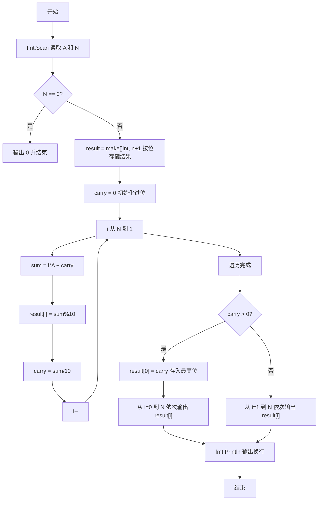
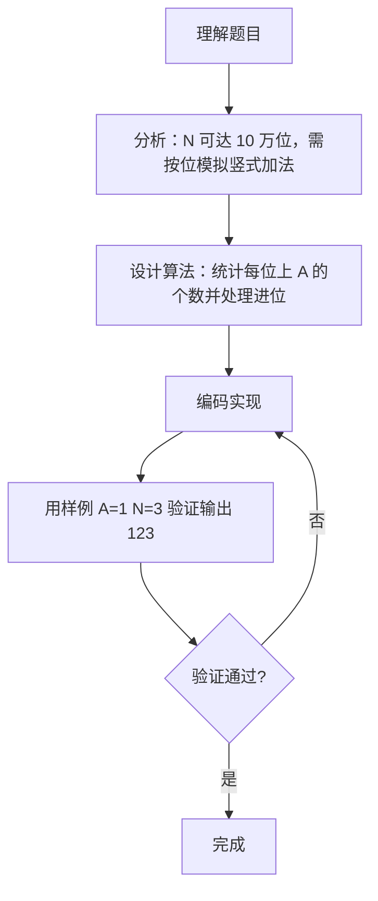

# 7-38 数列求和-加强版（Go语言实现）

## 前言

这道题表面上是在做加法求和，但 N 最大可达 100000，结果会超过 10 万位，任何普通整型都无法容纳，因此必须采用高精度思路。

仔细观察数列 A, AA, AAA, … 的结构可以发现一个巧妙的规律：从右往左数的第 i 位上，恰好有 i 个 A 参与求和。利用这个规律可以逐位确定每一位的数字，而不需要真的构造出 N 个巨大的数。

只要从低位到高位逐位求和并传递进位，再把最高位可能的进位也输出出来，整个问题就能在 O(N) 时间内解决。

## 题目描述

给定某数字A（1≤A≤9）以及非负整数N（0≤N≤100000），求数列之和S=A+AA+AAA+⋯+AA⋯A（N个A）。例如A=1, N=3时，S=1+11+111=123。

## 输入格式

输入数字A与非负整数N。

## 输出格式

输出其N项数列之和S的值。

## 输入样例

```in
1 3
```

## 输出样例

```out
123
```

## 解题思路

### 1. 用按位存储代替大整数

N 最大为 100000，和 S 的位数最多可超过 10 万位，`int` 或 `int64` 都无法容纳。用长度为 `N+1` 的切片 `result` 按位保存结果，每个位置只存一位十进制数字。

### 2. 统计每一位上 A 出现的次数

第 i 项 `AA...A`（共 i 个 A）从右往左数的第 i 位恰好是 A，因此从右往左第 i 位上总共有 i 个数是 A。这一位参与求和的数值就是 `i * A`，再加上从低位传递来的进位 `carry`，就得到该位的总和。

### 3. 逐位计算并传递进位

从 `i = N` 循环到 `i = 1`，下标 `i` 恰好等于该位（从右往左）上 A 的个数。每一位：

- 总和：`sum = i*A + carry`
- 当前位数字：`result[i] = sum % 10`
- 新进位：`carry = sum / 10`

循环结束后若 `carry > 0`，说明最高位还有进位，把它存入 `result[0]`。

### 4. 输出结果

有进位时从 `result[0]` 输出到 `result[N]`，否则从 `result[1]` 输出到 `result[N]`，最后输出换行。

## 完整代码

```go
// 题目：7-38 数列求和-加强版
// 要求：计算 S = A + AA + AAA + ... + AA...A（N 个 A）的值，N 最大为 100000。
//
// 实现原理：
//   1. 结果位数可能超过 10 万，用切片 result 按位存储；
//   2. 从右往左第 i 位恰好有 i 个 A 参与求和，该位和 = i*A + 低位进位；
//   3. 从 i=N 到 i=1 逐位求值并传递进位，最后处理最高位进位后按位输出。
package main

import "fmt"

func main() {
    var a, n int
    fmt.Scan(&a, &n)

    if n == 0 {
        fmt.Println("0")
        return
    }

    result := make([]int, n+1)
    carry := 0

    for i := n; i >= 1; i-- {
        sum := i*a + carry
        result[i] = sum % 10
        carry = sum / 10
    }

    if carry > 0 {
        result[0] = carry
        for i := 0; i <= n; i++ {
            fmt.Printf("%d", result[i])
        }
    } else {
        for i := 1; i <= n; i++ {
            fmt.Printf("%d", result[i])
        }
    }
    fmt.Println()
}
```

## 代码流程说明

1. 用 `fmt.Scan` 读取数字 `a` 和非负整数 `n`。
2. 处理边界情况：若 `n == 0`，数列为空，直接输出 `0` 并结束程序。
3. 创建长度为 `n+1` 的切片 `result` 用于按位存储结果，初始化进位 `carry = 0`。
4. 从 `i = n` 循环到 `i = 1`：计算 `sum = i*a + carry`（第 `i` 位有 `i` 个 A 相加），当前位数字存入 `result[i] = sum % 10`，新进位为 `carry = sum / 10`。
5. 循环结束后若 `carry > 0`，说明最高位还有进位，存入 `result[0]`。
6. 有进位时从 `result[0]` 到 `result[n]` 依次输出，否则从 `result[1]` 到 `result[n]` 依次输出。
7. 输出换行，main 函数自然结束。

## 代码流程图



## 解题流程图



## 代码解析

### N=0 的边界处理

```go
if n == 0 {
    fmt.Println("0")
    return
}
```

N=0 时数列不存在，和为 0。若不处理，`make([]int, n+1)` 之后的循环不会执行，会直接走到输出分支输出空串。

### 核心按位循环

```go
for i := n; i >= 1; i-- {
    sum := i*a + carry
    result[i] = sum % 10
    carry = sum / 10
}
```

下标 `i` 从 N 递减到 1，同时表示"从右往左第 i 位"。第 i 位上有 i 个数是 A，加上低位进位即 `i*a + carry`；取余得到当前位数字，整除得到传给高位的进位。

### 最高位进位与输出

```go
if carry > 0 {
    result[0] = carry
    for i := 0; i <= n; i++ {
        fmt.Printf("%d", result[i])
    }
} else {
    for i := 1; i <= n; i++ {
        fmt.Printf("%d", result[i])
    }
}
```

循环结束时可能还有进位（例如 A=9、N=3 时最高位进位为 1，结果为 1107）。有进位时把它放在 `result[0]` 并从 0 开始输出，否则从 1 开始输出，避免多出一个前导 0。

## 复杂度分析

设 N 为输入规模：

- 时间复杂度：`O(N)`，从第 1 位到第 N 位各计算一次，每位操作均为常数时间；
- 空间复杂度：`O(N)`，`result` 切片需要存储 N 位结果。

## 常见易错点

### 1. 遗漏 N=0 的边界情况

N=0 时没有求和项，正确输出是 `0`。若不做特殊处理，循环不执行，输出将为空。

### 2. 位序与循环方向搞反

第 i 位（从右往左）上有 i 个 A 参与求和，因此 `i` 必须从 N 递减到 1 计算 `sum = i*a + carry`。如果循环方向或"i 个 A"的含义弄反，每一位的数字都会算错。

### 3. 最高位进位丢失

循环结束后 `carry` 可能非 0，必须作为最高位存入 `result[0]` 并输出。例如 A=9、N=3 时正确结果为 1107，若忽略进位会输出 107，恰好少一位。

### 4. 输出起点选错

有进位时要从 `result[0]` 开始输出，无进位时从 `result[1]` 开始输出。两个起点写反会多输出一个前导 0 或少输出一位。

## 更多测试

### 测试一：N=0 的边界

输入：

```text
5 0
```

输出：

```text
0
```

### 测试二：产生最高位进位

输入：

```text
9 3
```

输出：

```text
1107
```

### 测试三：无进位多位数

输入：

```text
1 4
```

输出：

```text
1234
```

## 总结

本题的巧妙之处在于把"逐项求和"转化为"逐位统计"，利用第 i 位恰好有 i 个 A 的规律，把高精度问题简化成一次 O(N) 的竖式加法。先按位求出数字并传递进位，再决定是否输出最高位进位，思路清晰且不易出错。这一"按位累加 + 进位处理"的方法同样适用于其它大数运算问题。
