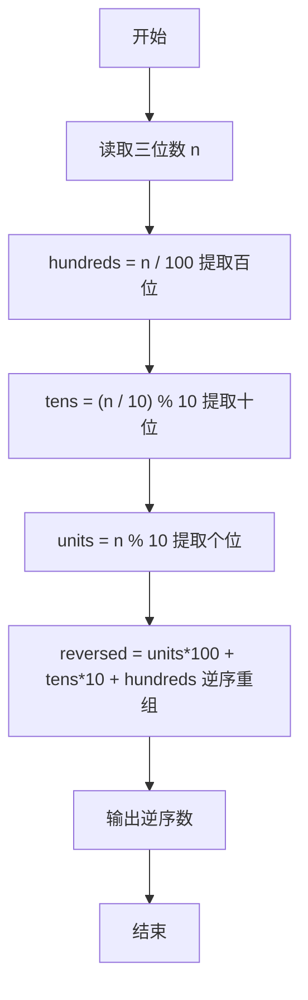
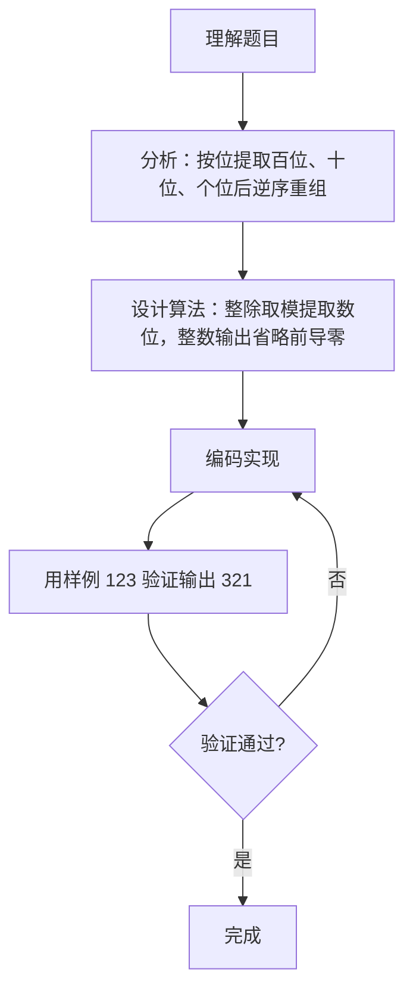

# 7-3 逆序的三位数（Go语言实现）

## 前言

这道题要求读入一个三位正整数，输出它的逆序数，例如输入 123 输出 321。

题目有两个细节容易出错：

1. 输入的数字可能含有结尾的 0，例如 700 逆序后是 007，输出不应带有前导零，应为 7；
2. 提取百位、十位、个位时，整除和取模的运算必须准确。

核心策略是分别提取个位、十位、百位数字，用「个位×100 + 十位×10 + 百位」重新组合成新整数，利用整数输出的特性自动省略前导零。

## 题目描述

程序每次读入一个正3位数，然后输出按位逆序的数字。注意：当输入的数字含有结尾的0时，输出不应带有前导的0。比如输入700，输出应该是7。

## 输入格式

每个测试是一个3位的正整数。

## 输出格式

输出按位逆序的数。

## 输入样例

```in
123
```

## 输出样例

```out
321
```

## 解题思路

### 1. 按位提取三个数字

对三位数 n，用整除和取模分别提取：

- hundreds = n / 100 提取百位
- tens = (n / 10) % 10 提取十位（先去掉个位，再取模 10）
- units = n % 10 提取个位

### 2. 逆序重组

把提取出的数字按逆序重新组合：个位作为新数的百位，十位保持不变，百位作为新数的个位：

```text
reversed = units*100 + tens*10 + hundreds
```

### 3. 自动处理前导零

当原数的个位为 0 时（如 700），units = 0，重组后 reversed = 0*100 + 0*10 + 7 = 7。由于输出的是整数，前导零被自动省略。

## 完整代码

```go
// 题目：7-3 逆序的三位数
// 要求：输入一个三位正整数，输出按位逆序后的数字，原数含结尾 0 时输出不能有前导零。
//
// 实现原理：
//   1. 用整除和取模分别提取百位、十位、个位数字；
//   2. 按 units*100 + tens*10 + hundreds 逆序重组新数；
//   3. 以整数形式输出，前导零自动省略。
package main

import "fmt"

func main() {
	var n int
	fmt.Scan(&n)
	hundreds := n / 100
	tens := (n / 10) % 10
	units := n % 10
	reversed := units*100 + tens*10 + hundreds
	fmt.Println(reversed)
}
```
## 代码流程说明

1. 导入 fmt 包，声明整型变量 n 存储输入的三位数。
2. 用 fmt.Scan 读取三位数 n。
3. 用 n/100 整除提取百位 hundreds。
4. 用 (n/10)%10 先去掉个位再取模，提取十位 tens。
5. 用 n%10 取模提取个位 units。
6. 计算 reversed = units*100 + tens*10 + hundreds，逆序重组新数。
7. 用 fmt.Print 输出 reversed，整数输出自动省略前导零。
8. main 函数自然结束。

## 代码流程图



## 解题流程图



## 代码解析

### 提取十位数字

```go
tens := (n / 10) % 10
```

n/10 先去掉个位（如 123 变成 12），再对 10 取模得到十位数字 2。这是数位提取的标准写法，若直接写 n/10 则会同时包含百位，结果错误。

### 逆序重组新数

```go
reversed := units*100 + tens*10 + hundreds
```

个位 ×100 成为新数的百位，十位 ×10 保持十位，百位成为个位。注意三个数字的权重必须与位置对应。

### 输出逆序数

```go
fmt.Print(reversed)
```

输出整数类型，Go 在格式化时自动省略前导零。例如 reversed = 7 时直接输出 `7` 而不是 `007`。

## 复杂度分析

该算法只进行固定次数的算术运算，与输入大小无关：

- 时间复杂度：`O(1)`，每次运行只做常数次整除和取模运算；
- 空间复杂度：`O(1)`，只使用几个固定数量的变量。

## 常见易错点

### 1. 十位数字提取错误

十位必须用 (n/10)%10 提取。若误写成 n/10，得到的是百位和十位组成的两位数，例如 123 会得到 12 而非 2，重组结果完全错误。

### 2. 逆序重组时权重写错

reversed = units*100 + tens*10 + hundreds 中，units 的权重是 100、hundreds 的权重是 1。若写成 hundreds*100 + tens*10 + units，等于没做逆序，例如 123 仍输出 123。

### 3. 前导零处理不当

输入 700 时逆序应为 7。若用字符串反转后直接拼接输出，可能输出 `007`；本文用整数重组并输出整数，前导零自动省略，天然满足要求。

### 4. 忽略输入为 100 的情况

输入 100 时，units = 0、tens = 0、hundreds = 1，reversed = 0*100 + 0*10 + 1 = 1，输出 `1`。若漏掉某一项或权重写错，结果就会出错。

## 更多测试

### 测试一：原数个位为 0

输入：

```text
700
```

输出：

```text
7
```

推演：hundreds = 700/100 = 7，tens = (700/10)%10 = 0，units = 700%10 = 0；reversed = 0*100 + 0*10 + 7 = 7，输出 `7`。

### 测试二：原数中间为 0

输入：

```text
100
```

输出：

```text
1
```

推演：hundreds = 100/100 = 1，tens = (100/10)%10 = 0，units = 100%10 = 0；reversed = 0*100 + 0*10 + 1 = 1，输出 `1`。

### 测试三：原数两端非零

输入：

```text
901
```

输出：

```text
109
```

推演：hundreds = 901/100 = 9，tens = (901/10)%10 = 0，units = 901%10 = 1；reversed = 1*100 + 0*10 + 9 = 109，输出 `109`。

## 总结

本题的核心是「数位提取」与「逆序重组」。用整除和取模分别拿到百位、十位、个位，再按逆序权重组合成新整数，就能同时完成逆序和前导零处理。这类按位处理的题目，关键是记住：除以 10 去掉低位、模 10 取得当前位，两者配合可以提取任意数位。