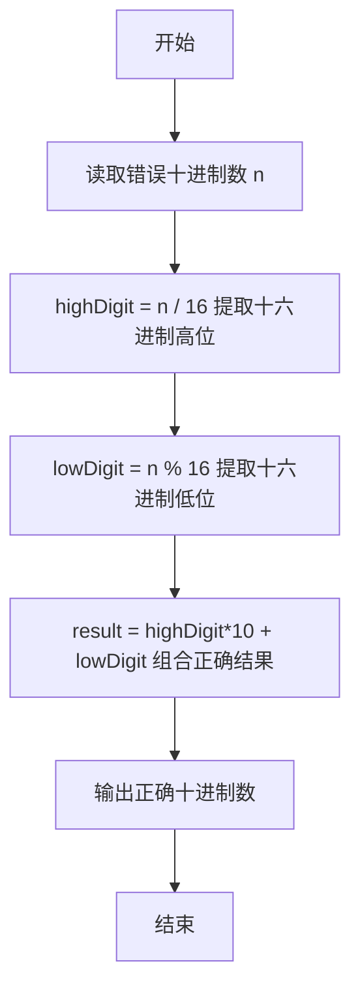
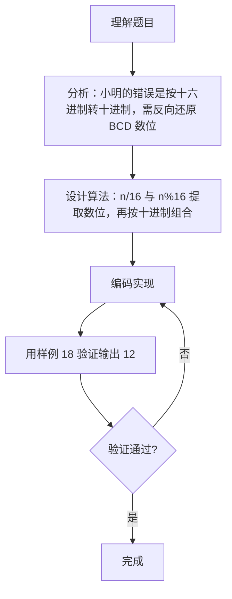

# 7-4 BCD解密（Go语言实现）

## 前言

这道题要求根据一个被错误转换的十进制数，还原出正确的 BCD 编码对应的十进制数。例如小明把 BCD 的 0x12 当作十六进制转成了十进制 18，题目要求读入 18，输出 12。

题目的两个关键点：

1. 理解 BCD 编码：一个字节的高 4 位、低 4 位分别表示十位和个位数字；
2. 理解小明的错误：他把十六进制数按 16 进制转换为十进制（高位×16 + 低位），而正确结果是按十进制组合（高位×10 + 低位）。

核心策略是对错误十进制数 n 做 n/16 和 n%16 提取高、低 4 位数字，再用「高位×10 + 低位」组合出正确结果。

## 题目描述

BCD数是用一个字节来表达两位十进制的数，每四个比特表示一位。所以如果一个BCD数的十六进制是0x12，它表达的就是十进制的12。但是小明没学过BCD，把所有的BCD数都当作二进制数转换成十进制输出了。于是BCD的0x12被输出成了十进制的18了！

现在，你的程序要读入这个错误的十进制数，然后输出正确的十进制数。提示：你可以把18转换回0x12，然后再转换回12。

## 输入格式

输入在一行中给出一个[0, 153]范围内的正整数，保证能转换回有效的BCD数，也就是说这个整数转换成十六进制时不会出现A-F的数字。

## 输出格式

输出对应的十进制数。

## 输入样例

```in
18
```

## 输出样例

```out
12
```

## 解题思路

### 1. 理解 BCD 编码与小明的错误

BCD 用一个字节（8 位）表达两位十进制数：高 4 位是十位数字，低 4 位是个位数字。例如 BCD 的 0x12 表示十进制 12。

小明没有学过 BCD，把 0x12 当作普通十六进制数转换成十进制：1×16 + 2 = 18。这正是错误输出的来源。

### 2. 提取十六进制数位

对错误十进制数 n 做 n/16 和 n%16：

- highDigit = n / 16：恰好是原 BCD 编码的高 4 位数字（十位）
- lowDigit = n % 16：恰好是原 BCD 编码的低 4 位数字（个位）

例如 n = 18：highDigit = 18/16 = 1，lowDigit = 18%16 = 2。

### 3. 组合正确结果

按十进制规则组合：result = highDigit*10 + lowDigit。

例如 1×10 + 2 = 12。

## 完整代码

```go
// 题目：7-4 BCD解密
// 要求：读入被错误转换的十进制数，还原出正确的 BCD 编码对应的十进制数。
//
// 实现原理：
//   1. 对错误数 n 做 n/16、n%16，提取原 BCD 的高、低 4 位数字；
//   2. 按十进制规则组合 result = highDigit*10 + lowDigit；
//   3. 输出正确的十进制数。
package main

import "fmt"

func main() {
	var n int
	fmt.Scan(&n)

	highDigit := n / 16
	lowDigit := n % 16

	result := highDigit*10 + lowDigit

	fmt.Println(result)
}
```

## 代码流程说明

1. 导入 fmt 包，声明整型变量 n 存储输入的错误十进制数。
2. 用 fmt.Scan 读取正整数 n。
3. 用 n/16 整除 16，提取十六进制高位数字 highDigit（对应 BCD 的十位）。
4. 用 n%16 取模 16，提取十六进制低位数字 lowDigit（对应 BCD 的个位）。
5. 计算 result = highDigit*10 + lowDigit，得到正确的十进制数。
6. 用 fmt.Println 输出正确结果并换行。
7. main 函数自然结束。

## 代码流程图



## 解题流程图



## 代码解析

### 提取高位数字

```go
highDigit := n / 16
```

错误数 n 是十六进制 0xhighDigit lowDigit 的十进制值，即 n = highDigit*16 + lowDigit。整除 16 恰好还原出 highDigit，也就是 BCD 编码的十位数字。

### 提取低位数字

```go
lowDigit := n % 16
```

取模 16 得到 lowDigit，也就是 BCD 编码的个位数字。题目保证输入转换成十六进制不出现 A-F，所以 highDigit 和 lowDigit 都在 0 到 9 之间。

### 组合正确结果

```go
result := highDigit*10 + lowDigit
```

正确结果按十进制规则组合（×10），而不是按十六进制规则（×16）。这是与小明错误的核心区别：0x12 表示的是十进制的 12，不是 18。

## 复杂度分析

该算法只进行固定次数的算术运算，与输入大小无关：

- 时间复杂度：`O(1)`，每次运行只做常数次整除、取模和乘法运算；
- 空间复杂度：`O(1)`，只使用几个固定数量的变量。

## 常见易错点

### 1. 用 10 而不是 16 做整除和取模

对错误数应使用 n/16 与 n%16 提取数位。若误用 n/10、n%10，例如输入 18，会得到 1 和 8，组合结果仍是 18，无法还原出正确的 12。

### 2. 组合时用 ×16 而不是 ×10

result 必须按十进制组合：highDigit*10 + lowDigit。若写成 highDigit*16 + lowDigit，等于把结果又按十六进制转回十进制，输出仍是错误的 18。

### 3. 忽略输入为 0 的情况

输入 0 时，highDigit = 0/16 = 0，lowDigit = 0%16 = 0，result = 0*10 + 0 = 0，输出 `0`。这个边界情况不需要特殊分支，正常计算即可。

## 更多测试

### 测试一：输入为 0

输入：

```text
0
```

输出：

```text
0
```

推演：highDigit = 0/16 = 0，lowDigit = 0%16 = 0，result = 0*10 + 0 = 0，输出 `0`。

### 测试二：十六进制低位为 0

输入：

```text
16
```

输出：

```text
10
```

推演：16 的十六进制是 0x10，即 BCD 编码 0x10 表示十进制 10；小明按十六进制转十进制得 1×16 + 0 = 16。还原：highDigit = 16/16 = 1，lowDigit = 16%16 = 0，result = 1*10 + 0 = 10，输出 `10`。

### 测试三：输入为最大值 153

输入：

```text
153
```

输出：

```text
99
```

推演：153 的十六进制是 0x99，即 BCD 编码 0x99 表示十进制 99；小明按十六进制转十进制得 9×16 + 9 = 153。还原：highDigit = 153/16 = 9，lowDigit = 153%16 = 9，result = 9*10 + 9 = 99，输出 `99`。

## 总结

本题的关键是透过小明的错误理解 BCD 编码的本质：一个字节的高 4 位和低 4 位分别表示十位和个位。对错误十进制数做 n/16 与 n%16 提取数位，再按十进制规则组合，就能完成还原。这道题考察的是进制转换与编码理解，提醒我们在处理编码问题时，要区分「数值」与「表示形式」。
