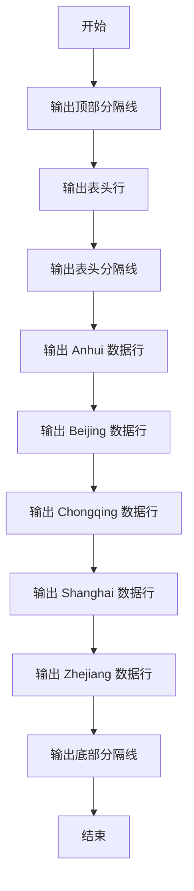
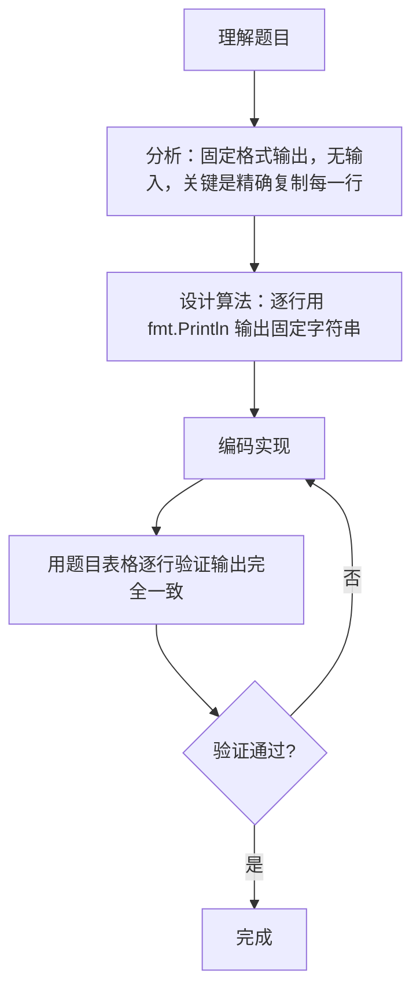

# 7-5 表格输出（Go语言实现）

## 前言

这道题要求按照规定格式输出一张表格，不需要读取任何输入，属于纯输出格式控制题。

题目有两个细节容易出错：

1. 表格中的分隔线由 36 个减号组成，数量必须精确；
2. 各行之间通过精确的空格数量对齐，多一个或少一个空格都会导致格式不符。

核心策略是把表格的每一行原样写进 fmt.Println 的字符串参数中，逐行输出即可，输出顺序与题目给出的表格完全一致。

## 题目描述

本题要求编写程序，按照规定格式输出表格。

## 输入格式

本题目没有输入。

## 输出格式

要求严格按照给出的格式输出下列表格：

```out
------------------------------------
Province      Area(km2)   Pop.(10K)
------------------------------------
Anhui         139600.00   6461.00
Beijing        16410.54   1180.70
Chongqing      82400.00   3144.23
Shanghai        6340.50   1360.26
Zhejiang      101800.00   4894.00
------------------------------------
```

## 输入样例

本题目没有输入，无需提供样例数据。

## 输出样例

```out
------------------------------------
Province      Area(km2)   Pop.(10K)
------------------------------------
Anhui         139600.00   6461.00
Beijing        16410.54   1180.70
Chongqing      82400.00   3144.23
Shanghai        6340.50   1360.26
Zhejiang      101800.00   4894.00
------------------------------------
```

## 解题思路

### 1. 分析表格结构

表格共有 9 行：顶部分隔线、表头行、表头分隔线、5 条数据行、底部分隔线。分隔线由 36 个减号组成。

### 2. 确定各行的内容与对齐

表头行 `Province      Area(km2)   Pop.(10K)` 由三列组成，各列之间用精确数量的空格分隔；数据行中省份名与数字之间同样有固定的空格数量，数字保留两位小数。

### 3. 逐行固定输出

程序不需要任何计算，把每一行的完整字符串原样写入 fmt.Println 参数，按顺序输出 9 行即可。输出顺序与题目给出的表格完全一致。

## 完整代码

```go
// 题目：7-5 表格输出
// 要求：按规定格式输出一张省份信息表格，无输入，需精确匹配空格与分隔线。
//
// 实现原理：
//   1. 表格共 9 行，分隔线为 36 个减号；
//   2. 把每一行的完整字符串原样写入 fmt.Println 参数；
//   3. 按题目给出的顺序逐行输出。
package main

import "fmt"

func main() {
	fmt.Println("------------------------------------")
	fmt.Println("Province      Area(km2)   Pop.(10K)")
	fmt.Println("------------------------------------")
	fmt.Println("Anhui         139600.00   6461.00")
	fmt.Println("Beijing        16410.54   1180.70")
	fmt.Println("Chongqing      82400.00   3144.23")
	fmt.Println("Shanghai        6340.50   1360.26")
	fmt.Println("Zhejiang      101800.00   4894.00")
	fmt.Println("------------------------------------")
}
```
## 代码流程说明

1. 导入 fmt 包用于标准输出。
2. 用 fmt.Println 输出顶部分隔线（36 个减号）并换行。
3. 输出表头行 Province、Area(km2)、Pop.(10K)，注意列间空格数量。
4. 输出表头分隔线（与顶部相同）。
5. 依次输出 5 条省份数据行：Anhui、Beijing、Chongqing、Shanghai、Zhejiang。
6. 输出底部分隔线，完成整个表格。
7. main 函数自然结束。

## 代码流程图



## 解题流程图



## 代码解析

### 输出分隔线

```go
fmt.Println("------------------------------------")
```

分隔线由 36 个减号组成，顶部、表头下、底部三处完全一致。fmt.Println 会在字符串末尾自动换行。

### 输出表头行

```go
fmt.Println("Province      Area(km2)   Pop.(10K)")
```

表头行包含三列：省份名、面积、人口。列与列之间的空格数量必须与题目完全一致，否则对齐会错位。

### 输出数据行

```go
fmt.Println("Beijing        16410.54   1180.70")
```

每条数据行都是「省份名 + 空格 + 面积 + 空格 + 人口」的固定格式，面积和人口保留两位小数。逐行复制题目给出的字符串即可。

## 复杂度分析

该程序不依赖输入规模，只执行固定次数的输出：

- 时间复杂度：`O(1)`，固定输出 9 行内容；
- 空间复杂度：`O(1)`，没有使用额外变量，字符串常量随程序固定。

## 常见易错点

### 1. 分隔线减号数量错误

分隔线必须恰好是 36 个减号。多写或少写一个减号，整行的字符数与题目不一致，判题时会判为格式错误。

### 2. 表头与数据行的空格数量错误

各行通过空格对齐，例如表头行 `Province` 后是 6 个空格，`Area(km2)` 后是 3 个空格；`Anhui` 后是 10 个空格。空格数量必须逐行核对，不能凭感觉近似。

### 3. 遗漏或重复行

表格共 9 行：3 条分隔线、1 行表头、5 行数据。漏掉某一行或把分隔线多输出一次都会导致输出与题目不一致。

## 更多测试

### 测试一：验证分隔线长度

输入：

```text
（本题目没有输入）
```

输出：

```text
------------------------------------
```

推演：分隔线字符串由 36 个减号组成，程序在顶部、表头下、底部三处输出完全相同的内容。

### 测试二：验证表头行

输入：

```text
（本题目没有输入）
```

输出：

```text
Province      Area(km2)   Pop.(10K)
```

推演：表头行是「Province + 6 个空格 + Area(km2) + 3 个空格 + Pop.(10K)」，与题目给出的表头逐字符一致。

### 测试三：验证完整表格

输入：

```text
（本题目没有输入）
```

输出：

```text
------------------------------------
Province      Area(km2)   Pop.(10K)
------------------------------------
Anhui         139600.00   6461.00
Beijing        16410.54   1180.70
Chongqing      82400.00   3144.23
Shanghai        6340.50   1360.26
Zhejiang      101800.00   4894.00
------------------------------------
```

推演：程序按顺序输出 9 行，内容与题目给定的表格完全一致，行末由 fmt.Println 自动换行。

## 总结

本题没有算法难度，考察的是对输出格式的精确控制能力。把表格每一行原样复制到 fmt.Println 参数中逐行输出即可。这类纯输出题在 PTA 中很常见，答题时务必逐字符核对分隔线长度、空格数量与行的顺序，任何一处细微差别都会导致判题失败。