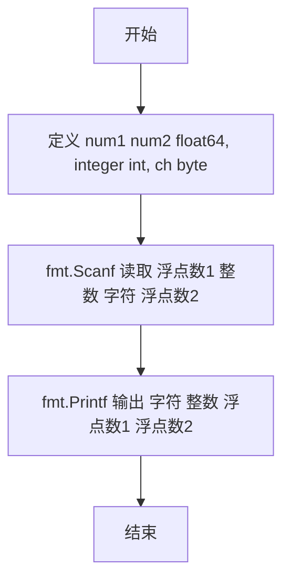
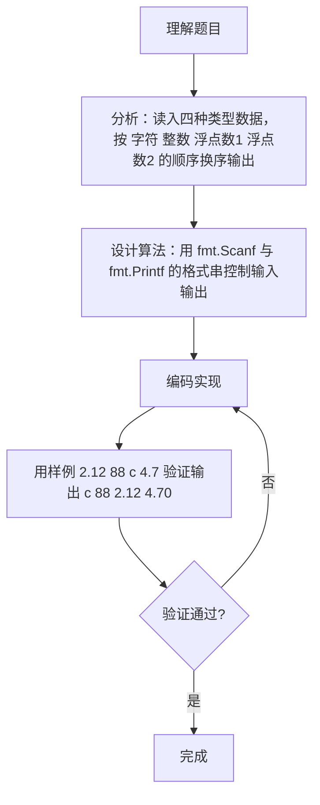

# 7-6 混合类型数据格式化输入（Go语言实现）

## 前言

这道题要求顺序读入浮点数1、整数、字符、浮点数2 四种不同类型的数据，再按 字符、整数、浮点数1、浮点数2 的顺序输出，且浮点数必须保留小数点后 2 位。

题目有两个细节容易出错：

1. 输出顺序与输入顺序不同，容易按输入顺序输出；
2. 浮点数位数需要固定，4.7 应输出为 4.70。

核心策略是使用 fmt.Scanf 与 fmt.Printf 的格式串分别控制读入与输出，由格式符完成类型解析与小数位控制，避免手工拼接字符串。

## 题目描述

本题要求编写程序，顺序读入浮点数1、整数、字符、浮点数2，再按照字符、整数、浮点数1、浮点数2的顺序输出。

## 输入格式

输入在一行中顺序给出浮点数1、整数、字符、浮点数2，其间以1个空格分隔。

## 输出格式

在一行中按照字符、整数、浮点数1、浮点数2的顺序输出，其中浮点数保留小数点后2位。

## 输入样例

```in
2.12 88 c 4.7
```

## 输出样例

```out
c 88 2.12 4.70
```

## 解题思路

### 1. 明确输入与输出的顺序

输入顺序为：浮点数1、整数、字符、浮点数2；输出顺序为：字符、整数、浮点数1、浮点数2。核心是按题目规定的顺序读入 4 个不同类型的数据，再按另一种顺序输出，并保证浮点数保留小数点后 2 位。

### 2. 用 fmt.Scanf 按格式读取数据

fmt.Scanf 能自动识别数据类型并按空格分隔解析。格式串 `"%f %d %c %f"` 依次读取浮点数1、整数、字符、浮点数2，分别存入对应类型的变量。

### 3. 按输出顺序排列变量并格式化浮点数

输出时把变量按 字符、整数、浮点数1、浮点数2 的顺序排列，其中浮点数使用 `%.2f` 格式符保留两位小数。例如 4.7 输出为 4.70。

## 完整代码

```go
// 题目：7-6 混合类型数据格式化输入
// 要求：顺序读入浮点数1、整数、字符、浮点数2，再按字符、整数、浮点数1、浮点数2的顺序输出，浮点数保留小数点后2位。
//
// 实现原理：
//   1. 用 fmt.Scanf 的格式串 "%f %d %c %f" 按顺序读入四种类型数据；
//   2. 输出时把变量按 字符、整数、浮点数1、浮点数2 的顺序排列；
//   3. 用 %.2f 使浮点数保留小数点后两位。
package main

import "fmt"

func main() {
	var f1, f2 float64
	var n int
	var ch byte
	fmt.Scanf("%f %d %c %f", &f1, &n, &ch, &f2)
	fmt.Printf("%c %d %.2f %.2f\n", ch, n, f1, f2)
}
```

## 代码流程说明

1. 导入 fmt 包，提供格式化输入输出函数。
2. 定义变量：num1、num2 为 float64 存储两个浮点数，integer 为 int 存储整数，ch 为 byte 存储字符。
3. 用 fmt.Scanf("%f %d %c %f", &num1, &integer, &ch, &num2) 按顺序读取浮点数1、整数、字符、浮点数2，以空格为分隔符。
4. 用 fmt.Printf("%c %d %.2f %.2f\n", ch, integer, num1, num2) 按 字符、整数、浮点数1、浮点数2 的顺序输出。
5. 格式符 %.2f 使浮点数保留两位小数。
6. 程序结束，main 函数自然返回。

## 代码流程图



## 解题流程图



## 代码解析

### 变量类型声明

```go
var num1, num2 float64
var integer int
var ch byte
```

浮点数用 float64 保证精度，整数用 int，字符用 byte，变量类型与格式串中的动词一一对应。

### 格式化读取四种类型数据

```go
fmt.Scanf("%f %d %c %f", &num1, &integer, &ch, &num2)
```

格式串中各项以空格分隔，fmt.Scanf 跳过输入空白并按动词识别类型：%f 读浮点数、%d 读整数、%c 读单个字符，读取顺序即输入顺序。

### 格式化输出

```go
fmt.Printf("%c %d %.2f %.2f\n", ch, integer, num1, num2)
```

输出顺序调整为 字符、整数、浮点数1、浮点数2；%.2f 使浮点数固定输出两位小数，如 4.7 输出为 4.70。

## 复杂度分析

本题输入固定为 4 个不同类型的数据，规模恒定：

- 时间复杂度：`O(1)`，读入与输出各执行一次，运算量不随数据规模增长；
- 空间复杂度：`O(1)`，仅使用 4 个变量存储数据，无额外空间开销。

## 常见易错点

### 1. 输出顺序与输入顺序混淆

输出要求按 字符、整数、浮点数1、浮点数2 的顺序。若按输入顺序输出：

```text
2.12 88 c 4.70
```

与正确结果 c 88 2.12 4.70 不符。

### 2. 浮点数未保留两位小数

若用 %f 或 %v 直接输出浮点数，小数位数不受控。例如浮点数2 的值为 4.7，要求输出 4.70；用 %v 输出为 4.7，不符合格式要求。

### 3. %c 读入空格

fmt.Scanf 的 %c 不跳过空白字符。若格式串中缺少空格分隔（如写成 "%f%d%c%f"），ch 会读到整数 88 后面的空格而不是字符 c，导致输出错误。

### 4. 变量类型选择错误

浮点数必须用 float64、整数用 int、字符用 byte。若把浮点数读入 int 变量，会丢失小数部分（如 2.12 读成 2），输出结果错误。

## 更多测试

### 测试一：小规模常规数据

输入：

```text
1 2 a 3.5
```

输出：

```text
a 2 1.00 3.50
```

### 测试二：全零数据

输入：

```text
0 0 x 0
```

输出：

```text
x 0 0.00 0.00
```

### 测试三：负数与多位小数

输入：

```text
-1.5 7 q -2.25
```

输出：

```text
q 7 -1.50 -2.25
```

## 总结

本题的难点不在计算，而在严格按题目规定的顺序与格式完成输入输出。使用 fmt.Scanf 与 fmt.Printf 的格式串分别控制读入顺序与输出顺序，配合 %.2f 保证浮点数位数，即可稳定通过测试。理解格式串中 %f、%d、%c 等动词的含义，是解决此类格式化题目的基础。