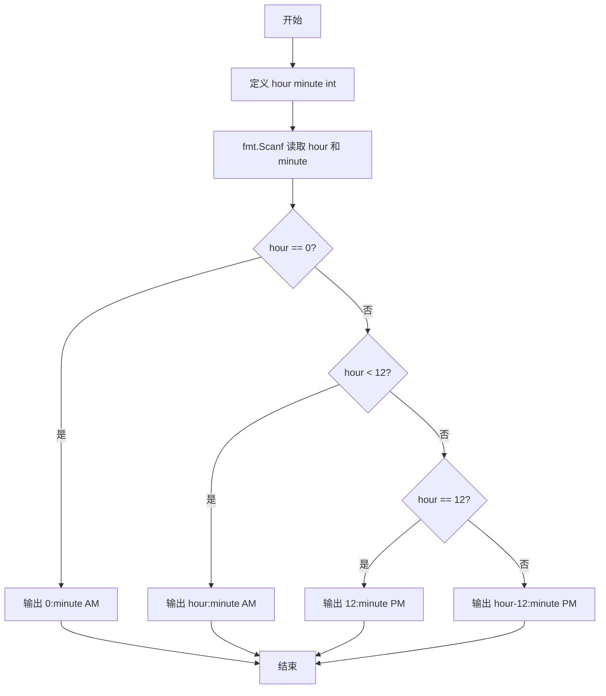
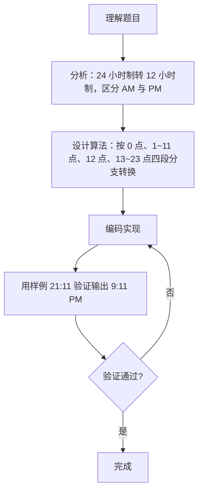

# 7-7 12-24小时制（Go语言实现）

## 前言

这道题要求把 24 小时制的时间转换成 12 小时制，并在末尾标注 AM 或 PM，输入时间带有冒号分隔符。

有两个边界点需要特别注意：

1. 0 点属于上午，应输出 0:0 AM；
2. 中午 12 点按英文习惯属于下午，应输出 12:0 PM，不能减 12。

核心策略是使用 fmt.Scanf("%d:%d") 让格式串直接处理冒号，再按 0 点、上午、12 点、下午四类分支转换输出。

## 题目描述

编写一个程序，要求用户输入24小时制的时间，然后显示12小时制的时间。

## 输入格式

输入在一行中给出带有中间的:符号（半角的冒号）的24小时制的时间，如12:34表示12点34分。当小时或分钟数小于10时，均没有前导的零，如5:6表示5点零6分。

提示：在scanf的格式字符串中加入:，让scanf来处理这个冒号。

## 输出格式

在一行中输出这个时间对应的12小时制的时间，数字部分格式与输入的相同，然后跟上空格，再跟上表示上午的字符串AM或表示下午的字符串PM。如5:6 PM表示下午5点零6分。注意，在英文的习惯中，中午12点被认为是下午，所以24小时制的12:00就是12小时制的12:0 PM；而0点被认为是第二天的时间，所以是0:0 AM。

## 输入样例

```in
21:11
```

## 输出样例

```out
9:11 PM
```

## 解题思路

### 1. 处理带冒号的时间输入

使用 `fmt.Scanf("%d:%d", &hour, &minute)` 读取输入：格式串中的冒号会按字面匹配输入中的冒号，由 Scanf 自动处理分隔，将小时与分钟分别读入两个变量。这正是题目提示"让 scanf 来处理这个冒号"的做法。

### 2. 划分四类时间转换分支

24 小时制到 12 小时制的转换共分 4 种情况：

- hour == 0：凌晨 0 点，输出 0:分钟 AM；
- 0 < hour < 12：上午，直接输出 小时:分钟 AM；
- hour == 12：中午 12 点（英文习惯视为下午），输出 12:分钟 PM；
- hour > 12：下午，小时减 12，输出 (hour-12):分钟 PM。

### 3. 确定判断顺序

按 hour == 0 → hour < 12 → hour == 12 → 其余 的顺序依次判断。该顺序使各分支条件互不重叠，0 点与 12 点两个特殊边界都能被准确捕获。分钟数值无论大小均原样输出，不加前导零。

## 完整代码

```go
// 题目：7-7 12-24小时制
// 要求：输入带冒号的 24 小时制时间，转换为 12 小时制时间并输出 AM/PM 标识。
//
// 实现原理：
//   1. 用 fmt.Scanf 格式串中的冒号匹配输入中的冒号，直接读入小时和分钟；
//   2. hour == 0 输出 0:minute AM，hour < 12 原样输出并加 AM；
//   3. hour == 12 输出 12:minute PM，hour > 12 输出 hour-12 并加 PM。
package main

import "fmt"

func main() {
	var hour, minute int
	fmt.Scanf("%d:%d", &hour, &minute)
	if hour == 0 {
		fmt.Printf("0:%d AM\n", minute)
	} else if hour < 12 {
		fmt.Printf("%d:%d AM\n", hour, minute)
	} else if hour == 12 {
		fmt.Printf("12:%d PM\n", minute)
	} else {
		fmt.Printf("%d:%d PM\n", hour-12, minute)
	}
}
```

## 代码流程说明

1. 导入 fmt 包，提供格式化输入输出功能。
2. 定义 hour、minute 两个 int 变量，分别存储小时与分钟。
3. 用 fmt.Scanf("%d:%d", &hour, &minute) 读取输入，格式串中的冒号自动匹配输入中的冒号。
4. 判断 hour == 0：成立则输出 0:minute AM。
5. 否则判断 hour < 12：成立则输出 hour:minute AM。
6. 否则判断 hour == 12：成立则输出 12:minute PM。
7. 否则（hour 为 13~23）输出 hour-12:minute PM。
8. 程序结束，main 函数自然返回。

## 代码流程图



## 解题流程图



## 代码解析

### 读取带冒号的时间

```go
fmt.Scanf("%d:%d", &hour, &minute)
```

格式串中的冒号与输入中的冒号逐字匹配，fmt.Scanf 自动跳过冒号，把冒号两侧的数字分别读入 hour 和 minute，无需手工拆字符串。

### 零点与上午时段的处理

```go
if hour == 0 {
    fmt.Printf("0:%d AM", minute)
} else if hour < 12 {
    fmt.Printf("%d:%d AM", hour, minute)
}
```

hour == 0 时输出 0:分钟 AM；hour 为 1~11 时直接原样输出并标注 AM。注意 0 点必须放在最前单独判断，否则会被后面的 PM 分支误捕获。

### 中午与下午时段的处理

```go
} else if hour == 12 {
    fmt.Printf("12:%d PM", minute)
} else {
    fmt.Printf("%d:%d PM", hour-12, minute)
}
```

hour == 12 时保持 12 不变并输出 PM；hour 为 13~23 时减去 12 得到 1~11 再输出 PM。

## 复杂度分析

本题输入规模固定（1 组小时、分钟）：

- 时间复杂度：`O(1)`，一次读入、一次分支判断、一次输出；
- 空间复杂度：`O(1)`，仅使用两个整型变量，无额外空间开销。

## 常见易错点

### 1. 0 点被当作下午处理

若把 hour <= 12 当作下午分支的条件，输入 0 点会错误输出 0:0 PM，而正确结果应为 0:0 AM。hour == 0 必须单独分支并输出 AM。

### 2. 12 点被减去 12

对 hour == 12 若直接使用 hour-12 输出，会得到 0:30 PM，而正确结果应为 12:30 PM。12 点表示中午，应保持 12 不变并标注 PM。

### 3. 输出缺少空格或冒号

输出格式为"小时:分钟 AM/PM"，冒号与 AM/PM 之前的空格都不能省略。例如 9:11PM 与 9:11 PM 输出不同，缺少空格会被判错。

### 4. 画蛇添足补前导零

题目要求数字部分格式与输入相同（小于 10 无前导零）。若把 5:6 输出成 05:06，则不符合"数字部分格式与输入的相同"的要求。直接以 %d 输出即可。

## 更多测试

### 测试一：零点

输入：

```text
0:5
```

输出：

```text
0:5 AM
```

### 测试二：中午 12 点

输入：

```text
12:34
```

输出：

```text
12:34 PM
```

### 测试三：深夜时段

输入：

```text
23:59
```

输出：

```text
11:59 PM
```

## 总结

本题的关键是把 24 小时制到 12 小时制的转换归纳为 0 点、上午、12 点、下午四类分支，并利用 fmt.Scanf 的格式串直接处理冒号分隔。0 点属于 AM、12 点属于 PM 这两个特殊边界是保证正确性的核心。掌握带分隔符输入的读取方式，可以推广到更复杂的格式化输入场景。
