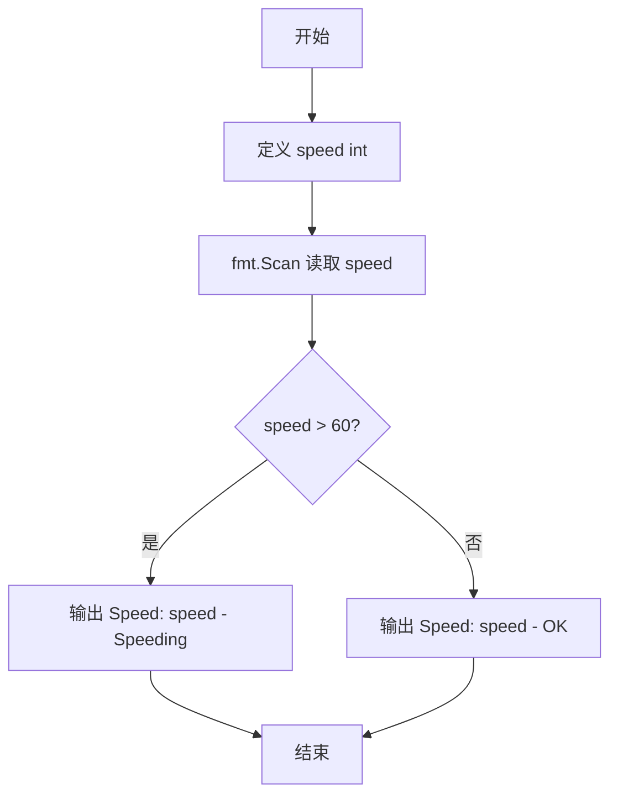
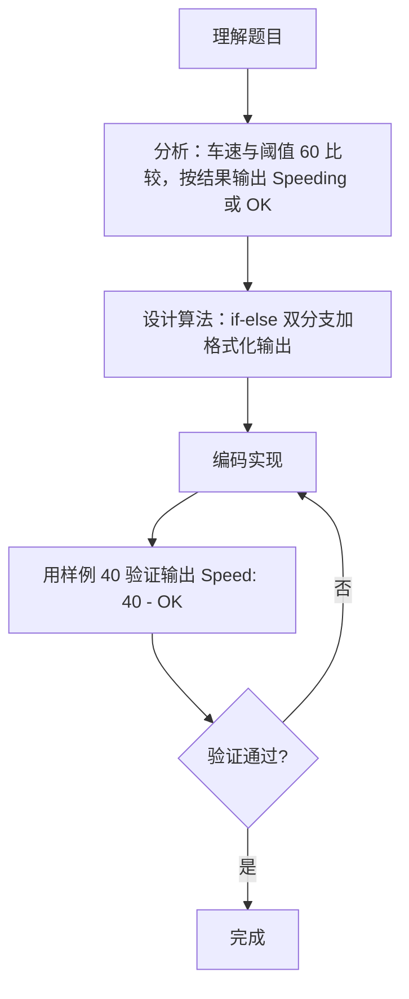

# 7-8 超速判断（Go语言实现）

## 前言

这道题模拟交通警察的雷达测速仪：输入车速，若超过 60 mph 输出 Speeding，否则输出 OK，并按 Speed: V - S 的格式输出。

题目有两个易错点：

1. 边界值 60 不算超速，判断必须用严格大于；
2. 输出中 S 两侧有空格，格式必须逐字匹配。

核心策略是简单的 if-else 双分支判断，配合 fmt.Printf 一次性完成格式化输出。

## 题目描述

模拟交通警察的雷达测速仪。输入汽车速度，如果速度超出60 mph，则显示"Speeding"，否则显示"OK"。

## 输入格式

输入在一行中给出1个不超过500的非负整数，即雷达测到的车速。

## 输出格式

在一行中输出测速仪显示结果，格式为：Speed: V - S，其中V是车速，S或者是Speeding、或者是OK。

## 输入样例1

```in
40
```

## 输入样例2

```in
75
```

## 输出样例1

```out
Speed: 40 - OK
```

## 输出样例2

```out
Speed: 75 - Speeding
```

## 解题思路

### 1. 读取车速并确定比较阈值

本题是典型的单条件二分支判断问题。读取整数车速 speed 后，与阈值 60 mph 比较，根据比较结果输出不同的提示信息，并严格按照指定格式拼接输出字符串。

### 2. 使用 if-else 完成二分支判断

- speed > 60：判定超速，输出 Speeding；
- 否则（speed <= 60）：判定正常，输出 OK。

注意阈值边界：题目要求"超出 60 mph"才显示 Speeding，因此恰好等于 60 不算超速，必须使用严格大于号。

### 3. 按固定格式拼接输出

输出形如 Speed: 40 - OK，其中 V 是车速、S 是 Speeding 或 OK，S 两侧各有空格与连字符。使用 fmt.Printf 一步完成格式化，避免手工拼接出错。

## 完整代码

```go
// 题目：7-8 超速判断
// 要求：输入车速，超过 60 mph 输出 Speeding，否则输出 OK，按 Speed: V - S 格式输出。
//
// 实现原理：
//   1. 读取整数 speed 作为车速；
//   2. 用 speed > 60 判断是否超速（恰好 60 不超速）；
//   3. 用 fmt.Printf 按 "Speed: %d - S" 格式输出判断结果。
package main

import "fmt"

func main() {
	var speed int
	fmt.Scan(&speed)

	if speed > 60 {
		fmt.Printf("Speed: %d - Speeding\n", speed)
	} else {
		fmt.Printf("Speed: %d - OK\n", speed)
	}
}
```

## 代码流程说明

1. 导入 fmt 包，提供标准输入输出功能。
2. 定义 int 变量 speed 存储雷达测得的车速。
3. 用 fmt.Scan(&speed) 读取车速。
4. 判断 speed > 60：成立则输出 Speed: V - Speeding 并换行。
5. 否则（speed <= 60）输出 Speed: V - OK 并换行。
6. 程序结束，main 函数自然返回。

## 代码流程图



## 解题流程图



## 代码解析

### 读取车速

```go
fmt.Scan(&speed)
```

fmt.Scan 跳过空白并从标准输入读取一个整数存入 speed。

### 阈值判断与格式化输出

```go
if speed > 60 {
    fmt.Printf("Speed: %d - Speeding\n", speed)
} else {
    fmt.Printf("Speed: %d - OK\n", speed)
}
```

条件 speed > 60 为严格大于，车速恰好为 60 时进入 else 分支输出 OK，符合题意。%d 原样输出车速，连字符两侧的空格在格式串中固定给出。

## 复杂度分析

本题输入规模固定（1 个整数）：

- 时间复杂度：`O(1)`，一次读入、一次比较、一次输出；
- 空间复杂度：`O(1)`，仅使用一个整型变量，无额外空间开销。

## 常见易错点

### 1. 边界值 60 的判断

题目要求"超出 60 mph"才显示 Speeding，因此 speed == 60 时应输出 OK。若误用 speed >= 60，输入 60 会错误输出：

```text
Speed: 60 - Speeding
```

正确结果应为 Speed: 60 - OK。

### 2. 输出格式不完整

输出必须严格为 Speed: V - S 形式，S 两侧的空格与连字符不能省略。例如 Speed: 40-OK 或 Speed:40 - OK 都属于格式错误。

### 3. 结果字符串的大小写

Speeding 与 OK 必须按题目给定的字母大小写输出。写成 speeding 或 ok 等大小写不一致的字符串会被判错。

### 4. 车速类型选择

车速是不超过 500 的非负整数，用 int 类型即可。若误用浮点类型，不仅没有必要，还可能带来精度与格式上的额外问题。

## 更多测试

### 测试一：恰好等于阈值

输入：

```text
60
```

输出：

```text
Speed: 60 - OK
```

### 测试二：最大边界值

输入：

```text
500
```

输出：

```text
Speed: 500 - Speeding
```

### 测试三：最小边界值

输入：

```text
0
```

输出：

```text
Speed: 0 - OK
```

## 总结

本题是一道典型的单条件二分支判断题。核心在于严格理解"超出 60 mph"的边界含义，正确选择比较符号，并按照 Speed: V - S 的格式输出。整道题只有一次比较与一次格式化输出，重点考查对题意与输出格式的把握。
